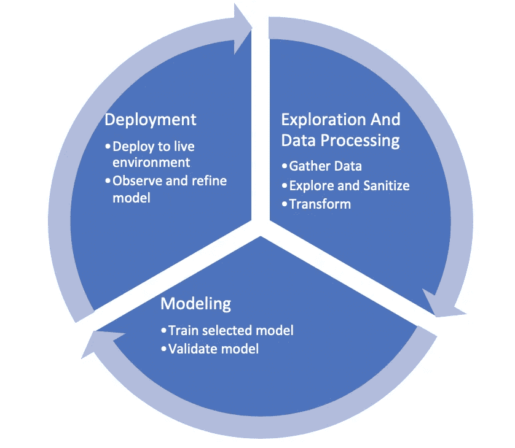

# 构建机器学习管道——建模

> 原文：<https://medium.datadriveninvestor.com/building-a-machine-learning-pipeline-modeling-3a5382412041?source=collection_archive---------1----------------------->

欢迎回来，各位。让我们深入到机器学习工作流的建模方面。对于那些错过第 1 部分探索和数据处理的人，可以在这里找到。这一阶段的主要目标是确定哪种预测模型最适合手头的数据和人们试图解决的问题陈述。

Machine Learning Workflow

确定这一点并不是一门精确的科学，需要一些实验。然而，我发现通过回答几个问题(下面会提到)开始旅程有助于快速缩小选择范围。这些潜在模型中的每一个都需要通过培训和验证周期进行评估。

以下是我建议回答的几个问题，以此开始决策过程

1.  基于统计分类或回归分析的模型是否容易实现我们所寻求的结果？如果是这样，像支持向量机这样的简单模型就足够了吗？还是需要往类似 CNN，RNNs，GANs 等神经网络的方向走？？

 [## 机器学习的外汇交易挑战|数据驱动的投资者

### 机器学习是人工智能的一个分支，之前占据了很多头条。人们是…

www.datadriveninvestor.com](https://www.datadriveninvestor.com/2019/02/18/the-challenge-of-forex-trading-for-machine-learning/) 

2.我们是希望使用已经调优和训练过的模型，还是希望构建自己的模型并用我们的数据对其进行训练？例如，AWS 的 NLP(自然语言处理)模型在大量数据上进行预训练，可能会比定制和本地训练的模型提供更低的错误率(假设可用数据不在同一规模)。另一方面，如果你想解决一个特定的问题，通过构建你自己的算法或者修改一个算法来定制可能是个好办法。一个令人愉快的媒介可能是利用迁移学习并在此基础上发展。

一旦我们对上述问题有了回应，我们就可以列出一个我们想要培训和验证的潜在候选人名单。在进行训练时，要注意常见的问题，如过度和不足。通过在测试数据集上运行定型模型并分析结果来确定模型的性能，从而验证模型。如果决定使用定制模型，模型设计方面可能是一个主要的前期任务。

根据测试结果，用户可能已经准备好进入部署的下一阶段，或者多次测试结果并不令人印象深刻，用户必须尝试调整超参数，或者可能回到绘图板。由于这整个过程本质上是非常迭代的，我建议采用精益方法来评估模型。例如，建立培训/测试数据集限制，创建能够很好地表明候选人表现如何的关键指标。然而，这不应该以牺牲长远考虑为代价。如果训练数据集特别大，从一个模型切换到另一个模型的机会成本可能特别高。

暂时就这样了。快乐造型。下周我们将讨论部署阶段。