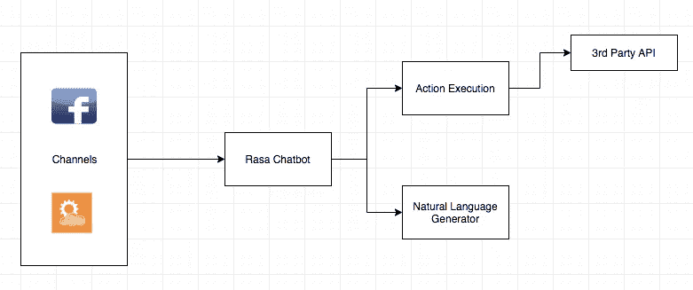
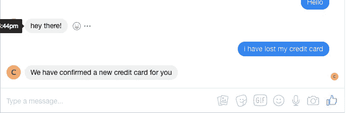

# 用 Rasa 构建多通道聊天机器人

> 原文：<https://medium.datadriveninvestor.com/building-a-multi-channel-chatbot-with-rasa-bf8d74a938a1?source=collection_archive---------1----------------------->

## 前提

Rasa Core 0.11 已于几周前发布，与上一版本相比，它包含了一些重大变化。所以为什么我对这个感到兴奋

*   新型多通道积分器
*   动作网钩
*   使用 NLG 服务器的动态模板
*   远程 NLU 服务器功能

从架构上讲，Rasa core 作为 bot 生态系统的核心组件的地位确实改变了团队决定如何定位产品的方式。

## 设置

本文的设置是构建一个主要存在于多个通道中的 bot。

我还将解释各种组件和我最喜欢的编排技术——docker-compose

这个想法是建立一个聊天机器人，通过一系列渠道连接到你的客户，并能够复制 Rasa core 最新版本架构的想法。

将会有很多服务器(你可以挑战这么多调用的性能，但是有优点也有缺点)

这里有一个我试图用这篇文章实现的简单设置



implemented architecture

我已经为每个连接器添加了两个使用 webhook 连接到 Rasa 聊天机器人的通道。它们都有一个 credentials.yml 文件来验证连接。然后，Rasa 聊天机器人将负责 NLU 和对话的模型推理。一旦我们有了需要执行的动作，我们要么执行一个自定义动作，可以调用 API、发送通知，或者将用户连接到一个实时代理，以实现更高级的场景。有备份总是好的

让我们一步一步来看

## 步骤 1 —构建核心

所以这个想法是首先创建我们的聊天机器人逻辑，我将从我的上一个教程中获得灵感(你可以在这里找到它)。我采用了相同的故事，但是还使用 actions webhook 添加了一个自定义动作。

你会在我的 [github](https://github.com/souvikg10/rasa-latest) 中找到所有代码

代表同样的想法，如果我丢失了我的信用卡或借记卡，我之前(上一个教程)的故事是提供关于如何做的信息，这里我将做一些事情，从触发订购一张新卡的过程开始(在演示中，我实际上没有这样做，但你得到了想法)

因此，训练的步骤保持不变，我有我的 NLU 模型，我训练机器人理解某些类，我有我的核心模型，我训练一个基本的故事。由于整个代码和结构对所有人都是免费的，所以您可以简单地派生代码并使其成为您自己的代码。

## 步骤 2 —动作网页挂钩

与以前的 Rasa 版本相比，这里有一些新的东西，即 actions webhook。这里的想法非常简单，您的定制集成从 rasa 堆栈外部化，允许您灵活地构建一个可以部署在任何地方的外部 webhook。

Rasa 还提供了 rasa_core_sdk，它提供了一个简单的 flask 服务器和所有 rasa_core 自定义动作库来执行动作

值得一提的是，如果你对 Java 或 Node JS 之类的其他语言很熟悉，那么 webhook 这个动作不一定要用 python。确保您有一个 REST 服务器正在运行，它将接受来自 Rasa chatbot 的 POST 请求。

## 第 3 步— NLG 组件

这是我在最新的 Rasa 堆栈中注意到的第三个有趣的组件。

嗯，这是自然语言的一代，简称 NLG，但它不是机器产生的想象力的话。相反，它是一个模板引擎，基本上是从模板本身获取域(在我的例子中)并生成通道驱动的响应。它也使你的模板外部化，因为你不需要仅仅为了改变一个简单的文本而重新训练模型。这同样适用于您的自定义操作。

## 让我们把它缝在一起。

我已经用 Docker 构建了三个图像(Rasa，Actions 和 NLG ),用 docker-compose 启动它们，瞧，我们可以测试了。我已经使用 ngrok 在多个端点测试了相同的 Rasa 聊天机器人。

**其余输入**

让我们首先在我们的本地 rest 端点上尝试一下。这里的设置可能是最简单的。我添加了一个 credentials.yml 文件，内容如下

```
rest:
```

就这样，现在用下面的命令运行 rasa 堆栈

```
python -m rasa_core.run 
-c rest 
-d data/servicing-bot-en/models/dialogue 
-u data/servicing-bot-en/models/servicing-bot-en/model-en 
— endpoints endpoints.yml 
— credentials credentials.yml
```

让我们逐一分析

*   c 代表通道(在这里你可以提供不同的通道来设置你的机器人，见[这里](https://rasa.com/docs/core/connectors/#)
*   d 是你的对话模型
*   u 是您的 NLU 模型(您也可以用远程 NLU 服务器替换它)
*   端点—它是一个包含您的操作 webhook 端点和您的 nlg 端点的文件，如果您添加远程 NLU，您将必须在此处提供端点)
*   凭据—该文件包含不同通道的连接凭据

一旦我启动了服务器，我就使用 POSTMAN 进行测试

```
POST /webhooks/rest/webhook HTTP/1.1
Host: localhost:5005
Content-Type: application/json
Cache-Control: no-cache
Postman-Token: 20a797ac-7b59-28cd-4a6e-0d45a66c18d9{
 "sender":"John Doe",
 "message":"i have lost my credit card"

}
```

我收到的回复是这样的

```
[
    {
        "recipient_id": "John Doe",
        "text": "We have confirmed a new credit card for you"
    }
]
```

让我们看看我们的日志现在是什么样子

```
rasa_en_1  | 172.22.0.1 - - [2018-09-19 14:13:11] "POST /webhooks/rest/webhook HTTP/1.1" 200 275 0.209853
action_1   | DEBUG:rasa_core_sdk.executor:Received request to run 'card_lost'
action_1   | DEBUG:rasa_core_sdk.executor:Successfully ran 'card_lost'
nlg_1      | 172.22.0.2 - - [2018-09-19 14:13:20] "POST /nlg HTTP/1.1" 200 163 0.001777
rasa_en_1  | 172.22.0.1 - - [2018-09-19 14:13:20] "POST /webhooks/rest/webhook HTTP/1.1" 200 285 0.037939
action_1   | 172.22.0.2 - - [2018-09-19 14:13:20] "POST /webhook HTTP/1.1" 200 214 0.004351
action_1   | DEBUG:rasa_core_sdk.executor:Received request to run 'card_lost'
action_1   | DEBUG:rasa_core_sdk.executor:Successfully ran 'card_lost'
nlg_1      | 172.22.0.2 - - [2018-09-19 14:17:01] "POST /nlg HTTP/1.1" 200 163 0.001800
rasa_en_1  | 172.22.0.1 - - [2018-09-19 14:17:01] "POST /webhooks/rest/webhook HTTP/1.1" 200 287 0.038043
```

正如所料，它运行了我的自定义操作，该操作理论上将调用外部服务，然后提供域文件模板中的话语。如果需要，您可以将模板保存在数据库中。

## 脸书输入

我在脸书上有一个演示页面，我经常用它来测试不同的聊天机器人。

我现在已经添加了 facebook 的凭证，并更新了 rasa chatbot 的 run 命令

我的凭证文件现在看起来像这样(嗯，不完全是这样！！)

```
rest:facebook:verify: "rasa-bot"secret: "app-secret"page-access-token: "pageaccestoken"
```

下面是我对 run 命令的更新

```
python -m rasa_core.run  
-c rest 
-c facebook  
-d data/servicing-bot-en/models/dialogue 
-u data/servicing-bot-en/models/servicing-bot-en/model-en 
--endpoints endpoints.yml 
--credentials credentials.yml
```

现在让我们启动 ngrok，将端口 5005 开放给 public

```
ngrok http 5005
```

请确保您将 webhook 回调 URL 添加到您的 facebook 页面

```
[https://779ee0c7.ngrok.io](http://779ee0c7.ngrok.io)/webhooks/facebook/webhook
```

现在让我们从页面开始测试



现在让我们来看看日志

```
rasa_en_1 | 172.23.0.1 — — [2018–09–19 14:44:43] “POST /webhooks/facebook/webhook HTTP/1.1” 200 154 0.010318
nlg_1 | 172.23.0.2 — — [2018–09–19 14:44:54] “POST /nlg HTTP/1.1” 200 130 0.002343
rasa_en_1 | 2018–09–19 14:44:54 INFO rasa_core.channels.facebook — Sending message: hey there!
rasa_en_1 | 172.23.0.1 — — [2018–09–19 14:44:55] “POST /webhooks/facebook/webhook HTTP/1.1” 200 154 0.548130
action_1 | DEBUG:rasa_core_sdk.executor:Received request to run ‘card_lost’
action_1 | DEBUG:rasa_core_sdk.executor:Successfully ran ‘card_lost’
nlg_1 | 172.23.0.2 — — [2018–09–19 14:45:03] “POST /nlg HTTP/1.1” 200 163 0.001459
rasa_en_1 | 2018–09–19 14:45:03 INFO rasa_core.channels.facebook — Sending message: We have confirmed a new credit card for you
rasa_en_1 | 172.23.0.1 — — [2018–09–19 14:45:04] “POST /webhooks/facebook/webhook HTTP/1.1” 200 154 0.618583
```

它仍然是同一个聊天机器人，现在活跃在两个频道(休息和脸书)

同样，您可以添加一系列受支持的频道，甚至构建自己的频道。随着时间的推移，Rasa 变得越来越稳定，我认为这个方向真的很有趣，它允许我们开发人员快速建立一些可以投入生产的东西。

我已经在 Github 上发布了代码，请随意使用设置来启动你的 Rasa 聊天机器人。

[https://github.com/souvikg10/rasa-latest](https://github.com/souvikg10/rasa-latest)