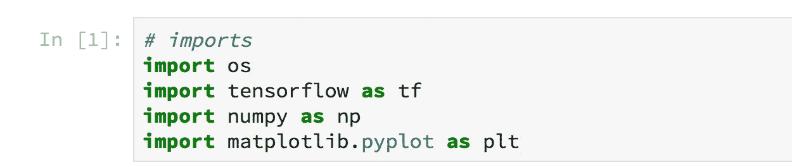
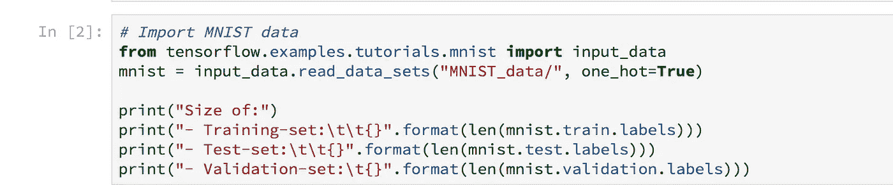
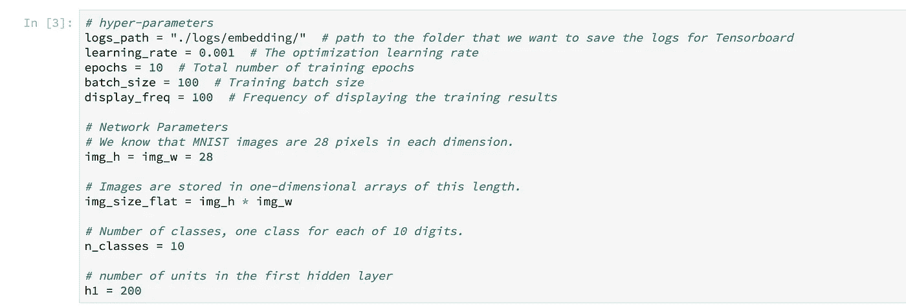
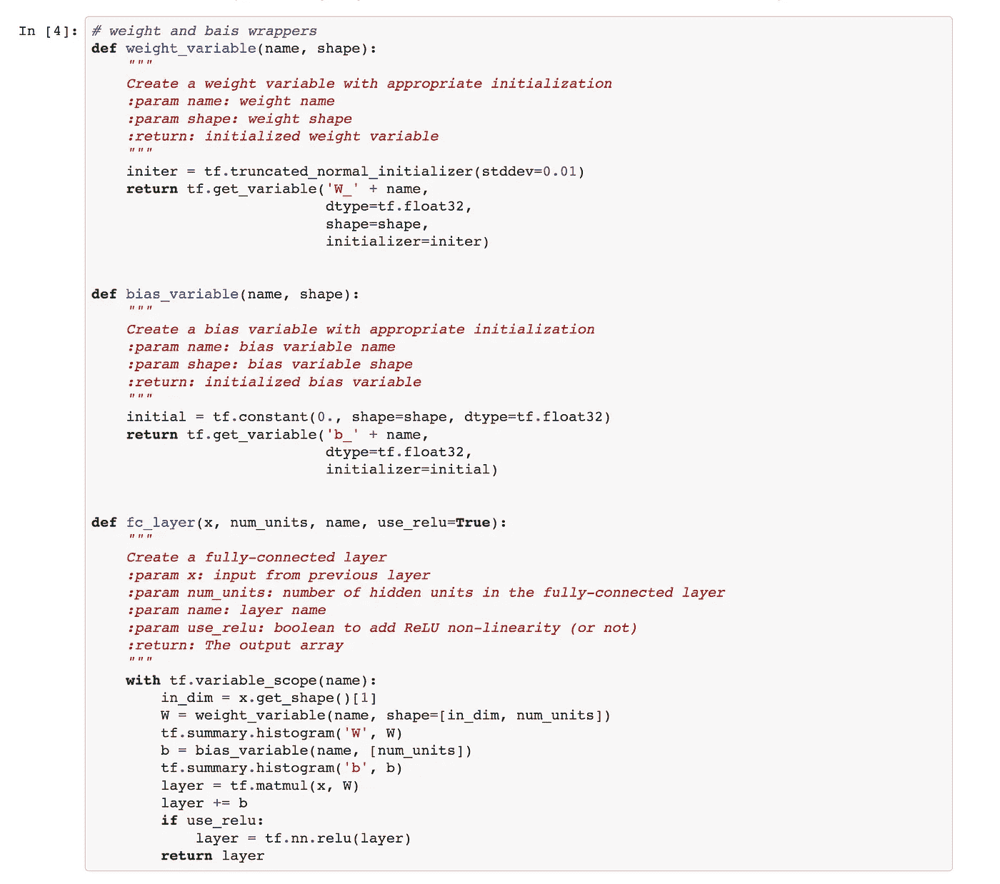
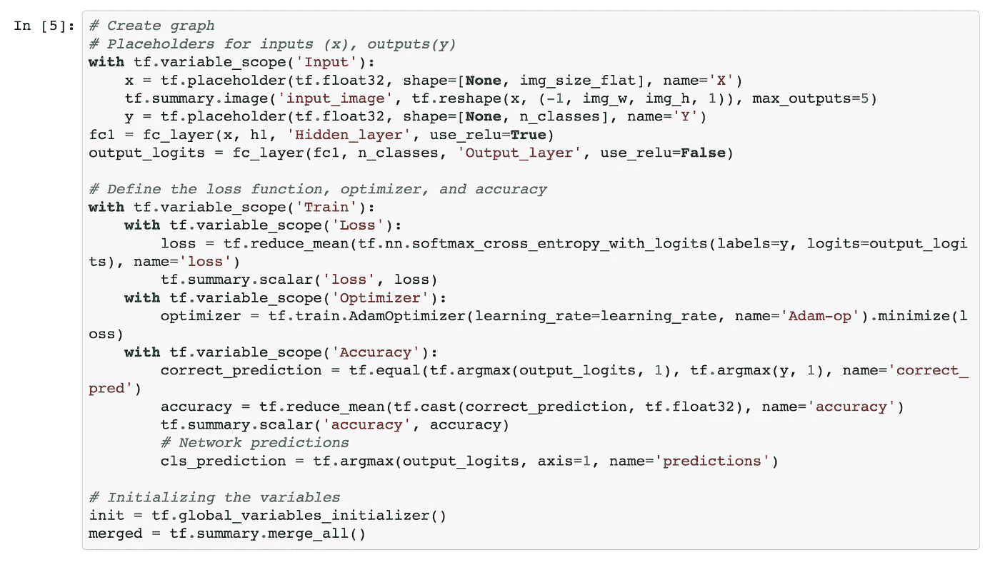
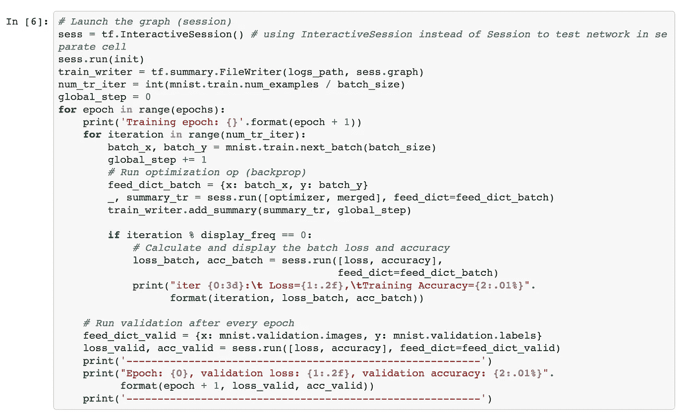
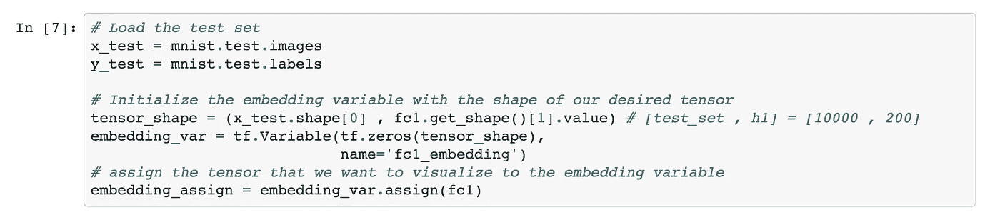
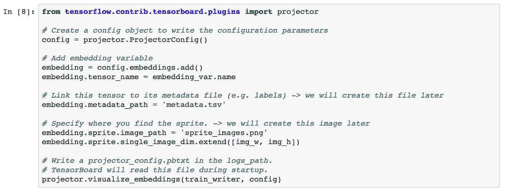
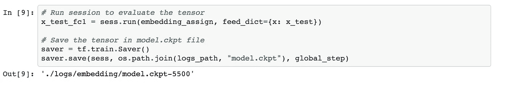
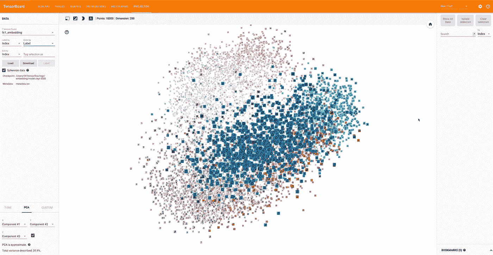

# 构建神经网络以可视化 TensorFlow 中的高维数据

> 原文：<https://medium.datadriveninvestor.com/building-a-neural-net-to-visualize-high-dimensional-data-in-tensorflow-269372414ae1?source=collection_archive---------2----------------------->


词嵌入和高维数据普遍存在于深度学习研究的许多方面，例如自然语言处理、构建推荐系统。谷歌最近开源了嵌入项目，该项目是一个交互式协作可视化工具，用于可视化高维数据。嵌入作为欧几里得空间中从点到数据输入的导航图。许多类型的大数据需要图形的可视化、神经网络、编写权重参数摘要、sigmoid 激活函数以及机器学习模型的准确性。

在本教程中，我们使用 MNIST 手写数字的数据集。关于 MNIST 手写数字数据集的机制的更多解释可以在 Yann Lecun 的网站上找到。正如 Yann Lecun 所描述的。

**IDX 文件格式**

IDX 文件格式是各种数值类型的向量和多维矩阵的简单格式。

基本格式是

幻数
尺寸 0
尺寸 1
尺寸 2
…..
尺寸 N 中的尺寸
数据

幻数是整数(MSB 优先)。前两个字节始终为 0。

第三个字节编码数据的类型:
0x08:无符号字节
0x09:有符号字节
0x0B: short (2 字节)
0x0C: int (4 字节)
0x0D: float (4 字节)
0x0E: double (8 字节)

第 4 个字节编码向量/矩阵的维数:1 代表向量，2 代表矩阵…

每个维度中的大小都是 4 字节整数(MSB 优先，高位字节序，就像大多数非英特尔处理器一样)。

数据像 C 数组一样存储，即最后一个维度中的索引变化最快。

第 4 个字节编码向量/矩阵的维数:1 代表向量，2 代表矩阵…

每个维度中的大小都是 4 字节整数(MSB 优先，高位字节序，就像大多数非英特尔处理器一样)。

数据像 C 数组一样存储，即最后一个维度中的索引变化最快。"

几个深度学习框架已经测量了利用 MNIST 手写数字的基准。TensorFlow 框架可以轻松访问 MNIST 数据集。TensorFlow 将数据表示为图表中的张量。张量大多数时候是高维数据的代表。MNIST 数据集大约有 Z784 维。我们生活的世界只有 Z3 空间。因此，对于人眼来说，可视化 784 维数据是一项艰巨的任务。因此，诸如主成分分析或 t-分布式随机邻居嵌入(t-SN3)的各种技术可以适于减少维数灾难，以减少维度并在人眼可解释的低维空间中可视化数据。

通过 TensorBoard 的嵌入式投影仪，可以构建一个神经网络来可视化隐藏层激活的张量。为此，将导入 numpy、matplotlib 库。



Figure 1\. Importing libraries.

这个例子的输入数据将利用手写数字的 MNIST 数据集。



Figure 2\. Importing Input data from MNIST dataset.

提取 MNIST 数据/列车图像-idx3-ubyte.gz

提取 MNIST 数据/列车标签-idx1-ubyte.gz

正在提取 MNIST _ 数据/t10k-images-idx3-ubyte.gz

提取 MNIST _ 数据/t10k-标签-idx1-ubyte.gz

尺寸:

–训练集:55000

–测试集:10000

–验证集:5000

超参数将在外部被指定为常量参数，因为神经网络不会学习这些参数。



Figure 3\. Hyper-parameters.

此处需要构建图表，但需要定义一个完整的卷积神经网络或 FC 层(LeNet)以及权重和偏差变量。



Figure 4\. Definition of weights, convolutional neural network, and bias variables.

由于助手功能已被激活，现在可以创建图形了:



Figure 5\. Creation of graph.

执行以下代码后，将在 Jupyter 笔记本中启动一个交互式图形会话:



Figure 6\. Launching the graph session.

执行代码后，它会显示神经网络的训练精度。

```
Training epoch: 1iter   0:       Loss=2.28,    Training Accuracy=37.0%iter 100:       Loss=0.45,    Training Accuracy=85.0%iter 200:       Loss=0.21,    Training Accuracy=95.0%iter 300:       Loss=0.34,    Training Accuracy=89.0%iter 400:       Loss=0.29,    Training Accuracy=90.0%iter 500:       Loss=0.18,    Training Accuracy=97.0%---------------------------------------------------------Epoch: 1, validation loss: 0.21, validation accuracy: 94.1%---------------------------------------------------------Training epoch: 2iter   0:       Loss=0.14,    Training Accuracy=97.0%iter 100:       Loss=0.19,    Training Accuracy=94.0%iter 200:       Loss=0.11,    Training Accuracy=95.0%iter 300:       Loss=0.06,    Training Accuracy=99.0%iter 400:       Loss=0.08,    Training Accuracy=96.0%iter 500:       Loss=0.12,    Training Accuracy=97.0%---------------------------------------------------------Epoch: 2, validation loss: 0.14, validation accuracy: 96.0%---------------------------------------------------------Training epoch: 3iter   0:       Loss=0.16,    Training Accuracy=96.0%iter 100:       Loss=0.15,    Training Accuracy=96.0%iter 200:       Loss=0.08,    Training Accuracy=97.0%iter 300:       Loss=0.11,    Training Accuracy=94.0%iter 400:       Loss=0.10,    Training Accuracy=96.0%iter 500:       Loss=0.09,    Training Accuracy=97.0%---------------------------------------------------------Epoch: 3, validation loss: 0.11, validation accuracy: 96.7%---------------------------------------------------------Training epoch: 4iter   0:       Loss=0.03,    Training Accuracy=100.0%iter 100:       Loss=0.04,    Training Accuracy=99.0%iter 200:       Loss=0.11,    Training Accuracy=94.0%iter 300:       Loss=0.05,    Training Accuracy=98.0%iter 400:       Loss=0.11,    Training Accuracy=97.0%iter 500:       Loss=0.11,    Training Accuracy=95.0%---------------------------------------------------------Epoch: 4, validation loss: 0.09, validation accuracy: 97.2%---------------------------------------------------------Training epoch: 5iter   0:       Loss=0.11,    Training Accuracy=97.0%iter 100:       Loss=0.04,    Training Accuracy=98.0%iter 200:       Loss=0.04,    Training Accuracy=100.0%iter 300:       Loss=0.02,    Training Accuracy=100.0%iter 400:       Loss=0.11,    Training Accuracy=97.0%iter 500:       Loss=0.04,    Training Accuracy=99.0%---------------------------------------------------------Epoch: 5, validation loss: 0.08, validation accuracy: 97.7%---------------------------------------------------------Training epoch: 6iter   0:       Loss=0.04,    Training Accuracy=100.0%iter 100:       Loss=0.07,    Training Accuracy=98.0%iter 200:       Loss=0.08,    Training Accuracy=98.0%iter 300:       Loss=0.04,    Training Accuracy=99.0%iter 400:       Loss=0.04,    Training Accuracy=99.0%iter 500:       Loss=0.05,    Training Accuracy=97.0%---------------------------------------------------------Epoch: 6, validation loss: 0.07, validation accuracy: 97.9%---------------------------------------------------------Training epoch: 7iter   0:       Loss=0.04,    Training Accuracy=99.0%iter 100:       Loss=0.03,    Training Accuracy=99.0%iter 200:       Loss=0.07,    Training Accuracy=99.0%iter 300:       Loss=0.06,    Training Accuracy=98.0%iter 400:       Loss=0.13,    Training Accuracy=96.0%iter 500:       Loss=0.07,    Training Accuracy=97.0%---------------------------------------------------------Epoch: 7, validation loss: 0.07, validation accuracy: 97.8%---------------------------------------------------------Training epoch: 8iter   0:       Loss=0.03,    Training Accuracy=99.0%iter 100:       Loss=0.01,    Training Accuracy=100.0%iter 200:       Loss=0.03,    Training Accuracy=99.0%iter 300:       Loss=0.02,    Training Accuracy=100.0%iter 400:       Loss=0.02,    Training Accuracy=100.0%iter 500:       Loss=0.05,    Training Accuracy=98.0%---------------------------------------------------------Epoch: 8, validation loss: 0.07, validation accuracy: 97.8%---------------------------------------------------------Training epoch: 9iter   0:       Loss=0.04,    Training Accuracy=99.0%iter 100:       Loss=0.01,    Training Accuracy=100.0%iter 200:       Loss=0.07,    Training Accuracy=98.0%iter 300:       Loss=0.03,    Training Accuracy=99.0%iter 400:       Loss=0.03,    Training Accuracy=99.0%iter 500:       Loss=0.09,    Training Accuracy=97.0%---------------------------------------------------------Epoch: 9, validation loss: 0.07, validation accuracy: 97.9%---------------------------------------------------------Training epoch: 10iter   0:       Loss=0.02,    Training Accuracy=100.0%iter 100:       Loss=0.03,    Training Accuracy=100.0%iter 200:       Loss=0.02,    Training Accuracy=100.0%iter 300:       Loss=0.02,    Training Accuracy=100.0%iter 400:       Loss=0.01,    Training Accuracy=100.0%iter 500:       Loss=0.01,    Training Accuracy=100.0% ---------------------------------------------------------Epoch: 10, validation loss: 0.07, validation accuracy: 98.1%---------------------------------------------------------
```

考虑到数据集大约有 10，000 个样本，神经网络中的隐藏层大约有 200 个节点。张量输出数据大约有 10，000 x 200 个图层。



Figure 7\. Assigning of hidden layer of the convolutional neural network to the variables.

该代码的目标是以低维方式可视化高维数据，使其可为人眼所理解。元数据可以从 TensorBoard 下载到 metadata.tsv 中，tensor board 可以存储各个样本的索引和标签。该文件必须添加到点嵌入配置中。文件。



Figure 8\. Creating config. object.

在 Jupyter Notebook 中运行会话将评估嵌入的张量并保存数据



Figure 9\. It creates the tensor in the deep learning model cockpit configuration log file.

我已经在 GPSingularity 的 GitHub 上分享了代码:

一旦会话被执行，现在可以使用以下命令在 TensorBoard 中可视化它:

tensorboard–logdir = logs/embedding/–host localhost 数据将在 tensor board 中显示如下。**程序结果**



Figure 10\. TensorBoard Embedded Projector to visualize High-dimensional data in low dimension.

我写这个程序的灵感来自于 Easy tensor flow【http://www.easy-tensorflow.com/'s 嵌入式可视化。

我已经在 GPSingularity Github 上分享了我的程序。

参考

易张量流(2018)。易张量流。从 http://www.easy-tensorflow.com/[取回](http://www.easy-tensorflow.com/)

Smilkov，d .，Thorat，n .，Nicholson，c .，Reif，e .，Viegas，F. B .，和 Watternberg，M. (2016)。嵌入投影仪:嵌入的交互式可视化和解释。从 https://arxiv.org/pdf/1611.05469v1.pdf[取回](https://arxiv.org/pdf/1611.05469v1.pdf)

[](http://eepurl.com/dw5NFP)