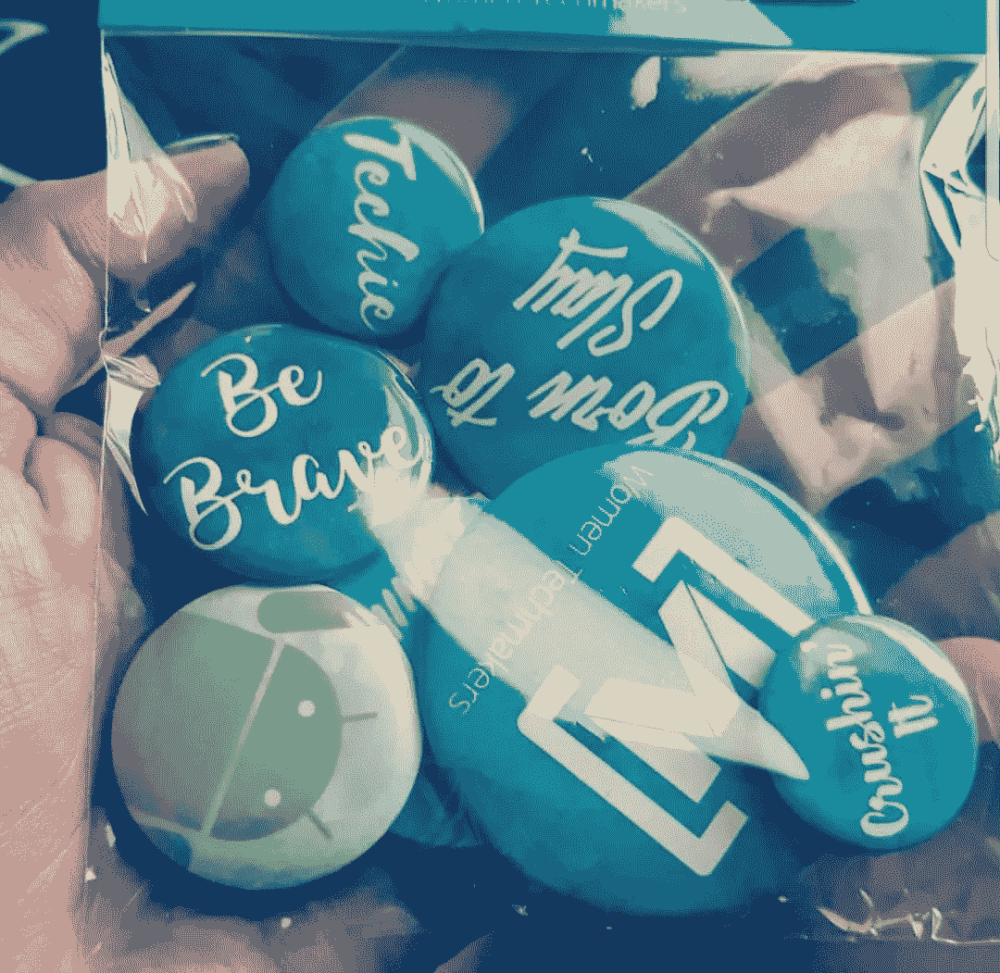
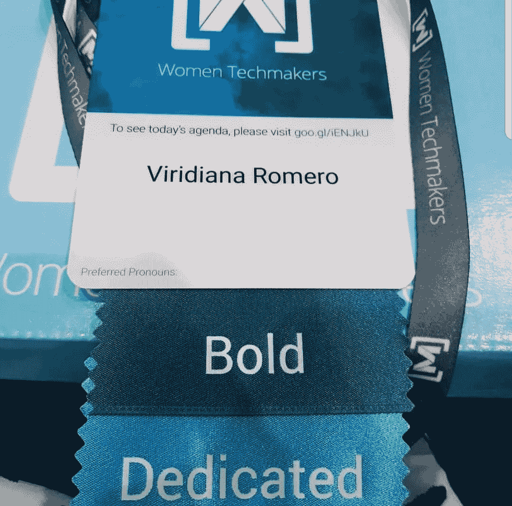
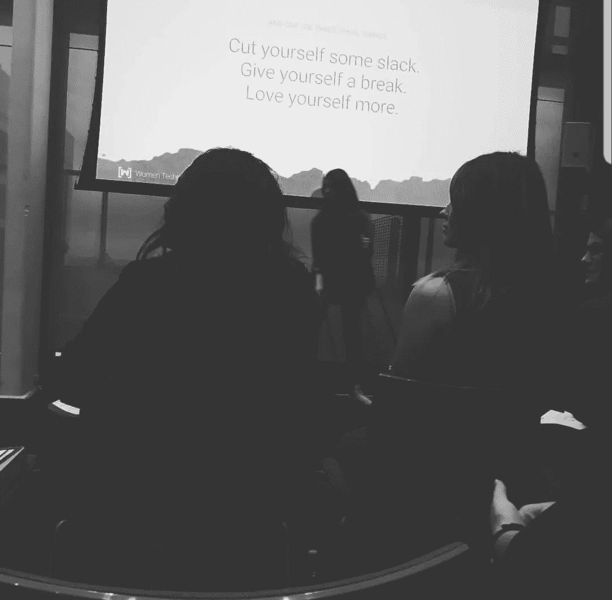
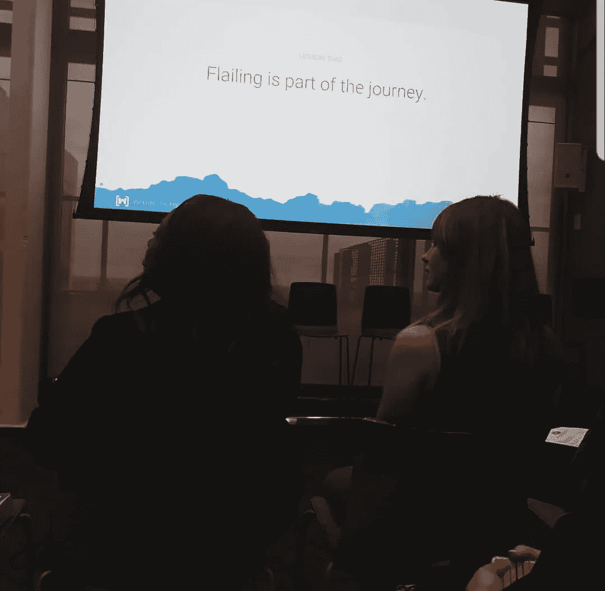
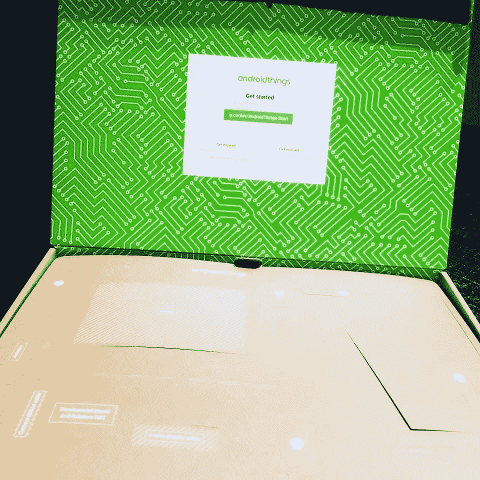
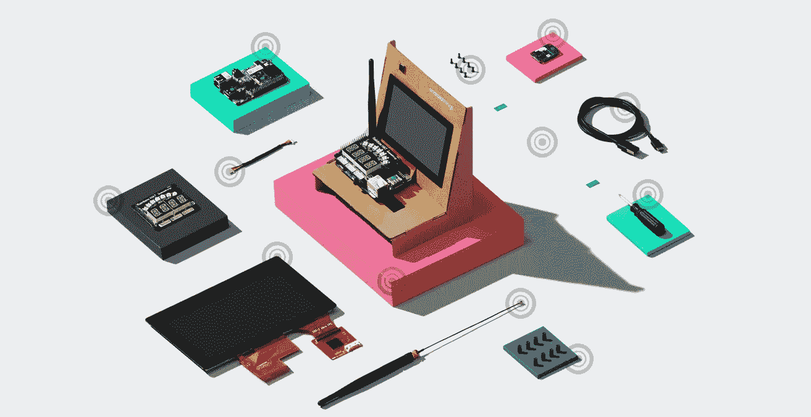
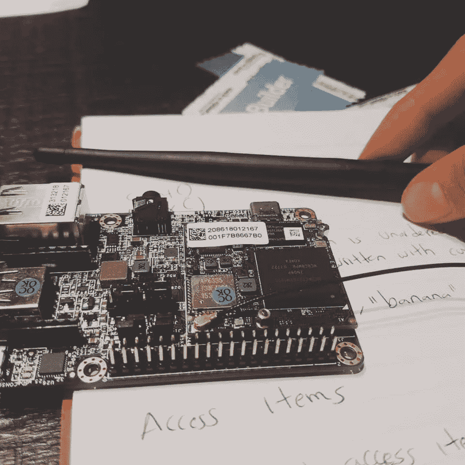
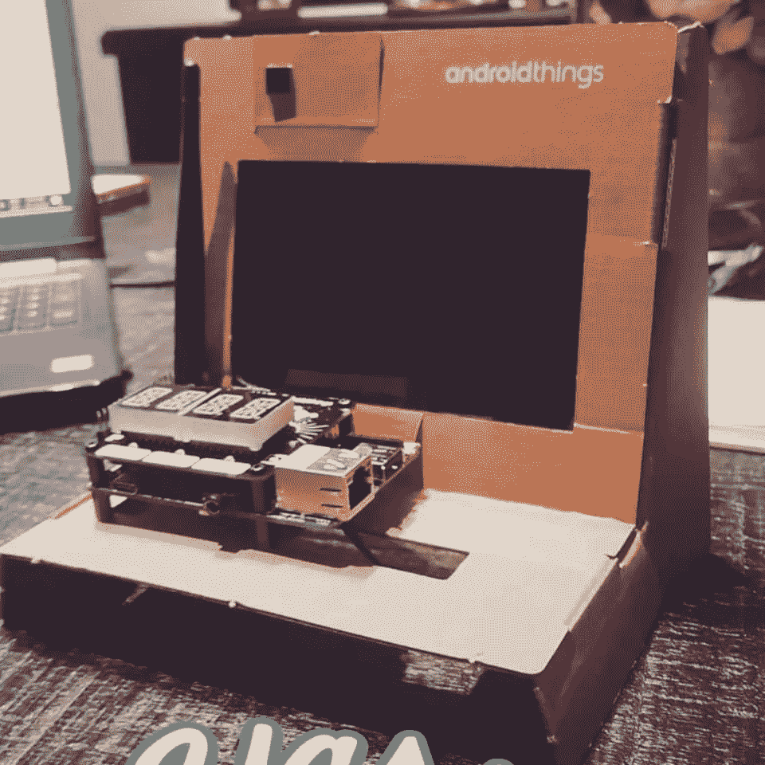
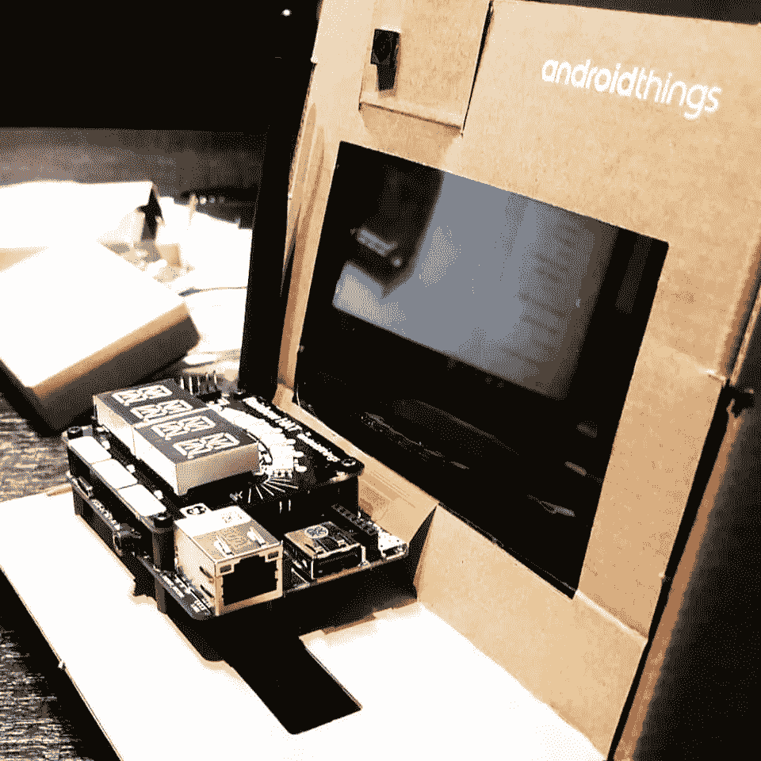
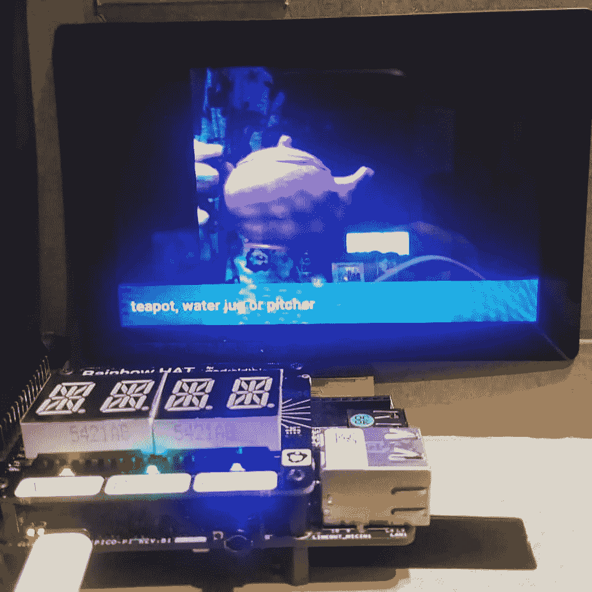

# 在国际妇女节峰会上建立一个新的地平线。刚刚连接了我的 AndroidThings 入门套件！

> 原文：<https://medium.datadriveninvestor.com/building-a-new-horizon-at-the-international-womens-day-summit-20c5552b7f1?source=collection_archive---------14----------------------->

几个月前，我申请了 2018 年女性科技创客峰会(Women Techmakers Summit)的席位，这是谷歌品牌和全球女性科技项目的一部分。幸运的是，我被邀请成为其中一员。我喜欢这类活动的原因是，它们提供了一个建立社区的空间，为技术领域的女性提供了资源，以推动该领域的创新和参与。

会议于 3 月 15 日在谷歌举行。我很高兴被邀请参加这次活动，并参观位于奥斯汀市区的谷歌总部。

第一件事，是在大厅登记，拿我的徽章。他们给了我纪念品和一个机器人套件，当时我还不知道那是什么。

这些活动总是一个认识不同背景的人的好机会，这可能会产生潜在的联系。最后，认识在同一领域有相似目标和兴趣的人总是一件愉快的事。带着一堆名片我太激动了！

演讲者和小组成员做得很好。她们都是代表奥斯汀地区科技行业优秀公司的女性。他们分享了自己在这个旅程中的经历，成为这个行业的一部分。励志演讲和建议总是受欢迎的。

Lynette Barksdale，Access Google 多元化、公平和包容性主管。是整个会议的主持人。

地图高级 UX 研究员 Erin Muntzert 是第一位发言人，她分享了自己在谷歌成为成功女性的经历。

我们有一个很棒的小组“**赋权女性赋权女性**”，由 Outdoor Voices 的高级软件工程师特里西娅·卡茨、DivInc 的联合创始人兼首席运营官达纳·卡伦德和 RetailMeNot，Inc .的运营副总裁金·里德组成。他们都是科技行业的伟大女性，但引起我注意的是特里西娅，她有使用跨平台网络和新兴技术的经验，包括聊天机器人和增强现实，她是户外之声新推出的 AR 购物体验 OV 小道商店的开发者。除了在 Outdoor Voices 的角色之外，Tricia 还是 VR Beyond Gaming、Austin WebVR 和 VR Cafe 的组织者。她致力于技术社区的多样性和包容性，并在“乡村女孩可以编码”、“奥斯汀妇女编码”和 Ann Richards 学校基金会中发挥了领导作用。

最后，也是我最喜欢的部分之一，谷歌闪电谈话介绍了谷歌聚焦故事的执行制片人卡伦·杜菲洛-罗森。凯伦在谷歌引入沉浸式叙事内容方面发挥了重要作用。作为该组织及其使命的主要贡献者，Karen 负责从开发到制作和多平台发布吸引和引导人才和内容，从而产生一系列原创、获奖、创作者驱动的故事，探索故事讲述者和观众的新问题。最近，卡伦是获得艾美奖和奥斯卡提名的短片《珍珠》的执行制片人，该片由帕特里克·奥斯本执导，并获得了先进影像学会杰出领导奖。

活动以 Natalie Villalobos 结束，她是全球项目的负责人，是谷歌的女性技术创造者，她还被邀请参加一个晚宴，并有机会与这些酷人交流。

别忘了他们给我的工具包！几个月后，我发现了这个有趣的神器是什么:它是 **Android Things Starter Kit** ！

盒子里有什么？

Android Things starter kit

*   纸板支架 x1
*   pico I . mx7 双开发板 x1
*   螺钉 x8
*   彩虹帽 x1
*   USB-C 电缆 x1
*   支座 x8
*   Wifi 天线和延长电缆 x1
*   摄像头模块 x1
*   摄像头模块电缆 x1
*   5 英寸多点触控显示屏 x1
*   显示 6 线电缆 x1
*   十字螺丝刀 x1

**什么是 Android Things Starter Kit？**

这是一个开发工具包，帮助你开始使用 Android 的东西，使用开源项目轻松构建原型。完成代码后，你可以把它移到生产板上，这就是它的工作原理！

我是 Android 开发的新手，我非常期待学习。所以我决定使用这个工具包来从事一个机器学习项目:使用用于 Android 的 TensorFlow 推理库来构建一个设备，该设备从设备摄像头捕捉图像，并根据预先训练的 ImageNet 模型在本地对它们进行分类。

**什么是张量流？**

TensorFlow 是一个使用数据流图进行数值计算的开源软件库。TensorFlow 已经成为训练机器学习模型并使用这些模型解决问题的流行框架。

我使用了 TensorFlow Lite 推理库，这样，我们可以很容易地将 TensorFlow 和机器学习集成到 Android 上的应用程序中。

首先，我需要连接我的工具包的各个部分。这是一个挑战，因为零件非常脆弱！

结果很神奇！我在开发板上安装了 Android 的东西，并将其连接到 Wi-Fi。

我让 Android Studio 使用我从谷歌开发者代码实验室得到的代码。Android Studio 是谷歌 Android 操作系统的官方集成开发环境，基于 JetBrains 的 IntelliJ IDEA 软件构建，专为 Android 开发而设计

将代码集成到开发板并拍了几张照片后，结果是这样的:

这不是很神奇吗？对于这个结果我还是很惊讶的！