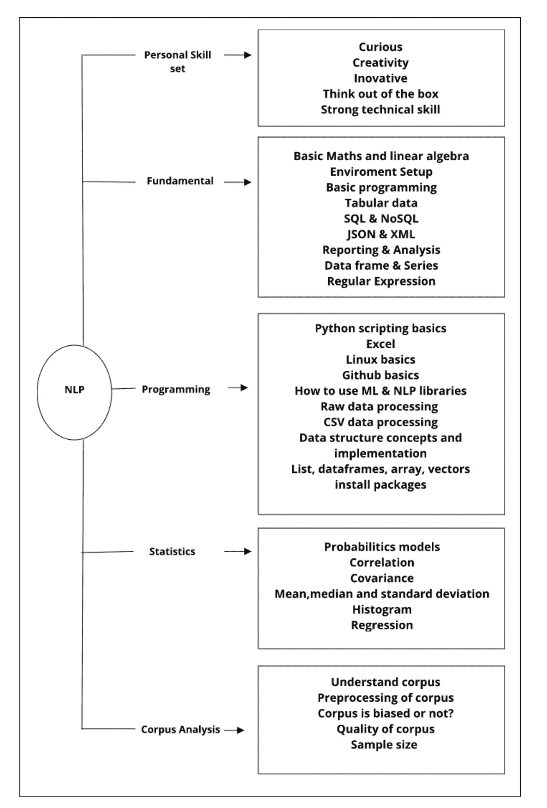
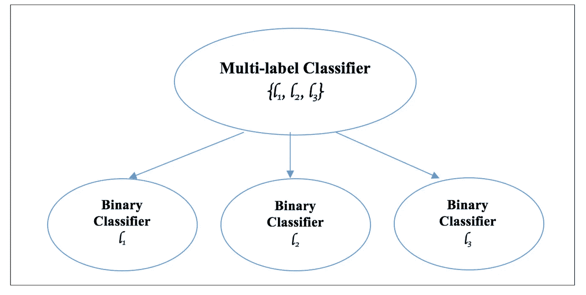
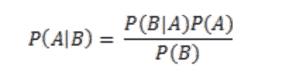
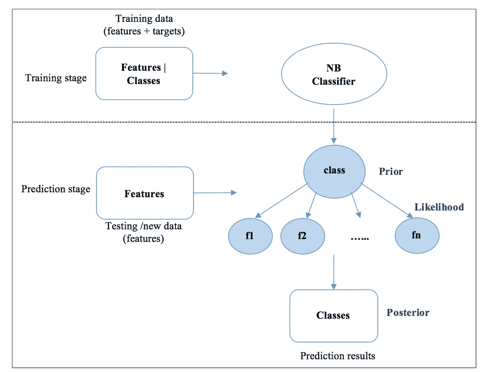
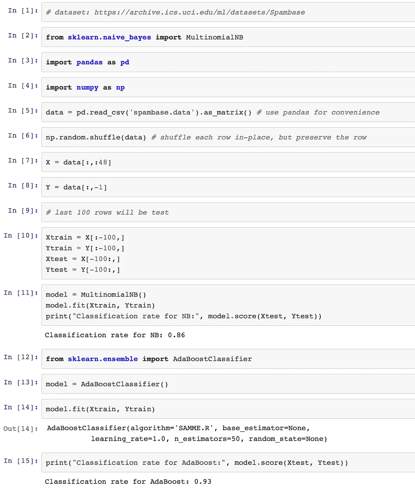

# 在 JupyterLab 中使用朴素贝叶斯和 AdaBoost 机器学习分类器构建垃圾邮件检测器。

> 原文：<https://medium.datadriveninvestor.com/building-a-spam-detector-with-na%C3%AFve-bayes-and-adaboost-machine-learning-classifiers-in-jupyterlab-d99d35f4d066?source=collection_archive---------1----------------------->

自然语言处理是人工智能的一个分支。构建一个机器或工具来通过自然语言处理来处理数据需要数学、统计学、算法和 Python 编程。Word2Vec 等先进技术可以将单词转换为向量，这使得通过数学和深度学习算法处理文本变得更加容易。Python 语言可以处理人类说、写和理解的语言。在我们开始在 JupyterLab 中实际实现 Python 代码之前，理解自然语言处理和机器学习分类器的本质是至关重要的。下图描述了自然语言处理的多个分支。

Figure 1: Adapted from Python Natural Language Processing Book

在我们试图通过 Python 中的自然语言处理和机器学习来解决的企业中设置上下文和背景问题是至关重要的。一旦定义了后台问题语句，下一步就是识别数据集和预处理数据，以机器可以通过 Python 语言理解的方式准备数据。特征工程是处理文本语言学的数据科学问题的另一个重要方面。任何机器学习分类器都可以应用于预处理数据集，以识别电子邮件是垃圾邮件还是非垃圾邮件。在这个场景中，我将处理一个包含 48 列的预处理数据集。确定词频度量对于理解特定单词在数据集中出现的次数除以文档中的单词数乘以 100 是至关重要的。在这个来自 UCI 的预处理数据集中，最后一列被标识为标签；1 =垃圾邮件，0 =非垃圾邮件。该数据集的利用不需要太多的数据争论和预处理来通过朴素贝叶斯和 AdaBoost 分类器测量分类的准确性。

作为受监督的机器学习算法的一部分，有几种其他的机器学习分类器可以用于解决电子邮件垃圾检测问题。作为解决该问题的一部分，最初将生成经过训练的分类模型，该模型从训练样本中学习数据特征。一旦训练完成，它将能够通过分类识别任何新数据。二元分类是最常见的分类器，可以确定电子邮件是垃圾邮件还是非垃圾邮件。当多类分类被应用于这样的问题时，它可以允许多于两个可能的类，并且在二元分类之外有更多的结果。手写识别可以追溯到研究和开发问题，以识别几个银行支票系统上从 0 到 9 的数字。多标签分类是另一种类型的算法，通常应用于生物信息学和基因组学，其中蛋白质可以具有多种功能。在这种情况下，分解分类器的数量可以是从多标签分类器到许多二元分类器的标签分类的解决方案。

Figure 2: Adapted from Python Machine Learning by Example.

贝叶斯定理表示事件 A 和事件 b。天气预测，例如明天是否会有暴风雨，或者翻转时得到正面或反面的概率。P(A|B)的概率是数据 B 的假设事件 A 的概率，这里 P(A|B)代表后验概率。P(B|A)表示事件 A 观察到 B 的概率，P(A)表示 A 为真的概率。它是 a 的先验概率。P(B)表示数据事件 B 的概率。

Figure 3: Bayes’ Theorem

Python 环境必须设置在 macOS 或 Linux 环境上。在本文中不会有在 macOS 或 Linux 上安装 Python 的分步指南。可以下载 PyCharm 或 Anaconda 发行版来设置 Python 和 JupyterLab 环境。如果通过 Pip 命令选择 PyCharm 作为 Python 环境，则必须导入单独的包。如果已经设置了 Anaconda 环境，它会安装所有必需的 Python 3.6 包，这样在从 sci-kit learn 访问朴素贝叶斯分类器时就不会出现任何问题。大多数时候，自然语言处理需要大量的预处理。只要数据没有任何不平衡，并且是合适的，任何机器学习分类器都可以用于分类电子邮件中的垃圾邮件问题。Python sci-kit learn 附带了用于多项式模型的朴素贝叶斯分类器。多项式朴素贝叶斯分类器对任何离散特征(如字数)都具有很高的准确性。然而，众所周知，它也适用于 TF-IDF。在 Python 程序中，数据被混洗以访问不同的数据块，最后 100 行被考虑用于训练和测试。具有朴素贝叶斯分类器的机器学习模型已经显示出 87%的准确度。也可以应用任何其他分类器。AdaBoost 分类器已经证明了 93%的准确率。

Figure 4: Adapted from Python Machine Learning by Example.

**结果**

JupyterLab 笔记本已经在 GPSingularity 的 Github 上分享了。

参考

t .考克斯(2018 年)。*面向 Python 程序员的 Raspberry Pi 3 食谱——第三版*(第三版。).英格兰伯明翰:Packt 出版公司。

哈登尼亚，N. (2016)。*自然语言处理:Python 和 NLTK* 。英格兰伯明翰:Packt 出版公司。

刘耀辉(2017)。 *Python 机器学习实例*。英格兰伯明翰:Packt 出版公司。

Thanaki，J. (2017 年)。 *Python 自然语言处理*。英格兰伯明翰:Packt 出版公司。