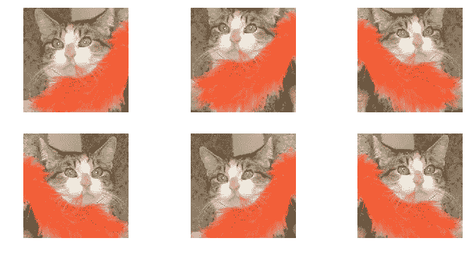

# 构建世界级的图像分类器

> 原文：<https://medium.datadriveninvestor.com/building-a-world-class-image-classifier-4584ecd96871?source=collection_archive---------12----------------------->

来自 [fast.ai](https://course.fast.ai) MOOC 关于程序员实用深度学习的个人笔记。

I 图像分类是视觉识别和计算机视觉中一个非常重要的问题。图像分类算法的主要目标是查看图像，并从预定义或固定的类别列表中决定它属于哪个类别。通常，我们使用卷积神经网络或 ConvNets 来实现这一点。

当使用 ConvNets 构建图像分类器时，我们模型的性能取决于我们训练数据的数量和质量、我们神经网络的架构以及我们在构建模型时选择的超参数。这篇文章向我们展示了我们如何处理我们的数据以及我们的算法的学习率，以建立一个世界级的图像分类器。

# 数据扩充

提高模型性能的一种方法是增加训练数据的数量。图像分类模型需要学习的数据越多，其性能就越好。在缺乏大量训练数据的情况下，模型开始过度拟合；当我们的模型开始学习训练数据的细节，而不是可以转移到验证集的更一般化的学习时，就会出现这种情况。如何避免这种对训练数据的过度拟合？我们可以找到更多的训练数据，或者对我们现有的训练数据进行数据扩充。

数据扩充是指我们可以在训练图像上执行的所有各种操作，以在不影响图像解释的情况下生成数据的变体。缩放、旋转和翻转是我们可以在图像上执行的一些操作，以增加我们的训练数据。我们这样做是为了给我们的模型提供更多的数据实例，这些实例可能是现实生活场景中可能遇到的变化。值得注意的是，您可以对图像执行的操作类型取决于您正在处理的图像。一些操作改变了某些类型的图像数据的解释。处理数据时的领域经验会让您直觉地知道哪种操作会对您的训练数据产生最佳结果。

Variations of the same image to augment the training data.

# 学习率

学习率是一个标量，它决定了我们向最优权重移动的快慢，以便通过梯度下降来最小化模型的误差。学习率太小，我们的优化将需要很长时间才能收敛，而我们的优化将开始发散而不是收敛，损失增加而不是减少。在训练任何深度学习模型时，这是要调整的最重要的超参数之一。我们如何为模型性能中如此重要的决定因素选择一个最佳值呢？

Leslie N. Smith 的一篇关于循环学习率的研究论文表明，提高我们的学习率可能会产生短期的负面影响，但在训练期间会对我们的模型的性能产生长期的积极影响。其中一个原因是，有时，减少损失和最终收敛到我们的局部最优的困难是鞍点的存在。鞍点是具有较小梯度的区域，因此需要较大的学习速率来“跳出”这种平稳状态，并最终加速这种区域的横向运动。另一个原因是因为我们的最佳学习率很可能在两个边界之间，所以选择这些边界将确保在训练期间使用最佳学习率。

既然我们已经有了一个决定最佳学习速度的策略，我们如何在实践中决定这个标量呢？在 [fast.ai](https://github.com/fastai/fastai/tree/master/fastai) 库中有一个内置的函数叫做学习率查找器**T5。lr_find()。** 这个函数的工作原理是从一个小的值初始化你的学习率，并在不同的迭代中逐渐增加你的学习率。然后，我们可以使用另一个内置函数 ***.sched.plot()*** 来查看损失与学习速率的关系图，这样我们就可以直观地了解每个学习速率的性能，然后选择最佳的学习速率。我们还可以创建一组学习率，在训练过程中使用，以使我们的模型在热重启(SGDR)的情况下进行随机梯度下降，以防我们的模型陷入局部最优，而实际上不会在我们的数据集上推广。

A plot of loss vs learning rate.

了解数据扩充并选择最佳学习速率是提高模型性能的可靠方法。在 [fast.ai](https://www.fast.ai) 库上构建这些实践给了我们准确性和速度的优势。

fastai 库是构建在 Pytorch v1 之上的免费开源库。如果你对此感兴趣，你可以看看这里的文档。