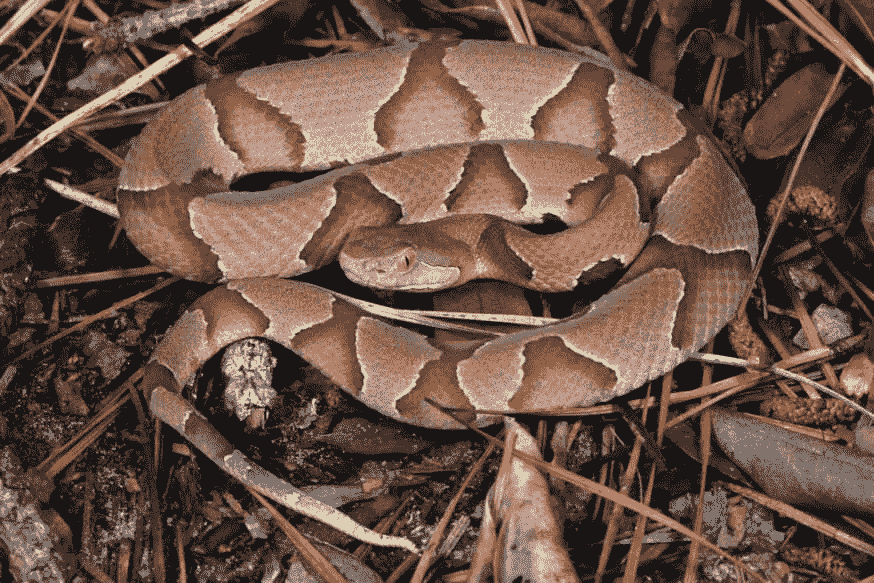
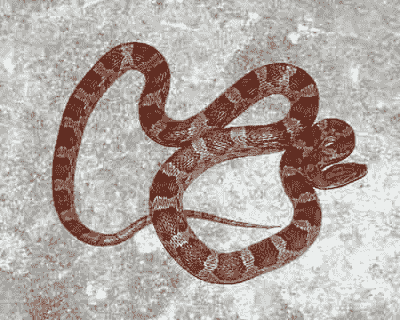
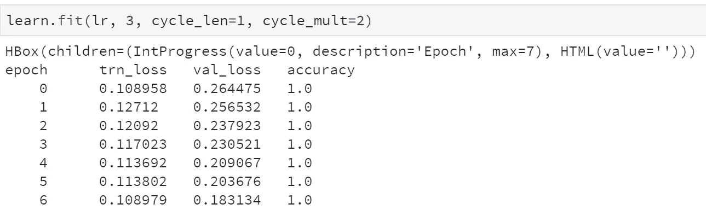
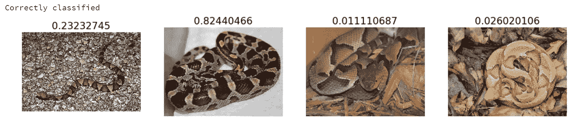
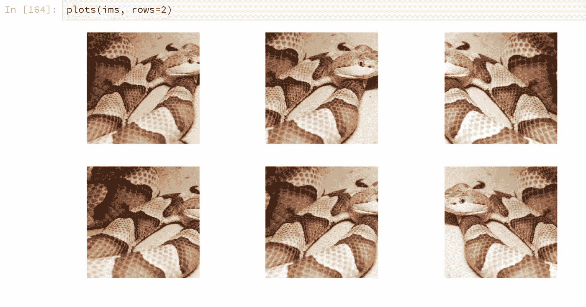
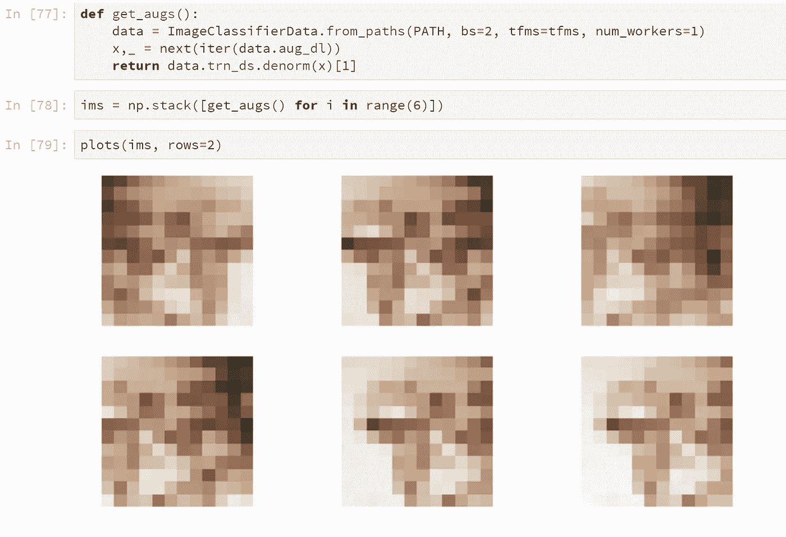
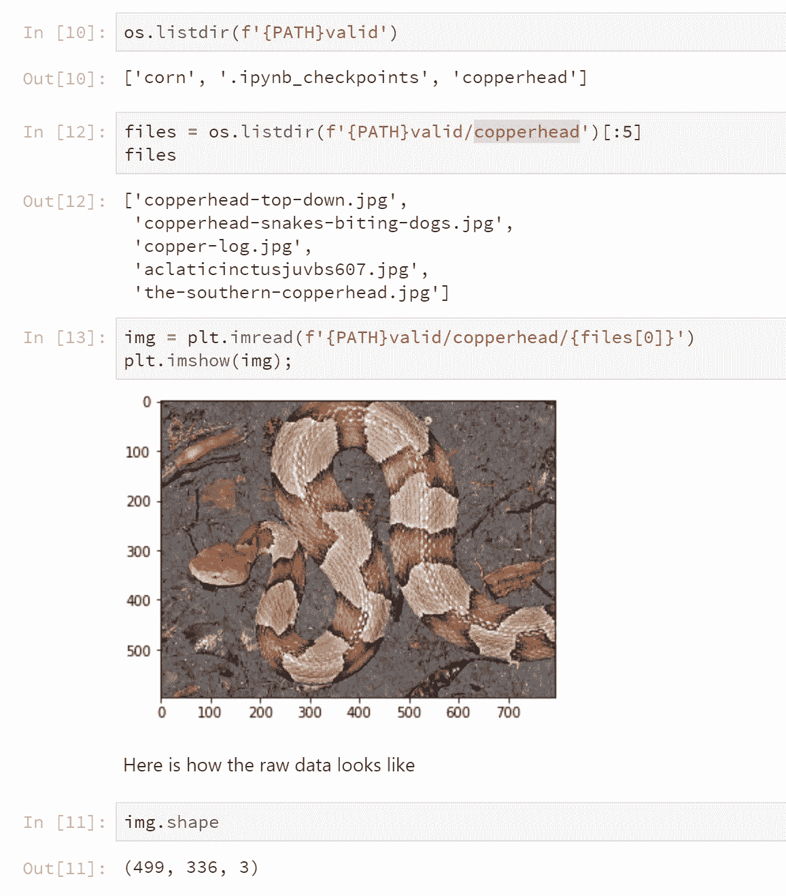

# 用 FastAI 构建一个 AI 蛇识别器——第一次测试:铜斑蛇 vs 玉米蛇。

> 原文：<https://medium.datadriveninvestor.com/building-an-ai-snake-identifier-with-fastai-first-test-copperhead-vs-corn-snake-15b10ec1c807?source=collection_archive---------6----------------------->

在看到很多社交媒体跟帖“我家院子里这是什么蛇？”随着没有全面的自动化蛇识别系统，我想也许利用人工智能可以形成一个自动化的通用蛇识别系统的基础。然而，全面的蛇识别器的第一步是简单地测试人工智能系统在避免常见的蛇错误方面是否比人做得更好。也就是说，有毒的铜斑蛇和无害的玉米蛇经常被混淆，导致许多无害的玉米蛇被当作“铜斑蛇”杀死(对老鼠很好，对人类或玉米蛇就不那么好了)。

作为我的学习 FastAI(一个用于构建世界级神经网络(AI)的新开源框架)的一部分，我想看看一个基本的视觉 AI(技术上是一个卷积神经网络或 CNN)是否能够学习，然后查看铜斑蛇和玉米蛇的图像，并自动区分哪个是哪个。这将是对我构建一个更加全球化的蛇标识符的长期项目的一个很好的概念验证测试。蛇专家使用鳞片图案作为识别蛇的主要方法，而人工智能在模式识别方面非常出色。然而，我还没见过通过人工智能完成的蛇分类器，因此这是一个挑战。

这里有两张照片显示了我想测试人工智能的问题——一张是有毒的，一张是无害的:

Common confusion — corn snake and copperhead. Can an AI system do better? (copperhead = left, corn snake = right).

最长的一步是第一步，这要归功于 FastAI 让你建立神经网络的速度——提取足够多的两种类型的蛇的图像，并将它们组织起来，输入到 AI 中，这样它就可以“学习”铜斑蛇和玉米蛇的样子。这两种蛇都有一系列的颜色阴影，因此颜色对于识别来说是不可靠的，所以数据集需要有各种各样的图像来匹配现实。

之后，使用 FastAI 建立主神经网络(AI)是一件简单的事情。事实上，在两天之内，我就能够设置和训练三种不同的架构来测试它们，因为 FastAI 处理了许多通常需要的底层杂务。

在设置、加载数据和训练之后，更多的训练产生了结果。所有这三种架构，通过增强的训练和数据扩充，能够学习并以高达 100%的准确率检测铜斑蛇与玉米蛇。下面是最后一次运行:

Final training results — 1.0 = 100% accuracy. The training loss and validation continue to improve with more runs.

上面显示了使用 ResNet50(测试的架构之一)进行的最后一次培训和测试。即使达到了“100%”的准确率，继续运行的原因是为了提高人工智能选择的信心…这就是上面的训练损失和验证损失数字。换句话说，它继续改进它的学习，因为它可以通过学习更多的细节在分类时磨练，从说“这是一只铜斑蛇，有 80%的信心……到 85%的信心，90%等”。

Examples of classifications from the AI snake system — three copperheads, one corn snake.

FastAI 简化的一个巧妙技术是“数据增强”的概念。基本上，人工智能可以经常学习一些东西(例如，如何识别一只猫)，但当一张新的猫照片让猫面对稍微不同的角度，或不同的缩放级别等时，这就失败了。因为它真的学会了如何只从或从特定的角度识别猫的脸。

因此，为了更稳健地训练一个人工智能系统，你可以拍摄照片，然后翻转它们，放大或缩小它们，稍微旋转它们，改变亮度等等。为了确保人工智能使用更一般化的规则来识别事物，而不是只针对那些照片的特定项目。

FastAI 让这一切变得简单。下面是 FastAI 在一张铜斑蛇照片上实现自动数据增强——你可以看到照片是如何翻转、放大、增亮等的。拍摄一张照片，并制作成总共 6 张图片进行训练:

当然，总是将进入神经网络进行训练的数据视为安全检查是有原因的。当我建立一个新的架构时，它总是达到 50%的准确率…换句话说，不比随机猜测好多少。发生了什么事？这种建筑真的不能在任何程度上识别蛇吗？

在查看图片之后，我错误地输入了 12，而不是 128 作为所有图片的尺寸。你可以看到下面的问题——这是新网络试图分类的增强图像的一个例子，失败的原因很明显:

oops — data augmentation gone wrong. A missing digit meant images were being sized to 12x12 instead of 128 x 128.

解决这个问题后，将图像尺寸从 128 像素提升到 400 像素，它很快就能像其他架构一样达到 100%的准确率。

Example of original training images before resizing for the AI to train on.

最终，由于所有三种架构都能够达到 100%的准确性，我能够证明神经网络或“AI”绝对可以作为一个合适的平台来建立一个自动化的蛇 id 系统。所有这三种架构都能够迅速达到 100%的准确性。

使用 FastAI 是非常有益的，因为许多世界级的人工智能训练技术(自动学习率检测、余弦退火、数据扩充)被轻松地添加进来，这也是快速达到世界级准确度的部分原因。我将写一篇更具技术性的文章，为感兴趣的人详细介绍将来使用 FastAI 相对于底层 PyTorch 的这些好处。

不过，更重要的是，现在，我能够展示一个通用的、基于人工智能的蛇身份识别系统应该是可能的。多个人工智能架构以优异的成绩通过了第一个概念证明程序，以查看它是否可以准确地将两种通常被混淆的蛇分类——铜斑蛇(有毒)与玉米蛇(除了基本的叮咬以外无害)。

下一步(也是这篇文章)将加入另一个常见的混淆(鼠蛇)，以及一些其他常见的蛇，如束带蛇，从一个分裂的分类转移到一个更大的多品种分类方案的开始，并继续增加人工智能的知识。