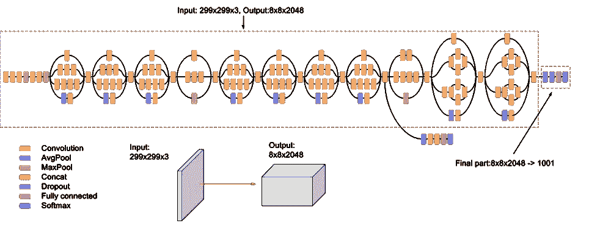
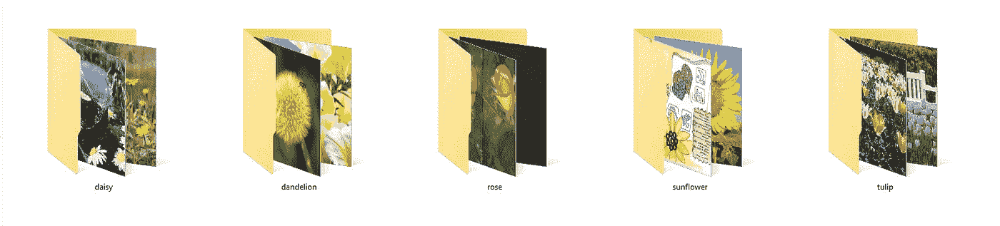
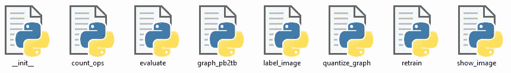
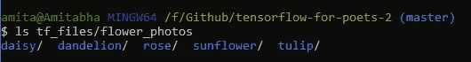
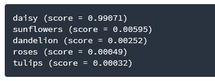

# 使用张量流构建图像分类器

> 原文：<https://medium.datadriveninvestor.com/building-an-image-classifier-using-tensorflow-3ac9ccc92e7c?source=collection_archive---------0----------------------->


Photo by [Arif Wahid](https://unsplash.com/@arifrw?utm_source=medium&utm_medium=referral) on [Unsplash](https://unsplash.com?utm_source=medium&utm_medium=referral)

将计算机视觉与机器学习相结合的前景让我不寒而栗！我们如何建立和训练模型，让机器以惊人的精度在图像之间进行识别，例如一张狗或猫的照片，这真的很有趣。潜力无穷。在这篇文章中，我将解释如何在谷歌为诗人创建的 TensorFlow 的帮助下，自己构建一个图像分类器，以识别世界上的任何事物！


在我们开始之前，我觉得有义务提供一些背景信息。 **TensorFlow** 是谷歌创建的一个开源库，专门研究机器学习应用。对于任何试图开始学习计算机视觉和机器学习的人来说，这是理解图像分类的复杂过程的一个很好的起点

从头开始构建图像分类器是一项巨大而艰巨的任务。有数以百万计的事情需要考虑。幸运的是，谷歌已经开源了其最好的图像分类器模型之一，名为*，它在世界上最快的一些机器上连续两周对来自一千个不同类别的惊人的 120 万张图像进行了训练。*

**

*The Inception model: convolutional neural network with multiple layers of abstractions*

*我们将使用现有的模型，并在此基础上构建我们自己的模型。这种方法带来了许多好处。例如，它将节省我们很多时间，一些 *Inception* 已经学习的参数可以重复使用，我们仍然可以用少得多的训练数据建立一个相当准确的分类器。这种在不同但相关的任务上重用预训练模型的过程在深度学习的世界中被称为**迁移学习**。*

# *1.下载培训图像*

*第一步是下载分类器的训练图像。这些将由您希望分类器学习识别的图像组成。你需要把它们整齐地分开，并贴上标签，放在单独的文件夹里。 *folder_names* 被认为是它们包含的照片的标签。*

**

*对于这个例子，我们将下载 5 种花的图片，每种类型有超过 700 张图片。点击下载图片[。你可以选择分类其他的东西，但是要确保你的目录像上面一样被整齐的划分。理想情况下，每类图片应该有超过 100 张图片(例如，> 100 张猫的图片，> 100 张狗的图片，等等)。你提供的照片越多，越多样化，你的分类器就越准确。](http://download.tensorflow.org/example_images/flower_photos.tgz)*

*小贴士:有一个非常酷的 Chrome 扩展叫做 [**Fatkun 批量下载图片**](https://chrome.google.com/webstore/detail/fatkun-batch-download-ima/nnjjahlikiabnchcpehcpkdeckfgnohf/related) 从谷歌批量下载图片。*

# *2.下载 TensorFlow 脚本*

*我们需要的所有脚本都保存在 [googlecodelab 的 git 库](https://github.com/googlecodelabs/tensorflow-for-poets-2)中。我们需要将存储库克隆到我们的计算机上。请注意，您需要在您的计算机上安装 [git](https://www.linode.com/docs/development/version-control/how-to-install-git-on-linux-mac-and-windows/) 。打开终端，使用以下命令克隆存储库:*

```
*git clone https://github.com/googlecodelabs/tensorflow-for-poets-2*
```

*回购包含以下脚本:*

**

*将包含所有训练图像的 *flower_photos* 文件夹复制到存储库的 *tf_files* 文件夹中。要确认工作目录的内容，使用命令 *ls* :*

```
*ls tf_files/flower_photos*
```

*这将显示您将要重新训练分类器的花的文件夹。*

**

# *3.重新培训网络*

*正如我之前提到的，这些图像分类模型包含数百万个参数。我们只是试图在此基础上构建我们的分类器。换句话说，我们将简单地训练网络的最后一层。虽然我们不需要显式地编写脚本的任何部分，但是强烈建议我们理解脚本使用的一些参数。*

## *一点理论*

*根据 TensorFlow 的[图像再训练文档](https://www.tensorflow.org/hub/tutorials/image_retraining)，**‘瓶颈’**是一个非正式术语，用于描述执行实际分类的最后一层之前的层。瓶颈层已经过训练，可以得出一组很好地代表图像的值，分类器可以使用这些值来区分它需要识别的不同类别。[阅读文档以获得更详细的解释。]*

*以下目录存储了所有瓶颈值的缓存，因此不必重新计算它们，从而节省了宝贵的时间:*

```
*--bottleneck_dir=tf_files/bottlenecks* 
```

*以下命令只是指向脚本的不同目录:*

```
*--model_dir=tf_files/models/"${ARCHITECTURE}" \
  --summaries_dir=tf_files/training_summaries/"${ARCHITECTURE}" \
  --output_graph=tf_files/retrained_graph.pb \
  --output_labels=tf_files/retrained_labels.txt \*
```

*最后，添加我们的训练图像的目录:*

```
*--image_dir=tf_files/flower_photos*
```

## *履行*

*综合起来，我们有这些命令集。我们将在终端中运行它以开始重新训练过程——下载预训练的模型，添加新的最终层，并在下载的花照片上训练该层。*

```
*python -m scripts.retrain \
  --bottleneck_dir=tf_files/bottlenecks \
  --model_dir=tf_files/models/"${ARCHITECTURE}" \
  --summaries_dir=tf_files/training_summaries/"${ARCHITECTURE}" \
  --output_graph=tf_files/retrained_graph.pb \
  --output_labels=tf_files/retrained_labels.txt \
  --image_dir=tf_files/flower_photos*
```

*训练所有图像的分类器大约需要 30 分钟。根据您提供的训练图像的数量，时间会有所不同。[偶尔，你可能会被错误淹没。不要被吓倒。我在脚注中包含了两个常见错误的解决方案。rest 的解决方案可以在 StackOverflow 和 Quora 中找到]*

# *4.分类图像*

*一旦你有了训练好的分类器，就可以开始测试了。你可以下载一张新的花的图片，或者从现有的训练图片集中选择一张图片。这次我们将调用我们的 *label_image* 脚本。运行以下命令对新图像进行分类:*

```
*python -m scripts.label_image \
    --image=tf_files/flower_photos/daisy/test_image.jpg*
```

## *结果*

**

*您将获得所有类别及其相应置信度得分的列表。上面的结果声称*测试 _ 图像*是具有(~99%)置信度的雏菊，这意味着我们的分类器已经相当准确地预测了。*

*您现在已经成功地构建了一个相当精确的图像分类器。祝你好运。*

## ***参考资料和有用资源:***

1.  *[tensor flow-如何为新类别重新训练图像分类器](https://www.tensorflow.org/hub/tutorials/image_retraining)*
2.  *[诗人张量流](https://codelabs.developers.google.com/codelabs/tensorflow-for-poets/?utm_campaign=chrome_series_machinelearning_063016&utm_source=gdev&utm_medium=yt-desc#0)*
3.  *[乔什·戈登的 ML 食谱](https://www.youtube.com/watch?v=cSKfRcEDGUs)*
4.  *[Siraj Raval 的图像分类器 tuts](https://www.youtube.com/watch?v=cAICT4Al5Ow)*
5.  *[tensorflow for poets 2 知识库](https://github.com/googlecodelabs/tensorflow-for-poets-2)*
6.  *[诗人做张量流](https://www.oreilly.com/learning/a-poet-does-tensorflow)*
7.  *[**张量流值错误解答**](https://stackoverflow.com/questions/40430186/tensorflow-valueerror-cannot-feed-value-of-shape-64-64-3-for-tensor-uplace)*
8.  *[**‘导入/输入’是指不在**](https://stackoverflow.com/questions/46325799/tensorflow-for-poets-the-name-import-input-refers-to-an-operation-not-in-the) 图形解决方案中的操作*
9.  *[图像分类走查-克里斯·达姆斯](https://www.youtube.com/watch?v=oXpsAiSajE0)*