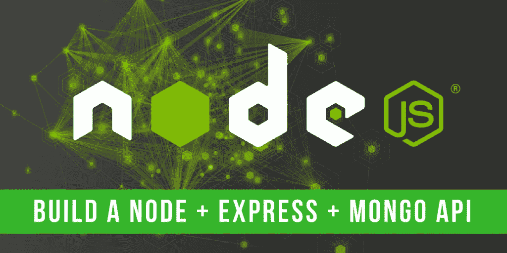
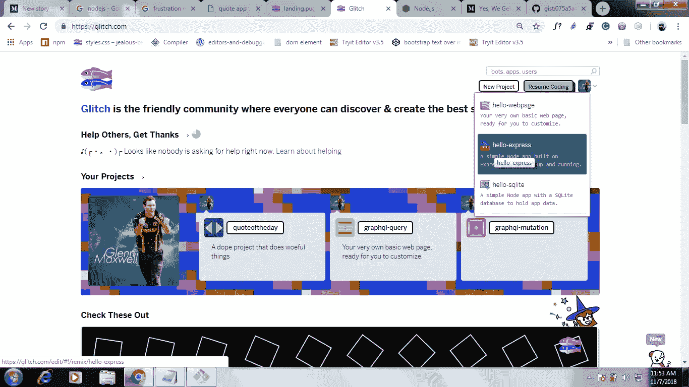
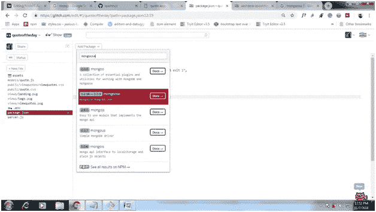
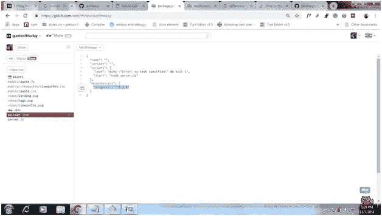

# 使用 Node.js、MongoDB 从头开始构建应用程序

> 原文：<https://medium.datadriveninvestor.com/building-app-from-scratch-with-node-js-mongodb-e00d3179afc1?source=collection_archive---------2----------------------->

> 我从初学者的角度写这篇博客。

为什么我选择了这个？

我选择 Node.js 作为我的服务器端编程语言，MongoDB 作为我的数据库。因为我了解 JS。但是，当开始学习 Node.js 和 MongoDB 的时候。我挣扎了很久。我自己认为，不要停止有很多资源。

**我们要建造什么？**

报价 APP。项目运行的是[这里的](https://quoteoftheday.glitch.me/viewquotes/)****。****

****先决条件！****

1.  **用于创建用户界面的 HTML。**
2.  **JavaScript 和 JQuery(在这个项目中使用)。**
3.  **使用服务器端编程。**
4.  **数据库的使用。**

> **注意:如果你看到 3 个点(换行符),停下来再读一遍换行符上面的段落。它会帮助你清楚地理解流程。**

****项目结构！****

**我强烈建议你使用 [glitch](https://glitch.com) 。我们可以通过搜索和选择轻松安装模块，只需点击一下就可以直接托管 Node.js 应用程序。**

****构建应用的步骤！****

**点击 hello-express 创建一个新项目。**

****

> **在创建文件或文件夹时查看项目结构。这是消除错误的简单方法。**

**步骤 1:创建文件夹和文件，就像在项目结构中一样。**

**步骤 2:在 quotes.html 内部，创建一个带有输入名称(标题、正文、作者)的表单。**

**上面的表单将标题、正文、作者发送到服务器。**

**步骤 3:在 viewquotes.html 内部，创建一个 div 标签来显示我们存储在数据库中的报价。**

**第 4 步:在 viewquotes.js 内部，编写 AJAX 函数向服务器发送 get 请求。**

**在上面的 AJAX 函数中，我们请求服务器发送数据库中的报价。(一旦我们编写了服务器端代码，上面的函数就可以工作了)。请再读一遍代码，直到你理解为止。还是不明白。别担心。一旦我们进入服务器端代码，你就会明白了。干杯！**

***踏入数据库…呜哇呜！！！***

**步骤 6:创建模式和模型(换句话说，表结构和使用该结构的表)**

**在第一行，有一个猫鼬模块(你必须安装它。该段落给出了在 mongoDB 中创建模式和模型的说明。从第 3 行到第 8 行，创建模型(表格)的结构。在第 10 行，使用结构创建模型。在第 12 行，创建了一个模型，它将被导入到 server.js 文件中(稍后)。**

****安装模块！****

**在 package.json 文件中，搜索一个模块并选择该模块。它将被添加到 package.json 中的依赖项下。**

****

**Searching and selecting the mongoose module**

**当您单击 mongoose 时，它会自动添加到依赖项下(可以在 package.json 文件中找到)。**

****

**mongoose module is added which is highlighted**

***在 server.js 文件中创建服务器端代码。接近关闭这个项目！！！***

**第 7 步:首先运行服务器。**

**这里安装了 express.js 框架，并且是必需的。为什么是框架？**

**查看使用和不使用 express.js 创建服务器的代码差异。在这里，你也可以从[那里学到很多好处。呜哇！你创造了服务器。厉害！](https://expressjs.com)**

**步骤 8:导入文件，安装模块并使用模块。**

**在第 3 行中，我们要求 body-parser 模块解析安装后来自客户端的 body 请求。第 4 行需要 mongoose，已经安装了。在第 5 行中，我们要求路径不需要任何安装过程。在第 6 行中，quote.js 文件被导入，该文件已经在 model 文件夹下创建并被导出。在第 8 行中，我们连接了 mlab。它将作为一个在线 mongo 数据库(见下面的视频了解如何设置 mlab 和使用云 mongoDB)。在第 10 行中，提供了公共文件夹中的静态文件。在第 12 行和第 13 行，body-parser 模块已经可以使用了。**

**步骤 8:在 URL 中提供 html 文件。**

**访问“/”将服务于 quotes.html 文件，“/viewquotes”将服务于 viewquotes.html 文件。**

**步骤 9:将报价存储在数据库中。**

**只要回到第 2 步，看看代码。我们将动作设置为 post。所以，当我们点击提交按钮。它将到达'/post '并将执行回调函数(即写在逗号(，)后的函数)。在第 4 行中，创建了新的报价对象，在第 3–7 行中，我们为该对象创建了属性。标题、正文和作者必须与报价方案中的字段名称相同。req.body 用于解析正文请求。标题、正文和作者在右边是输入标签的名称。从 6–15，对象保存在数据库中，如果数据存储正确，则重定向到“/viewquotes ”,否则将返回错误。**

**步骤 10:从数据库中检索报价。**

**请务必阅读步骤 4。AJAX 用于在“/get/quotes”端点发送 get 请求。因此，在服务器中，它从报价表中获取所有报价，并发送给客户端。在客户端，我们从服务器获取数据(对象)并将其粘贴到文档中(显示在 viewquotes.html 中)。**

**part of the viewquotes.html**

**以上代码是 AJAX 功能的一部分，它是为了你的理解。现在，你明白发生了什么吗？太好了！。**

**步骤 10:从数据库中删除报价。**

**它将删除数据库中的报价，与我们在 URL **':id'** 中发送的 id 相关。当您单击删除按钮时，您已经在 AJAX 回调函数中创建了这个按钮。尽可能多地理解 append 函数。**

**part of the viewquotes.html**

**没错。就是这样。删除按钮现在工作正常。**

**completed server.js file**

**步骤 11:尝试使用更新功能并更新报价。**

**对，你说得对！。您刚刚创建了 node.js 应用程序并将其托管在 glitch.com 中。太棒了。**

****有用的链接！****

1.  **[网络忍者](https://www.youtube.com/watch?v=BRdcRFvuqsE&list=PL4cUxeGkcC9jBcybHMTIia56aV21o2cZ8)。**

**随时欢迎评论！**

**D ay 1。这是我的博客，明天见！**