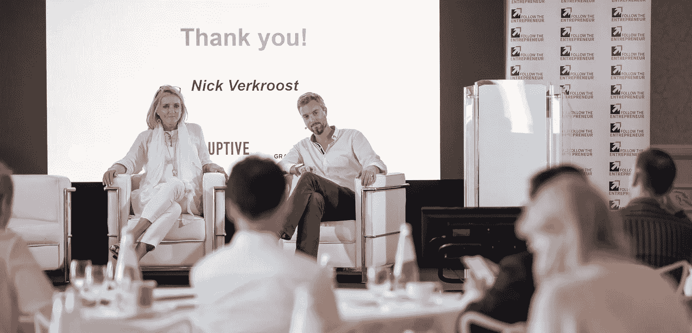
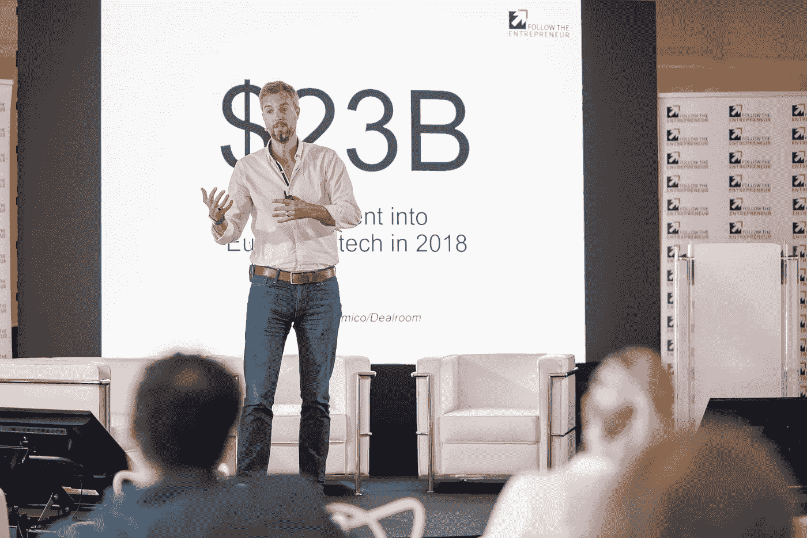
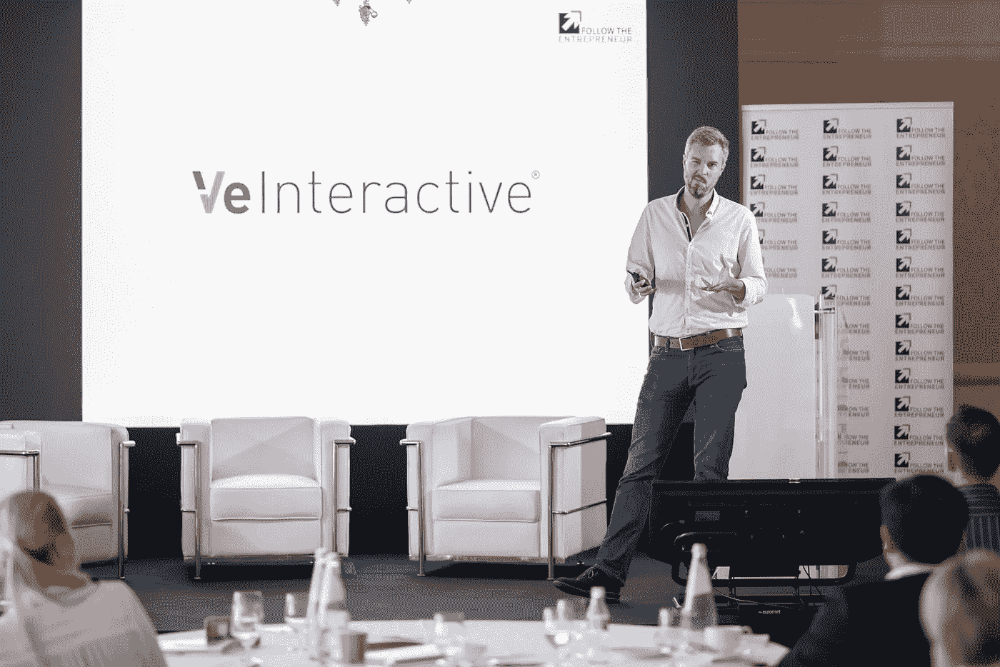

# 在创始人和投资者之间建立建设性的关系

> 原文：<https://medium.datadriveninvestor.com/building-constructive-relationships-between-founders-and-investors-e5f4185f19ef?source=collection_archive---------8----------------------->

## 从我作为投资者和企业家的旅程中学到的东西

*本文编辑自我在西西里岛陶尔米纳* [*跟随企业家*](https://globalftenetwork.com/) *2019 投资者峰会上的演讲*

# TL；速度三角形定位法(dead reckoning)

一旦创始人邀请投资者收购他们企业的股权，他们就有意识地决定分享这一旅程。他们的命运现在不可避免地交织在一起。然而，尽管两家公司都把自己视为创新的倡导者，但他们从根本不同的角度看待机遇。这造成了一种内在的紧张，有时会导致关系破裂，往往对公司不利。

 [## 风险投资家在给创业公司播种时会考虑什么标准？数据驱动的投资者

### 2017 年，风险投资资金攀升至十年来的最高水平。你的创业公司目前吸引风险投资的机会是…

www.datadriveninvestor.com](https://www.datadriveninvestor.com/2018/04/20/what-criteria-do-venture-capitalists-consider-when-seeding-a-startup/) 

关键是找出如何最大限度地利用彼此。

**创始人:**相信自己的愿景。你的投资者是一个渠道，而不是解决方案。他们的投入是一种视角，而不是法治。最终，他们永远不会比你更了解你的业务。但是，你也必须认识到，你还没有完成文章。就像运动员一样，只有努力训练并保持专注，胜利才会到来，这意味着建立正确的顾问团队来指导你。你的投资者有潜力在这方面提供巨大的价值，无论是通过他们的网络、他们投资组合的模式识别还是他们对金融市场的理解。学习如何提取它是你的工作！在一天结束的时候，你邀请他们和你一起踏上旅程，你需要他们坚持到最后。

投资者:你可以提供巨大的价值，但不要假装你不是。根据 [Diversity VC](https://sifted.eu/articles/uk-vc-sector-diversity-data/) 的调查，你们当中只有 8%的人曾经在创业公司工作过！在成为创业公司的首席运营官之前，我也经历过你的处境，所以请相信我，除非你自己经历过，否则很难产生共鸣！就像教练帮助他们的运动员成为最好的一样，归根结底，我们需要培养他们的才华，以使这家公司变得伟大。诚实地说出你哪里有有意义的经历，哪里没有。并且诚实地面对你能实际交付什么，不能交付什么。对一个创始人来说，披着经验外衣、实际上与你的经验无关的建议可能是灾难性的。你拥有独一无二的权威地位。尊重它。即使这意味着你能做的最好的事情就是躲开。

# 伟大的企业需要创始人和投资者一起工作

对于企业家来说，这真是前所未有的好时机。从上周在陶尔米纳举行的 FTE 投资者峰会的讨论来看，令人难以置信的是，从汽车到医学，从食品行业到儿童保育，有多少行业仍处于被颠覆的时机。

最重要的是，欧洲风险投资的资金比以往任何时候都多。2018 年，对欧洲科技的投资首次突破€的 200 亿美元大关。在过去的 12 个月里，英国 A 系列支票的平均规模增加了 18%。我们也看到企业和外国投资者的参与程度大大提高。我在之前的博客中写了这些趋势。

但对于所有这些融资轮的庆祝活动和围绕越来越大的支票金额的炒作，归根结底，这些都不重要！因为当行业媒体对下一笔完成的投资感到兴奋时，每个企业家都知道真正的工作才刚刚开始。

企业家面临的挑战是，他们现在必须带一个投资者一起上路。尽管投资者承诺向创始人的企业投资背后的意图是好的，但令人惊讶的是，我们都有这种关系破裂的故事。

在过去的 6 年里，我有幸作为投资者、导师或经营者与 20 多家初创公司合作，不幸的是，我在董事会上看到了相当多的可疑行为。投资者表达对某项业务的兴趣，作为对竞争对手进行尽职调查的一种手段；创始人在没有通知董事会的情况下，从根本上改变了商业模式；强行雇佣；政治斗争；利己主义；虚假承诺…我们都知道会发生，但作为一个行业，我们很少谈论它。

如果这些类型的行为没有发生，知道我们还会有多少成功的故事将是令人着迷的！

对创始人来说，重要的考虑是，通过允许投资者收购你企业的股权，你也在有意识地决定与你的投资者分享你的旅程，并允许他们参与其中:

*   他们将有投票权；
*   他们会对企业应该如何发展有自己的想法；
*   他们会从你作为创始人与他们交流并最终花掉他们的钱的方式中期待一定程度的专业性。

但是反过来也是一样的。投资者获得投资回报的能力取决于创始人(和他们的团队)能否建立一家伟大的公司。如果公司成功了，大家都赢了。如果公司倒闭，所有人都会损失——或者至少如果每个人都有相同级别的股份，他们会损失！

最终，它归结为一个严酷的事实:一旦融资完成，双方都必须认识到他们的成功本质上是相互依赖的。

成功的关键在于如何充分利用彼此——我指的不仅仅是温布利的包厢座位！

# **了解双方的动机**

为此，我们需要了解双方的动机:

## **创始人想要改变世界。**

是的，当然，经济回报是一个很好的副产品，如果发生的话，但这很少是驱动力。他们的主要动机是让他们对未来的憧憬成为现实。他们有一个单一的焦点，到了痴迷的地步。他们准备做出极大的牺牲来确保他们的生意成功。他们准备冒一切风险来实现他们的愿景。最终，他们不需要对任何人负责，并且在筹集到资金后，他们希望以同样的独立程度运营。

## **相比之下，投资者的驱动力是希望以尽可能小的风险获得投资回报。**

他们没有做出任何接近创始人的牺牲。他们的工作是管理风险，通过投资组合实现回报最大化，同时确保他们有必要的下跌保护措施。最终，他们要对合作伙伴和有限合伙人负责，做出正确的决策。

尽管两者都是创新和打破现状的倡导者，但他们从根本不同的角度看待机遇。但是每个人都掌管着建立一个成功公司等式的一半。这造成了一种内在的紧张:

*   创始人被他们的愿景所驱动，但他们知道他们需要投资者的支持才能实现目标；
*   投资者必须相信创始人的愿景会让他们在基金期限内产生回报，并不断怀疑自己是否投资了错误的业务。

# 创始人很难不仰视投资者

对大多数创始人来说，不幸的是，在他们开始与投资者建立关系之前，天平就向他们倾斜了:

首先，重要的是要认识到，追逐投资的创始人比满足需求的资助者多得多，这在市场上造成了巨大的权力不平衡。在与各种风险投资公司的交谈中，似乎典型的比例是大约 100 个未经过滤的机会落在风险投资公司的桌子上，然后成功完成投资。根据 Atomico 的《欧洲科技状况报告》, 2018 年有 2513 名投资者参与完成了 3952 笔风险交易，这意味着有很多失望的创始人。

但即使你足够幸运地赢得了风险投资，这一筛选过程在第一轮融资完成后仍会持续很长时间。由于早期阶段的自然流失率，风险投资者故意让自己投资的公司数量超过他们拥有的资金，以确保它们全部退出。因此，有一个持续的过程，将基金的剩余资本集中在风投认为将真正“成功”的投资组合公司上。根据 Crunchbase 的数据，只有 62%成功筹集 A 轮资金的公司会继续筹集 B 轮资金，其中只有 61%会继续筹集 c 轮资金。这意味着风投公司的 A 轮投资组合中，只有五分之二的公司会在 c 轮融资中继续获得基金的支持。

这给创始人带来了巨大的压力，让他们继续给投资者留下深刻印象，同样，这也给了投资者在这种关系中重要的隐含权威。然而，这种舞蹈并没有给创始人让世界变得更美好的首要使命增加多少价值。

但它比这更深刻。我们要明白，创始人是第一次做一件事。没有人建立创始人正在建立的企业。因此，他们在一个不断被评判、被告知行不通的环境中这样做，很少有可信的参考点来知道他们是否真的走在正确的道路上。创始人穿着令人难以置信的自信和坚韧的盔甲，但在内心深处，在一个不确定的世界里，他们也很自然地从身边的人那里寻求认可，尤其是当他们做出如此重大的牺牲时。

# **投资者肩负着巨大的责任**

这将创始人置于潜在的弱势地位。同样，这也让投资者承担了巨大的责任。然而，根据[多元化风投](https://sifted.eu/articles/uk-vc-sector-diversity-data/)最近的一项研究，只有 8%的英国风投曾经在初创公司工作过。这绝对是一个惊人的数字！这也许并不奇怪，当我们看到那些我们可悲地期待的行为时，却很少对创始人的处境感同身受。

让我们站在投资者的角度思考几分钟…

我想我们都同意，创始人承担的风险最大。但同样重要的是要认识到，当投资者承担风险时，大多数时候他们是代表别人这么做的。我不知道你是怎么想的，但是当我知道风险只影响到我的时候，我会更愿意承担风险，而不是代表其他人做出可能导致他们赔钱的决定。责任的级别突然变大了。现在，假设我选择的投资组合公司失败了，我不仅要卑躬屈膝地去找我所有的有限合伙人，解释发生了什么(尴尬！)但这也可能会影响我对管理基金其余部分的看法，因为我现在能获得所需回报的“赌注”更少了。投资者必须平衡投资组合和有限合伙人的需求。

就像创始人一样，投资者正在投资一个以前从未建立过的企业，同样缺乏可信的参考点，无法真正知道它是否会成功。有时候，最好的尽职调查永远无法揭示事情将如何真正展开。看看 Fab.com 的遭遇就知道了，它是电子商务行业的宠儿，其收入和用户的惊人增长吸引了来自沙丘路精英的高质量人才和投资。2011 年至 2013 年间，该公司积累了逾 3 亿美元的投资，对该公司的估值为 9 亿美元。两年后的 2015 年，由于糟糕的商业规划和过早向欧洲扩张，该公司仅以 1500 万美元的价格被出售。

偶尔，你会看到一些流氓创始人，比如 VE Interactive 的[大卫·布朗，他们在破产前通过债务和股票筹集了 1 . 5 亿英镑，这在很大程度上要归功于他们在私人飞机、豪华派对和名牌家具上的过度支出。这些故事让投资者夜不能寐。](https://ftalphaville.ft.com/2017/11/23/2196102/the-former-ceo-of-fallen-tech-unicorn-ve-interactive-has-filed-for-bankruptcy/)

# **投资者支持创始人，而不是企业**

支持任何企业的现实是，尽管你可以进行尽职调查和第三方验证，但你永远无法确定你的投资是否会有回报。

投资者唯一确定的事情是他们支持创始人。该行业的其他一切都可能发生变化。

我相信大家都熟悉营销自动化工具 Marketo，它在 2013 年以 5 亿美元的价格首次公开募股，随后被收购，随后以 40 亿美元的价格转售。你可能不知道的是，菲尔·费尔南德斯(Phil Fernandez)、乔恩·米勒(Jon Miller)和大卫·莫兰迪(David Morandi)这三位创始人在 2006 年创办了这家公司，他们在第一年里构建了错误的 MVP，花光了 300 万美元的风投资金，然后转向董事会说:“我们将放弃这款产品和我们从中获得的 100 万美元 ARR，转而打造其他东西”。他们最初的风投支持者、InterWest 的道格·佩珀(Doug Pepper)做出了巨大的承诺，才同意了这个项目。大多数人可能已经注销了投资。但在今年早些时候的 SaaStr 欧洲会议上听他讲述这个故事时，他解释说，从根本上来说，这归结于他对创始人的信念。

关于创始人的伟大之处在于，你找不到任何人像他们一样致力于事业，即使在事情变得糟糕的时候！看看埃隆·马斯克的故事就知道了。他已经花光了出售 PayPal 赚来的所有钱，前三次 SpaceX 飞行失败，特斯拉大出血，最糟糕的是他离婚了。然后在《60 分钟》的采访中，他被问及是否想过放弃，他的回答是:

> “从来没有。我从不放弃。我必须死亡或者严重残疾”——埃隆·马斯克

今天，SpaceX 正在向国际空间站运送美国国家航空航天局的物资，特斯拉正在成功地载着一夜醉酒后的人们回家。

建立这些企业需要惊人的信念和信心。同样，支持这些创始人也需要巨大的勇气和承诺。

# 创始人不是完稿

然而，另一方面，不管喜欢与否，创始人在这个过程中需要他人的指导，无论是来自投资者还是其他值得信赖的顾问:

1.  首先，创业从来都不是线性的，创始人的角色是根据他们对市场需求的愿景，利用非常有限的数据做出重大决策。所以根据定义，他们会时不时地出错。弗雷德·德斯坦对此有一个绝妙的描述:他在哈利·斯特宾斯(Harry Stebbings)采访的[最近的播客](http://www.thetwentyminutevc.com/freddestin2/)中说(我在这里转述一下),创始人是在追求平均打击率，而不是最高分。根据[最近的一项研究](https://techcrunch.com/2013/11/02/welcome-to-the-unicorn-club/)，80%的独角兽公司至少有一名联合创始人曾经踏上退出之旅，这可能就不足为奇了。
2.  其次，创始人必须意识到，创业和扩大业务规模是非常不同的，大多数人都发现这种转变非常困难。他们可能想出了这个主意，并付出了血、汗和泪来实现它，但通常他们是高级领导团队中资格最差、经验最少的成员。我的一位经营着一家著名英国风投公司的好朋友谈到他们目前投资的 34 家公司时表示，随着公司规模的扩大，他只看到 1 位创始人成功地适应了首席执行官的角色。
3.  第三，尤其是在当前的环境下，创始人很容易沉迷于实现他们的愿景，以至于他们不自觉地忽视了公司对社会的广泛影响。只要看看脸书对用户隐私的滥用，优步对创造一个多样化和包容性的工作场所的漠视，或者亚马逊数据中心的环境影响就知道了。这些都是极其重要的考虑因素，无论如何，创始人必须将这些考虑因素置于已经超乎常人的业务建设任务之上。

创始人和投资者有很大的空间互相帮助，双方都有责任创造合适的环境，让他们为了企业的利益建设性地合作。投资者可能是强大的驱动力，但如果他们不小心，他们在企业中的权威也可能扼杀推动这一动力的创业火花。创始人带来了秘方，让每个人都兴奋的才华，但他们很少是成品，如果他们不适应公司的发展，他们也有可能扼杀他们创造的业务。

# **运动员和教练**

我把这种关系比作运动员和教练的关系:

我们都熟悉拉菲尔·纳达尔，前世界排名第一，18 次大满贯冠军，红土之王。然而，是他早期的教练，他的叔叔托尼·纳达尔，告诉右撇子拉法学会用左手打网球。托尼永远无法复制拉法的天才，但这种微小的洞察力是拉法今天成为球员的基础。

在最近与保罗·安纳孔的一次采访中，他说:

> “像这样的教练根本不包括帮助他们提高技能，更多的是平衡情绪和心理，以确保他们在球场上继续做他们需要做的事情。”—保罗·安纳孔

投资者和创始人的关系非常相似。

## **投资者的角色类似于教练:**

*   他们永远不会成为像创始人那样优秀的运动员。
*   他们永远不会像创始人那样了解企业。
*   但无论是因为他们的网络、他们投资组合的模式识别，还是他们对金融市场的理解，他们都可以提供巨大的价值。
*   他们的角色是问一些聪明的问题。挑战创始人的想法，不是因为他们认为创始人是错的，而是因为创始人被迫对他们最终做出的任何决定建立信心。
*   投资者有责任在创始人失意时支持他们，在事情进展顺利时推动创始人想得更远，并且永远不要害怕说出需要说的话。

如果投资者认为他们做不到这一点，那么他们能做的最好的事情就是离开！

## **企业家的角色类似于运动员:**

*   我们相信的是你的才华，这不是可以教的。
*   归根结底，是你在球场上做出的决定决定了我们是否成功。
*   但是你不是文章的完稿，你不会总是把每件事都做对。
*   从长远来看，来自正确教练的训练会有回报。
*   建立你认为需要帮助你的团队取决于你自己。

当然，最大的区别是运动员可以解雇他们的教练。创始人不能解雇他们的投资人！

*本文编辑自我在西西里岛陶尔米纳*举行的 [*跟随企业家*](https://globalftenetwork.com/) *2019 投资者峰会上的演讲*

***关于我的一点点:*** *我是一名初创公司投资人，后来成为经营者，喜欢帮助创始人实现他们的愿景。这些年来，我收集了大量可能与其他企业经营者相关的知识，所以我希望你喜欢我的文章。如果你想多谈谈，请随时联系我。*