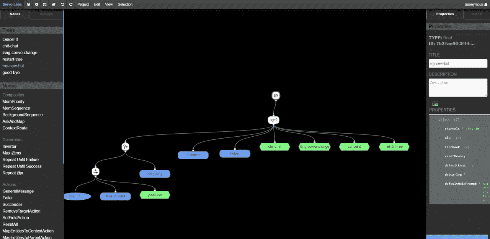
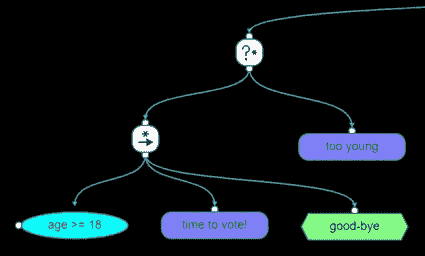
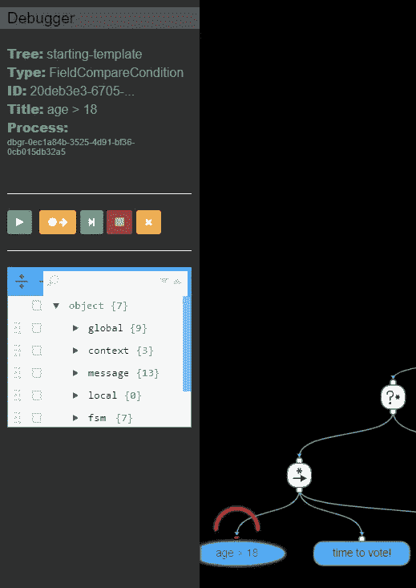

# 使用 Servo 构建上下文感知机器人

> 原文：<https://medium.datadriveninvestor.com/building-context-aware-stateful-bots-using-servo-a2dc3f557469?source=collection_archive---------9----------------------->

[](http://www.track.datadriveninvestor.com/1B9E)

美国开发者超级擅长开发应用程序:移动、桌面或网络应用程序。这些应用程序通常遵循相同的流程:用户填写表格(或点击按钮)，应用程序计算新数据以显示，然后显示更新的屏幕。随着时间的推移，架构和设计模式已经发展到支持这种类型的应用程序开发..举几个例子，可以提到依赖注入、微服务、基于方面的编程、MVC(模型视图控制器)等等。

然而，对于聊天机器人或语音助手来说，这些功能并不太好用，因为它们没有一个表格可以填写，也没有特定的按钮可以点击。用户可以说任何话，有时与当前问题无关。销售机器人可能会询问用户她正在寻找的鞋子的尺寸，用户会通过询问机器人他们是否有靴子来回应。汽车语音助手可能正在进行关于寻找附近餐馆的对话，而用户告诉它给他住在该地区的朋友打电话。朋友没有接电话，机器人将返回到它停止的同一点。

当然，人们可以限制对话，但这显然会损害用户体验。或者，可以尝试提供特定的逻辑解决方案——但这可能会导致复杂、庞大且难以维护的代码库，使其难以维护。

本质上，这是一个国家管理问题。Servo 是少数几个可以解决这个问题的框架之一。它是通过利用行为树来做到这一点的，行为树是一种在软件行业开发的编程范式，该行业多年来一直在开发机器人，即游戏行业。

在本教程中，我们将解释如何启动一个简单的伺服机器人。这里我假设你是一个熟悉 Github、NodeJS 的开发者，重要的是，你知道如何使用 NLU 和 NLP 引擎(意图、实体等)。如果你没有，互联网上到处都是优秀的资源——只需搜索“机智教程”或“路易斯教程”。

# 入门指南

Servo 是一个开源框架，因此，你可以在 [Github](https://github.com/servo-ai/servo-platform.git) 将其分叉，并按照自述文件进行安装和 *npm start* 。它应该在您的本地机器上运行行为树编辑器和伺服服务器，每个都有自己的进程。然后，在浏览器中打开 localhost:8000，您将看到一个登录屏幕。通过后，选择项目，打开你自己的**新项目:**



New Project initial template

这个树代表了一个处理一系列问题的机器人，可以作为这个框架的简单教程。点击调试器，然后点击运行▶️按钮，你会被询问你的年龄。让我们输入几个数字，看看会发生什么:

1.  如果输入一个年龄(比如说 55 岁)，机器人会给出你的年龄，并让你去投票
2.  如果输入一个小于 18 的数字，回答会是你太年轻了
3.  32 岁时，机器人会给你一个关于你年龄的极客评论

但是:如果我们输入完全不同的东西呢？

1.  如果你问“你是谁？”，你会得到答案的。然后，你会被引导回到年龄问题
2.  对于不理解的回答，机器人会在再次问问题之前给你一个帮助信息

# 它是如何工作的？

让我们从中心节点“年龄”开始。选择它并单击属性选项卡。您将看到节点的类型是 AskAndMap，它有一个惟一的 GUID 和一个标题。点击属性📄图标，在显示的 JSON 中，您会看到一些有趣的项目:

首先，提示会员:

```
**“prompt”: [
“What’s your age?”,
“How old are you?”
]**
```

保存机器人向用户提出的问题。如果 **cyclePrompts** 成员为 *true* 它将循环遍历它们，否则它将到达末尾并保持最后一个成员。

第二，**上下文**数组用于选择正确的孩子。一旦用户对提示做出响应，响应就被发送到 NLU 引擎(Servo 附带一个默认模型，在根属性中配置)。NLU 引擎从句子中提取意图和实体。然后将它们与上下文进行匹配，并选择最佳匹配。

所以，如果用户用一个数字(比如 22，15 等等)来回答。)，将选择第一个上下文，因为它是一个数字实体，在这里是预期的:

```
**“contexts”: [
{
 “entities”: [
 {
 “contextFieldName”: “age”,
 “entityName”: “number”,
 “entityIndex”: 0
 }
]
}**
```

然后，在接下来的对话中，流程继续向下。我们一会儿会深入探讨这个问题。

如果用户用 NLU 不理解的东西来响应，则选择第三个上下文:

```
“helper”: true,
“default”: true
```

在**默认**和**助手**之间有一些细微的差别，但是在那上面，其他时间。

另一方面，如果用户说了一些 NLU 能识别的话，但是语境不同(例如“你是谁？”)，机器人然后基于**意图**选择一个上下文来继续。可以看到，有些上下文是用几个 **intentId** 中的一个选择的。

# 行为树

Servo 没有发明太多专有的编程方法，而是选择尽可能依赖行业标准。最成功的范例之一，尤其是在游戏人工智能领域，是行为树(BTs)。大多数游戏引擎，如 Unity 或 Unreal，都带有 BT 编辑器，它们对于构建基于规则的行为非常有用。Servo 建立在制作精良的 Behavior3 编辑器之上，由雷纳托·德·庞特斯·佩雷拉用 Javascript 编写。

这里有一句关于 AI 的话很到位。虽然深度学习受到了很多宣传(这是理所当然的)，但似乎许多现实世界的应用程序仍然需要规则，至少作为一个编排框架。尽管人工智能在对大数据流进行分类方面表现出色，但结果需要引发一些行动，而这最好由基于规则的逻辑来处理，即把这些分类器连接到输入/输出通道。从这个意义上说，Servo 结合了这两种范例的优点。

你可以阅读更多关于[行为树](https://en.wikipedia.org/wiki/Behavior_tree_(artificial_intelligence,_robotics_and_control))的内容，但是在这里我将快速地教你一些重要的东西。让我们看看树的左手边，在输入年龄时通过最左边的孩子到达:



Priority, Sequence, conditions and action nodes

行为树有一个主循环，每秒执行当前节点几次。一个节点执行可能返回三种结果之一: ***成功*** 、 ***失败*** 或当前 ***正在运行*** 。如果一个节点有任何子节点，它会执行其子节点，然后根据执行结果返回自己的执行结果。

有子节点的节点称为复合节点，它们只有两种主要类型。让我们沿着这里的执行路径来理解它们。

那个？节点被称为**优先级**节点，其作用类似于 OR 选择器。它试图从左到右执行其子代。如果其中一个孩子返回*成功*，它停止尝试并返回一个成功。这就是为什么它被称为“优先”，因为这给了最左边的孩子一个优先权。

如果没有子进程成功，那么**优先级**也不会成功，返回*失败*。

在这里，执行继续向下到→节点，称为序列。序列**就像一个 AND:它从左到右执行它的子进程，期望所有子进程都成功。如果其中一个孩子失败，整个**序列**失败，并返回*失败*。**

所以，执行继续向下，到*年龄* > = 18 节点。这是一个**条件**，它将*年龄*与 *18* 进行比较(我们一会儿会谈到这种比较是如何进行的)。

如果**条件**成功，执行继续到*‘投票时间’*节点。这是一个动作，顾名思义，它是所有动作发生的地方。选择它，您会看到它是一个 **GeneralMessage** 动作，向用户输出“您可以投票”的句子。然后我们继续走向绿色的*‘再见’*六边形。这是一棵子树！双击它，你就会进入它。

年龄不满 18 岁怎么办？在继续阅读之前，你可能想看看上面的内容，然后自己解决这个问题。

如果*年龄* < 18，**条件**失败，导致→ **序列**失败，然后**优先级**转到下一个孩子:*太年轻。*

很容易，不是吗？

# 分级存储器

现在我们来看看**条件**和**动作**的细节，谈谈回忆。选择*年龄> =18* 条件并打开其属性:

```
“left”: “context.age”,
“operator”: “>”,
“right”: “18”
```

这里发生了什么？实际上，您可以在节点的描述字段中阅读简短的帮助部分。上面写着*“比较全局、上下文、易失性和消息存储器中的字段。左操作数和右操作数应该有一个带对象名的点符号。例如:message.chat_message，context.amount 等。运算符可以是任何逻辑运算符，如===，<，< ==，！==，== >等。”*

的确，这是一个简单的[关系运算符](https://docs.microsoft.com/en-us/cpp/cpp/relational-operators-equal-and-equal?view=vs-2017)，对于*成功*或*失败*，返回*真*或*假*。到目前为止一切顺利。但是 *context.age* 这个表达是从哪里来的呢？

嗯，还记得“*时代的**上下文**数组吗？”*节点？这就是它的来源。结果是，一旦选择了一个上下文，所有的实体和意图都被“映射”到上下文定义的字段中。在这方面，我们有:

```
“contextFieldName”: “age”,
“entityName”: “number”,
“entityIndex”: 0
```

这定义了所发生的事情:NLU 识别了一个“数字”实体。然后系统在*上下文中创建了一个*年龄*字段。*一旦存在， ***该字段对所有上下文后代*** 可用。这真的很重要，不是因为它本身，而是因为它带来了一个问题:如果有另一个环境呢？换句话说，如果另一个问题是跟在年龄问题后面呢？

幸运的是，任何了解面向对象编程，尤其是 JavaScript 继承的人都知道它的工作方式。如果父问题后有另一个问题，则会创建一个新的子上下文。如果节点然后引用某个 *context.fiel* d，则向上搜索，直到找到与名称匹配的字段，或者直到到达树的根。

这是非常强大的，因为一旦机器人理解了你的用户的年龄，即使它继续谈论新的话题，你仍然可以参考 *context.age* ，框架将获取最近谈论的年龄。对了，为什么要起“分级记忆”这个花里胡哨的名字？嗯，这可能是[我们的大脑如何识别实体](https://en.wikipedia.org/wiki/Hierarchical_temporal_memory)。

其他类型的内存包括:

*   **全局**:整个对话全局记忆
*   **消息**:来自用户的最新消息
*   **易失性**:永远不会序列化到数据库中的内存。这对于内存中的复杂对象很有好处。
*   **本地**:每节点内存
*   此外，还有一个未记录的 Fsm 内存，用户可以在其中访问会话过程的属性，如主行为树的根中所定义的。

随之而来的还有一个重要的**动作**类型，称为 **SetFieldAction** 。如果你需要在其中一个内存区域设置一个字段，那就是这个地方。

# 传递信息

流程中仍然缺少的最后一部分是返回给用户的消息。一个人如何去构建它？为此，你可以看看*“投票时间！”* **通用消息**属性:

```
“prompt”: [
“Congrats! at <%=context.age%> you can vote”,
“At <%=context.age%> you are old and wise, you can vote!”
],
```

我相信你已经注意到了**% =>%**的批注。这是一种众所周知的 web 开发技术，称为*“模板化”*。< %=告诉框架对包含所有内存区域的对象计算表达式，所以我们也可以使用< %=global.fieldName% >和其他。有趣的是，我们不限于表达式，也可以使用代码。比如加上*<% if(context . age>= 100){ %>你是我们最年长的投票者之一< %}% >或者<% if(context . age>= 100)print '你是我们最年长的投票者之一' %>【T27]会为年龄> =100 的人打印那句话。*

许多操作和节点类型都可以使用模板。查看描述，了解节点是否特别要求“点符号”或“内存字段”。如果没有，那么您可以使用模板来代替。

# 排除故障

正如你可能看到的，Servo 配备了一个内置的调试器。假设你是一名开发人员，这是非常简单的。您可以设置断点(仅在编写时打开)，运行、单步执行和查看上面讨论的不同内存区域。



Debugger stops at a breakpoint

两个重要的备注:

*   断点是在“后滴答”时到达的，这意味着在执行节点的之后的
*   *如果你在树上改东西，记得发布就行了！虽然 Servo 会给你一个警告，但是很容易忘记*

# *深入*

*Servo 是一个大型框架，它带来了更多的功能，可以加速机器人、自动化和面向流程的系统的开发。它的其他特性包括:*

*   *Alexa、脸书、Web 和其他定制客户端*
*   *数据库接口*
*   *RESTful 服务*
*   *上下文开关程序*
*   *回溯:改变主意*
*   *自动化对话测试*
*   *数据驱动的图像渲染*
*   *自定义节点和驱动程序*
*   *子流程和子树*

*其中一些包含在 Servo 附带的文档中，还有一些，正如他们所说，是为勇敢的探索者准备的。尽情享受吧！*