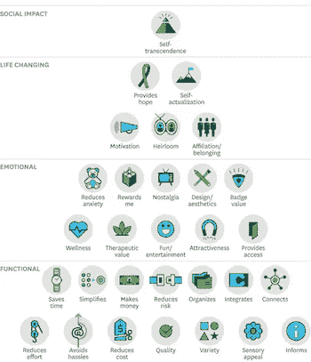
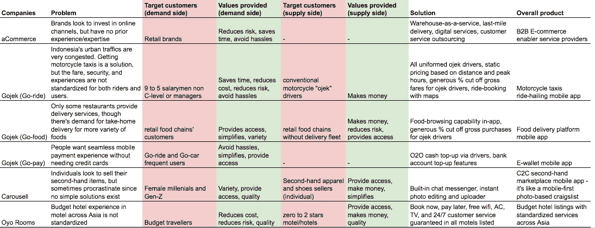

# 围绕客户价值契合度构建早期增长战略

> 原文：<https://medium.datadriveninvestor.com/building-early-stage-growth-strategy-around-customer-value-fit-1724d783cf55?source=collection_archive---------3----------------------->

早期创业公司在东南亚苦苦挣扎有两个原因:它们无法足够快地获得客户，或者无法持续地获得客户。第一种情况比第二种情况更难生存。在我之前的创业中，我们失败的部分原因是第一个。

**在第一种情况下**，创始人倾向于将更多的注意力放在打造产品上，而不是确定正确的目标市场。副作用是他们跳过*解决方案——市场*契合度。在最好的情况下，他们会有一个很棒的产品，对于更广泛的市场来说很好，而不是一个足够好的产品，一个特定的细分市场必须有。当创始人不生产*必备*产品时，他们就有生产客户不想要的产品的风险。实现产品与市场的契合变得非常困难，获得客户和发展也是如此。创始人只有两个选择:旋转或关闭。

**在第二种情况下**，创始人通常会应对一个竞争激烈的巨大市场。早期的客户获取和筹资可能比第一种情况更直接。但创始人往往更倾向于追逐赢家通吃的前景，而不是从更深层次的市场核心开始逐步获胜的前景。这导致了过早的扩张，因为扩张太薄，随着时间的推移，这可能会稀释初创公司的价值主张。因此，保持良好的[单位经济性](http://blog.samaltman.com/unit-economics)变得具有挑战性。创始人有三种选择:他们可以继续烧钱，同时建立令人信服的可持续增长的叙事，以保持筹款，缩小规模，或关闭。

**实现客户价值契合**

解决这两个问题的一个常见方法是*客户价值匹配；*创始人从开始，根据对客户有吸引力的价值观对客户进行细分，然后进一步缩小到真正将他们的解决方案视为*必备*解决方案的细分市场。这将是他们的目标市场。

目标市场通常只占假设客户群的≤ 20%。然而，他们创造了 80%的价值；他们花更多时间在应用上，购买更多产品，甚至向其他人推荐解决方案。

增长是一个复杂的问题，但是客户价值契合降低了这个复杂性，因为它允许创始人将他们的精力放在那 20%的客户身上，而这 20%的客户为他们的创业公司创造了 80%的价值。

了解价值金字塔的[要素可以帮助创始人发现*顾客价值契合度:*](https://hbr.org/2016/09/the-elements-of-value)

Elements of Value Pyramid. Source: HBR.org

例如，手机/游戏机玩家对*的情感价值*(乐趣/娱乐)有吸引力。在东南亚，*功能价值*往往最有吸引力。作为一个视角，下面是一个矩阵，展示了一些适合东南亚创业公司的*客户价值*的例子:

Example of a customer-value fit matrix for Southeast Asia’s startups

在我的方法中，我对每个创业公司的目标市场做了假设。实际的目标市场在现实中可能是不同的(例如，Carousell 可能针对所有性别，而不是我猜测的只针对女性)。但这不是重点。重点是说明创业公司可能创造的各种价值，以及它们如何满足客户的需求。

**案例研究:Gojek 的客户价值契合度**

作为进一步的说明，下面是一个关于 [Gojek](https://www.cnbc.com/2018/07/02/nadiem-makarim-and-indonesias-billion-dollar-unicorn-start-up-go-jek.html) 如何实现*客户价值*在其应用生态系统中的假设示例:

**1)。顺风车:叫车服务**

**需求:** *上班族* ( **顾客**)想避开工作日上下班高峰期的交通拥堵。交通拥堵让人们疲惫不堪，但大多数工人负担不起私人司机。Go-ride 对他们来说是有价值的，因为它提供了一个容易获得负担得起的摩托车出租车的途径。

**供给** : *常规摩托车出租车司机* ( **客户**)收入低。Go-ride 招募他们为司机，*为他们提供接触骑手的途径，并让他们拿走总车费的大部分* ( **值**)。

**2)。Go-food:移动送餐服务**

需求:Gojek 可以简单地将他们的顺风车客户转化为目标市场。但是一个更有效的选择可能是那些菜单已经列在 Go-food 的应用程序目录中的餐馆的顾客/访客(**顾客**)。原因是送餐服务提供的价值与顺风车提供给用户的价值不同。Go-ride 因其方便、省钱和省时的特性而很有价值。但是 Go-food 是有价值的，因为它提供了获取各种带回家的食物的便利途径。

**供应**:为了创造需求，Gojek 与*餐馆* ( **顾客**)建立了合作关系。Gojek 会在 Go-food 的应用程序上列出他们的菜单，这样客户就可以使用该应用程序点餐。对于餐馆来说，Go-food 是有价值的，因为它允许他们通过增加送货销售渠道赚更多的钱，而不用冒巨大的风险投资车队；Go-food *提供对 Gojek 的应用客户群和车队的访问*(**值**)。

**3)。Go-pay: O2O 移动电子钱包服务**

Gojek 的增长战略是推出 Go-pay 电子钱包服务，允许用户通过向司机支付现金来补充离线余额。这允许在线支付参与，而不需要银行账户。这在东南亚是一大进步，那里 70%的人口没有银行账户。

Go-pay 提供其现有目标客户需要的功能价值*:*避免麻烦、简化并提供访问* —通过保留和获取新用户实现增长。*

**

*Customer-value fit diagram for Gojek’s products*

**你可以在*[*Twitter*](http://twitter.com/bennytjia)*上关注我或者在*[*LinkedIn*](https://www.linkedin.com/in/tjhgie)*上联系我。所有帖子都在我的* [*个人网页上索引。*](https://bennytjia.github.io/)*