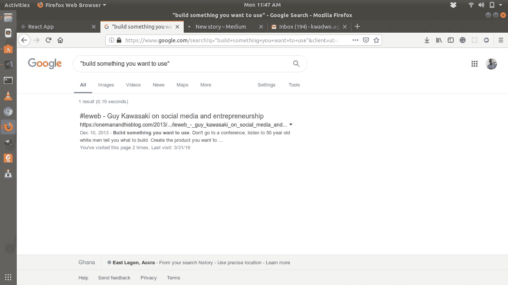

# 为你而建

> 原文：<https://medium.datadriveninvestor.com/building-for-you-7c9142c6b3a1?source=collection_archive---------6----------------------->

# 我从一级市场调查中学到的经验

Photo by [Kiyun Lee](https://unsplash.com/photos/3PILPw4O80w?utm_source=unsplash&utm_medium=referral&utm_content=creditCopyText) on [Unsplash](https://unsplash.com/search/photos/entrepreneur?utm_source=unsplash&utm_medium=referral&utm_content=creditCopyText)

> 建造你想用的东西。
> ——盖伊·川崎

我在网上搜索了上面的确切引述，因为我知道我在什么地方听到过。那天，它只返回了一个搜索结果。是的，就一个。

See? One result.

我很高兴发现这是盖伊·川崎说的；我非常尊重他关于科技创业的观点。

科技创业基本上是从技术角度出发的创业。也就是说基本要求是良好的行动力。当然是以一种聪明的方式。

 [## 金融科技初创公司正在扰乱世界各地的银行业-数据驱动的投资者

### 传统的实体银行从未真正从金融危机后遭受的重大挫折中恢复过来…

www.datadriveninvestor.com](https://www.datadriveninvestor.com/2018/10/20/fintech-startups-are-disrupting-the-banking-industry-around-the-world/) 

许多才华横溢的人试图理解大型科技公司是如何成功利用革命性的创意赚钱的，这些创意在一开始并不明显。这在很大程度上导致了大量的设计和市场研究框架和方法:从设计思维到商业模型画布，以及很多中间的东西。

# 但是你怎么知道什么对你有效呢？

简短回答:**你不要**。

以 100%的成功率预测成功需要相当多的魔法。变数太多:市场机会；种子投资；创始人和团队动态；收入模型和许多其他要考虑的事情总是会让你在概率和可能性之间周旋。

诚然，这些工具、框架和方法中的大多数是由世界上最受欢迎的学习和研究机构中的一些最聪明的人构建的，就我个人而言，我是这些工具中的许多工具的粉丝——我真的很喜欢精益创业方法——但你的利基是你的利基，你的痛苦是你的痛苦，最好的人应该是发痒的人。

让我用盖伊的话说(写在亚当·汀沃斯的[博客](https://onemanandhisblog.com/2013/12/leweb_-_guy_kawasaki_on_social_media_and/)):

> 造一些你想用的东西。不要去参加会议，听 50 岁的白人告诉你要建什么。创造你想用的产品，并且希望你不是世界上唯一两个想要它的人。

这条建议对在西非加纳的我来说尤其重要。观点是识别和解决问题的关键。为什么要放弃你几十年的经验，去解决一个你想解决的问题，去虔诚地坚持一个与你的特殊情况无关的框架呢？如果当地人没有创建一个他们真正想要使用的系统，像 Flutterwave 的支付网关和 Safaricom 的 mPesa 这样的产品永远不会问世。本质上，先解决你的问题；还没有人要求你拯救世界……

当拯救世界的时刻到来时，我给你的建议是:从所有这些框架和方法中挑选各种想法，但是如果它们不适用于你的具体问题和环境，就扔掉它们——它们会拖你的后腿。

我再引用一句盖伊的话，我想每个企业家都应该知道。(再次声明，这是亚当·丁沃斯在他的博客上写的:

> 企业家能做的最重要的事情就是建立一个原型。不是幻灯片，不是推销。一个原型。大多数计划、预测和宣传都是胡说八道。它们说的都是大致相同的数字。

挠痒痒。有些痒是在一些只有你能到达的*的地方。*

*卡约*