# 利用 Keras 建立神经网络进行分类

> 原文：<https://medium.datadriveninvestor.com/building-neural-network-using-keras-for-classification-3a3656c726c1?source=collection_archive---------0----------------------->

[](http://www.track.datadriveninvestor.com/1B9E)

***在这篇文章中，我们将学习一步一步地使用 keras 库为分类构建神经网络。***

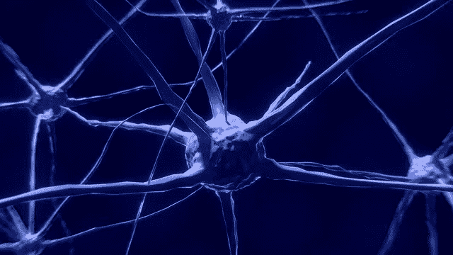

## 先决条件:

[了解神经网络](https://medium.com/datadriveninvestor/neural-network-simplified-c28b6614add4)

[激活功能](https://medium.com/datadriveninvestor/neural-networks-activation-functions-e371202b56ff)

[梯度下降](https://medium.com/datadriveninvestor/gradient-descent-5a13f385d403)

[评估机器学习模型的性能](https://medium.com/datadriveninvestor/how-to-evaluate-the-performance-of-a-machine-learning-model-45063a7a38a7)

## *什么是 Keras？*

*   Keras 是用 Python 编写的高级神经网络 API。
*   它能够在 Tensorflow、CNTK 或 Theano 上运行。
*   Keras 可以作为深度学习库。支持卷积和递归神经网络
*   使用 Keras 制作原型既快速又简单
*   在 CPU 和 GPU 上无缝运行

***我们将构建一个用于二分类的神经网络***

对于二元分类，我们将使用[皮马印第安人糖尿病数据库](https://raw.githubusercontent.com/jbrownlee/Datasets/master/pima-indians-diabetes.data.csv)进行二元分类。

有 768 个观察值，8 个输入变量和 1 个输出变量。

变量名如下:

1.  怀孕的次数。
2.  口服葡萄糖耐量试验中 2 小时的血浆葡萄糖浓度。
3.  舒张压(毫米汞柱)。
4.  三头肌皮褶厚度(毫米)。
5.  2 小时血清胰岛素(μU/ml)。
6.  体重指数(体重单位为千克/(身高单位为米))。
7.  糖尿病谱系功能。
8.  年龄(岁)。
9.  类别变量(0 或 1)。

我已经将 csv 文件复制到我默认的 Jupyter 文件夹中。

我们将首先导入基本库——pandas 和 numpy 以及数据可视化库 matplotlib 和 seaborn。其他库将在使用时导入。

```
import numpy as np
import pandas as pd
import seaborn as sns
import matplotlib.pyplot as plt
%matplotlib inline
```

我们现在将读取文件并将数据加载到数据帧**数据集**中

```
dataset = pd.read_csv('pima_indian_data.csv')
```

为了更好地理解数据，让我们来查看数据集的详细信息。我们需要理解列以及与每列相关的数据类型

```
dataset.head(2)
```

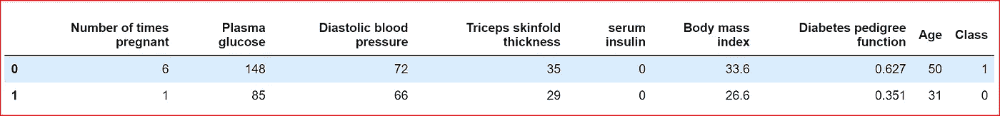

output of dataset.head(2) display 2 rows from the dataset along with headers

我们需要检查数据集中的数据类型

```
dataset.describe(include='all')
```

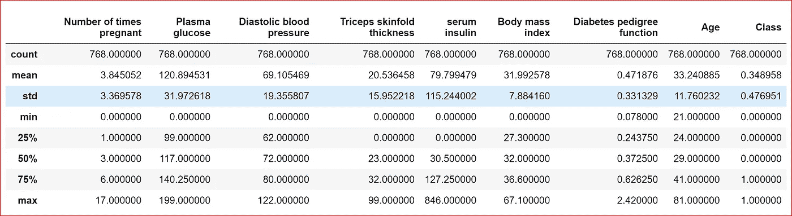

output of dataset.describe(include=’all’)

我们可以看到所有的特征都是数字的，没有任何分类数据。因为我们没有任何分类变量，所以我们不需要分类变量的任何数据转换。

为了更好地理解，我们将把数据形象化。我们使用 seaborn pairplot 绘制数据，使用属性 hue 以不同的颜色绘制两个类。

```
sns.pairplot(dataset, hue='Class')
```

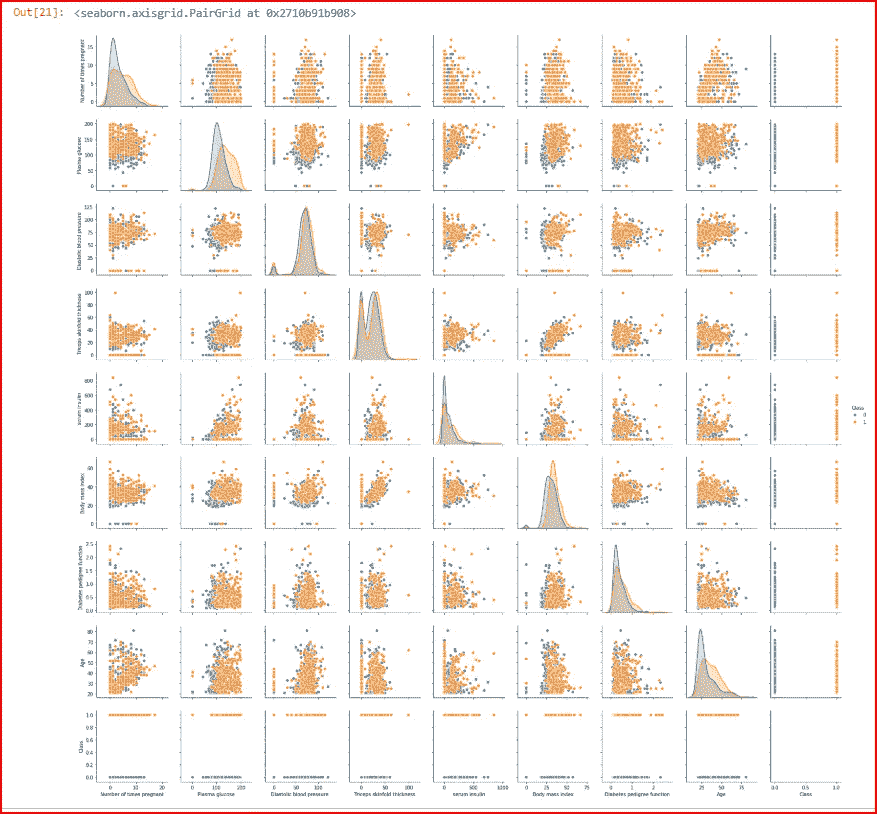

Pairplot for all features in the dataset

我们通过使用数据集的相关性来绘制热图。这有助于我们消除任何可能对预测没有帮助的特征。

```
sns.heatmap(dataset.corr(), annot=True)
```

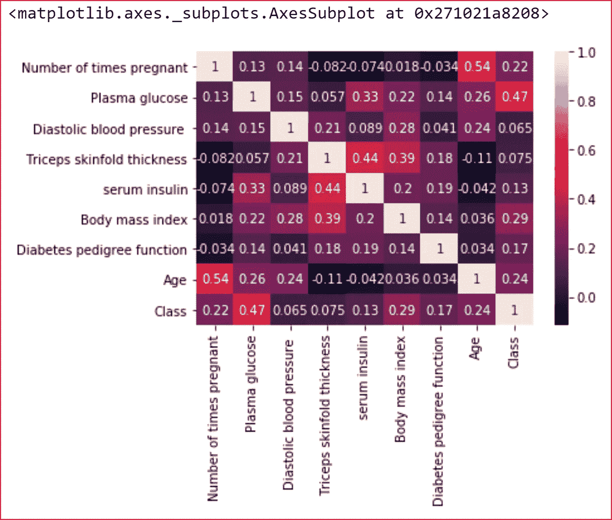

Heatmap for the dataset

我们看到所有特性都与类有某种关系，所以我们保留了它们。血浆葡萄糖与类别(一个人是否患有糖尿病)的关系最强。年龄和体重指数也是重要的影响因素。

现在我们已经了解了数据，让我们创建输入特征和目标变量，并通过预处理数据为输入到我们的神经网络做好准备。

```
# creating input features and target variables
X= dataset.iloc[:,0:8]
y= dataset.iloc[:,8]
```

让我们来看看我们的输入功能

```
X.head(2)
```

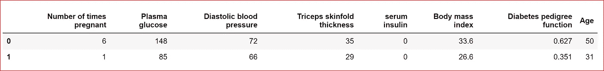

data from DataFrame X

由于我们的输入要素处于不同的比例，我们需要标准化输入。

```
#standardizing the input feature
from sklearn.preprocessing import StandardScaler
sc = StandardScaler()
X = sc.fit_transform(X)
X
```

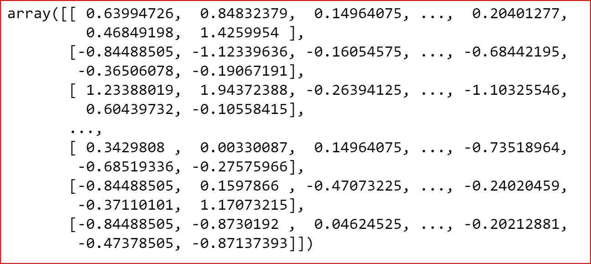

Standardized input features

我们现在将输入特征和目标变量分成训练数据集和测试数据集。我们的测试数据集将占整个数据集的 30%。

```
from sklearn.model_selection import train_test_split
X_train, X_test, y_train, y_test = train_test_split(X, y, test_size=0.3)
```

我们已经对数据进行了预处理，现在我们准备建立神经网络。

我们正在使用 keras 来构建我们的神经网络。我们导入 keras 库来创建神经网络层。

keras 中有两种主要类型的模型——顺序模型和模型。我们将使用序列模型来构建我们的神经网络。

我们使用密集库来构建神经网络的输入、隐藏和输出层。

```
from keras import Sequential
from keras.layers import Dense
```

我们有 8 个输入特征和一个目标变量。2 隐藏层。每个隐藏层将有 4 个节点。

ReLu 将是隐藏层的激活功能。由于这是一个二元分类问题，我们将使用 sigmoid 作为激活函数。

密集层工具

***输出=激活(点(输入，内核)+偏置)***

内核是权重矩阵。内核初始化定义了设置 Keras 层的初始随机权重的方式。

**随机正态初始化器生成正态分布的张量**。

对于均匀分布，我们可以使用随机均匀初始化器。

Keras 为内核或权重以及偏差单元提供了多个初始化器。

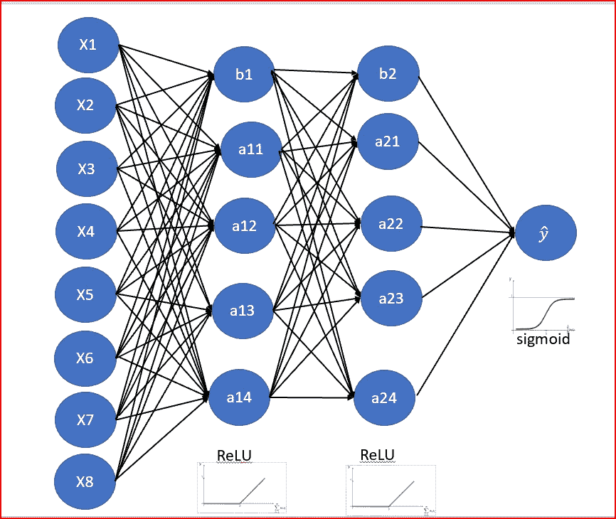

```
classifier = Sequential()
#First Hidden Layer
classifier.add(Dense(4, activation='relu', kernel_initializer='random_normal', input_dim=8))#Second  Hidden Layer
classifier.add(Dense(4, activation='relu', kernel_initializer='random_normal'))#Output Layer
classifier.add(Dense(1, activation='sigmoid', kernel_initializer='random_normal'))
```

一旦不同的层被创建，我们现在编译神经网络。

由于这是一个二元分类问题，我们使用 binary_crossentropy 来计算实际输出和预测输出之间的损失函数。

为了优化我们的神经网络，我们使用亚当。Adam 代表自适应矩估计。Adam 是 RMSProp + Momentum 的组合。

动量考虑了过去的梯度，以便平滑梯度下降。

我们使用准确性作为衡量模型性能的标准

```
#Compiling the neural network
classifier.compile(optimizer ='adam',loss='binary_crossentropy', metrics =['accuracy'])
```

现在，我们将训练数据拟合到我们创建的模型中。我们使用的批量大小为 10。这意味着我们每次梯度更新使用 10 个样本。

我们迭代超过 100 个时期来训练模型。一个历元是整个数据集的一次迭代。

```
#Fitting the data to the training dataset
classifier.fit(X_train,y_train, batch_size=10, epochs=100)
```

经过 100 个时期后，我们得到了大约 80%的准确率

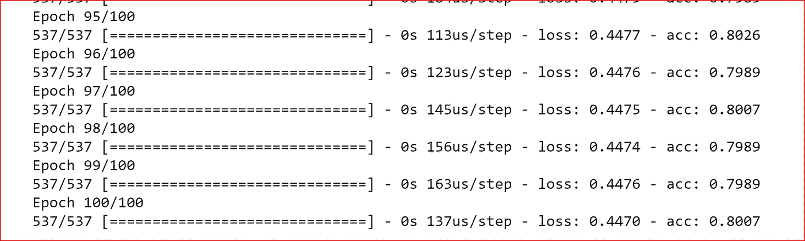

我们还可以使用 evaluate 函数在测试模式下评估模型的损失值和度量值

```
eval_model=classifier.evaluate(X_train, y_train)
eval_model
```

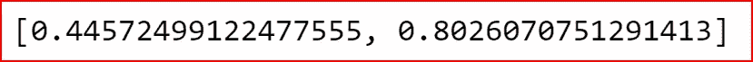

Loss and accuracy of the mode;

我们现在预测测试数据集的输出。如果预测值大于 0.5，则输出为 1，否则输出为 0

```
y_pred=classifier.predict(X_test)
y_pred =(y_pred>0.5)
```

现在是关键时刻了。我们检查测试数据集的准确性

```
from sklearn.metrics import confusion_matrix
cm = confusion_matrix(y_test, y_pred)
print(cm)
```

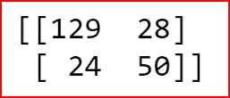

Confusion matrix

真阳性和真阴性的总数是测试数据集中 231 个观察值中的 179 个。因此，我们对测试数据集的准确率约为 78%。

根据给定的输入，我们可以以 78%的准确率预测该人是否患有糖尿病

## 在下一篇文章中，我们将使用 K 折叠交叉验证和参数调整，以及我们如何使用 dropout 来处理过拟合。

# 如果你喜欢这篇文章，请鼓掌！

参考资料:

[](https://keras.io/) [## Home - Keras 文档

### Python 深度学习库 Keras 的文档。

keras.io](https://keras.io/)