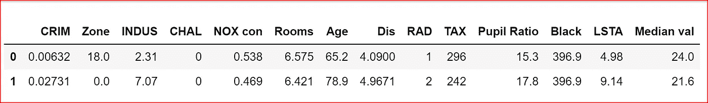
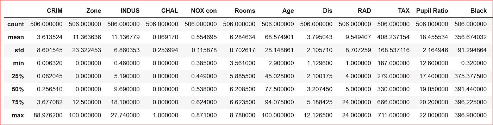
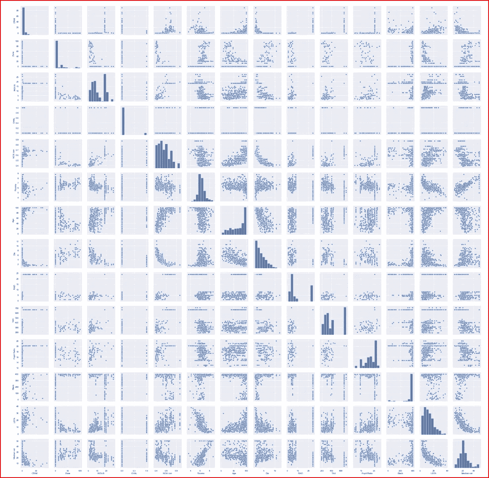
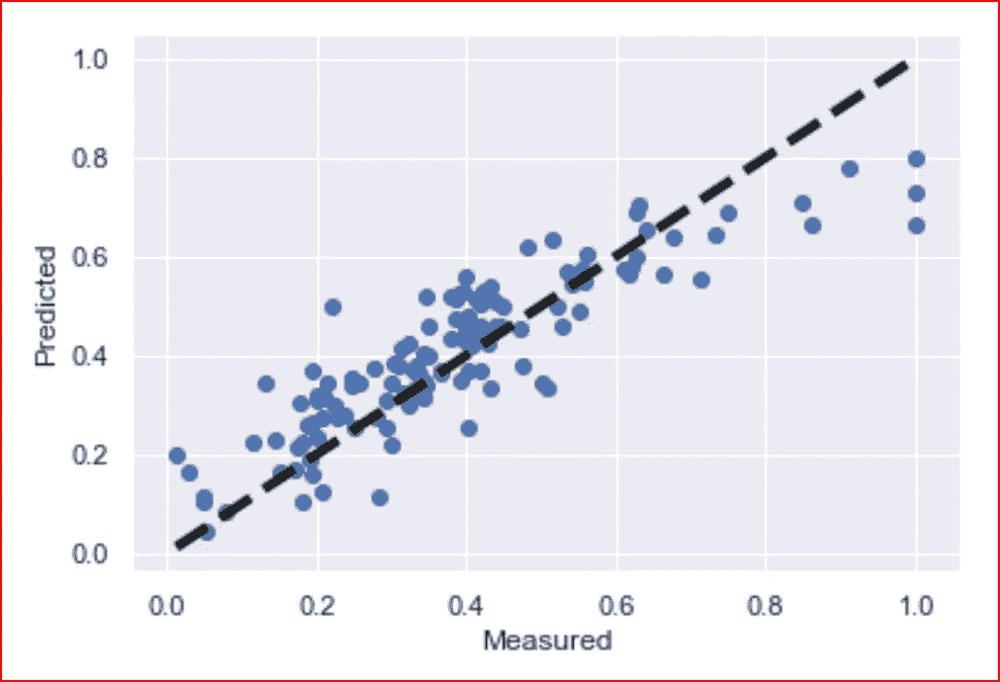

# 利用 keras 建立神经网络进行回归

> 原文：<https://medium.datadriveninvestor.com/building-neural-network-using-keras-for-regression-ceee5a9eadff?source=collection_archive---------2----------------------->

[](http://www.track.datadriveninvestor.com/1B9E)

在这篇文章中，我们将学习一步一步地使用 keras 库为回归建立一个神经网络。

## 先决条件:

[理解神经网络](https://medium.com/datadriveninvestor/neural-network-simplified-c28b6614add4)

[激活功能](https://medium.com/datadriveninvestor/neural-networks-activation-functions-e371202b56ff)

[梯度下降](https://medium.com/datadriveninvestor/gradient-descent-5a13f385d403)

[评估机器学习模型的性能](https://medium.com/datadriveninvestor/how-to-evaluate-the-performance-of-a-machine-learning-model-45063a7a38a7)

[线性回归](https://medium.com/datadriveninvestor/linear-regression-794f841adbcf)

对于回归，我们将使用[房屋数据集](https://www.kaggle.com/apratim87/housingdata)

导入基本库并读取数据集。我已经将数据复制到我默认的 Jupyter 文件夹中

```
import numpy as np
import pandas as pd
import seaborn as sns
import matplotlib.pyplot as plt
%matplotlib inlinedataset = pd.read_csv('housing.csv')
dataset.head(2)
```



我们使用描述方法来了解数据

```
dataset.describe(include='all')
```



我们对数据集中的所有变量做一个配对图

```
sns.pairplot(dataset)
```



我们创建输入特征和目标变量

```
X=dataset.iloc[:,0:13]
y=dataset.iloc[:,13].values
```

所有输入要素都是数字，因此我们需要对它们进行缩放。当数据呈正态分布时，StandardScaler 工作良好。根据配对图，我们看到数据不是正态分布的。因此，我们使用 MinMaxScaler 来缩放数据

```
 from sklearn.preprocessing import  MinMaxScaler
sc= **MinMaxScaler**()
X= sc.fit_transform(X)
y= y.reshape(-1,1)
y=sc.fit_transform(y)
```

创建训练和测试数据集

```
from sklearn.model_selection import train_test_splitX_train, X_test, y_train, y_test = train_test_split(X, output_category, test_size=0.3) 
```

为回归变量创建神经网络。我们有 13 个输入节点，我们创建一个有 13 个节点的隐藏层和一个输出层。

由于这是一个回归问题，我们使用的损失函数是均方误差，我们用来评估模型性能的指标是平均绝对误差和精确度。

平均绝对误差是预测值和实际值之间的绝对差值。

我们定义一个函数***build _ regressor***来使用这些包装器。***build _ regressor***创建并返回 Keras 序列模型。

```
from keras import Sequential
from keras.layers import Densedef **build_regressor**():
    regressor = Sequential()
    regressor.add(Dense(units=13, input_dim=13))
    regressor.add(Dense(units=1))
    regressor.compile(optimizer='adam', loss='**mean_squared_error**',  metrics=**['mae','accuracy']**)
    return regressor
```

在构造 **KerasRegressor** 类时，我们将***build _ regressor***函数传递给 **build_fn** 参数。Batch_size 是 32，我们运行 100 个时期

```
from keras.wrappers.scikit_learn import KerasRegressor
regressor = KerasRegressor(build_fn=build_regressor, batch_size=32,epochs=100)
```

我们现在将模型与训练数据进行拟合

```
results=regressor.fit(X_train,y_train)
```

我们现在预测测试数据的数据

```
y_pred= regressor.predict(X_test)
```

让我们把预测值和实际值画出来

```
fig, ax = plt.subplots()
ax.scatter(y_test, y_pred)
ax.plot([y_test.min(), y_test.max()], [y_test.min(), y_test.max()], 'k--', lw=4)
ax.set_xlabel('Measured')
ax.set_ylabel('Predicted')
plt.show()
```



黑色虚线是预测值，我们可以看到它包含了大部分的值

提高准确性的几个技巧

*   始终标准化输入特征和目标变量。如果我们只标准化输入特征，那么我们将得到不正确预测
*   数据可能不总是正态分布，因此检查数据，然后根据分布应用标准缩放器、最小最大缩放器、规格化器或鲁棒缩放器

这些建议是基于我的经验

# 如果你喜欢这篇文章，请鼓掌！