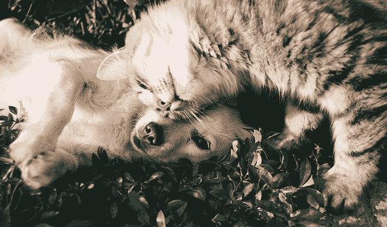
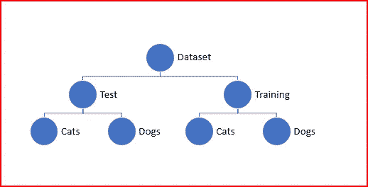
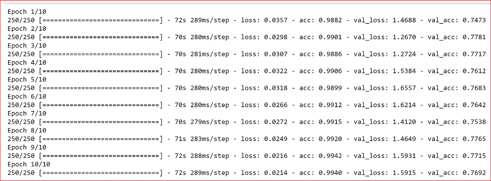
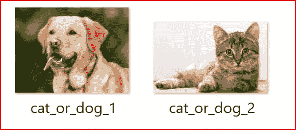
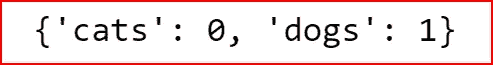

# 利用 Keras 构建强大的图像分类卷积神经网络

> 原文：<https://medium.datadriveninvestor.com/building-powerful-image-classification-convolutional-neural-network-using-keras-a1839d0ff298?source=collection_archive---------0----------------------->

[](http://www.track.datadriveninvestor.com/1B9E)

在本文中，我们将探讨如何使用 keras 构建 CNN 并对图像进行分类。

**先决条件:**

[卷积神经网络基础知识](https://medium.com/datadriveninvestor/convolutional-neural-network-cnn-simplified-ecafd4ee52c5)，

[使用 Keras 建立人工神经网络](https://medium.com/datadriveninvestor/building-neural-network-using-keras-for-classification-3a3656c726c1)



我们将使用[数据集](https://www.kaggle.com/chetankv/dogs-cats-images)将图像分类为猫或狗。

我将图像存储在如下所示的目录结构中



构建 CNN 对图像进行分类的高级步骤是

1.  通过应用内核或特征映射创建卷积层
2.  为平移不变性应用最大池
3.  拉平输入
4.  创建一个完全连接的神经网络
5.  训练模型
6.  预测产量


首先，我们初始化用于构建 CNN 的神经网络

```
from keras.models import Sequential
classifier = Sequential()
```

我们在输入图像上使用多特征检测器或核来应用卷积运算。特征检测器可以锐化图像、模糊图像等。

我们的输入图像是一个 64×64 像素的彩色图像，有 3 个通道。

我们希望通过使用一个 3×3 的内核或特征检测器得到 32 个特征图，从左到右的步长为 1，从上到下的步长为 1。

激活功能是 **relu —整流器线性**单元，有助于神经网络中的非线性。

```
from keras.layers import Conv2D

classifier.add(Conv2D(filters=32, kernel_size=(3,3),strides=(1, 1), input_shape=(64,64,3), activation='relu'))
```

一旦我们有了 32 个特征图，我们就为平移不变性应用最大池。平移不变性是指当我们少量改变输入时，输出不会改变。最大池减少了单元的数量。

池有助于检测颜色、边缘等特征。

对于最大池，我们对所有 32 个特征地图使用 2×2 矩阵的池大小。

```
from keras.layers import MaxPooling2Dclassifier.add(MaxPooling2D(pool_size=(2,2)))
```

我们可以再增加一个卷积层。

这次我们将有 64 个核为(3，3)的特征图。默认步幅为(1，1)。然后，我们将最大池应用于卷积层。

```
classifier.add(Conv2D(filters=64, kernel_size=(3,3), activation='relu'))
classifier.add(MaxPooling2D(pool_size=(2,2)))
```

下一步是拉平所有输入。展平的数据将成为完全连接的神经网络的输入。

```
from keras.layers import Flattenclassifier.add(Flatten())
```

我们现在建立一个具有 128 个输入单元和一个输出单元的全连接神经网络。我们使用 20%的辍学率来防止过度拟合。

这是一个二元分类问题，所以我们在输出层使用 sigmoid 激活函数。

```
from keras.layers import Dense
from keras.layers import Dropoutclassifier.add(Dense(units=128, activation='relu'))
classifier.add(Dropout(rate=0.2))
classifier.add(Dense(units=1, activation='sigmoid'))
```

我们现在用一个 **dadelta** 优化器来编译神经网络。Adadelta 加速收敛。

损失函数将是**二元交叉熵**，因为这是一个二元分类问题。

```
classifier.compile( optimizer='adadelta', loss='binary_crossentropy', metrics=['accuracy'])
```

我们通过大量随机变换应用**图像增强**来使 CNN 适合图像。

我们放大图像，剪切图像，水平翻转图像。这有助于防止过度拟合，并帮助模型更好地概括。

我们的原始图像包含 0–255 范围内的 RGB 系数。给定一个典型的学习率，这些值对于我们的模型来说太高了。为了解决这个问题，我们通过 1/255 的缩放因子将目标值设置在 0 和 1 之间。

```
from keras.preprocessing.image import ImageDataGenerator# applying transformation to image
train_datagen = ImageDataGenerator(
 rescale=1./255,
 shear_range=0.2,
 zoom_range=0.2,
 horizontal_flip=True)test_datagen = ImageDataGenerator(rescale=1./255)
```

我们创建训练集和测试集。我们的目标尺寸应该与输入图像的输入尺寸(64，64)相匹配。

因为我们的数据存储在目录中，所以我们使用 **flow_from_directory** 方法。flow_from_directory 从指定路径获取数据帧，并生成批量的扩充规范化数据。

```
training_set = train_datagen.flow_from_directory(
        'D:\\ML-data\\dataset\\test_set',
        target_size=(64, 64),
        batch_size=32,
        class_mode='binary')test_set = test_datagen.flow_from_directory(
        'D:\\ML-data\\dataset\\training_set',
        target_size=(64, 64),
        batch_size=32,
        class_mode='binary')
```

我们最终使用 **fit_genator** 将数据拟合到我们上面创建的 CNN 模型。

我们使用**健身器械**当

1.  数据集通常太大，内存容纳不下。
2.  当我们需要执行数据扩充以避免过度拟合时。这增加了我们模型的概括能力。

要设置参数值，我们可以使用下面的公式，但这不是一个硬性规定。

**steps_per_epoch =总训练样本/训练批量 validation_steps =总验证样本/验证批量**

我们在训练数据中有 8000 个图像，并且我们的训练批量大小是 32，因此 steps_per_epoch 被设置为 8000/32。

我们在测试集中有 2000 个图像，我们的批量大小是 32，所以 validation_steps = 2000/32，四舍五入为 64。我没有得到一个很好的验证准确性，所以我尝试了不同的组合，然后解决了 150

```
from IPython.display import display 

classifier.fit_generator(
        training_set,
        steps_per_epoch=250,
        epochs=10,
        validation_data=test_set, validation_steps=150)
```



我们在训练数据上获得了 99%的准确率，在测试数据上获得了 77%的准确率。

我们现在终于可以用一张图片来做预测了。我已经将一只狗和一只猫的测试图像添加到一个名为 single_prediction 的数据集下的新文件夹中。



Test images

*如何识别 0 是猫还是狗？*

我们使用训练集的 class _ indices 来理解 0 和 1 代表什么。

```
training_set.class_indices
```



如果我们得到的输出是 0，那么图像是一只猫，如果我们得到的输出是 1，那么图像是一只狗。

*我们如何对图像进行预测？*

为了使预测方法正常工作，我们需要对测试图像输入进行整形。

test_image 是 64 乘 64 像素的输入。我们首先需要为颜色添加 3 个通道，以匹配我们为第一个卷积层指定的输入形状。为此，我们使用 Keras 的图像库。在将 img_to_array()方法应用于 test_image 之后，它的维数为(64，64，3)

**预测**方法也需要一个 **batch_size** ，它是输入图像的第一维。

Batch_size 指定我们将向 predict 方法发送多少图像。在我们的例子中，我们只发送一个图像，但我们仍然需要指定。

test_image 的最终维数是(1，64，64，3)

```
import numpy as np
from keras.preprocessing import imagetest_image = image.load_img("D:\\ML-data\\dataset\\single_prediction\\cat_or_dog_1.jpg",target_size=(64, 64) )# Adding the channel
test_image = image.img_to_array(test_image)# adding the batch size as predict method expects
test_image = np.expand_dims(test_image, axis=0)# Predicting the test image
result= classifier.predict(test_image)print(result)
```

我们得到的结果是 1，这意味着狗的第一个图像被正确分类。

我们可以通过增加更多的卷积层或增加全连接层的深度来进一步微调该模型。

# 如果你喜欢这篇文章，请阅读并鼓掌！