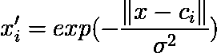

# 用 Keras 建立径向基函数网络:估计泰坦尼克号幸存者

> 原文：<https://medium.datadriveninvestor.com/building-radial-basis-function-network-with-keras-estimating-survivors-of-titanic-a06c2359c5d9?source=collection_archive---------0----------------------->

[](http://www.track.datadriveninvestor.com/1B9E)

source: [http://cdn2.tstatic.net/makassar/foto/bank/images/ilustrasi-titanic_20180419_171034.jpg](http://cdn2.tstatic.net/makassar/foto/bank/images/ilustrasi-titanic_20180419_171034.jpg)

第一个问题是，什么是径向基函数网络(RBFN)？我对这个话题有独特的理解。如果你已经知道多层感知器(MLP)(这是我已经在这里的第一部分提到的[)，这将会很容易。RBFN 只是一个特殊的单层感知器(SLP)，在这种情况下，您可以指定在输入层有多少神经元。](https://medium.com/datadriveninvestor/how-neural-network-process-your-input-trained-neural-network-fd48f1bf310)


example of SLP structure (source: [https://schwalbe10.github.io/thinkage/images/posts/perceptron.png](https://schwalbe10.github.io/thinkage/images/posts/perceptron.png))

这里的输入层是**不是真正的输入层**！这是什么意思？这里的实际输入层是使用称为径向基函数的函数预先转换的。RBFN 常用的径向基函数是高斯函数，其形式为:



x’i is a transformed input as an i-th new input, x is original input, σ is radii, and ci is the i-th center of data.

有两个未知变量，即 c 和σ。最优σ是通过**试错**获得的，而 c(或聚类的中点)是通过聚类算法获得的(我已经在这里中介绍了聚类算法[，这里](https://medium.com/datadriveninvestor/how-the-simplest-clustering-algorithm-work-with-code-b8af21aabda2)[介绍了](https://medium.com/datadriveninvestor/how-to-clustering-and-detect-outlier-at-the-same-time-30576acd75d0))。除σ之外，SLP 将处理的新输入神经元的数量也是通过试错法获得的。**对于每个新的输入神经元，有 1 个中心**。数据中心/新输入神经元的数量类似于 MLP 的隐藏层和隐藏神经元的数量。数字越多，网络在预测复杂问题时就越好，但太多会导致过度拟合。

这里是 RBFN 使用 Keras 的代码。喀拉石被用来建造 SLP。

```
#!/usr/bin/pythonimport numpy as np
import matplotlib.pyplot as plt
import matplotlib.cm as cm
import random
from keras.models import Sequential
from keras.layers import Activation, Dropout, Flatten, Dense, LSTM, RepeatVector, TimeDistributed#setting
data = '/home/genomexyz/Downloads/titanic/train-mod.csv'
kval = 10
itertot = 40
sigma = 1.2
itergd = 300def transforminput(param, center):
 newinput = np.zeros((len(param), len(center))).astype('float32')
 for i in xrange(len(param)):
  for j in xrange(len(center)):
   newinput[i,j] = np.exp(-(np.sum((param[i] - center[j])**2.0)**0.5) / sigma**2.0)
 return newinputdef generatemodel(numparam):
 model = Sequential()
 model.add(Dense(1, input_dim=numparam, activation='sigmoid'))
# model.add(Dense(10, activation='sigmoid'))
# model.add(Dense(1, activation='sigmoid'))
 # Compile model
 model.compile(loss='binary_crossentropy', optimizer='adam', metrics=['accuracy'])
 return modeldataread = np.genfromtxt(data, delimiter=',')[1:,1:]alldata = []
for i in xrange(len(dataread)):
 if np.isnan(dataread[i,-2]):
  continue
 alldata.append(dataread[i])alldata = np.asarray(alldata)#dividing data
trainparam = alldata[:600,1:]
trainlabel = alldata[:600,0]testparam = alldata[600:,1:]
testlabel = alldata[600:,0]###############
#normalization#
###############std = np.zeros((len(trainparam[0]))).astype('float32')
rata = np.zeros((len(trainparam[0]))).astype('float32')
trainparamnorm = np.zeros(np.shape(trainparam))
testparamnorm = np.zeros(np.shape(testparam))
for i in xrange(len(trainparam[0])):
 std[i] = np.std(trainparam[:,i])
 rata[i] = np.mean(trainparam[:,i])
 trainparamnorm[:,i] = (trainparam[:,i] - rata[i]) / std[i]
 testparamnorm[:,i] = (testparam[:,i] - rata[i]) / std[i]###############
#search k-mean#
################init kmean
kmean = np.zeros((kval, len(trainparamnorm[0])))for i in xrange(kval):
 for j in xrange(len(kmean[0])):
  kmean[i,j] = random.uniform(min(trainparamnorm[:,j]),max(trainparamnorm[:,j]))#looping of real algorithm
distmin = np.zeros((len(trainparamnorm)))
for i in xrange(itertot):
 print 'iterasi ke', i
 for j in xrange(len(distmin)):
  #determine euclid distance
  distall = np.sum((trainparamnorm[j] - kmean)**2.0, axis=1)**0.5
  distmin[j] = np.argmin(distall)#search new k mean
 for j in xrange(kval):
  clust = []
  for k in xrange(len(distmin)):
   if distmin[k] == j:
    clust.append(trainparamnorm[k])
  if len(clust) > 0:
   kmean[j] = np.mean(np.asarray(clust), axis=0)#tranform our input
newinput = transforminput(trainparamnorm, kmean)print trainlabel
##########################
#gradient descent session#
##########################mod = generatemodel(kval)
mod.fit(newinput, trainlabel, batch_size=20, epochs=itergd, verbose=1, shuffle=True)##################
#predict session#
###################transform test data
newinputtest = transforminput(testparamnorm, kmean)lifeprob = mod.predict(newinputtest)#######################
#determine performance#
########################determine biner accuracy
binpred = np.zeros((len(lifeprob)))
for i in xrange(len(lifeprob)):
 if lifeprob[i] > 0.5:
  binpred[i] = 1.score = 0
for i in xrange(len(testlabel)):
 if binpred[i] == testlabel[i]:
  score += 1
accbin = float(score) / float(len(testlabel))#determine brier score
brierscore = 0
for i in xrange(len(testlabel)):
 brierscore += (testlabel[i] - lifeprob[i])**2.0
brierscore = brierscore / float(len(testlabel))for i in xrange(len(testlabel)):
 print lifeprob[i], testlabel[i]
print accbin, brierscore[0]
```

或者可以在这里下载代码[(Python 对 tab 和空格非常敏感)。在这段代码中，我使用了 kaggle 竞赛的数据。我修改了数据，你可以在这里下载。请修改上面的代码进行实验，以更好地理解超参数对 RBFN 的影响。下面是上述代码的输出示例。](https://github.com/genomexyz/machine_learning/blob/master/rbfnn.py)

```
0.80701754386 0.137136
```

这意味着我们有 80%的准确率，Brier 得分为 0.137136。很好的表现。

在这个故事中，有许多超参数，它们的最佳值必须通过反复试验来确定。也许在下一个故事中，我会解释一个进化算法和粒子群优化算法**来帮助确定超参数**。