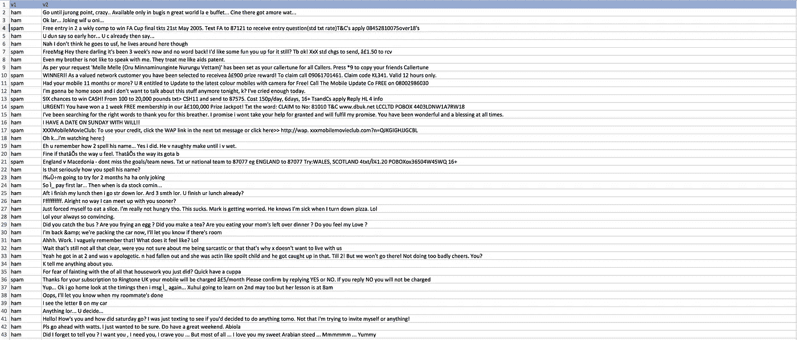
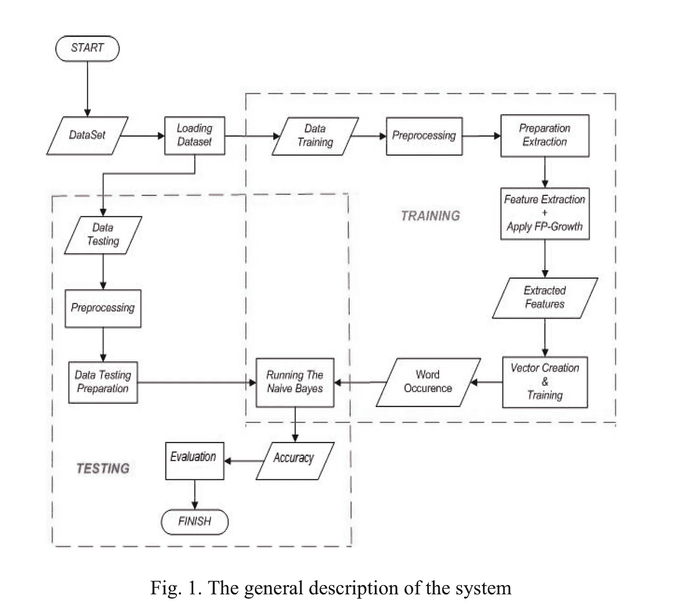
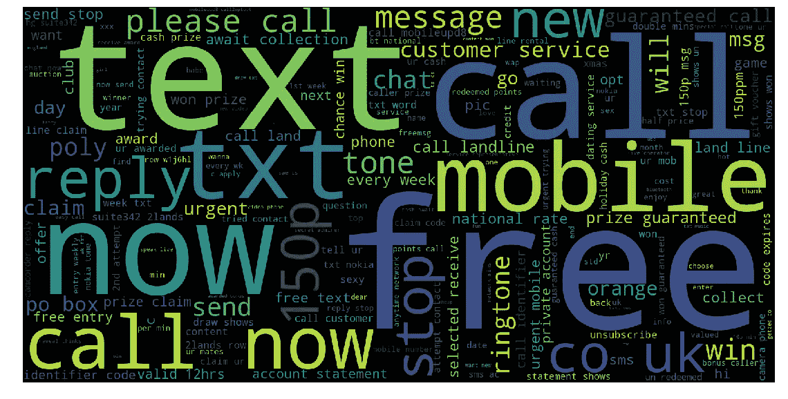
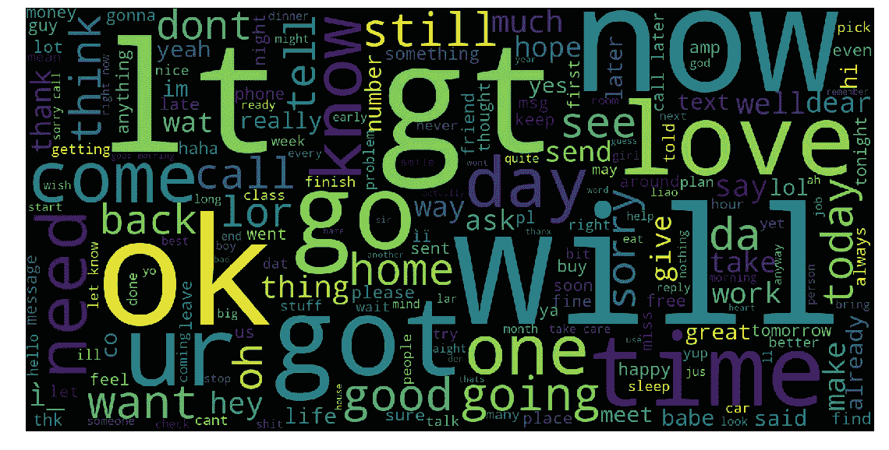
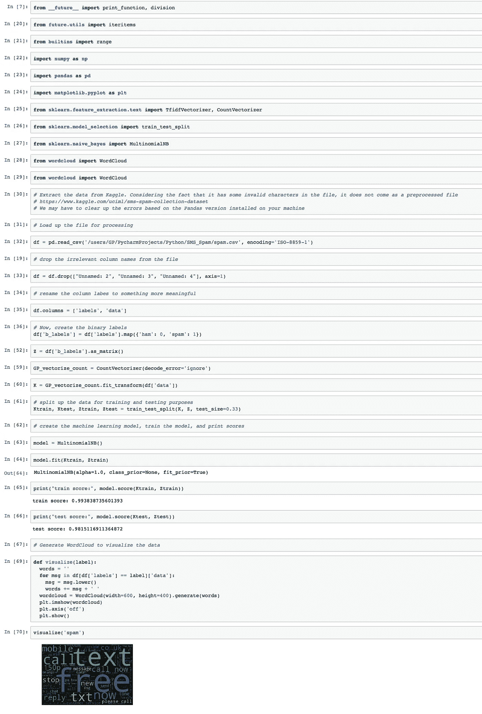

# 用 JupyterLab 中的 Kaggle 数据集构建垃圾短信检测器并生成词云

> 原文：<https://medium.datadriveninvestor.com/building-sms-spam-detector-and-generating-a-wordcloud-with-kaggle-dataset-in-jupyterlab-46b0d53b7470?source=collection_archive---------4----------------------->

**背景问题**

至少 97%的美国人每天用手机发短信。根据 Portio research 的研究，2016 年，通过手机交换的信息有 8.3 万亿条。不断增长的大数据洪流显示，每天有 230 亿条消息交换，每分钟有 1600 万条消息交换。截至 2012 年底，全球约有 64 亿移动用户。根据 Portio Research 的研究，从 2014 年到 2017 年，移动用户群的 CAGR 增长率将达到 4.8%。截至 2017 年底，移动用户达到 74 亿。由指数计算驱动的智能设备的激增表明，在高通、苹果、MediaTrek、三星、海思、展讯和市场上大量其他智能手机芯片制造商的引领下，全球智能手机片上系统市场显著增长。用人工智能技术为芯片提供动力，为 5G 铺平了道路，以实现更高的性能和信号处理。尽管智能手机具有多功能和先进的功能，但简单的短信服务仍在全球市场上持续飙升。计算处理能力的指数级增长导致在文本消息上产生如此大量的大数据。移动手机行业从 1983 年(第一个移动手机推出)到 2002 年(第一个带触摸屏的移动电话)的时间线显示，对于 SMS 消息上的这种大数据海啸，计算和 SoC(片上系统)架构显著增长。1992 年推出第一个 SMS 通信服务。3G 移动服务于 2002 年推出。2010 年，4G 网络启动。这种传递的速度增加了通过 SMS 消息进行通信的机会，使企业和个人能够管理他们生活中的重要部分。仅在 2012 年，移动信息服务行业就创造了 2120 亿美元的收入。

Figure 1\. Adapted from Portio Research.

根据 Portio Research 的数据，1996 年至 1999 年间，短信流量从 5 亿条跃升至 1000 亿条。到 2003 年底，又过了四年，短信流量翻了两番，达到 4500 亿条。2005 年，仅在 2003 年到 2005 年的两年间，短信流量就超过了 1 万亿条。到 2009 年，全世界已经有了 5 万亿条信息。2015 年流量峰值达到 8.3 万亿条。在银行、移动医疗和移动支付领域，应用程序对应用程序的短信和个人对应用程序的短信流量突飞猛进。这就为大量来自电话销售人员的垃圾短信提供了空间。现在，许多招聘机构发送带有订阅的工作职位的短信，有时没有订阅。我收到招聘机构发来的大量没有订阅的短信。这是由一些在脸书和推特上黑了我的账户的人协调的。我仍然保留着那些信息。

根据两份 Forrester Research 出版物 Forrester Research 2012–2017 年移动媒体应用支出预测 EU-7 和*Forrester Research 2012–2017 年移动媒体应用支出预测*美国每天仅在美国就发送 60 亿条短信。大多数文本，即 80%的文本来自美国成年人。垃圾邮件的增加可以归因于 45%的短信成功*打开率*，而不是通过电子邮件的 20%成功*打开率*。短信回复率更高，分别为 45%和 6%。美国人交换的短信是电话的两倍。

**朴素贝叶斯分类器**

考虑到大数据和短信流量的指数级增长，垃圾短信作为实施欺诈和宣传工作机会的媒介也在显著增长。垃圾邮件过滤可以通过朴素贝叶斯分类器通过将 SMS 分类为垃圾邮件或 HAM 来应用。本质上，朴素贝叶斯分类器可以作为具有更高准确率的反垃圾邮件软件。在该 Python 实现中，训练准确率达到 99.38%，测试准确率达到 98.15%。Kaggle 数据集已经被用于通过朴素贝叶斯分类器执行垃圾邮件检测。Kaggle 数据集文件有两列，标签分别为 v1 和 v2。V1 包含垃圾邮件或火腿文本数据的标签，而 v2 列包含实际的 SMS 消息。美国用户每周大约收到 11 亿条垃圾短信，中国移动用户每周收到 82.9 亿条由各种广告媒体和欺诈公司发送的垃圾短信。许多分类器可以用于过滤垃圾短信问题，例如规则归纳、神经网络、决策树、朴素贝叶斯、k-最近邻和支持向量机。人们必须考虑这样一个事实，对电子邮件进行分类与对 SMS 文本进行分类完全不同，因为文本的长度被限制在 160 个字符以内。因此，特征必须足以区分火腿和垃圾邮件。历史上，朴素贝叶斯分类算法已被证明在识别垃圾邮件方面非常有效。

Figure 2\. Kaggle SPAM dataset.

Figure 3.Adapted from The 2016 IEEE Asia Pacific Conference on Wireless and Mobile (APWiMob) Research Paper

**TF-IDF 矢量器与通用矢量器策略**

与其他问题一样，该过程首先涉及通过使用 ISO-8859–1 编码读取 Python 来加载数据集，并通过构建机器学习模型的训练和测试阶段来应用朴素贝叶斯机器学习算法。需要删除文件中任何不相关的列名。可以通过计数矢量器或者通过 TF-IDF 矢量器来执行特征提取。countvectorizer 通过单个类应用标记化和出现计数。通过应用通用矢量器，可以通过自然语言处理对单词进行标记，并通过文本文件或文档的极简语料库对单词出现次数进行计数。或者，TF-IDF 矢量器也可以应用于大型文本语料库的情况；在英语中会有重复出现的单词，如*、a、*或*是*。scikit learn 中的 TFIDFTransformer 和 TFIDVectorizer 将计算单词出现的次数。

**数据可视化**

通过 word cloud 库生成一个词云，显示出最常重复的垃圾词，如 call、free、now、UK、铃声、客服、聊天、座机、文字等。蓝色和绿色的组合。从以下程序生成的 wordcloud:

Figure 4\. Python program output from Jupyter console for SPAM text.

ham 的数据可视化显示了来自程序的以下单词云。

Figure 5\. Python program output from Jupyter console for HAM text.

结果

我已经在 GPSingularity 的 Github 上分享了这个程序。

Figure 6\. Jupyter Lab Python Notebook .

参考

Arifin，D. D .，Shaufiah，& Bijaksana，M. A. (2017，2017 年 1 月)。利用 FP-growth 和朴素贝叶斯分类器提高手机短信的垃圾邮件检测性能。 *IEEE 探索无线与移动(APWiMob)，2016 IEEE 亚太会议。http://dx.doi.org/10.1109/APWiMob.2016.7811442*T2

m . o ' grady(2012 年)。在美国，短信的使用依然强劲:每天发送 60 亿条短信。2015 年 5 月 13 日检索自[https://go . Forrester . com/blogs/12-06-19-SMS _ usage _ remains _ strong _ in _ the _ us _ 6 _ billion _ SMS _ messages _ are _ sent _ each _ day/](https://go.forrester.com/blogs/12-06-19-sms_usage_remains_strong_in_the_us_6_billion_sms_messages_are_sent_each_day/)

Portio 研究(2017)。2014-2017 年全球短信市场。2018 年 5 月 13 日检索，来自[http://www . xconnect . net/WP-content/uploads/world wide-SMS-markets-portio-strike iron . pdf](http://www.xconnect.net/wp-content/uploads/worldwide-sms-markets-portio-strikeiron.pdf)

史密斯(2015)。2015 年美国智能手机使用情况。检索于 2018 年 5 月 13 日，来自[http://www . pewinternet . org/2015/04/01/us-smart phone-use-in-2015/](http://www.pewinternet.org/2015/04/01/us-smartphone-use-in-2015/)

斯里瓦斯塔瓦，S. (2017)。2017 年第三季度，全球智能手机 SoC 市场规模超过 80 亿美元，创下第三季度纪录。检索于 2018 年 5 月 13 日，来自[https://www . counterpoint research . com/global-smart phone-SOC-market-crossed-us 80 亿-Q3-2017-third-quarter-record/](https://www.counterpointresearch.com/global-smartphone-soc-market-crossed-us8-billion-q3-2017-third-quarter-record/)