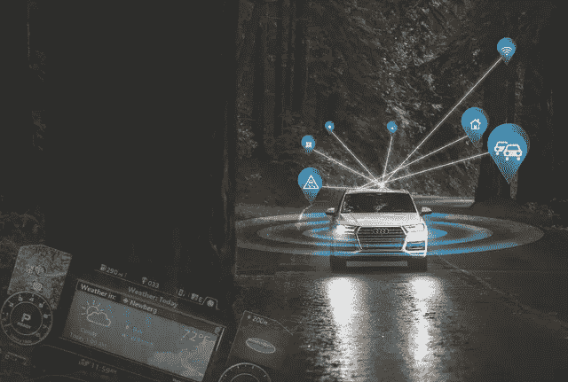
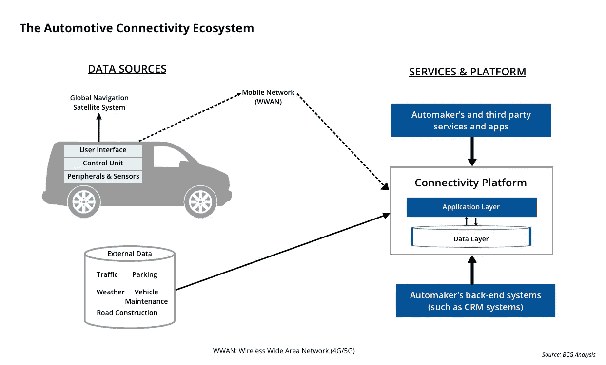

# 构建汽车互联生态系统

> 原文：<https://medium.datadriveninvestor.com/building-the-automotive-connectivity-ecosystem-ef0f71813784?source=collection_archive---------1----------------------->

今天的汽车拥有大约 20 台个人电脑的计算能力，包含超过 1 亿行代码，每小时产生高达 25gb 数据的 T2。数字化和技术以前只关注优化车辆的内部功能，但现在的注意力正转移到开发汽车与周围世界连接的能力，并增强用户的车内体验。联网汽车现在能够使用车载传感器和数据连接优化自身的操作和维护，以及乘客的便利和舒适。汽车不仅仅是将人和货物从 A 点运送到 B 点，它们越来越成为与汽车相关的服务的电子商务中心，例如信息娱乐服务和基于使用的保险服务，这些服务可以跟踪司机的行为。如今，车主对卓越驾驶体验的认知已经超越了汽车发动机，包括通过互联服务实现车辆个性化。

**对汽车互联生态系统的需求**

在回答上述问题之前，让我们先问问自己，为什么我们首先需要一个车辆连接生态系统？汽车行业主要由汽车制造商、供应商和经销商组成的日子已经一去不复返了。随着联网汽车和移动服务的兴起，生态系统已经扩展到包括技术提供商、服务提供商、基础设施提供商、智能城市等。在数字化时代，世界变得更加互联，使人们更加紧密地联系在一起。汽车工业正在经历同样的转变。汽车制造商正在与技术和服务提供商建立战略合作伙伴关系，目标是使汽车成为一个互联系统，就像我们的家和工作场所一样，我们可以在那里工作或享受休闲时光。连接性并不仅限于收听广播，今天它已经能够连接到许多智能手机应用程序，如 [Spotify 和谷歌地图](https://www.lifewire.com/complete-guide-to-android-auto-4077121)。现代汽车中的数据连接反映了已经熟悉的基于智能手机的移动体验，并将消费者的数字生活方式扩展到他们的汽车中。在不久的将来，连接将超越车辆和云连接，汽车将相互连接，并与周围的基础设施连接。

随着车辆中软件和数据的增加，创新的软件和数据管理解决方案正在开发中。为了帮助汽车制造商避免昂贵的负担，帮助车主避免不必要的不便，我们现在有了[空中(OTA)服务](https://movimentogroup.com/products/)，可以在车辆和云之间传输软件更新和数据，而不必将车辆带到经销商处。这意味着，通过 OTA 技术，车辆有能力在车辆的整个生命周期内不断更新自己的软件，包括越来越重要的安全更新。除了彻底改变车辆软件更新和数据管理，OTA 技术还将成为完全自动驾驶汽车的基础。随着驱动轮从车辆中完全消失，汽车架构和设计将发生根本转变，因为汽车制造商将转向适应额外的技术发展，如引入人工智能(AI)、新的交通模式和增强的用户体验。

**汽车互联生态系统的构建模块**

汽车互联生态系统由互联车辆产生的汽车数据流以及基于这些数据可以执行的操作所驱动。[波士顿咨询集团(BCG)](https://www.bcg.com/publications/2017/connected-vehicles-road-revenue.aspx) 已经为联网车辆定义了连接生态系统，如下图所示。

汽车连接生态系统可以大致分为两个部分— (1)数据源和(2)服务和平台。

*   **数据来源**:数据首先通过车辆产生(比如车辆的确切位置、车辆的健康状况、驾驶员行为等。)和外部基础设施(交通状况、道路状况、天气状况等。).这些数据源然后通过蜂窝网络(如 4G 或未来的 5G 通信网络)连接到“服务和平台”。
*   **服务和平台**:这个组件的核心是连接平台，由两个不同的层组成——应用层和数据层。从数据源生成的所有数据都累积在数据层中。利用[边缘计算](https://movimentogroup.com/blog/the-drive-towards-intelligent-edge-computing/)，只有必要的数据必须被传输到这一层。应用层充当第三方和汽车制造商自身的接口，利用数据创建增值服务和应用，在许多情况下使用人工智能和区块链技术等其他技术。数据层由汽车制造商的后端系统管理和维护，有时外包给第三方。

以前，汽车制造商只关心汽车——它的设计、外围设备和传感器、控制单元和用户界面。随着互联需求的不断发展，汽车制造商需要更加关注消费者，并承担更多功能，以有效运营并击败竞争对手，为客户提供出色的用户体验。他们必须管理从车辆到平台再到应用的数据流，并且需要可靠的通信系统来安全地传输数据。他们还需要合适的基础设施(包括基于云的平台)来支持他们的新服务和应用。

对于汽车行业来说，连接可以提供新的收入机会。有效实施将是一项具有挑战性的复杂任务，需要深入了解客户需求，并愿意以新的方式与新的合作伙伴合作。汽车制造商将需要成为软件公司。例如，他们将需要以新的方式向客户收费，如通过每月订阅或基于服务的支付。这些(对汽车行业而言)新功能中的许多不太可能在内部找到，并且开发起来可能很困难或很昂贵。通过建立合作伙伴网络，汽车制造商可以快速获得他们需要的资源。上市时间、风险和成本都可以降低，而质量和收入却可以提高。

**免责声明:本文表达的观点和意见仅代表我个人，不代表任何其他人或公司。所有内容都受版权保护。*