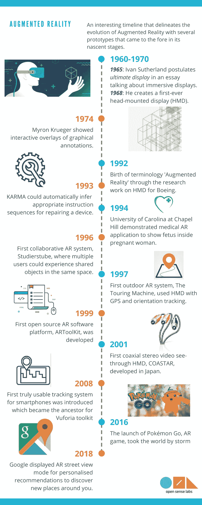
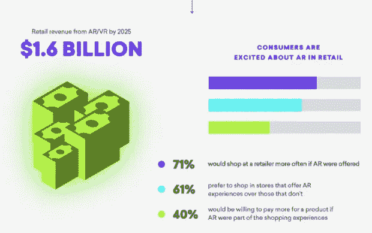
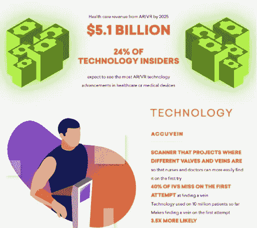
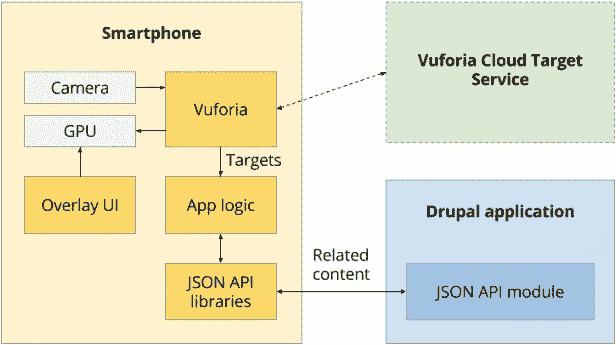
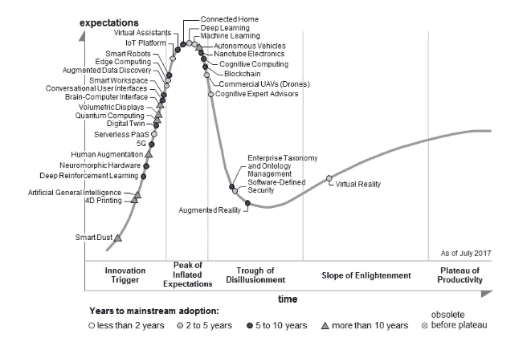
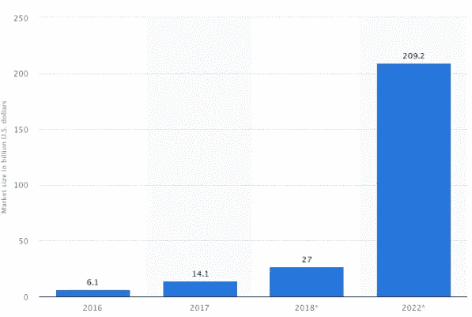
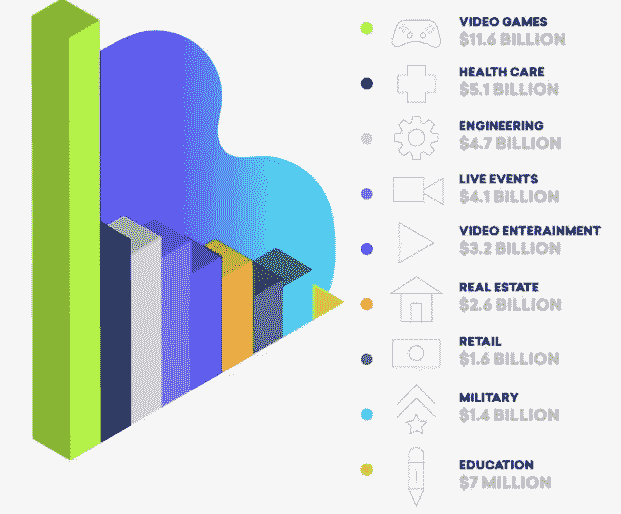

# 用我们的想象力、增强现实和 Drupal 构建世界

> 原文：<https://medium.datadriveninvestor.com/building-the-world-with-our-imagination-augmented-reality-and-drupal-4a4e698d6365?source=collection_archive---------29----------------------->

还记得当你读你最喜欢的书，或者看触动你情绪的电影时，你有多开心吗？

有人称之为逃避现实，有人称之为休息，但这种经历会持续更长时间。

随着科技的进步，我们不仅可以想象一些远离现实的东西，而且有可能就在我们眼前看到它们。**增强现实**是未来科技奇迹，可以用来打造科技天才。

> **但是什么是增强现实(AR)？**

# 了解词义和词源

Gartner 将 AR 定义为以文本、图形、音频和其他与现实世界对象集成的虚拟增强形式实时使用信息。

正是这种“**真实世界**”元素将 AR 与虚拟现实区分开来。与模拟相比，AR 集成并增加了用户与真实世界的交互的价值。

AR 的发展是惊人的，同时也是有趣的。

## AR 是怎么产生的？

今天，叠加在物理世界之上的信息成为了人们谈论的话题。早在 20 世纪 60 年代，准确地说是 1965 年，**伊凡·苏泽兰**在一篇文章中谈到了沉浸式显示器，并在 1968 年创造了第一个头戴式显示器。

> 今天的视觉显示器的用户可以很容易地使固体物体透明——他可以“看穿物质！”
> ——伊凡·苏泽兰

克鲁格在 1978 年展示了图形注释的协作交互叠加。快进到 20 世纪 90 年代，我们将见证大量的研究工作和原型。1992 年，名为*增强现实*的术语首次出现在波音公司的一项研究中。随后的发现，如 93 年的 KARMA，94 年的首次医疗 AR 应用，96 年的 Studierstube，97 年的 Touring Machine 和 99 年的 ARToolKit，为千禧年后的许多复杂创新铺平了道路。

Pokémon Go 的推出在 2016 年的高峰期拥有近 4500 万用户。最近，在 2018 年，谷歌除了个性化推荐外，还显示了 AR 街景模式，以实时帮助你发现你周围的新地方。

如今，当涉及到专用于 AR 的软件平台时，AR 开发者有很多选择。但是这些发明在指导和模型方面提供了很多东西。

# 不同版本的增强现实

增强现实在商业用途上确实走了很长的路。AR 内部有不同的分类。

*   **基于标记的 AR** :又称图像识别 AR 最容易实现。它使用触发器对象来显示内容。[谷歌眼镜](https://play.google.com/store/apps/details?id=com.google.android.apps.unveil&hl=en)、 [Popcode](http://popcode.info/whatispopcode) 和 [ScanLife](http://www.scanlife.com/) 就是其中的一些例子。
*   **无标记 AR** :比基于市场的 AR 更通用。代替触发对象，它使用相机，GPS 和加速度计信息来跟踪用户位置，并为他们提供相关内容。无标记 AR 的例子包括 [ARIS](https://fielddaylab.org/make/aris/) 和 [Layar](https://fielddaylab.org/make/aris/) 。
*   **基于投影的 AR** :它将数字图像直接投影到用户周围的表面上。[迪士尼主题公园](https://www.researchgate.net/publication/235961176_Projection-Based_Augmented_Reality_in_Disney_Theme_Parks)已经采用投影仪相机工具箱来构建 3D 对象，以增强主题公园体验。
*   **勾勒 AR:** 它使用图像识别来勾勒形状和边界。它可以用来帮助司机在昏暗的光线下看到高速公路的边缘，以便安全驾驶。
*   **基于叠加的 AR** :利用物体识别，将用户周围的物体部分或全部替换成数字图像。例如，外科医生可以在手术过程中使用这种技术在患者身体的一部分上添加数字 x 射线。

# 增强现实的应用

无论是交通还是体育，AR 对于不同行业都大有可为。让我们全部看看。

**零售业**可以很大程度上收获 AR 的好处。宜家有一个名为 [IKEA Place](https://digiday.com/marketing/ikea-using-augmented-reality/) 的 AR 应用程序，它允许顾客在家中的实际房间里预览数千件虚拟家具。

**交通部门**也可以探索 AR 来简化他们的工作。 [Aero Glass](https://glass.aero/) 已经创造了可以显示机场、导航点、地形特征等的 AR 耳机。对于飞行员来说。

AR 对于体育产业来说是一大福音。 [Stubhub](https://mashable.com/2018/01/18/stubhub-augmented-reality-app-super-bowl/#w4vApWRsVSqf) 在他们的移动应用程序上开发了一个功能，可以让超级碗的门票购买者看到体育场和周围地区的虚拟 3D 模型。

它在**教育部门**也有巨大的潜力。像 [AR 抽认卡动物字母表](https://edshelf.com/tool/ar-flashcards-animal-alphabet/)这样的应用程序可以通过将抽认卡带入生活来帮助孩子们轻松学习字母表。

[**医疗保健行业**](https://opensenselabs.com/blog/articles/drupal-paves-better-future-healthcare) 有望成为 AR 最重要的领域之一，潜力巨大。 [AccuVein](https://www.accuvein.com/why-accuvein/evidence/) 使用 AR 技术帮助护士在插入静脉注射时更容易地找到静脉。

**营销板块**也不会远。2014 年，通过在伦敦公交候车亭安装面向外的摄像头，并投射不明飞行物、机器人、气球和老虎，[百事可乐](https://www.jcdecaux.com/blog/augmented-reality-and-outdoor-5-campaigns-make-your-eyes-pop)将促销活动推向了一个全新的高度。

# 增强现实的工作原理

AR 在许多行业的许多层面上都很棒。增强现实是如何工作的？

**传感器**可以在 AR 设备的外部找到，收集关于用户现实世界交互的数据并处理它们。

**同样位于 AR 设备外部的摄像头**，扫描周围区域，并使用这些信息来确定适当的输出。

**基于投影的增强现实**通过一个面向外的增强现实设备中的微型投影仪工作。他们可以将任何表面或物体变成身临其境的环境。相机收集的数据通过基于投影的 AR 设备投影到表面上。

增强现实设备就像迷你超级计算机，需要大量的计算机处理能力。它们使用许多与智能手机相同的组件，包括 CPU、GPU、闪存、RAM、蓝牙/Wifi 微芯片、GPS 微芯片等。

AR 设备还可以使用镜子进行**反射**来帮助观察我们的眼睛观看虚拟图像的方式。虽然一些 AR 设备可以使用小曲面镜阵列，但是其他 AR 设备可以使用双面镜，其中一个表面将入射光反射到侧面安装的相机，而另一个表面将该光反射到用户的眼睛。

# 用 Drupal 构建:AR 和 Drupal 的用例

一家 Drupal 代理公司制作了一个[聊天机器人](https://opensenselabs.com/blog/articles/chatbots-important-website)原型，它可以帮助顾客根据健康限制和他们的喜好选择食谱。与聊天机器人的互动体验可以让他们的生活变得更轻松，并禁止他们为购买杂货而进行密集的研究。为了进一步改进它，他们试图在 Drupal 中集成 AR。

该视频中的演示展示了一名购物者与 AR 应用程序的交互。建立在 [Drupal 8](https://opensenselabs.com/why-drupal-8) 上的 Freshland Market(一个虚构的杂货店)的移动应用程序引导购物者浏览她的购物清单。

它还帮助她在通过 AR 覆盖购物时做出更好的决定。它将价格、产品评级和推荐等相关细节叠加在智能手机摄像头检测到的购物项目上。移动应用程序通过显示最适合她饮食限制和偏好的产品，使购物者的体验个性化。

Drupal 的 web 服务支持和 [JSON API 模块](https://www.drupal.org/project/jsonapi)有助于为移动应用提供内容。Freshland Market 的 Drupal 8 站点存储了所有与产品相关的信息，包括价格、饮食限制以及评论和评级。如果编辑了某个产品的 Drupal 内容，显示该商品正在出售，它会自动反映在通过移动应用程序叠加的内容中。除此之外，产品的位置也存储在网站上，以引导购物者找到产品在商店中的位置。

该应用程序是使用 AR 库 [Vuforia](https://www.vuforia.com/) 开发的，它可以识别预先配置的目标，如产品标签的图像。例如，在演示中，它可以识别番茄酱和麦片标签。每个目标都有一个惟一的 ID 来查询 Freshland Market 的 Drupal 8 站点，从而找到与这些目标相关的内容。

另一个用例是 Lift HoloDeck 原型，它是使用 Drupal(内容商店)、Acquia Lift(个性化引擎)、Vuforia(AR 库)和 Unity(3D 游戏引擎)等商业技术构建的。

Lift HoloDeck 团队构建了一个移动应用程序，可以将产品信息和智能通知叠加在智能手机屏幕上检测到的现实生活中的物体上。它可以改变顾客与品牌互动的方式，改善顾客体验。

假设用户通过这个移动应用程序向咖啡店通知他的购买情况。当他进入商店时，他会在手机屏幕上显示“今日交易”。该应用程序在饮料上叠加了饮食信息、如何点餐的说明和产品信息。通过仔细阅读营养成分，他将点他喜欢的食物，并会收到他点的食物已经准备好了的通知。

# 增强现实的未来是这样的…

增强现实的未来是怎样的？Gartner 在 2017 年的炒作周期发现表明，AR 的主流采用还需要 5 到 10 年的时间。

上面提到的图形表示清楚地表明，AR 将是未来几年需要考虑的一股力量。AR 的市场份额将在未来几年发生巨大变化。

如上图所示，到 2025 年，AR 的最大行业将是游戏和医疗保健行业，其次是工程、房地产和零售行业。

# 结论

世界正在改变。它正以难以想象的速度变化着。像增强现实这样的技术曾经是我们庞大幻想清单的一部分。有了这项令人敬畏的颠覆性技术，你的许多幻想都可以实现。使用 Drupal 作为内容商店，设计一个 AR 驱动的 web 和移动应用程序对您的组织来说是非常有益的。

与领先的 Drupal 专家**、ping us at[**【hello@opensenselabs.com】**](https://opensenselabs.com/cdn-cgi/l/email-protection#c8a0ada4a4a788a7b8ada6bbada6bbada4a9aabbe6aba7a5)交谈，为您的未来业务获得 Drupal 和增强现实的最佳功能。**

***Vid 是* ***首席执行官*** *并领导* ***Drupal 和区块链*** ***实践*******OpenSense Labs****。基于工业物联网的预测性维护系统首席架构师，他是 IOTAhead* *的* ***联合创始人。OpenSense Labs 是一家全球顶级的全方位服务 Drupal 机构。******

****博客原载于*[*OpenSense Labs*](https://opensenselabs.com/blog/articles/augmented-reality-drupal-come-together)*。****