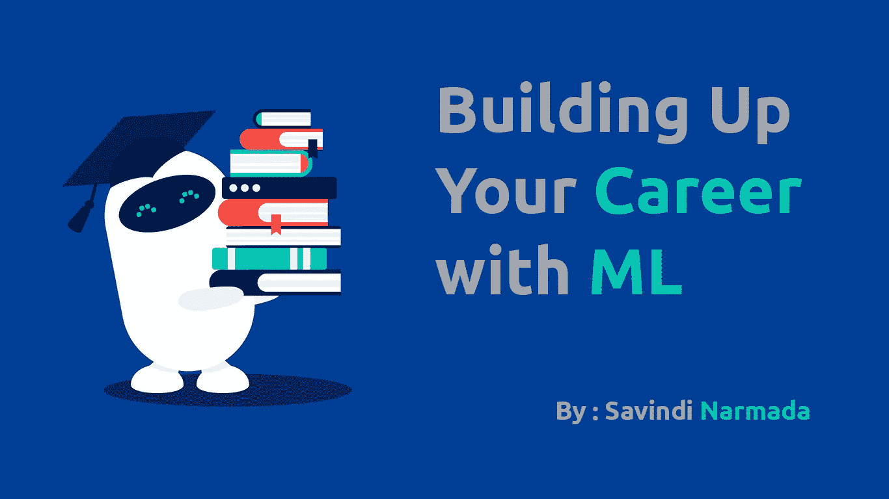

# 用 ML 建立你的职业生涯

> 原文：<https://medium.datadriveninvestor.com/building-up-your-career-with-ml-scholarx-write-up-part1-3b131bb94e2c?source=collection_archive---------6----------------------->

读者们好！今天的帖子有点偏离了我正常的帖子风格，因为我写的大多是技术实践。

当我在大学实习期间突然发现 ML 时，我正在做 java 和 web 作为我的核心领域。但现在它偷走了我的心。我承认我在这个领域只有 9 个月的经验，但是这篇文章不仅仅是因为我的学习。这是我从许多曾经和我一起工作过的前辈那里收集到的信息。

 [## 教科书行业如何最终被颠覆，并将继续改变-数据驱动…

### 就此而言，教科书产业在美国乃至全世界都有着悠久的历史。事实上，他们已经…

www.datadriveninvestor.com](https://www.datadriveninvestor.com/2018/09/25/how-the-textbook-industry-has-finally-been-disrupted-and-will-continue-to-change/) 

其中一位资深人士是 Rukshan Batuwita 博士。我在学校遇见他。最近，我被选入了一个名为 ScholarX 的指导项目，我们有一名导师。这位导师通常来自我们所要求的领域中的知名公司或大学。(不仅包括软件工程领域，还包括许多工程和生物相关领域)。这些导师指导我们 3 个月。我很幸运有 Rukshan Batuwita 博士作为我的导师，他是 FAANG 公司的数据科学家，毕业于斯里兰卡的 Peradeniya 大学。所以我认为他很清楚我们在哪里，我们可以去哪里，凭他的经验。

因此，我想和大家分享他的指导和我个人的学习。这就是今天帖子的介绍。现在你可以决定这篇文章是否适合你。

这篇文章有两部分:

1.  ML 第一步→指导从零到 ML 英雄
2.  ML 中的高等教育→指导你如何进入著名的高等教育大学并建立你的职业道路

# ML 的第一步

## 1.数学

在很多课程中，我看到有人说，你不想学数学。是的，仅仅为了操纵一个预先训练好的模型，我们不需要数学。但是，要对模型架构、算法等进行适当的专业研究。，你必须对内部机制有所了解。这需要相当的数学知识，尤其是在以下领域

*   可能性
*   矩阵
*   代数学
*   结石

## 2.了解基本原理

正如洛克山博士总是告诉；

> 了解基本面是成功的关键

例如，如果你不知道 softmax 是什么，你就不能在 Keras 中创建一个模型时盲目地使用它。或者说，如果你不知道什么是标记化，你就无法前进，去做一个问答系统。所以关键是要对 ML 的基础有一个正确的理解。

之前写过一篇关于 ML 入门的帖子，名为[机器学习基础](https://medium.com/@phantomgrin/ml-101-part-1-basics-of-machine-learning-1734836696c1)。为了对 ML 有一个大概的了解，你可以继续读下去。另外，我强烈建议[谷歌 ML 速成班](https://developers.google.com/machine-learning/crash-course/ml-intro)。这是一个有点以阅读为导向的网站，尽管它有视频。另一个我个人推荐的很棒的课程是 [mlcourse.ai](https://mlcourse.ai/) 。这个课程实际上应该跟在谷歌课程之后，因为它专注于深入理论，而不是覆盖整个 ML 流程。

另外两个我会一直推荐的非常好的课程是[吴恩达在 Coursera 上关于 ML 的课程](https://www.coursera.org/learn/machine-learning)和斯坦福大学的课程(有许多单独的主题，如 CNN、NLP、强化学习等。可以在 youtube 上找到)。在你确定你已经掌握了足够的基础知识之后，去斯坦福吧。

你可以在 Robbie Allen 的帖子中找到更多的资源和好的课程；[我从网络上收集的人工智能和机器学习资源的精选列表](https://medium.com/machine-learning-in-practice/my-curated-list-of-ai-and-machine-learning-resources-from-around-the-web-9a97823b8524)。

## 3.在卡格尔比赛

实际上我并没有这么做。但是我在很多场合被建议参加 T21 的比赛来提高自己。在不久的将来，我也会尝试这样做。

## 4.做很多自己喜欢的项目

这是我经常做的提高自己的事情，也是检验你所学知识的最好方法之一。只要想出你觉得想要完成的事情，例如，你可能想要将毕加索的艺术风格与你的一幅图像融合在一起。当然，有足够多的应用程序可以做到这一点。但是你可以尝试一下，享受一下。(也要给别人留下深刻印象:P)。你可以把你们的情侣照片和艺术气息一起送给你的伴侣，作为他/她的生日礼物:D(只是一个想法)。玩笑归玩笑，我的观点是，也要看到你的宠物项目的价值。享受做这件事。

## 5.在社交媒体上，追随这个领域的巨头

在我从网上收集的人工智能和机器学习资源的列表中， [Robbie Allen](https://medium.com/u/c308c421ca8d?source=post_page-----3b131bb94e2c--------------------------------) 提到了许多你可以关注的好组织。在推特上关注他们。你可以跟上快速发展的 ML 世界。此外，多读一些关于 ML in medium 的文章，这样你每天早上都会得到类似内容的建议。也要关注媒体中的优秀作家。(Robbie 在他的帖子中也提到了一些)

# ML 高等教育

许多热衷于机器学习的大学本科生通常都有在机器学习的一个子领域追求更高研究的梦想。通常，我们斯里兰卡人计划在国外攻读博士学位，因为在斯里兰卡，ML 领域仍处于起步阶段。那么怎样才能考上国外的大学，全额或者部分奖学金？

## 1.以第一名成绩毕业

保持你的平均绩点是获得奖学金的一个关键因素。如果你获得了第一名(或至少第二名)，你就成功地向你梦想的大学迈进了一步。

## 2.为你最后一年的研究选择一个好题目

随着时间的推移，研究的趋势发生了变化。然而，你可以做两种研究。

1.  理论研究→架构、最佳损失函数、最佳优化算法等方面的研究。属于这一类。简单地说，你试图重新定义或修改 ML 中的理论。需要对基础知识有透彻的理解。
2.  应用研究→试图解决医学、会计、教育等应用领域实际问题的研究。

两种类型都不错。在目前的趋势下，研究主题的最佳选择将是[生成对抗网络(GANs)](https://en.wikipedia.org/wiki/Generative_adversarial_network) 或[深度强化学习](https://en.wikipedia.org/wiki/Deep_reinforcement_learning)。此外，研究较少的领域(例如:NLP)也相当有利可图。

如果你对应用研究感兴趣，尝试研究量较少的应用领域，如医学、教育等。这将给你更大的机会发表你的研究并在会议上展示。

> 在选择研究课题时，你需要考虑的最重要的方面是，**时间**

你需要思考你知道多少，你需要知道多少才能成功完成研究。基本上是你的知识差距。然后再考虑自己学习能力的快慢。和知识差距对比一下，看自己时间够不够。

## 3.发表你的研究

努力以出色的方式完成最后一年的研究。然后申请会议，全球的和本地的。在一次全球会议上发言将会非常困难，但是要一直努力。一些大型会议包括:

1.  [ICML](https://icml.cc/)
2.  [神经突](https://nips.cc/)
3.  [ICCV](http://iccv2019.thecvf.com/)
4.  [KDD](https://www.kdd.org/kdd2019/)
5.  [IEEE](https://www.ieee.org/)

你可以从[乔治·赛义夫](https://medium.com/u/e2af5c8737ec?source=post_page-----3b131bb94e2c--------------------------------)的“[2019 年即将到来的顶级人工智能会议](https://towardsdatascience.com/the-top-upcoming-ai-conferences-in-2019-3c3eb6f4c515)”中找到更多关于会议的信息。

至少试着让你的研究发表在当地的 IEEE 机器学习会议上。

今天就到这里吧！希望你能从这篇文章中很好地理解如何开始使用 ML 以及如何在这个领域走得更远。

希望看到许多来自我的读者的出版物！😇

祝大家好运😊

PS:本帖开放讨论。在这方面你可能比我更有见解。如果是这样，请随意添加您的意见和建议，以便未来的科学家从中受益。💪