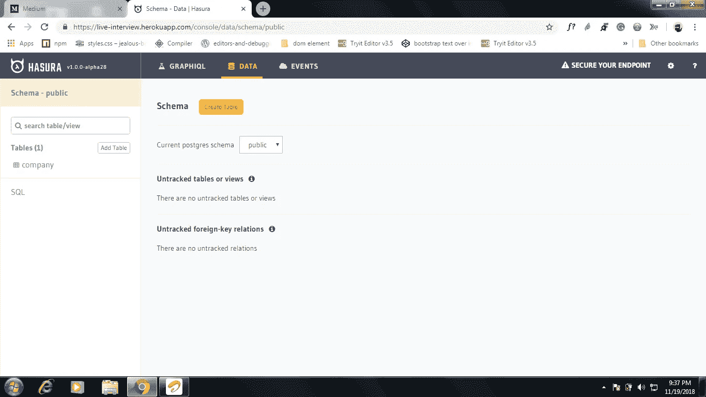
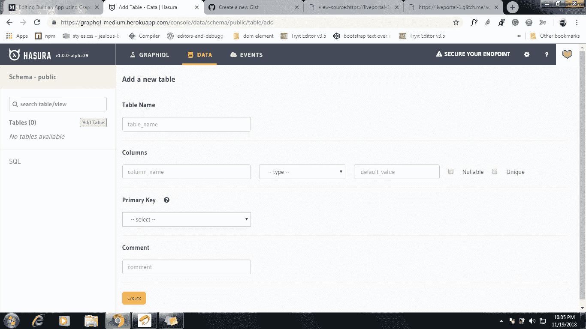

# 使用 GraphQL API 构建了一个应用程序

> 原文：<https://medium.datadriveninvestor.com/built-an-app-using-graphql-api-970c0808e52a?source=collection_archive---------40----------------------->

**Rest API vs GraphQL API！？**

Rest API —端点根据请求而变化。举个例子，

> 查询表中的用户名字段:www.url.com/get/:username
> 
> 查询表中的 id 字段:www.url.com/get/:id

GraphQL —整个数据库的一个端点。我们可以用一个端点在数据库中进行操作。

> 查询整个数据库:www.url.com/

点击这里了解更多 GraphQL [作者](https://medium.freecodecamp.org/so-whats-this-graphql-thing-i-keep-hearing-about-baf4d36c20cf)[萨夏·格雷夫](https://medium.com/u/156e844b0e31?source=post_page-----970c0808e52a--------------------------------)。

在这篇博客中，我们将使用 [Hasura](https://medium.com/u/5f5557965017?source=post_page-----970c0808e52a--------------------------------) GraphQL 引擎来构建一个应用程序。

**为什么要 Hasura GraphQL 引擎！**

> 没有服务器端编码。而是一个 app！怎么会？

HGE — Hasura GraphQL 发动机。HGE 是一个开源软件。HGE 提供的 Postgres 数据库，我们可以直接看到 HGE 控制台内的数据库。我们只需要为 Postgres 编写 GraphQL 查询，以便从前端进行 CRUD。我们需要两样东西，

> GraphQL 端点或 API
> 
> HGE 控制台

获得我们自己的 HGE 控制台和端点不是一个火箭科学。

**如何获取控制台暨端点！**

1.  点击此[链接](https://dashboard.heroku.com/new?button-url=https%3A%2F%2Fdocs.hasura.io%2F1.0%2Fgraphql%2Fmanual%2Fgetting-started%2Fheroku-simple.html&template=https%3A%2F%2Fgithub.com%2Fhasura%2Fgraphql-engine-heroku)获得您自己的 HGE 控制台。
2.  完成部署后。你会得到这样的东西，

HGE console

所以接下来，我们将向前迈进一步，创建一个类似于 [this](https://raspy-hippopotamus.glitch.me/) 的应用程序。让我们先创建一个前端！

**为应用程序创建一个前端！**

创建一个 index.html 文件，并输入以下代码。

两个输入框。一个提交按钮和 div 标签来显示存储的数据。

**创建表格！**

您可以在“数据”选项卡下创建表格。我把它命名为 users_hobby。

creating a table

**如何将数据写入数据库！**

创建一个 index.js 文件，并添加以下代码以将数据写入数据库。

代码将执行写操作。重要关键词，

1.  “您的端点”是您可以在自己的 HGE 控制台的 GraphQL 选项卡下找到的端点。
2.  “突变”用于插入数据。
3.  “插入 _ 用户 _ 爱好”—用户 _ 爱好是表名。
4.  “fetch()”—它类似于 AJAX 函数。向 API 发送请求。

如何从数据库中获取数据！

在 index.js 文件中添加以下代码。

Read the data

某种程度上等于插入，

1.  "查询"用于从数据库中查询数据。

> 像你喜欢的那样容易

有任何建议或问题欢迎随时评论！

学会了一项新技术。放一些👏去接触更多的人。

Part 2 这里是[这里是](https://medium.com/p/15d4c8f70fe7)。

D ay 13。这是我的博客，明天见！