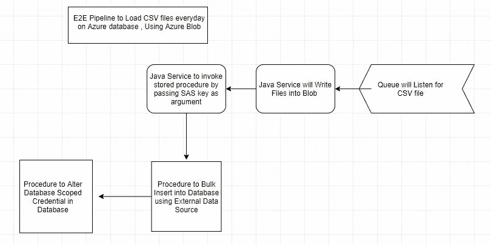

# 编排:使用 Blob 存储将数据批量插入 Azure 数据库

> 原文：<https://medium.datadriveninvestor.com/bulk-insert-into-azure-database-using-blob-storage-f1fbc2d65325?source=collection_archive---------0----------------------->

我们经常需要将 CSV 文件导入数据库，虽然有多种方法，但我们将讨论使用 Azure Blob 在 Azure 数据库中批量插入的方法。

上面的截图展示了如何设置一个管道，每天将 CSV 文件导入到您的表中。

生成 SAS 密钥和将文件写入 Blob 存储超出了本文的范围。我们将更多地关注数据库端的工作。

使用 SQL Server Management Studio 在您的本地系统中进行批量插入非常简单，需要的工作量也较少，但是在类似生产环境的云环境中进行这种操作有点棘手，并且需要很少的先决条件。

**先决条件:
用于存储 CSV 文件的 Azure Blob 存储**

**数据库设置:
创建数据库主密钥
创建数据库范围凭证
创建外部数据源**

您将需要开发运营支持来完成大多数先决条件，或者如果您拥有所需级别的访问权限，您也可以自己完成。
请参考下面的代码片段来完成此设置。

**对象创建:**

**提供资助:**

## **术语:**

**Azure Blob 存储:** Azure Blob 是微软针对云的存储解决方案。它可以存储不同类型的非结构化数据，如文件、图像等。

**SAS 密钥:**共享访问签名(SAS)密钥用于从数据库提供对 Blob 存储帐户的临时访问。
之所以是临时的，是因为密钥仅在特定时间段内有效，之后它将过期，并且不能用于访问您的 blob 存储帐户。

在初始设置之后，Java 服务可以调用您的存储过程，通过传递一个新生成的 SAS 键作为参数来执行批量插入操作。

**用于批量插入的 T-SQL 存储过程**

 [## cdamak/AzureSQL

### 在 GitHub 上创建一个帐户，为 cdamak/AzureSQL 开发做出贡献。

github.com](https://github.com/cdamak/AzureSQL/blob/master/Automatic%20Bulk%20Insert/prc_bulk_insert_stg_table.sql) 

大容量插入过程将首先使用 SAS 键更新其数据库范围的凭据对象，以便它可以使用外部数据源建立与 Blob 存储帐户的连接。

**更改数据库范围凭据的 T-SQL 过程**

 [## cdamak/AzureSQL

### 在 GitHub 上创建一个帐户，为 cdamak/AzureSQL 开发做出贡献。

github.com](https://github.com/cdamak/AzureSQL/blob/master/Automatic%20Bulk%20Insert/prc_alter_database_scoped_cred.sql) 

成功更新数据库范围的凭据后，CSV 文件中的数据将被加载到临时表中！

**优点:**
——它是免费的，也就是说，与使用像 SSIS 或 Azure Data factory 这样的 ETL 工具相比，没有额外的成本。
-开发一次，运行/调度多次。

**缺点:**
——与使用 ETL 工具相比，初始测试和开发工作要高一些。
-执行速度取决于您的数据库订阅，如果您使用较低的数据库订阅，加载大型数据文件将需要更多时间。
-额外的工作，如跳过数据文件/表中的列或在目标表中以不同的顺序映射列。
这是通过创建与批量插入命令一起使用的格式化文件来完成的，而不是在 ETL 工具的情况下通过 UI 进行简单的映射

**LinkedIn**:[https://www.linkedin.com/in/karan-dama](https://www.linkedin.com/in/karan-dama-46234957/)