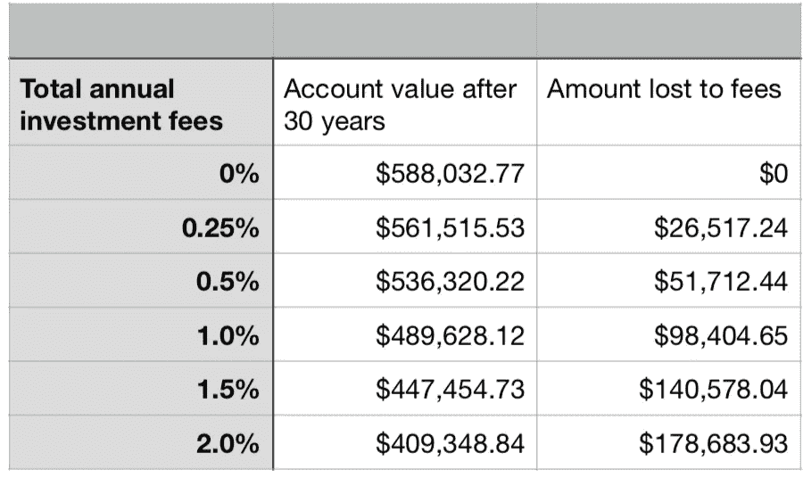

# 牛市或熊市:你的 401(k)费用仍在耗尽你的储蓄

> 原文：<https://medium.datadriveninvestor.com/bull-or-bear-market-your-401-k-fees-are-still-draining-your-nest-egg-457e4745cf3?source=collection_archive---------26----------------------->

401(k) Fees

随着股市的调整和熊市的开始，你必须明白高昂的基金费用会对你造成更大的伤害。没有人喜欢为任何东西付费，然而在熊市期间可能会更痛苦，因为你通常会公布投资的负收益，所以知道你支付了多少以及你是否应该转向收费较低的基金很重要。

你知道你的雇主赞助的 401k 向你收费吗？你们中的一些人会说是，其他人会说不是，然后其他人会说是，但他们并不确切知道它们是什么，也不知道它们加起来有多少。

更多的美国人知道他们为网飞或 Spotify 服务支付了多少钱，而不是他们为 401(k)计划支付了多少钱。

在 TD Ameritrade 所做的一项研究中，只有 27%的美国人知道他们支付了多少 401(k)费用。当我开始投资我的退休计划时，我从来没想过要花多少钱，因为我不用自掏腰包支付这些费用。它们刚刚从我的账户里出来，我一点也不知道。当然，他们每个季度都会发一份声明，但是说实话，大多数人都不会看，甚至不明白他们在看什么，因为财务信息让很多人感到害怕和困惑。但是 401(k)费用可能比你意识到的要昂贵得多，并且会减少潜在的投资收益。

**费用如何花费你的钱**

较大的公司计划的平均费用低于 1%，而较小的公司计划可能在 1.5%到 2%之间。记住这是你总余额的百分比。但也有其他计划可以达到每年 3.5%或更高。

即使是很少的费用，随着时间的推移也会积累很多钱。看看下面这个例子，看看费用是如何影响你的收入的。

在这个例子中，一位投资者每月向一个账户存入 500 美元，为期 30 年，在此期间共存入 180，000 美元，平均年回报率为 7%。

让我们比较一下 1%的费用和 2%的费用。如果收取 1%的费用，你本可以赚 489，628 美元，但你在 30 年内要支付 98，404 美元的费用。2%的例子显示你只赚了 409，348 美元，因为你必须支付 178，683 美元的费用。

如果 200，000 美元的费用损失还不足以成为你现在登录 401k 查看费用的理由，那我就不知道还有什么理由了。

**找什么**

以下是一些你可能会支付的最受欢迎的费用:

管理费:这些费用用于 401(k)的一般管理。

投资费用:根据劳工部的数据，这是 401(k)费用的最大驱动因素，涉及投资管理和其他服务，通常按资产的百分比收取。

服务费:这些费用与计划赞助商提供的功能或计划选项相关，并且各不相同。一个例子是从计划中贷款的费用。

去哪里找他们

根据已经完成的 TD 调查，大约 14%的被调查者表示他们不知道如何确定他们可能要支付的费用。这是因为公司不会直接出来告诉你，你的费用是 1.3%。相反，他们把它埋在一个很难找到的说明书里，或者网上的某个地方，除非你知道它的确切位置，否则你很难找到它。在过去的几年里，费用吸引了如此多的关注，公司开始变得透明和公开他们的费用是多少。类似于餐馆在菜单上标注卡路里信息的方式。

我想了解你的费用的第一个地方是阅读你的 401(k)计划的年度总结报告，这是参与者需要收到的列出费用的文件。如果你像我得到它时一样扔掉了它，你可以向你的公司要另一份或者在网上找到它。参与者还可以在网上索取或找到账户资金的说明书，说明书中将列出该计划投资的资金以及任何相关费用的详细信息。

我的 401(k)到底有什么好处，如果我不想支付这些费用，我能做什么？

由 401(k)资助的公司的主要好处是双重的。第一个好处是，许多公司每年都会为你的计划提供一定数额的资金。这是免费的钱，你绝对应该利用这一优势。

第二个好处是你的投资是免税的，因此减少了你年底的应税收入。重要——对吗？较低的应税收入意味着较少的税收。现在不要被愚弄了，当你在退休期间取款时，山姆大叔会向你征税。虽然这是正确的，但要考虑的一件事是，越来越多即将退休的人由于旅行、医疗保健费用和其他活动而花费更多的钱。人们退休后的支出与工作时相同甚至更多的情况越来越普遍，所以你需要做好准备，因为你必须为你的提款缴税。

因此，如果你的公司费用很高，你可能只想贡献你的公司匹配的费用。那么你可能要考虑把剩下的钱投资到其他金融选择上。也许在一个单独的罗斯个人退休帐户或只是投资 ETF 或你自己的共同基金，但确保在你投资之前，你正在研究[费用比率](https://en.wikipedia.org/wiki/Expense_ratio)和管理费，这样你将清楚地知道你将为这些基金支付多少。请记住，无论你在年底赚钱还是亏损，你都将付出代价。这是你投资的基金的管理费用。需要考虑的一点是，被动管理型基金的费用率通常低于主动管理型基金。