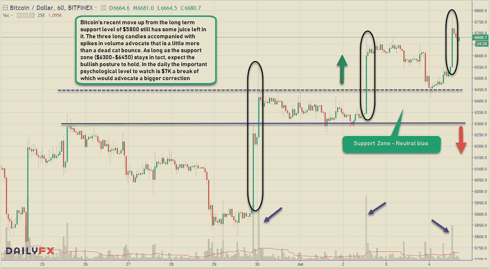
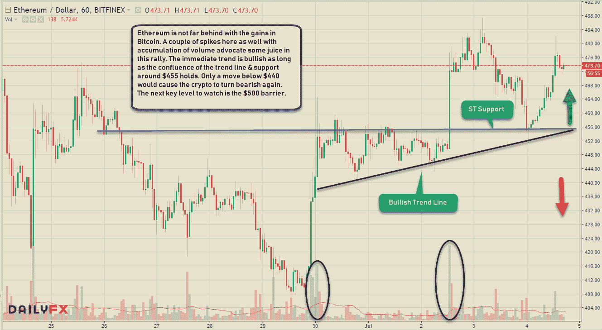
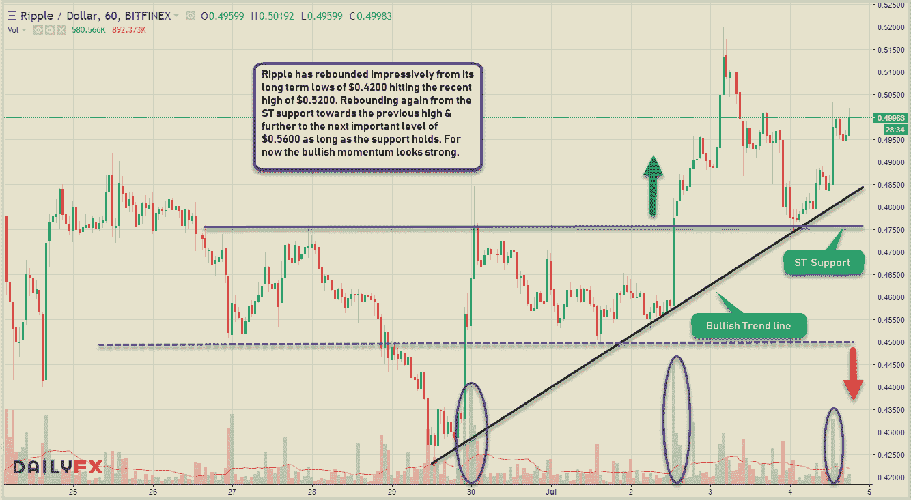
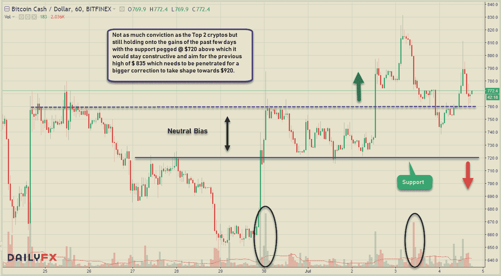
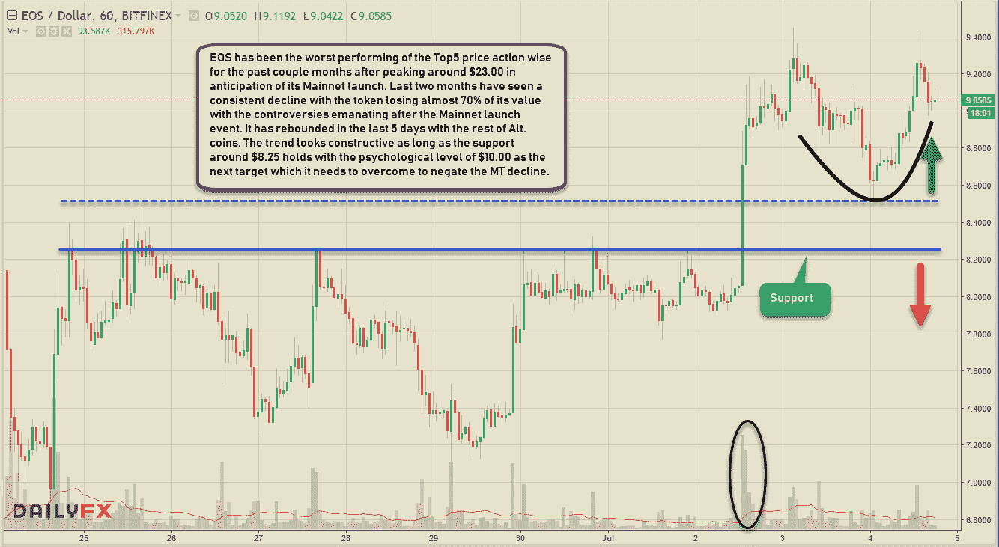

# 看涨的姿态在密码-ST 移动

> 原文：<https://medium.datadriveninvestor.com/bullish-posturing-in-cryptos-st-moves-6052db855257?source=collection_archive---------5----------------------->

在过去的几天里，通货膨胀率已经从低点反弹，预示着一个可能的底部。对我来说，这是一个美好的缓慢的一天，在美国股市因假期休市的情况下，看看前 5 大密码的技术水平。图表说明了一切，所以为什么不开始呢。

**比特币— BTCUSD (ST 看涨，MT 看跌)**

**以太坊— ETH (ST 看涨，MT 看跌)**

**Ripple — XRPUSD (ST 看涨，MT 看跌)**

**比特币现金— BCHUSD (ST 看涨，MT 看跌)**

**EOS — EOSUSD (ST 看涨，MT 看跌)**

类似内容链接: [**交易美元专业做外汇**](https://medium.com/datadriveninvestor/trading-usd-majors-in-forex-b616c7841bc7) ， [**做空比特币是可能的**](https://medium.com/datadriveninvestor/shorting-bitcoin-is-possible-94cefe71452c) ， [**一刀切的交易策略？**](https://medium.com/datadriveninvestor/one-size-fits-all-trading-strategy-c8c2d7954740) ， [**百事通……一人之主！**](https://medium.com/datadriveninvestor/jack-of-all-trades-master-of-one-bb05ccafdf8a)

保持联系:[Twitter](https://twitter.com/fklivestolearn)|[StockTwits](https://stocktwits.com/trade_nut)|[LinkedIn](https://www.linkedin.com/in/faisal-khan-2a3009b/)|[Telegram](https://t.me/joinchat/IWzyHBGWCFwPQTe8Tm5H_Q)|[trade alike](http://www.tradealike.com/)

*原载于 2018 年 7 月 4 日*[*www.datadriveninvestor.com*](http://www.datadriveninvestor.com/2018/07/04/bullish-posturing-in-cryptos-st-moves/)*。*