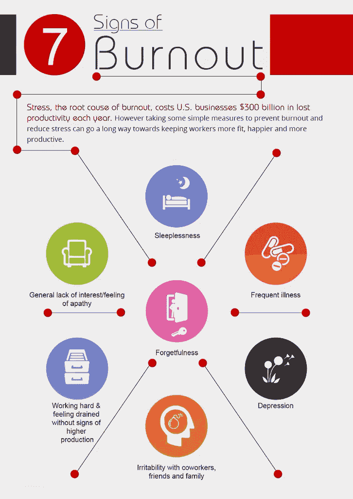

# 倦怠使医生处于危急状态

> 原文：<https://medium.datadriveninvestor.com/burnout-places-doctors-in-critical-condition-4da0e15bb9ca?source=collection_archive---------1----------------------->

## 在太少的时间里完成太多的任务会导致压力和错误

根据[Gia Baquiran Sison](https://twitter.com/giasison)医生的说法，urnout 在医疗领域很常见。“这在过去曾被讨论过，但在精神健康倡议的黎明，它似乎总是医疗保健专业和学术界的一个主要障碍。”

Sison 是职业健康专家，拥有菲律宾大学和芝加哥伊利诺伊大学的职业健康硕士学位。她是世界卫生组织西太平洋地区和菲律宾马卡蒂医疗中心的顾问。

 [## 抑郁症发作时，谁来医治治疗者？

### 医生容易受到压力和心理健康下降的影响

medium.datadriveninvestor.com](/who-heals-the-healer-when-depression-strikes-d72f4c10a4b9) 

她与[的斯蒂芬妮·米亚科博士](https://twitter.com/StephMiaco)就如何管理学业倦怠展开了讨论。Miaco 是来自菲律宾杜马盖地市的执业精神病医生。她倡导精神健康，是西利曼大学医学院的一名教员。

“精疲力尽是超负荷的结果——在太少的时间里完成太多的任务，期望成功，却不能容忍失误，”Sison 说。

Miaco 多次感受到这样的压力。

“有那么多的激情和要做的事情——那么少的时间、资源、人力和报酬，”她说。“这可能会非常令人沮丧。直到我们在诊所看到它们，事情才真正变得相关。”

# 无精打采

她谈到了学业倦怠是如何显露出来的。

“这可能会让人感觉烦躁不安——一种情绪低落、无精打采——持续很长时间，并可能表现为面对工作日时的疲惫，”Miaco 说。“做日常活动需要额外的努力，就好像你在收缩额外的肌肉。“死在里面”听起来是对的。

“你真的想做好自己的工作，并受到激励，但你似乎就是找不到立足点，”她说。"日子似乎就这样从我身边过去了，在我意识到之前，整整一周或一个月已经过去了。"

她的个人倦怠疗法是挤进更多的艺术和“有趣的东西”

“我注意到自己想要更多地出去拍照，只是为了再次获得对事物的创造性感觉，”Miaco 说。“虽然他们说如果你选择了一份你热爱的工作，你一生中一天都不会工作，但我认为这并不是在所有情况下都适用。”

 [## 当压力增大时，是时候寻求帮助了

### 危机期间，远程工作的正常压力会加剧

medium.datadriveninvestor.com](/when-stress-builds-its-time-to-reach-out-for-help-bca08e70b6d7) 

令她感到些许安慰的是，她并不是一个人在与疲惫作斗争。

“这种事在我身边发生得太多了，”米亚科说。“最糟糕的是，并不是每个人都意识到自己的行为变化。休息几天通常能让你重回正轨。”

Sison 问卫生专业人员可以采取什么措施来最大限度地减少学术倦怠甚至职业倦怠的影响。

一种可能性是控制预期。要求完美会导致恐惧和麻痹——带来更多的压力和倦怠。把人当人，不要当机器。

“恐惧是麻痹，”Miaco 说。“我一直主张和一个能给你第三人称视角并帮助你处理问题的同事一起讨论。然后你就可以重新构想这种情况了。”

鼓起[勇气对别人的请求说不](https://medium.com/@JKatzaman/just-saying-no-isnt-as-easy-as-it-sounds-b3ed7979860a)也会增加压力。

“不想成为‘坏人’是导致倦怠的一个因素，”Miaco 说。

只要机构坚持将不断增长的学术和专业需求作为规范，她所称的“职业倦怠的医学流行病”将继续是一个挑战。

**关于作者**

吉姆·卡扎曼是拉戈金融服务公司的经理，曾在空军和联邦政府的公共事务部门工作。你可以在[推特](https://twitter.com/JKatzaman)、[脸书](https://www.facebook.com/jim.katzaman)和 [LinkedIn](https://www.linkedin.com/in/jim-katzaman-33641b21/) 上和他联系。