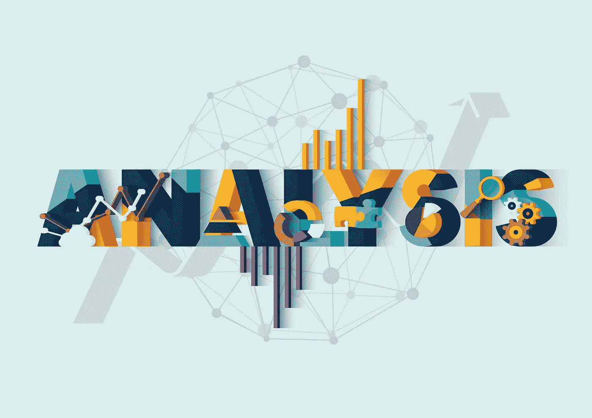

# 软件开发生命周期中的业务分析师角色

> 原文：<https://medium.datadriveninvestor.com/business-analyst-role-in-software-development-life-cycle-f33d10d79343?source=collection_archive---------11----------------------->

商业世界的发展速度如此之快，以至于公司不得不使用软件来加快商业运作。拥有最好的软件，给你最深刻的商业见解，让你在短时间内做很多事情，这将转化为巨大的竞争优势。当我们将这一点与各行业争夺相同客户的竞争水平上升结合起来时，我们看到拥有最佳技术的公司将处于更有利的位置来吸引客户。为了确保你从软件投资中获得最大的回报，业务分析师是必要的。在本文中，我们将看看软件行业中业务分析师的角色和职责，以强调这份工作有多出色。

# 业务分析师在软件开发生命周期(SDLC)中的角色

拥有一个优秀的业务分析师之所以重要的最大原因之一是因为他们在 SDLC 期间身兼多职。例如，由于他们必须规定软件必须满足的所有业务需求，他们通常成为项目所有者。这意味着他们将负责:

 [## 数据科学和软件工程哪个更有前途？数据驱动的投资者

### 大约一个月前，当我坐在咖啡馆里为一个客户开发网站时，我发现了这个女人…

www.datadriveninvestor.com](https://www.datadriveninvestor.com/2019/01/23/which-is-more-promising-data-science-or-software-engineering/) 

*   确定需求——公司通常会要求一个涵盖许多领域的广泛解决方案。业务分析师的责任是获取这些信息，并将其缩小到实际需要的范围。此外，企业可能拥有的软件愿景对于开发来说根本不可行或不实际。商业分析师将建议公司关注哪些特性是最好的。一旦这一部分完成了，你就可以开始起草需求规范了。
    如果没有商业分析师，你最终可能会得到一个不如你想象中高效的产品。解决方案中的所有功能都会对系统速度产生负面影响。因此，如果您想获得定制软件开发提供的所有优势，请确保您有一个业务分析师。
*   确保每个人都在同一页上——一旦你告诉业务分析师你想要什么，他会告诉你什么是现实的，从而使业务和技术经理在同一页上。业务分析师可以将你的业务需求用技术术语表达出来，让开发人员确保[软件编程公司](https://skywell.software/)创建的正是你想要的。
    IT 专业人士经常会使用非业内人士难以理解的技术术语。相反，软件开发人员可能很难理解公司的业务需求。因此，业务分析师的角色对于保持每个人都在同一页面上是绝对关键的，因此您最终会得到您所订购的确切解决方案。
*   保持沟通渠道的畅通——定制软件开发的过程是一个漫长而艰难的过程，保证所有参与方之间的适当沟通是至关重要的。业务分析师将承担沟通者的角色，通过了解团队成员的优缺点来改善信息的流动。
    作为客户，您总是需要知道正在创建什么，并且需要了解项目的最新进展。开发团队也需要您的指导，以确保他们所构建的实际上是您所期望的。如果没有这种沟通，将需要重做软件的某些部分，并会给双方带来很多麻烦。业务分析师将在 SDLC 的所有阶段向您提供最新信息，以确保开发朝着正确的方向进行。

# 实施后的好处

除了上述由业务分析师执行的所有任务之外，我们还可以通过列出实施解决方案后您获得的所有好处来进一步强调拥有 BA 的重要性。首先，你会在效率上得到很大的提升。商业分析师将能够判断你对产品的设想是否是最快的成功之路。因为他们将拥有软件开发行业的内部知识，他们将能够为您提供节省大量时间和金钱的见解。

说到省钱，业务分析师会确保工作第一次就做对了。由于他们了解软件必须满足的需求，他们将能够消除诸如重建工作之类的意外成本。因此，虽然找这样的专家看起来是不必要的花费，但从长远来看，它最终会为你节省很多。

# 结论

虽然我们提到了业务分析师承担的一些角色，但是很多角色将取决于您的单个产品的规格。在敏捷环境中，SDLC 中的 BA 角色将更加活跃，因为他们必须在开发的每个阶段重复他们的任务。他们提供的最大价值是让你安心，知道你得到的正是你所订购的，这将为你提供最大的性价比。通过提供一定程度的可预测性，您将对未来的软件开发投资充满信心。

*最初发布于*[*https://sky well . software*](https://skywell.software/blog/business-analyst-role-in-software-development/)*。*