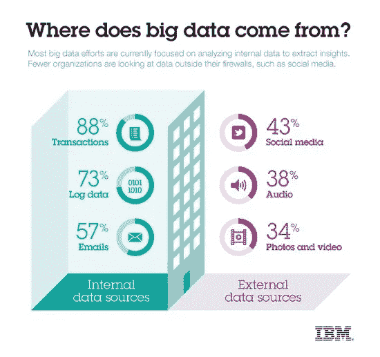
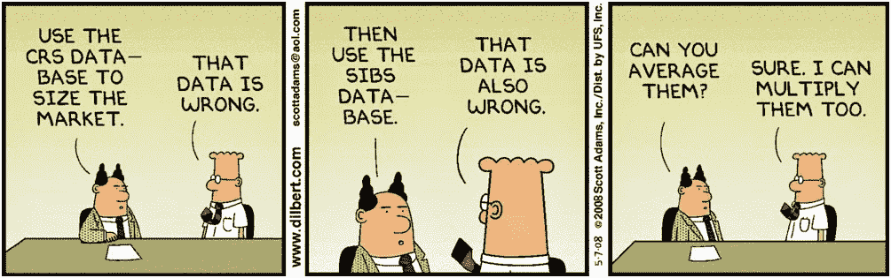

# 数据科学家的业务基础

> 原文：<https://medium.datadriveninvestor.com/business-basics-for-data-scientists-b758cf87d352?source=collection_archive---------4----------------------->

## 在创建模型之前，关于数据要问的 5 个问题

作为一名眼光敏锐的新数据科学家，你可能会有这样的误解，认为数学和编码技能就是一切。也许你整天都在学习新的机器学习模型，并在 hackerrank.com 磨砺你的 Python 技能。然而，鉴于我作为一名技术相关业务分析师的工作经验，我已经看到了什么真正增加了一个组织的价值。事实上，沟通、团队合作和好奇心往往比重构代码更有价值。

## 当软技能更擅长解决问题时

金融危机后，教育的钟摆从重视软技能转向只关注 STEM(科学、技术、工程和数学)的价值。最近中间人即应用服务的蓬勃发展造就了数千名新的千禧一代百万富翁，这进一步强化了这一想法。

 [## 成为数据科学家所需的 8 项技能|数据驱动型投资者

### 数字吓不倒你？没有什么比一张漂亮的 excel 表更令人满意的了？你会说几种语言…

www.datadriveninvestor.com](https://www.datadriveninvestor.com/2019/02/07/8-skills-you-need-to-become-a-data-scientist/) 

这就是为什么当彭博电视台播放一段关于 Redfin 如何不仅教非开发人员编程，而且教这些没有经验的开发人员如何解决困扰 Redfin 多年的问题时，我的好奇心被激起了。

The value-add was not in the creation of the software itself, but in understanding the business process of the real estate agents to create a product that fit in seamlessly with their current process

我很震惊这个故事没有得到更多的公众认可，因为它与我们经常听到的故事相反。像史蒂夫·乔布斯这样取得巨大成功的领导人所代表的硅谷的“建造它，他们就会到来”的傲慢是例外，而不是常态。这个故事也暗示了一个事实，客观上伟大的软件在错误的情况下可能是无用的——采用与否取决于你的目标用户当前的业务流程。对于非消费者软件来说更是如此。

> 这给了他们一套全新的想法，如果他们没有采取这种同理心的方法，他们永远不会得到这些想法。

## 业务流程对于软件工程师，就像数据管道对于数据科学家一样

所以你可能会想，这个故事和我这个数据科学家有什么关系呢？数据科学家不创造软件或应用程序。他们创造模型。因此，虽然软件工程师受到用户的支配，但数据科学家只需要说服高级管理层使用他们的模型。此外，谁比数据科学家更了解模型或底层数学？

“ ‘Data pipeline’ is a broader term that encompasses ETL as a subset. It refers to a system for moving data from one system to another. The data may or may not be transformed, and it may be processed in real time (or streaming) instead of batches.” — [Alooma](https://www.alooma.com/blog/what-is-a-data-pipeline)

采用软件就像采用模型一样。就像软件工程师需要理解业务流程来构建有效的软件一样，数据科学家需要理解数据管道来构建有效的模型。

虽然您的利益相关者可能是十几个或几百个内部员工，而不是数千或数百万用户(不考虑在整个社会大规模实施的模型)，但采用的障碍是相同的。你需要对自己诚实——你的模型真的回答了潜在的问题吗？你的模型可信吗？如果利益相关者不相信你的模型——要么数据输入错误，要么假设不正确——他们会拒绝使用它。

在这两种情况下，采用都可以用“买进”这个词来概括

## 作为数据科学家接受买入

我喜欢把一家公司或一项业务看作有两个组成部分:

1.  日常运营——赚钱。又名"生意"
2.  **变革管理**——保持相关性和竞争力。

数据科学家倾向于站在变革的一边，但决策总是由业务驱动的。为了获得认同，企业必须相信分析是有效的，包括任何模型假设和模型数据。这是他们的谋生之道，也是创造利润的源泉。

你猜怎么着？你的股东比你更了解业务！虽然数据科学家被定义为拥有“领域专业知识”，但你永远不会比那些每天以此为生的人拥有更多的领域专业知识。尤其是如果你是公司的新人！所以它总是回到沟通和共鸣上来——你有足够的谦逊来提出正确的问题并倾听吗？

# 要问的问题

正如我们在 Redfin 的案例中所看到的，失败和成功的区别在于问了正确的问题。(或者只是在第一时间提问！)根据我作为一名业务分析师的工作经验，以下是一些为你的分析提供信息的问题，包括原因:

## 1.这些数据从何而来？

这个问题的核心是数据是内部生成的还是从外部来源获得的。所有的公司*都应该*有他们的数据管道图，但是他们并不总是这样。有时候有必要问一下数据是从哪里来的。

Where does data come from? Image via [IBM Big Data and Analytics Lab](https://www.ibmbigdatahub.com/infographic/where-does-big-data-come)

为什么这个问题很重要？它告诉你是否可以期望数据符合公司的静态数据，以及如果你想获取额外的功能，该去哪里。

内部生成的数据通常使用相同的静态数据—客户 id、产品类别等。—便于数据源之间的链接。(警告一句——如果公司没有“黄金数据源”，不同的源系统之间仍然可能存在不同的处理方式。)我们可能没有想到这一点，但是公司名称或产品类别可能不同，这使得合并来自不同来源的数据变得很困难，甚至几乎不可能。或者，如果数据提供商使用一种定义，但您的组织以不同的方式定义它(非美国客户的定义，或小型企业的定义)，您可能无法使用所提供的数据。

此外，如果您希望数据通过数据管道传输，但却丢失了，这个问题还会告诉您到哪里去请求它。您是直接联系您的 IT 部门，还是需要直接联系数据提供商？外部数据提供商可能不愿意为一个客户改变他们现有的流程，而获取额外数据的困难会影响你以后的精力投入。

## 2.数据是如何生成的？

数据是如何生成的，可以告诉你很多关于数据创建的频率，数据与你的问题有多合适，是否需要补充。虽然 IT 最适合回答这个问题，但了解数据是如何生成的通常可以帮助您向业务部门提出更有针对性的问题。

例如，如果您想预测一家弹出式商店的销售额，您需要知道销售数据是否仅来自收银机。这可能会让您认识到，脱销但可以在线订购的产品(以及在弹出式商店的售货亭订购的产品)也应该包括在分析中，以免低估弹出式商店的价值。

或者，销售和退货数据如何？也许销售数据在生成后会被立即存储，但是处理退货的仓库每周只提供一次退货数据。意识到这一事实有助于告知你的模型对新产品的热情——也许你需要在获得所有回报数据后等待几周，然后才能得出任何结论。了解生成的数据会有所帮助。

## 3.有什么转型在进行吗？

人们很容易忘记，对于每一次“数据跳跃”——任何时候从一个地方提取数据并加载到另一个地方——都可能发生转换。事实上，始终假设数据管道图上的每个箭头本质上都是一个提取-转换-加载(ETL)过程。

为什么要问转换呢？虽然这些往往是数据完整性可能崩溃的地方，但大多数时候，IT 部门已经在 ETL 周围设置了一个严密的过程，以确保没有记录丢失。更微妙的转换过程——即使操作正确，并按照最初达成的协议进行——对数据科学家造成的破坏比丢失记录更大。

人们往往会忘记数据并不总是干净的，尤其是当它看起来很干净的时候。在 ETL 过程中，可能会使用业务逻辑填充缺失的值或者将值转换成不同的类别。即使在最初创建 ETL 过程时，业务最初同意转换逻辑，也可能是很久以前的事情了。随着时间的推移和业务的变化，组织往往会忘记 ETL 过程中的转换也需要更新以反映这些变化。

因此，如果可以的话，在分析中使用所有要素之前，尝试获取每个数据跃点发生的转换列表。并问商家“你认同这些转型吗”？你可能会惊讶地发现答案不再是肯定的了！

## 4.数据是否描述了我们试图测量的内容？

有时你认为对你的分析完美的数据是不完整的，或者不是你想要测量的。关于数据的文档通常很少，我们可以基于这些很少的信息对数据做出假设——例如，仅仅通过字段的名称。

但有时数据并不代表我们认为的那样。通常对“数据是如何生成的”这个问题的回答会告诉我们这个问题的答案。如果我们想要分析全球销售额，但是我们获得的销售数据只是美国的销售额，那么这些数据并没有描述我们想要测量的东西。或者，如果用户根据他们的 IP 地址被标记为“欧洲人”——这很容易改变——这是我们想要用来识别受 GDPR 影响的用户的准确指标吗？

也许企业同意，考虑到局限性，这是我们衡量指标的最佳方法。这没关系。但是如果他们认为这会使结果偏离可接受的范围，他们永远不会同意使用这些度量作为输入的模型。

## 5.数据是否正确？

这可能是最可怕的问题，因为答案可能不是肯定的。尽管这个问题看起来很天真，但事实并非如此！通常情况下，业务部门或前台办公室可能知道数据有问题，并在使用数据之前避免或转换数据，但组织的其他部门(如 it 和后台办公室)对此一无所知。如果你从来不问这个问题，你可能会进行一个完整的分析，然后把你的模型展示给利益相关者，结果你的工作被五个简单的词抵消了——“底层数据不可靠。”

“The underlying data isn’t reliable“ — it happens more often than you think

数据科学家创建的任何模型都取决于输入的数据。统计学家的老话“垃圾进垃圾出”也是数据科学家的战斗口号。没有准确的数据提供给模型不仅会妨碍认同，而且如果模型表现不佳，还会对数据科学家的声誉产生负面影响。

询问企业数据是否正确听起来像是潘多拉的盒子，但我们应该把它看作是知识的源泉。最好的情况是，企业可能会告诉您如何转换数据以使其更加准确，或者从哪里获得您需要的数据。即使在数据不正确的最坏情况下，您也可以获得关于如何改进创建数据的过程的信息。它可以保护你不创建一个无效的模型，因为你可以指出企业对数据缺乏信心。

## 在此之前，请提问

作为一名数据科学家，你能做的最糟糕的事情就是只看事物的表面价值，而不去质疑它们。如果你不质疑你收到的数据，你永远不会知道是否有问题，直到为时已晚！

如果你问一下，你会惊讶于你所学到的东西，以及你从业务中得到的支持！