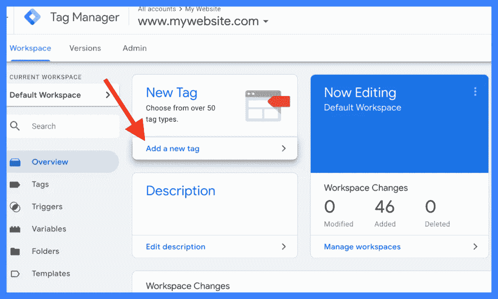
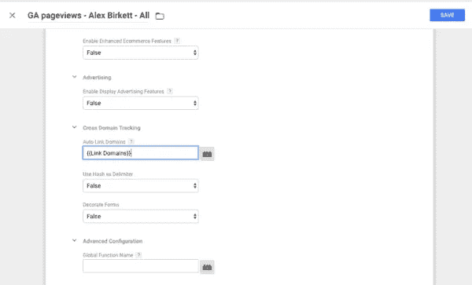
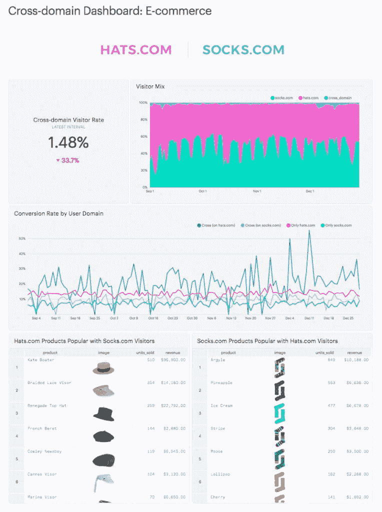
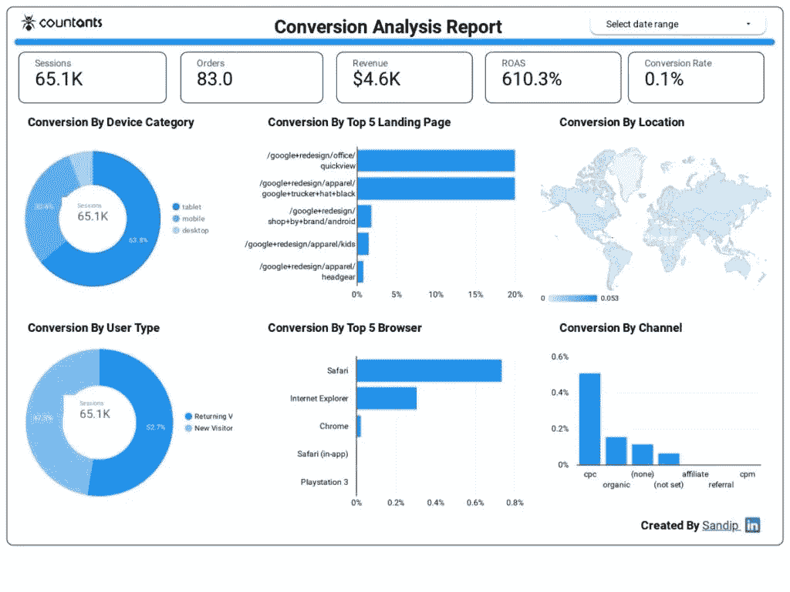
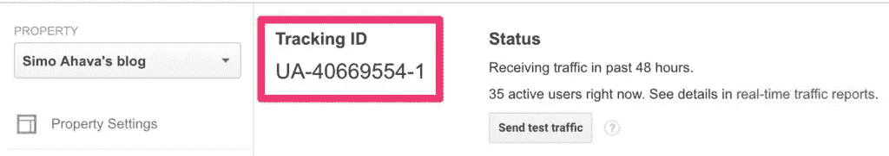
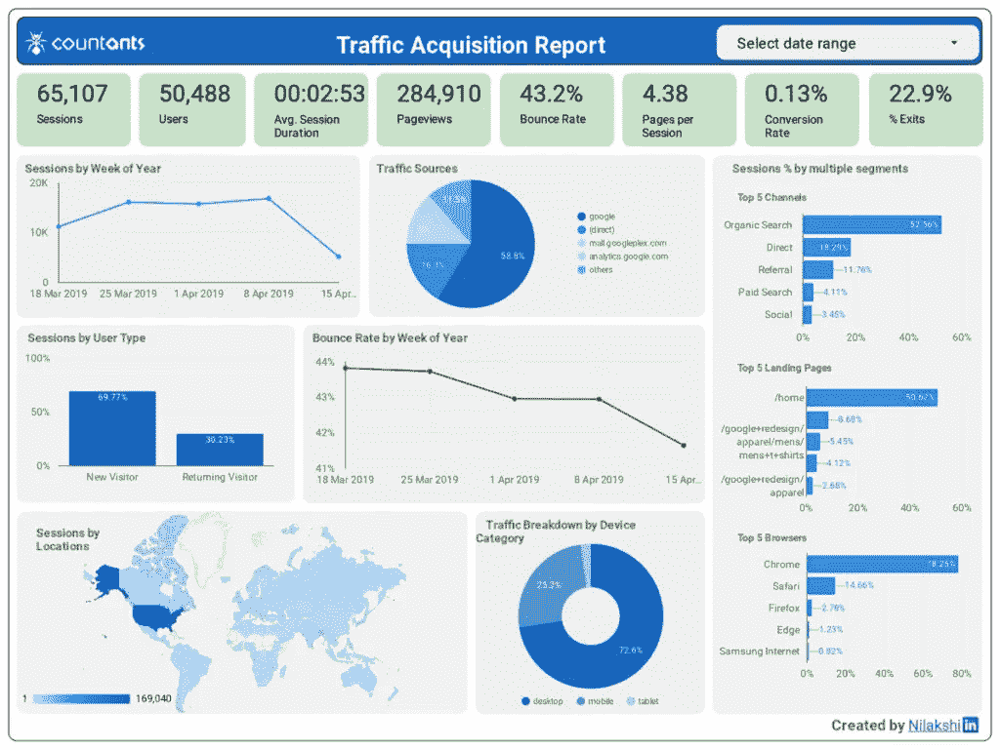

# 使用 Google Analytics 进行跨领域跟踪的商业优势

> 原文：<https://medium.datadriveninvestor.com/business-benefits-of-cross-domain-tracking-using-google-analytics-e59583fdf40f?source=collection_archive---------0----------------------->

作为一种有效的网络分析工具， [Google Analytics](https://analytics.google.com/analytics/web/) 主要用于跟踪来自单个业务领域的数据(例如，网站或社交网络页面)。商业企业也希望更深入地了解他们的客户行为和他们在多个领域的数字足迹。

由于这种业务需求，跨域跟踪已经成为使用 Google Analytics 跨多个域跟踪在线用户的可靠工具。

客户跨多个域交互的一个例子是，在线购物者使用电子商务商店(用于购物)和第三方网站(用于支付)。

另一个例子是跟踪谷歌商品商店的用户分析以及引入流量的推荐域。

 [## 创建折衷书架的程序员指南|数据驱动的投资者

### 每个开发者都应该有一个书架。他的内阁中可能的文本集合是无数的，但不是每一个集合…

www.datadriveninvestor.com](https://www.datadriveninvestor.com/2019/03/25/a-programmers-guide-to-creating-an-eclectic-bookshelf/) 

通过这篇文章，让我们来关注如何使用 Google Analytics 进行跨领域跟踪，以及跨领域分析仪表板如何使任何企业受益。

# 什么是跨域分析？

也称为站点链接，使用 Google Analytics 的跨域跟踪(或分析)被定义为链接两个(或更多网站)并通过 Google Analytics 报告整体查看它们的机制。每个商业网站都需要跨域跟踪作为其数据分析策略的一部分吗？答案是否定的。大多数商业和博客网站分析一次只跟踪一个网站域名就足够了。

跨域分析主要用于跨多个域的电子商务跟踪或转换跟踪等功能。例如(如前所述)，您有一个托管在<myshoppingstore.com>的电子商务商店和一个托管在<shoppingcart.com>的第三方购物车，那么执行增强的电子商务跟踪以进行跨域分析就变得势在必行。</shoppingcart.com></myshoppingstore.com>

接下来，我们将讨论为您的网站配置跨域分析有多简单(或复杂)。

如何设置跨域跟踪

为了方便起见，您可以使用 GTM(简称“[谷歌标签管理器](https://tagmanager.google.com/)”)轻松设置跨域跟踪。顾名思义，GTM 是谷歌的一个标签管理工具，你可以轻松地为网站或智能手机应用程序配置和部署与分析相关的标签

在使用 GTM 实现标签管理解决方案之前，首先让我们了解跨域跟踪设置中涉及的技术要点:

1.  对于它跟踪的每个网站，Google Analytics 都会检索一个以网站 cookies 形式存储的唯一客户端 ID。任何网站都无法检索或访问存储在其他网站上的客户端 ID 或 cookies。
2.  然而，在跨域跟踪的情况下，Google Analytics 必须能够跨其跟踪的多个域传输客户端 id。这是通过 Google Analytics 链接功能实现的，该功能将(源域的)客户端 ID 放在目的域可以访问的 URL 链接中。
3.  如果您使用的是 gtag.js，可以通过向指向目标域的 URL 添加 link 参数(带有客户端 ID 和其他元数据信息)来启用跨域跟踪。

以下是如何在 Google Analytics 中设置或检查跨域跟踪。为了更容易理解，让我们举一个例子，您正在为两个网站(“site1.com”和“site2.com”)实现跨域跟踪。

1.  登录到您的谷歌分析帐户，并配置一个单一的属性。对两个域使用相同的客户端 ID 和跟踪代码(“站点 1”和“站点 2”)。
2.  使用以下更改(以粗体突出显示)编辑您的跟踪代码(针对“站点 1”域)。

ga('create '，' UA-XXXXXXX-X '， **'auto '，{ ' allow link er ':true })；**
**ga(‘要求’，‘链接器’)；**
**ga('链接器:自动链接'，[' site 2 . com '])；**

1.  类似地，编辑跟踪代码(对于“site2”域)，进行相同的更改(如上所示)。唯一的区别是添加了“site1.com”而不是“site2.com”

完成这些步骤后，接下来您需要使用 Google Tag Manager 工具设置推荐排除:

1.  在 GTM 工具中创建新变量。
2.  选择新变量，并添加您希望链接的所有域。
3.  将新变量添加到 Google Analytics Pageview 标签中。

*   导航到“更多设置”下的“跨域跟踪”菜单选项
*   在“自动链接域”字段中添加新变量(如下所示)。

*   此外，将“allowLinker”框设置为“true”

1.  接下来，您需要配置推荐排除列表，以避免任何自我推荐。

*   导航到“跟踪信息”下的“推荐排除列表”部分
*   将适用的域(在我们的示例中为“site1.com”和“site2.com”)添加到排除列表中。

1.  最后，保存设置并测试设置以实现高效的跨域跟踪。

接下来，我们将了解什么是跨领域分析仪表板，以及它如何为任何业务带来好处

# 跨域分析仪表板的优势

基于从跨域跟踪收集的数据，跨域分析仪表板是一种虚拟化工具，可以帮助您了解您在多个域中的客户行为，并用于其他业务目标跟踪。

以下是为您的企业设计跨域分析仪表板的一些好处:

## 跟踪转换路径

跨多个领域的谷歌分析数据使任何企业都能在整个转化过程中跟踪用户。转化跟踪提供对重点领域的业务洞察，如:

*   客户最初是如何找到商业网站的。
*   无论进入的流量来自谷歌有机搜索结果页面(或通过付费搜索)，还是来自其他推荐网站或社交媒体页面。

## 建立一个跨网站的谷歌分析销售漏斗

使用跨域跟踪，您可以创建一个跨越多个网站的销售漏斗。例如，电子商务商店的销售漏斗可以包括产品详情页面、购物车页面、产品运输页面和支付页面(即使它们托管在不同的 web 域上)。

## 跟踪网站事件

除了域跟踪之外，Google Analytics 还可以用于跨网站域的事件跟踪。这使得任何企业都能够确定他们的用户在登陆他们的网站之前和之后在做什么。

# 跨域分析的关键参数

为了成功进行跨领域分析，您必须在 Google Analytics 中实现以下关键参数:

## 财产

用于收集网站数据的 Google Analytics 跟踪参数。为了跨域收集网站数据，两个域都必须具有 Google Analytics 属性。

## 跟踪 ID

每个 Google Analytics 属性都由一个唯一的 ID 标识，称为跟踪 ID(示例如下所示)

## 推荐排除域

引用排除列表是指分析引用流量时必须排除的所有 web 域。例如，来自源域的所有流量都被视为直接流量，因此该域必须包含在引用排除列表中。

## URL 链接器

这是 Google Analytics 参数，它将客户端 ID 存储在每个域的“_ga”浏览器 cookie 中。对于跨域跟踪，链接器参数(当通过链接器插件调用时)传递客户端 ID 和签名(有效期仅为 2 分钟)。下面显示了一个使用“_ga”参数的域示例。

## AllowLinker

目标域上的 Google Analytics tracker 需要认识到 URL 中“_ga”链接器参数的重要性。为此，它需要重置目标域上的客户端 ID 值，并使用链接器参数中包含的客户端 ID。这可以通过将目标站点中的“allowLinker”参数设置为“true”来实现

# 结论

通过本文，我们讨论了使用 Google Analytics 的跨域跟踪如何使企业能够跨多个域了解客户行为。作为一家数据分析和商业智能公司，Countants 为其全球客户提供了谷歌分析和[云分析](https://www.countants.com/services/cloud-analytics/?utm_medium=social&utm_source=Medium&utm_campaign=Traffic)的优势。

借助我们在业务仪表盘和[数据可视化方面的定制解决方案，](https://www.countants.com/services/cloud-visualization/?utm_medium=social&utm_source=Medium&utm_campaign=Traffic)我们可以实施跨领域分析仪表盘工具，以满足您的业务需求。如果您想利用跨域跟踪和分析的优势来促进业务增长，请立即联系我们。