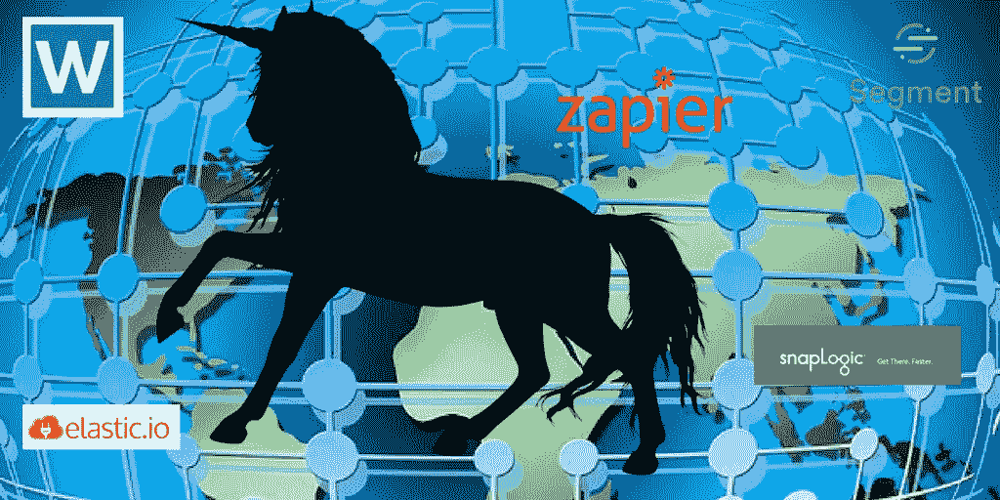
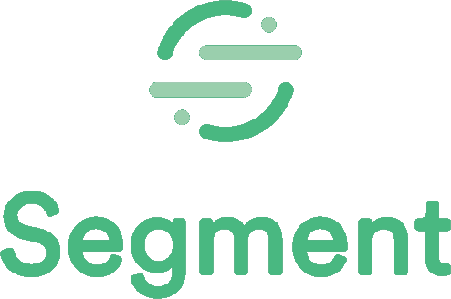
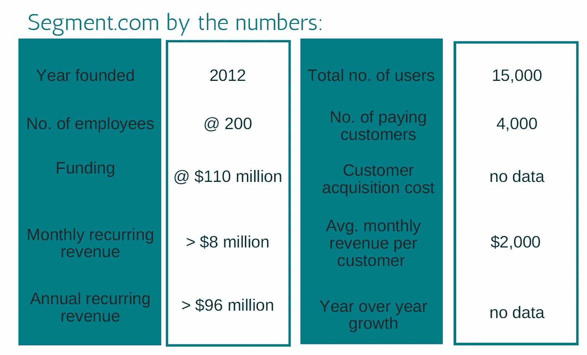
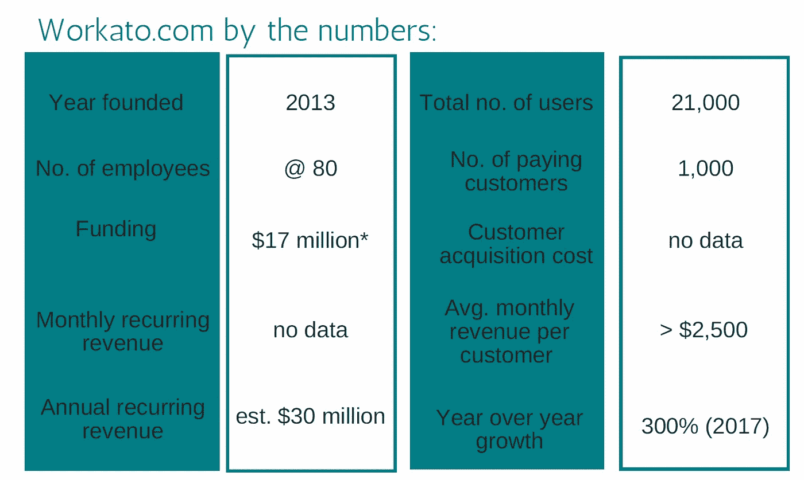
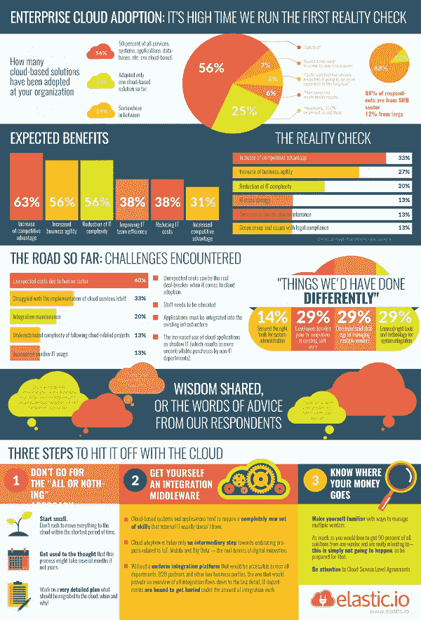
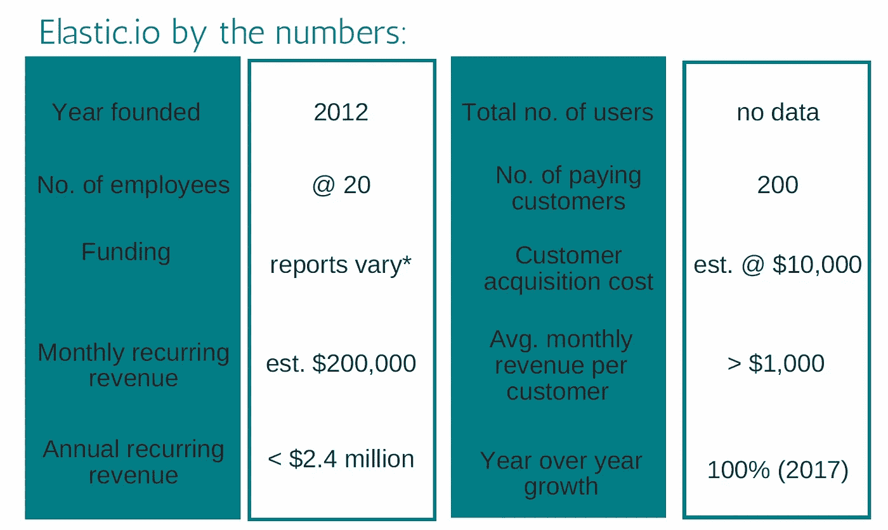
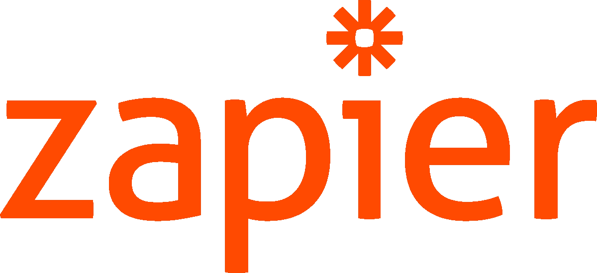
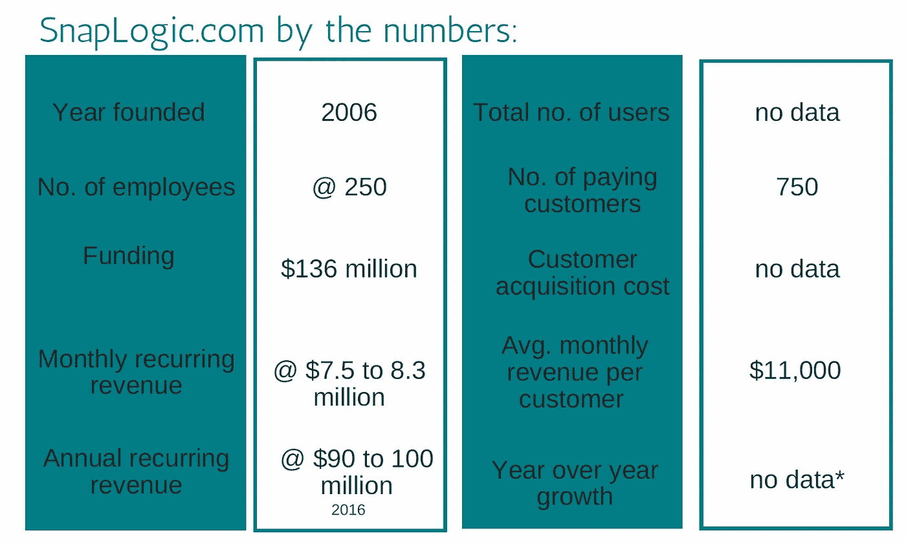

# 哪个业务集成服务初创公司将达到 10 亿美元的资本总额，并首先实现独角兽地位？

> 原文：<https://medium.datadriveninvestor.com/business-integration-services-startup-will-reach-1-billion-capitalization-and-achieve-unicorn-8e2554cd8496?source=collection_archive---------0----------------------->

业务集成服务领域的这五家初创公司中，哪一家有望首先达到 10 亿美元的估值？

当我向 GetLatka.com 的主人和《T2》的主持人内森·拉特卡询问一个具有挑战性的写作提示时，他向我提出了这个问题。

然后他给了我一份竞争者的名单:

●Segment.com

●Workato.com

● Elastic.io

●Zapier.com

●SnapLogic.com

好吧内森。

但是你知道我写的是*使用*应用的营销和商业，而不是投资，对吗？他当然知道，他是我最大的粉丝。呃……也许不是。我只是他电子邮件时事通讯的订阅者。

不过，他能回应我的请求，真是太好了。所以我决定接受挑战，写下我的答案。

[我们要明确的是，我与 GetLatka.com 没有任何关系，内森也没有以任何方式支持这篇文章。我只是喜欢一个好的挑战。]

**现在回到正题。**

当谈到内幕消息时，对于内森和其他人已经发现的这些公司，我没有多少可以补充的。我和这些创始人并不亲近。我不认识他们。我当然不能问他们对自己公司前景的个人看法。

我能在谈话中补充的是一个局外人的观点。

当这些公司决定上市时，我们大多数人都会有同样的局外人观点。虽然风险资本家和天使投资者现在决定这些公司的命运，但如果这些公司启动 IPO，个人投资者可能会选择其中一个。

当我决定从外部观察这些公司时，我发现了什么？

请继续阅读，寻找答案。

## 跳到您最喜欢的部分:

*   [业务集成服务公司是做什么的？](https://medium.com/p/8e2554cd8496#9723)
*   [Segment.com](https://medium.com/p/8e2554cd8496#4f0b)
*   [Workato.com](https://medium.com/p/8e2554cd8496#d0c1)
*   [Elastic.io](https://medium.com/p/8e2554cd8496#d0fe)
*   [Zapier.com](https://medium.com/p/8e2554cd8496#0027)
*   [SnapLogic.com](https://medium.com/p/8e2554cd8496#161e)
*   我认为哪个业务集成平台将获得 10 亿美元的 Cap 奖？

# 业务集成服务公司是做什么的？

这些公司实际上是做什么的？这是我开始调查时的第一个问题。

虽然每家公司都是业务应用集成生态系统的一部分，但它们彼此之间也略有不同。为了揭示这些差异，我听了内森的 *The Top* 播客，采访了每家公司的代表。在每次采访的开始，他都要求他的客人描述他们的商业模式以及它的特别之处——最重要的 UVP。

我要戴上我的营销帽子一会儿，指出这些差异，以及每个公司如何将它们传达给市场，是评估公司潜力的一个重要因素。

*成功的公司有清晰而有价值的差异化。*

你可以拥有这个星球上最好的 SaaS，但如果你不能告诉潜在客户为什么它是最适合他们的 SaaS，你就不会获得收入。因此，当你听一个采访或阅读一篇引用公司代表的文章时，要注意每个发言人如何完成介绍公司的任务。

他们有推销的电梯推销吗？

SaaS 的好处清楚了吗？

**如果公司的代言人不能代表，那么公司可能会遭遇沟通失败。**

现在回到我们的问题，这些公司到底是做什么的？

业务集成公司提供技术、软件和服务，帮助应用程序相互交流。他们让您的 Salesforce 应用程序连接到您的 MailChimp 应用程序。

其中一些可以让你将电子邮件列表与 Instagram 照片整合在一起。其他公司提供定制服务，为企业系统提供定制解决方案。

其中一些公司提供软件即服务(SaaS)，其他公司提供平台即服务(PaaS)。投资者和媒体通常将这些公司称为集成平台即服务(iPaaS)。

这些公司可能向开发团队、最终用户或两者出售他们的服务。同一家公司可能直接销售，也可能通过原始设备制造商或合作伙伴销售。嘿，现在是 2018 年，所以他们都采用了某种形式的基于云的系统来实现这一目标。

我们的五个竞争者是由企业家创建的，他们看到了为各种类型和规模的企业提供服务的专业应用的兴起，并意识到了整合的需要，他们为一个新兴的市场提供服务。他们乘着新的技术浪潮，为专业应用和云服务爆炸之前不存在的问题创造解决方案。

这些公司中的一家或多家达到 10 亿美元的可能性有多大？让我们考虑一下数据。

# 竞争者:业务整合 SaaS 和 PaaS 公司可以把它带到顶端

## 1.[Segment.com](https://segment.com/)——企业客户喜爱的客户数据平台。

为了了解 Segment.com，我听了内森在 *The Top* 对其首席执行官彼得·莱因哈特的采访。

Reinhardt 将 Segment foremost 描述为一个客户数据平台，他说:“我们帮助公司从他们拥有客户接触点的所有不同地方收集数据。”他进一步将该公司描述为一家在后台运行的公司，收集数据并在该公司使用的各种应用程序之间重新分配数据。

Segment 是追踪客户的强大工具，无论他们在哪里以及如何与公司互动。这个工具允许您团队的每个成员都可以访问特定客户的所有已知信息，所有信息都集中在一个地方。这听起来像一个营销人员的梦想应用程序。

Sources: [GetLatka.com](https://getlatka.com/companies/segment), company website and public statements, The Top podcast, [Craft.co](https://craft.co/segment)

## 关于 Segment.com，你还应该知道些什么？

该公司收入强劲，没有放缓的迹象。2017 年，[分部获得了 6400 万美元的 C 轮融资](https://segment.com/blog/segment-raises-64m/)，这要感谢 Y Combinator Continuity 和 GV 以及一些早期投资者的参与。

Segment 也积压了大量希望被整合的潜在应用程序合作伙伴。Segment 的一些竞争对手已经通过允许他们的合作伙伴访问开源代码来众包这个过程。细分市场选择让合作伙伴和用户等待，同时增加员工。该公司目前的大部分资本都花在了员工人数上，而不是营销上。

在他的 *The Top* 采访中，Segment 首席执行官 Peter Reinhart 指出，他们的营销成功很大程度上归功于他的工程团队制作的优秀内容。细分市场工程师擅长向潜在客户的技术人员传达细分市场的 UVP。

虽然作为一名作家，我不得不承认内容营销是目前的趋势，但我不得不怀疑这是否是最有效的人才利用方式。这种对工程师内容的依赖会影响公司的扩展能力吗？也许不是。

该公司也从口碑营销中受益匪浅，Reinhardt 告诉“成长黑客 AMA”的参与者。

**这家公司的发展定位如何？很好，我会说。**

对消费者数据的需求正在激增。企业希望了解每个客户的一切，以满足有针对性的营销和个性化关注的需求。细分市场挖掘了强大的需求，并承诺提供易于使用的解决方案。正如 Gordon Wintrob 在他的文章《细分市场如何改变 SaaS 市场》中所说的那样，细分市场处于有利地位，有机会向高端市场发展，并与它所服务的初创公司一起成长。

然而，由于“了解、喜欢、信任”现象的影响，我可能对细分市场持积极态度。我喜欢这家公司，因为我了解它做什么。当然，强劲的融资和收入数字也不会造成伤害。

在我看来，这家公司面临的最大挑战是其(相对而言)缺乏经验的高管团队，以及提升到更高水平的困难。

## 2.【Workato.com——一个(最终)用户友好的企业集成解决方案，有开源集成方案和守口如瓶的创始人。

Workato = "工作+自动"

明白了吗？

Workato 的首席执行官 Vijay Tella 是 2018 年 1 月顶级播客的[嘉宾。这位科技创业老手是一个精明的采访对象。](https://www.youtube.com/watch?v=Cg8q6RqpefM)

他分享了一些有用的情报，但让内森为之工作。

SaaS 公司是一家专注于企业的软件集成公司。

这家重量级企业没有 B2C 的成分，只是专注于服务那些决策者需要消费者方法的大公司。

Tella 将公司的目标和服务建立在他的观察之上，即随着企业空间转向消费化模式，连接业务应用程序所需的集成工具并不用户友好。

在与 TechCrunch 的 Ron Miller 的采访中，Tella 解释说 Workato 的基于云的集成服务是为在技术之外工作的商务人士设计的。毕竟，在购买企业级技术解决方案时，技术团队并不是唯一的利益相关者。通过反应灵敏的机器学习，Workato 的系统可以帮助用户随着时间的推移改善工作流程。

*Sources:* [*GetLatka.com*](https://getlatka.com/companies/segment)*, company website and public statements, The Top podcast,* [*Craft.co*](https://craft.co/segment)*,* [*Crunchbase.com*](https://www.crunchbase.com/organization/workato)

*** 报道不一。Crunchbase 报道称，2017 年 7 月的一轮融资筹集了 1000 万美元。在 2018 年接受 [The Top](https://www.youtube.com/watch?v=Cg8q6RqpefM) (@ 18 分钟标记)采访时，Tella 表示外部人士贡献了 700 万美元，内部人士贡献了另外 1000 万美元。

## 关于 Workato.com，你还应该知道些什么？

尽管 Tella 在接受采访时不愿透露具体数字，但他愿意承认，他预计 Workato 在未来两年内的收入将达到 5000 万美元。随着现有企业客户继续扩大对 Workato 集成解决方案的依赖，大部分收入可能会实现。这是 Workato 按连接或功能收费的定价模式的一个好处。产品(向上)自我销售。

此外，Workato 使用开源“配方”,允许合作伙伴创建自己的集成。这种集成的众包减轻了 Marketo 工程师的负担。(不过，我认为他们不会把那点空闲时间花在写作上。)这种开源特性也加快了合作伙伴采用 SaaS 的速度，这些合作伙伴随后成为推广者。

该公司的财务状况非常紧张，净收入为正。随着 Workato 的不断发展，它正在用销售和营销人员补充其工程师队伍。Workauto 已经接受了远程工作者的趋势。2018 年 1 月，当 Nathan 接受 Tella 采访时，Workato 的人才中有三分之二是远程工作者。

两个竞争者出局，还有三个。

细分市场有更多的收入和更大的客户群。但 Workato 拥有成熟的领导层、积极的净收入，并准备加大营销力度。前进！

## 3.[elastic . io](https://www.elastic.io/)——一家在 mVISE AG 获得 75%股份后不需要融资的公司。

Source: [https://www.elastic.io/resources/#webinar](https://www.elastic.io/resources/#webinar)

Elastic 的首席执行官 Renat Zubairov 在他的 [*The Top* 访谈](https://getlatka.com/companies/elasticio)中透露了该公司与其他 SaaS 商业整合组织不同的几个重要方面。最重要的是，Elastic 自我认同为 PaaS。Elastic 提供定制的集成服务，连接应用程序、云到云或地面，并自动化连接之间的数据流。这是一家为技术工程师服务的公司。

Elastic 区别于同行的另一点是，该公司专注于白色标签和企业客户，而不是直接销售。弹性合作伙伴通常将 PaaS 作为大型企业业务解决方案的一部分进行转售。Elastic 的商业模式与 Workauto 形成鲜明对比。Elastic 没有拉拢所有的利益相关者，而是让技术团队为它说话。

*Sources:* [*GetLatka.com*](https://getlatka.com/companies/segment)*, company website and public statements, The Top podcast,* [*Crunchbase.com*](https://www.crunchbase.com/organization/workato)

*在他的[顶级播客采访](https://getlatka.com/companies/elasticio)中，首席执行官 Renat Zubairov 表示总资金达到了七位数。根据 Crunchbase 的报道，mVISE 收购了 Elastic，收购金额未披露。

## 关于 Elastic.io 你还应该知道什么？

现在进入第五年(或第六年)，与第一个达到 10 亿美元的其他竞争者相比，Elastic 的收入仍然相当低。此外，该公司最近调整了重点，放弃了许多小客户，转而追求大客户。

由于经销商的参与，CAC 对 Elastic 来说很高。然而，在与 Nathan 的访谈中，Zubairov 表示，这些成本可在收购后的 6 至 12 个月内收回。

就整个市场而言，Zubairov 和其他人已经注意到，企业系统从地面到云的移动提供了一生一次的机会，类似于从大型机到 PC 的移动所提供的机会。有远见和技能抓住这个机会的公司正在收获回报。

我质疑一家成功依赖于一次性事件的公司的寿命，是不是太天真了？或者，采用云技术的过程会持续足够长的时间，让公司找到新的增长机会吗？公司的增长模式可以用下一个新技术复制吗？

Zubairov 撰写的这篇关于聊天机器人的文章可能会为 Elastic.io 下一步的计划提供一些线索。

此外，这家公司不是独立的。是[在 2017 年 5 月](https://salesphere.com/en/mvise-ag-takes-over-a-majority-of-elastic-io/)被 mVISE 收购为子公司。在不知道 mVISE 对公司有什么规划的情况下，我们真的无法知道 Elastic 的前景如何。牺牲了如此大的股权后，这家公司只能任由它的主人摆布。

Elastic 会先达到 10 亿美元的目标吗？

尽管 Elastic.io 可能会成为赢家，但我看不到这个沉睡的巨人及时醒来赢得速度赛的迹象。

## 4.Zapier.com-宣传和受欢迎，但在企业级回合中超出其重量级。

大学毕业一年后，韦德·福斯特与人合伙创办了 Zapier。他和他的联合创始人曾是自由职业者，也认识到了这种需求。因此，他们决定通过创建 Zapier 来满足这一需求，这是一个连接应用程序和应用程序的集成工具。

Zapier 是我们的竞争者列表中最简单的工具之一，这是其创始人有意选择的。SaaS 是为没有 IT 部门的用户设计和销售的。

使用 Zapier，小企业主可以点击一个按钮，所有他们喜欢的应用程序将开始相互兼容。Zapier 在非技术人群中非常受欢迎，其庞大的客户群大部分来自集客和有机营销。

Sources: [GetLatka.com](https://getlatka.com/companies/segment), company website and public statements, [Crunchbase](https://www.crunchbase.com/organization/snaplogic), The Top podcast, [Business Insider](http://www.businessinsider.com/zapier-35-million-annualized-run-rate-software-trends-report-2018-1)

*Zapier 的用户总数从 2017 年 5 月的 100 万增长到 2018 年 1 月的 200 万，翻了一番。

## 关于 Zapier.com，你还应该知道些什么？

凭借领先优势和庞大的客户群，Zapier 可能是我们竞争者中最知名的公司。但它真的是竞争者吗？客户的平均收入很低，与其他公司相比，它提供的 SaaS 有限。

所以也许 Zapier 的产品比竞争对手的少？它也更容易使用和集成，而且低廉的价格对小企业来说是一个强大的诱惑。

说到获奖，口碑营销可能是 Zapier 的秘密武器。像这篇在 *Fast Company* 、[写的关于我作为一个远程工作的外向者如何保持理智和高效的文章一样的公关努力](https://www.fastcompany.com/40551777/how-i-stay-sane-and-productive-as-an-extrovert-who-works-remotely)也没有坏处。

在接受 [Inside Intercom](https://blog.intercom.com/zapier-wade-foster/) 播客采访时，Foster 告诉 Intercom 的 Adam Risman，Zapier 团队是 100%远程的，这使得该公司可以从世界各地召集团队。

事实证明，Zapier 利用其 200 万用户电子邮件列表和 900 多个合作伙伴网络也是一种非常有效的增长手段。虽然该平台的一半集成是在开发的第一年内部构建的，但 Foster 表示，现在超过 90%的集成是由合作伙伴构建的。

Zapier 的品牌拥护者大军有助于保持公司在人们心目中的最高地位，并提供了最有价值的社会证明。

2017 年秋天，该公司正准备推出付费广告，以将其产品放在更多人的面前。大约在同一时间，该公司还推出了新产品，Zapier for Teams。亚当·卡普兰在[中报道了 *TechCrunch* 的发布，Zapier 让团队更容易在他们的应用工作流程](https://techcrunch.com/2017/10/31/zapier-makes-it-easier-for-teams-to-collaborate-on-their-app-workflows/) *中进行协作。*

**扎皮尔能达到临界质量吗？**

凭借每月 250 美元的价格，Zapier 的新团队产品有可能显著增加平台的每位客户收入。此外，随着新用户持续稳定地增加，收入也在上升，该公司显然在做正确的事情。

但是，当达到独角兽地位时，缓慢而稳定的公司会赢得胜利吗？

## 5.[SnapLogic.com](https://www.snaplogic.com/)——一个经验丰富的领导团队，不怕追求胜利。

SnapLogic 是其首席执行官 Gaurav Dhillon 一系列成功中的最新一个，gaur av Dhillon 在 2009 年成为其首席执行官之前，于 2006 年成为 SnapLogic 的支持者。与 Elastic 首席执行官 Renat Zubairov 一样，Dhillon 将从地面到云的过渡及其带来的机遇比作 20 年前从大型机到 PC 的过渡。

在这位行业资深人士的带领下，SnapLogic 是一款真正的企业级 iPaaS，具有持续的云组件。在 2017 年 5 月接受采访时，迪隆将该公司描述为“一些玩具的工业版”。(阅读:这不是没有扎皮尔。)

SnapLogic 的[客户群](https://www.snaplogic.com/customers)是大型跨国公司的名人录，包括麦肯锡、Adobe 和高通。经过几轮融资后，SnapLogic 的资本状况良好。Dhillon 告诉 Top 的 Nathan Latka，该公司明智地花钱，专注于客户的 ltv。在描述他关于客户获取成本的哲学时，Dhillon 明确表示，如果有钱可赚，公司将投入资本来赚钱。

Sources: [GetLatka.com](https://getlatka.com/companies/segment), company website and public statements, [Crunchbase](https://www.crunchbase.com/organization/snaplogic), The Top podcast

* snap logic 的[硅谷女性简介指出，该公司 2016 年的预订收入同比翻了一番。](https://www.womenofsiliconvalley.com/snaplogic)

## 关于 SnapLogic.com，你还应该知道些什么？

SnapLogic 的增长势头相当强劲，年收入翻了一番。但是，Dhillon 暗示，该公司正在消耗一些资本来实现这些利率。此外，虽然他没有提供确切的数字，但这家公司的年收入很有可能很快接近 1 亿美元。“我喜欢我们的趋势，”这是他在接受内森采访时给出的答案。

2018 年 3 月 22 日，该公司博客上的一篇文章[宣布，该公司每月处理超过 1 万亿份文档，这是一个强大的可扩展平台，能够满足现代企业的大容量、高速数据需求](https://www.snaplogic.com/press-releases/snaplogic-enterprise-integration-cloud-now-processing-one-trillion-documents-per-month)。

这家公司即将进行首次公开募股吗？

该公司自己的客户可能会对此有所帮助。它的许多客户财力雄厚，对公司的成功有既得利益。总的来说，该公司已经经历了由 14 位投资者支持的 9 轮融资，其中包括微软和 Capital One。

在营销方面，迪隆称其最好的广告是口口相传，称 SnapLogic 为“buzz 公司”。在新的营销环境中，这无疑是一个优势。

但是公司会飞得太高、太快吗？

并非 SnapLogic 的所有资本都投资于 CAC。2018 年 2 月，该公司宣布对其企业集成云平台进行更新。值得注意的是，这次更新包括了对 Amazon 的扩展支持。

SnapLogic 有很多大明星。他们会把它带到顶峰吗？

# 我认为哪个业务集成平台将获得 10 亿美元的 Cap 奖？

我读到过，对于初创公司来说，收入并不意味着什么。但不得不承认，看到那些大数字是很有说服力的。我们的一些低收入竞争者正在上演一些真正的营销魔术。然而，当你的 ARPU 很低，而今天的顾客又相当善变的时候，你必须获得(并保持)很多顾客。

我已经提到了我对细分市场的吸引力。随着数据成为十年来的宠儿，该公司服务于一个高速增长的市场。细分市场的领导层是否有能力和动力驾驭火箭，首先达到 10 亿美元？我不相信。

也许我的...呃哼...成熟的年龄让我倾向于经验，但我想我会选择 SnapLogic 来获胜。该公司已经在这一领域证明了自己，我认为有一位高管希望赢得这场官司。

当然，第一个到达并不一定是最好的。所以我不会低估任何其他竞争者的前景。收购要约或趋势的突然转变可能会改变每个人的命运。

如果我一年后再来看，这些公司还会存在吗？我想我只能等着看了。