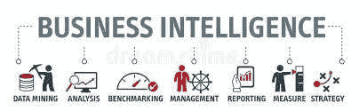
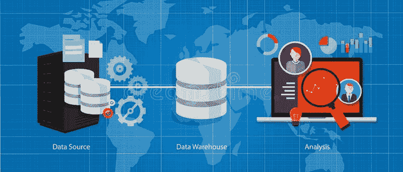
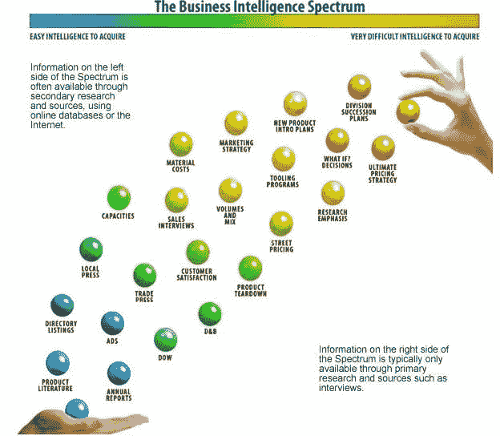

# 商业智能

> 原文：<https://medium.datadriveninvestor.com/business-intelligence-10dcfc863d3a?source=collection_archive---------4----------------------->

## 什么是商业智能？

十年来的最新趋势表明，在互联网、网站、博客、用户体验、视频、用户浏览数据、提供数字信息显著转变的技术、数字系统等出现之后，可用的数字数据和信息呈爆炸式增长。

这些趋势在数字系统和技术上产生了大量原始的非结构化、半结构化和结构化数据。结构化数据容易获得并且容易理解。然而，非结构化数据很复杂，不容易获得，也不容易解释。半结构化数据是结构化数据和非结构化数据的混合。现在问题来了，我们如何把这些大量的数据解释成有意义的东西？我们能使用各种工具、情报和分析来实现这一目标吗？这就是商业智能发挥作用的地方。

商业智能的出现使得将原始数据翻译成有意义的信息成为可能，企业和大公司使用这些信息来为他们的业务创造繁荣的未来。这在几年前是不可能的，但多亏了各种商业智能工具、系统和技术，使得对天文原始数据的这种解释成为可能。

 [## 为什么数据将改变投资管理|数据驱动的投资者

### 有人称之为“新石油”虽然它与黑金没有什么相似之处，但它的不断商品化…

www.datadriveninvestor.com](https://www.datadriveninvestor.com/2019/01/25/why-data-will-transform-investment-management/) 

在我们学习商业智能之前，还有一件事需要记住，那就是数据生命周期管理(DLCM)。这个循环的流程如下。

*   用户或系统创建数据
*   然后保存在存储库中
*   随后对其进行处理或修改
*   接下来，它被开采和收集
*   此外，它在提出之前进行了分析
*   最后，数据被清除。

在数据永远丢失之前，我们需要获得关于数据的情报信息，这就是我们使用商业智能的地方。

## 什么是商业智能？

商业智能是通过使用各种工具、技术、应用程序和实践，将原始数据识别、收集、集成、分析和呈现为有意义的商业信息的过程。

BI 用于更好的决策能力。商业智能是数据驱动决策支持系统(DSS)的关键词。因此，战略、战术、关键和至关重要的业务决策得以制定。

商业智能提供数据的历史、当前和预测分析。

下图以一种非常通用的形式描述了商业智能步骤

*Source: —* [*Dreamstime*](https://www.dreamstime.com/stock-illustration-business-intelligence-concept-doodle-chart-keywords-icons-image77711917)

数据被挖掘并保存在数据仓库中，然后从那里借助工具和系统；它被分析成有意义的商业信息。下图显示了原始数据是如何传输并转换成有用信息的。

Source: — [*Dreamstime*](https://www.dreamstime.com/stock-illustration-data-business-intelligence-warehouse-database-analysis-vector-image53731174)

## 商业智能的重要性

由于各种原因，商业智能对于商业和公司已经变得非常重要，例如:未来趋势预测、对公司的多个方面的可见性、制定 KPI、了解组织的关键风险指标、获得可观的收入、发布新产品和服务、了解客户行为的各个方面、提高运营效率、获得市场情报、获得竞争优势以及做出有意义的可操作决策。

## 商业情报的来源

1.  互联网

2.白皮书

3.博客

4.网站

5.文章

6.在线电子书

7.公司年度报告

8.顾客购物和浏览行为

9.公司数据库

10.数据仓库

11.数据挖掘技术和系统等

***下图提供了各种商业情报源和 BI 谱。***

Source: — [*Slideshare*](https://www.slideshare.net/ChrisOrtegaMBA/data-analytics-and-business-intelligence)

# BI 系统实施

以下是 BI 系统实施的简单步骤

步骤 1)确定数据源。

步骤 2)从各种来源挖掘数据。

步骤 3)然后，在数据仓库中收集数据。

步骤 4)现在，数据被清理并分为结构化、半结构化和非结构化数据。

步骤 5)使用各种工具分析数据，如切片和切块、数据透视表等。探索[更多工具](https://www.greatlearning.in/blog/best-business-intelligence-reporting-solutions-in-2019/)在 2020 年成为职业玩家。

步骤 6)报告、交流和展示有意义的信息。

步骤 7)制定关键的战术、战略和重要决策。

## 实践中的 BI 系统—示例

在实践中，商业智能可以应用于许多领域。为了让你理解，叙述了一些例子。

例 1: —用户体验、购物体验和偏好。

在这里，一家规模相当大的企业对客户公司 Amazon 在全球范围内提供在线购物，它可以利用 BI 来衡量其网站上的用户体验，然后是用户的购物偏好和客户的未来需求。

这是通过从网站上收集购物数据，并在 cookies 的帮助下浏览数据以及对他们的个人资料进行会话管理来实现的。这些收集到的数据将存储在数据库中，然后进行分析并提交给管理层，以便他们就新产品的推出、当前产品的销售趋势以及产品在用户、地理位置和成本方面的历史模式做出决策。

**示例 2: —员工加入、流失、保留和账户管理**

像 Infosys 或 Cognizant 这样的大公司有许多员工，他们可以使用 BI 来收集员工管理数据，以确定一个月内有多少员工离开公司？一个月有多少员工加入公司？板凳席上有多少员工？成功留住员工的参数是什么？最后，优化所有客户中的员工？

这些工作是通过从活动目录和人力资源数据库中收集信息，然后分析员工流动模式，然后提交给管理层，以便在人力资源管理方面采取适当的行动/决策。

**例 3: —顾客通过现金、信用卡或借记卡等的消费行为。**

拥有全球客户的大型银行可以使用 BI 来了解客户的消费模式、他们的信用卡或借记卡使用情况、他们的购物行为以及其他交易，以便为客户提供折扣，并从银行营销新产品和服务。

# BI 用户和类型

BI 用户有四种类型，详述如下:

1.  **数据科学家**

数据科学家将处理原始数据，然后分析数据，并向管理层提供有意义的信息。

**2。最高管理层**

最高管理层会从公司的利益出发，利用有用的信息并做出决策

**3。信息技术团队**

信息技术团队将维护所需的基础设施，如 BI 工具和软件、数据库、数据仓库和其他所需的支持。

**4。商业用户**

企业用户是最高管理层根据所获得的信息做出决策的受益者。他们可能为某个特定的客户或特定的组织工作。

# 商务智能的利与弊

优势第一。

1.  **洞察趋势**

BI 提供了对原始数据的历史、当前和预测分析的洞察力，否则这些分析将没有任何意义。因此，使用 BI，您可以监督服务、产品或消费者等的趋势。

**2。获得数据的可见性**

借助 BI，您可以了解未来的技术、系统和市场。举个例子:如果你想卖东西，你需要评估人们的要求、偏好，然后是地理偏好等等。你可以开创一个市场广阔的行业；也就是买家比较集中。

**3。获得竞争优势**

对 BI 来说，制定计划和做出决策已经变得轻而易举。比市场上的竞争对手更早发布新产品和新服务。

**4。实时管理大量数据**

在 BI 的帮助下，您可以实时分析环境的各个方面，如消费者、员工、消费者支出和交易等。

**5。变成可操作的决策**

BI 有助于将最终结果转化为可操作的选择，从而为组织创造更多收入和利润。

**6。提高流程效率**

有时，有必要深入了解已经制定好的流程来衡量有效性。这可以在 BI 的帮助下完成。因此，可以使用 BI 来改进方法和度量过程的成熟度。

**这就是你的缺点**

1.  **技术人力资源**

我们需要专门的资源来处理 BI，因为分析结构化、半结构化和非结构化的原始数据非常复杂。因此，BI 的任务并不简单，因为将数据仓库中的数据解析成立方体并对其进行分析似乎是劳动密集型和困难的。

**2。相同数据得出不同结论**

由于依赖于数据挖掘、数据仓库和数据分析，对相同的数据进行分析可能会得出不同的结论。因此，相同的数据可能提供不同的结果；此外，如上所述，它依赖于熟练的人力资源来解析数据。因此，在使用 BI 时，正确地判断和处理结果是至关重要的。

**3。隐私和安全**

维护和遵守公司、客户和地理位置的隐私规则和安全规则是非常必要的。否则，可能会出现数据安全违规，包括违规和攻击。

**4。数据规定**

对数据的使用、访问和处理的多种控制正在生效。

例如，欧盟的 GDPR 就是一个这样的法规，美国还有针对健康相关数据的 HIPAA。这些法规使得数据的使用、访问和处理更加严格。

**5。成本**

维护 BI 和处理 BI 的成本可能会高得令人望而却步。这是由于对熟练劳动力、高科技基础设施和工具的需求。

**6。数据的可用性**

要使用 BI，数据必须可以从不同的来源获得；但是，由于数据限制和成本，有些来源可能无法提供给组织。

**7。多个商务智能应用**

有时，为了得出结论，您需要各种 BI 应用程序，这可能是劳动密集型的、昂贵的和复杂的。

但是，考虑到 BI 的好处，它总是有可能解决创造双赢局面的缺点。

# 商业智能—八大趋势

1.  **无孔不入的毕**

在这种情况下，组织会让其大部分员工参与 BI 工作；这种趋势目前正在发生，并且在未来也将继续。

**2。自助 BI**

在未来，BI 可以由任何不具备数据科学家技能的非熟练人力资源来管理和工作。

**3。自动化**

根据 Gartner 的研究，到 2020 年，超过 40%的 BI 任务将实现自动化。因此，仍然需要熟练的数据科学家来自动化 BI 工作。

**4。毕**中的 NLQ

基于自然语言查询的系统正在不断发展，这使得数据科学家使用自然语言来查询海量数据和处理商业智能。

**5。AI in BI**

使用人工智能来自动化任务，并对复杂的数据结构进行处理，以获得有意义的结论，否则用人类智能是非常不可能的。

**6。移动中的毕**

许多商业智能供应商已经开始为移动用户提供商业智能应用。这是因为目前移动电话的普及以及未来移动电话的功率和使用的增加。

**7。数据治理**

在今天的情况下，维护数据源已经变得很有必要；这些数据源可能不可用，或者可能会过时。因此，在正确的时间从数据源获取正确的数据变得至关重要。

**8。叙事驱动的 BI**

BI 的未来之一是向高层管理人员叙述性地解释 BI 结果，使他们理解数据科学家试图解决的问题。

## 关键要点

商业智能在最近十年里越来越受欢迎，不仅大公司，中小公司也能从中获得巨大的利益。对数据科学家的需求已经翻了几番，而且在未来几年还会继续增长。因此，在今天的市场中，对正确的商业智能课程的需求变得越来越重要。

请联系[大学](https://www.greatlearning.in/pg-program-business-analytics-course)深入了解 BI。如果你对从商业分析师开始的 BI 职业机会持怀疑态度，那么我们建议你通过[阅读这篇博客](https://www.greatlearning.in/blog/business-analytics-and-business-intelligence-possible-career-paths-for-analytics-professionals/)来自学。