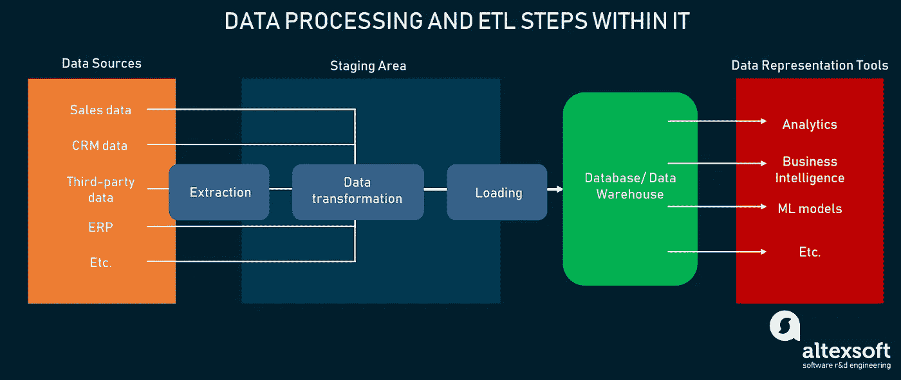
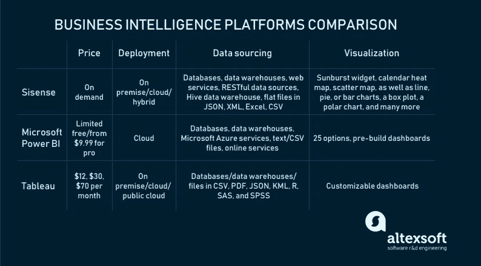
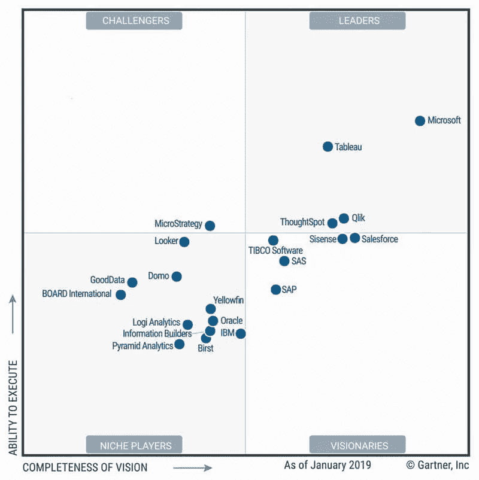
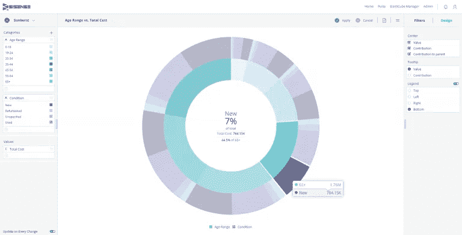
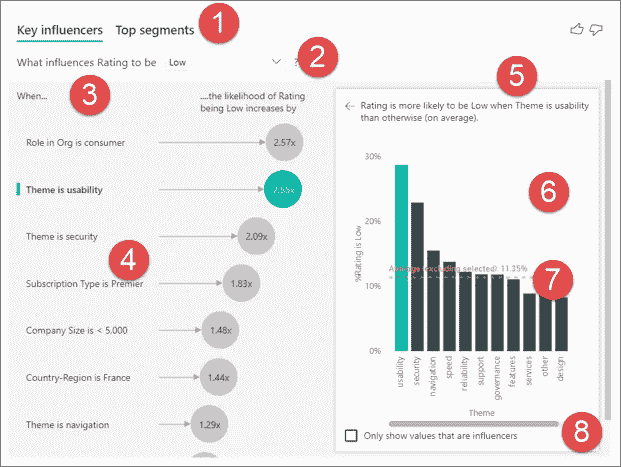
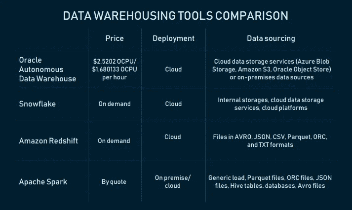
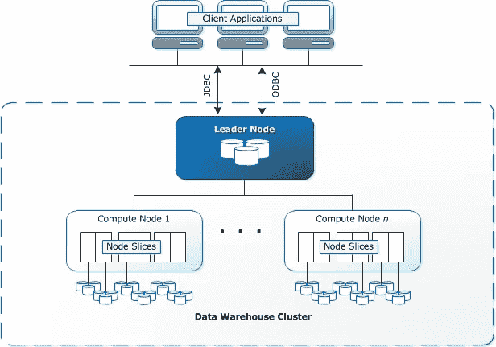
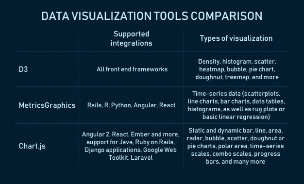
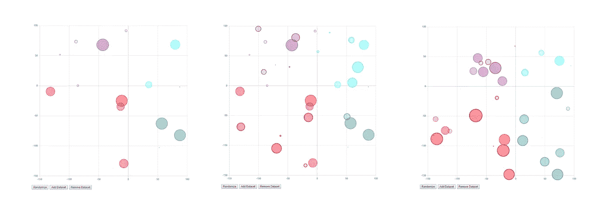

# 商业智能工具概述

> 原文：<https://medium.datadriveninvestor.com/business-intelligence-tools-overview-97b39282dc8f?source=collection_archive---------4----------------------->

想象你是一个快速时尚品牌的商业分析师。你的任务是了解为什么一个新的服装系列在某个地区的销售额在下降。你的工作是如何在实现预期利润基准的同时增加销售额。要考虑的一些变量包括顾客/买家角色、网站评论、社交媒体提及、不同商店位置的每日和每小时的销售数据、假日或其他事件、当地公司的预期付款日期，甚至每个商店的热图数据和当前货架图。。。

大量不同的数据以不同的格式存储。您必须从各种系统中提取数据，或者有时手动收集丢失的数据。然后将数据移动到单个存储，浏览并可视化数据，定义事件和数据点之间的相互联系。维度太多，要处理的数据太多。必须有一个数据管理策略，并且必须有一个 IT 基础设施来实现这个策略。这就是商业智能(BI)的意义所在。

 [## 为什么数据将改变投资管理|数据驱动的投资者

### 有人称之为“新石油”虽然它与黑金没有什么相似之处，但它的不断商品化…

www.datadriveninvestor.com](https://www.datadriveninvestor.com/2019/01/25/why-data-will-transform-investment-management/) 

# 什么是商业智能，需要什么工具来支持它？

**商业智能**是一个访问、收集、转换和分析数据以揭示有关公司绩效的知识的过程。然后利用这些知识来支持决策。

是的，过程。这意味着 BI 包含活动、工具和支持从原始形式到可读图形的数据转换的基础设施。这一过程可被视为一系列连续的阶段:

**第一阶段。提取数据** —连接到原始数据源并从中检索数据。数据源可能是内部的(数据库、CRM、ERP、CMS、Google Analytics 或 Excel 等工具)或外部的(来自供应商的订单确认、来自社交媒体网站的评论、公共数据集存储库等)。).

**第二阶段。转换数据** —将数据放在称为暂存区的临时存储中。根据指定的要求和标准格式化数据，使其适合于分析。

**第三阶段。加载数据** —将标准化数据移动到最终存储目的地—数据库、数据湖或数据仓库。如有必要，创建数据集市——数据仓库的子集，以存储来自每个公司单位、人力资源或销售部门的信息。

**第四阶段。可视化** —探索数据并以可视化方式呈现结果(通过用户界面)。

步骤 1、2 和 3 被合并成 ETL(提取、转换、加载)操作。 **ETL 过程**指定了如何从不同的源检索异构数据，将其转换成适合分析的形式，并加载到单个目的地。我们不会在这里花太多时间解释，因为我们已经在一篇关于一个 [ETL 开发者](https://www.altexsoft.com/blog/datascience/who-is-etl-developer-role-description-process-breakdown-responsibilities-and-skills/?utm_source=MediumCom&utm_medium=referral&utm_campaign=shares)的专门文章中解释过了。

*Flow of data and ETL*

之前我们写过实现商业智能策略的[步骤](https://www.altexsoft.com/blog/business/complete-guide-to-business-intelligence-and-analytics-strategy-steps-processes-and-tools/?utm_source=MediumCom&utm_medium=referral&utm_campaign=shares)，其中我们提到了数据集成工具和数据仓库。在本文中，我们将通过进一步的分析和可视化，深入探讨建立和维护系统间数据流所需的工具和服务。

我们将考虑两种情况:

**你需要完整的商务智能基础设施**。当您想从头开始建立一个 BI 流程时，可以考虑那些分析解决方案包括 ETL、数据仓库服务、数据分析和可视化模块的提供商。

**你的目标是构建定制 BI** 。你有技术人员在船上，可以开发一个定制的商业智能平台或其部分，但正在寻找积木。在这种情况下，我们建议寻找能够执行任何数据处理步骤的库、框架和工具。

# 端到端 BI 平台提供商

首先，让我们调查一些领先提供商提供的几个完整的解决方案。这些 BI 平台包括 ETL 和数据存储服务，以及可视化分析和报告。

*End-to-end BI platforms at a glance*

我们查看了 Gartner 2019 年分析和 BI 平台魔力象限(截至 2019 年 1 月)以及由 [G2 Crowd](https://www.g2.com/categories/business-intelligence) 发布的最佳 BI 软件列表。

*Magic Quadrant for Analytics and BI Platforms as of January 2019\. Picture source:* [*Stellar*](https://www.stellarconsulting.co.nz/technology/gartner-2019-magic-quadrant-analytics-and-bi/)

## Sisense:“发现有意义的商业见解不需要博士学位”

[Sisense](https://www.sisense.com/) 是一个业务分析平台，支持从数据建模和探索到仪表板构建的所有 BI 操作。它支持本地、云和混合部署场景。

**数据来源。【Sisense 有两种获取数据的方式:将数据导入解决方案的专有数据库 ElastiCube，或者直接连接到数据源。第二个选项称为实时连接，适用于频繁变化的数据。**

活动连接器允许从以下位置加载数据:

*   数据库(谷歌大查询，甲骨文，MySQL，PostgreSQL，SQL 服务器，MemSQL)
*   数据仓库(亚马逊红移和雪花)。

ElastiCube 连接器支持所有活动连接器源，并且:

*   网络服务(Google Analytics/AdWords、Salesforce、MailChimp、Splunk、Stripe、Dropbox 等。)
*   RESTful 数据源
*   蜂巢数据仓库
*   JSON、XML、Excel 或 CSV 格式的平面文件。

可以从 Sisense 社区获得其他非官方支持来源的连接器。支持的数据源和类型的完整列表在[文档](https://documentation.sisense.com/latest/managing-data/DataSources.htm#gsc.tab=0)中。

**数据转换**。该平台为数据转换提供了许多功能。例如，它分析属性在表格中的拼写，根据相似性对它们进行分组，以帮助用户协调属性名称。接口使数据模型的操作变得简单。

*Tutorial on how to add a custom SQL table in Sisense*

**数据可视化**。仪表板是在 web 上创建的。用户可以向仪表板添加小部件。报告选项的选择非常广泛:sunburst 小部件、日历热图、散点图，以及折线图、饼图或条形图、箱线图、极坐标图等等。

*Multi-dimensional pie chart — the Sunburst widget. Source:* [*Sisense*](https://documentation.sisense.com/latest/creating-dashboards/adding-widgets-to-dash/sunburst.htm#gsc.tab=0)

Sisense 有教程、视频和文档，对理解如何最大限度地使用该平台有很大帮助。要获得报价，请填写表格。

## Microsoft Power BI:适用于所有设备的用户友好平台

[Microsoft Power BI](https://powerbi.microsoft.com/en-us/) 是一款云自助式业务分析解决方案，用于在内部和云中进行可视化数据探索和分析。该平台允许在几乎所有主要操作系统的任何设备上进行实时数据监控，并具有针对任何变化打开移动警报的能力。

*Overview of Microsoft Power BI*

**数据采集**。Microsoft Power BI 有大量数据源连接器:

*   数据库(IBM Netezza，MySQL，Teradata，PostgreSQL 等。)
*   数据仓库(SAP Business Warehouse Server、雪花、Google BigQuery、Redshift 等。)
*   微软 Azure 服务
*   文本/CSV 文件，以及 JSON、PDF、XML、SharePoint 文件夹文件和文件夹
*   在线服务(Salesforce 对象/报表、谷歌分析、脸书、Zendesk、Stripe、GitHub、Twilio 等。).

在[文档](https://docs.microsoft.com/en-us/power-bi/desktop-data-sources)中可以找到更多数据源。

**数据转换。**该解决方案包括众多数据转换功能。其中一个叫做*合并文件*功能:用户可以合并特定文件夹中的所有文件，如果它们具有相同的文件类型和结构，例如，相同的列。一旦用户合并了文件，如果需要，他们可以应用附加的转换或提取步骤。

还有一个为列指定数据类别的功能，以便 Power BI 为它们生成精确的可视化。具有这种模糊数据的列可能包含地理缩写:CA 代表加利福尼亚和加拿大，或者 Georgia 代表美国的州和国家。

还提供了一些标准功能，如过滤字段行、将文本记录转换为数字记录、重命名列或表，或者将第一行设置为标题。

**数据可视化**。客户有多种可视化方式可供选择。该工具将上传自定义的视觉效果，将视觉效果作为一个站点固定到仪表板上，或者改变它们的样式，以查看哪一个在给定的数据下工作得更好。您可以在这里浏览可用可视化列表。该平台还拥有由 Salesforce 或 Google Analytics 等热门提供商预先构建的仪表盘和报告。

*The Key Influencers visual for pointing at factors that affect a given metric*. *Source:* [*Microsoft Power BI*](https://docs.microsoft.com/en-us/power-bi/visuals/power-bi-visualization-influencers)

用户可以在有限免费(1 GB 存储空间，每天更新一次)或专业版(10 GB 存储空间，每个用户每月 9.99 美元)之间进行选择。要开始使用该工具，只需注册即可。

## Tableau:只需拖放即可了解您的数据

[Tableau](https://www.tableau.com/) 在 Gartner 象限中名列前茅，它提供了几款产品来支持端到端的分析工作流。

*Tableau capabilities in short*

[Tableau 服务器](https://www.tableau.com/products/server#data-sources-2)就是这些解决方案之一。这是一个企业分析平台，可以部署在内部(Windows 或 Linux)、公共云中(AWS、Microsoft Azure 或 Google 云平台)，或者完全由提供商托管。

**数据采集**。该平台通过 web 数据连接器和 API 连接到云和本地数据源。

Tableau 服务器支持的数据源包括:

*   数据库(Google Cloud SQL，MarkLogic，PostgreSQL 等。)
*   数据仓库(Redshift，Google BigQuery，Cloudera Hadoop，SAP NetWeaver Business Warehouse 等。)
*   CSV、PDF、JSON、KML、R、SAS 和 SPSS 格式的文件。

查看[受支持数据源的完整列表](https://www.tableau.com/products/server#data-sources-2)以找到更多数据源。

**数据转换。**用户可以使用数据管理附加组件中的另一个工具 [Tableau Prep Conductor](https://www.tableau.com/products/prep#conductor) 来调度和管理数据流，将仪表板嵌入到其他应用程序中，并组合不同的数据集。此外，该解决方案允许用户管理仪表板扩展——允许用户通过 [Tableau 扩展 API](https://tableau.github.io/extensions-api) 直接在 Tableau 中与其他应用程序的数据进行交互的 web 应用程序。我们提到了一些管理数据的方法，但肯定还有更多。

**数据可视化。Tableau Server 因其易用性、可伸缩性和可定制的交互式仪表盘而备受赞誉。**

例如，它具有 Ask Data 特性，允许用户使用自然语言(通过键入)从任何已发布的数据源中提问，并以可视化的形式获得答案。[特性](https://www.tableau.com/products/new-features/ask-data/demo)基于算法“自动分析、索引和优化数据源”

Tableau 服务器包含在三个软件包[中](https://www.tableau.com/pricing/teams-orgs):Tableau Creator(70 美元)、Tableau Explorer(30 美元)和 Tableau Viewer(12 美元)。如果按年计费，价格是每个用户每月的费用。供应商提供免费试用。

当然，值得考虑排名最高的其他供应商。例如， [Qlik](https://www.qlik.com/us) ， [Looker](https://looker.com/) ， [ThoughtSpot](https://www.thoughtspot.com/) ，像 [SAS Business Analytics](https://www.sas.com/en_us/software/business-analytics.html) ，[sales force Einstein Analytics](https://www.salesforce.com/products/einstein-analytics/overview/)，或者[SAP 的 BI 解决方案](https://www.sap.com/products/analytics/business-intelligence-bi.html)。

接下来，我们将讨论第二个场景——使用专门的工具构建定制的 BI。先说数据整合。

# ETL 工具和库/包

为了做出在短期和长期都能对业务产生积极影响的决策，公司必须全面了解其运营数据。ETL 需要从不同的源收集数据并集成到一个共同的目的地，它有助于获得业务数据的完整视图。

*The main characteristics of ETL solutions*

现在让我们来看看可以用来构建 ETL 管道的工具，以便将数据拼图放在一起。 [Gartner 的数据集成工具魔力象限](https://www.gartner.com/doc/reprints?id=1-1OBCG8GI&ct=190725&st=sb)是我们在编制该列表时所依赖的来源之一。

[PowerCenter](https://www.informatica.com/products/data-integration/powercenter.html#fbid=UhHOq4EqruJ) 是由 [Informatica](https://www.informatica.com/#fbid=UhHOq4EqruJ) 提供的企业数据集成平台，提供数据管理、质量、安全和集成解决方案。元数据服务层是该平台的特色之一，它确保了更好的数据质量和一致性。例如，借助数据沿袭验证功能，分析师可以"[跟踪](https://www.informatica.com/downloads/INFA_meta_WP_6687_web.pdf)哪些数据在何时以及由谁更改，以支持数据验证和审计的业务和法规需求。"元数据可以与不同的应用程序交换。

该平台支持批量和实时数据处理。它通过[REST API](https://docs.informatica.com/integration-cloud/cloud-data-integration/current-version/rest-api-reference/data-integration-rest-api.html)连接内部和云数据源。

该工具支持多种数据源:

*   数据库(IBM DB2 UDB、甲骨文、微软 SQL Server、微软 Azure SQL 数据库、Netezza)
*   PDF、XML、JSON、Microsoft Office 等格式的文件
*   物联网设备数据。

Capterra 和 Gartner Peer Insights 上的评论者注意到该工具的易用性，即使对于没有软件工程经验的人也是如此。

PowerCenter 可以作为 SaaS 和 web 服务在云中使用。按需定价。据其中一位评论者称，许可证价格已经够贵了，但还是可以控制的。

## Talend Data Fabric:一套数据集成解决方案，支持多种数据源和格式

数据集成和数据完整性解决方案提供商 Talend 是 Gartner 魔力象限中的另一个领导者。该公司拥有 [Talend Data Fabric](https://www.talend.com/products/data-fabric/?type=why-talend) ，这是一套跨云或内部系统进行数据收集、治理、转换和共享的应用程序。人们可以购买整个套件或选择感兴趣的产品。让我们简要描述一下其中两种的功能。

[Stitch Data Loader](https://www.talend.com/products/data-loader/) 是一个基于云的 ETL 服务，它通过[导入 API](https://www.stitchdata.com/docs/integrations/import-api) 从各种来源提取数据，并将其复制(非实时)到最终目的地。

可以从中提取数据的来源包括:

*   数据库(MySQL、MongoDB、亚马逊 Oracle RDS 等。)
*   数据仓库和数据湖(亚马逊红移、雪花、亚马逊 S3、PostgreSQL、Azure SQL 数据仓库、Google BigQuery、Panoply 等。)
*   SaaS 应用和服务(Zendesk、Salesforce、Stripe、谷歌广告、脸书广告等。).

注册用户可以选择免费和标准计划。

[Talend Open Studio](https://www.talend.com/products/data-integration/data-integration-open-studio/) 是在开源 Apache 许可下发布的数据集成服务。它将图形设计环境与元数据驱动的方法相结合。用户可以在运行时环境中导出和执行独立作业。

Open Studio 连接到:

*   关系数据库(Oracle、Microsoft SQL server、Teradata 等。)
*   数据仓库(雪花、Azure SQL 数据仓库、SAP 业务仓库等。)
*   SaaS 应用程序(NetSuite、Marketo、Salesforce 等。)
*   应用和服务(SAP、Microsoft Dynamics、Sugar CRM、Dropbox 等。)
*   文本文件、物联网和机器数据。

Talend 产品的所有连接器均在此处发布[。](https://www.talend.com/connectors/)

该解决方案还支持 SMTP、FTP/SFTP 和 LDAP 协议。除了 REST，它还支持 [SOAP API](https://www.altexsoft.com/blog/engineering/what-is-soap-formats-protocols-message-structure-and-how-soap-is-different-from-rest/?utm_source=MediumCom&utm_medium=referral&utm_campaign=shares) 集成。

## Apache Spark:用 Python、Scala、Java、SQL 和 R 构建 ETL 管道

[Apache Spark](https://spark.apache.org) ，大规模数据处理的分析引擎，可以用来为 Python(用 [PySpark API](https://spark.apache.org/docs/2.2.1/api/python/pyspark.html) )、Java、SQL、Scala、R(用 [SparkR](https://spark.apache.org/docs/latest/sparkr.html) 包)中的应用构建 ETL 管道。Spark 允许在 parallels 中处理流数据(通过多个处理器或计算机同时处理)，这就是高可伸缩性和处理大量数据的速度。您可以处理多种格式的非结构化、半结构化和结构化数据，包括 JSON、CSV、TXT、Parquet、Avro、ORC。值得注意的是，用 Spark 构建 ETL 管道需要编码技能。

ETL 包包含函数、返回值的代码片段——从任何子例程返回的变量或其他信息。有许多可供选择。

## petl:用于 etl 的 Python 通用包

petl 是一个通用的包，用于提取、转换和加载 Python 中的数据表。该包提供了提取文本 XML、HTML、JSON、CSV 和更多类型文件的方法，构建表格，并将它们加载到选择的存储系统中。petl 开发人员注意到这个包非常适合处理异构数据和/或混合质量的数据。据开发人员称，petl 转换管道对系统内存的使用最少，如果速度不是优先考虑的问题，它可以扩展到数百万行。

列出构建 ETL 管道的所有工具超出了本文的范围。然而，让我们记住其中的一些:Apache Kafka、Apache Samza、Apache Storm、Pentaho Data Integration 和 Amazon Kinesis Firehose。

现在，让我们来谈谈存储解决方案，它将确保转换后的数据安全，并随时可供查询。这里有几个受欢迎的选择。

# 数据仓库工具

数据仓库是商业智能中报告、数据转换和分析的中央存储库。市场上有很多数据仓库服务和工具可以提供。让我们探索其中的一些。

*Data warehousing services compared*

## Oracle 自治数据仓库:可弹性伸缩的全自治数据库

[Oracle 自治数据仓库](https://www.oracle.com/database/adw-cloud.html)是基于 Oracle 数据库云服务器计算平台构建的云全自治存储系统。据官网介绍，它主要有三个特点:自驱动、自固定、自修复。自动驾驶意味着数据仓库不需要数据库管理员进行手动调优——它使用机器学习来实现这一点。通过自动数据备份和安全更新以及访问监控来实现自我保护。第三个特性是关于从停机中自动恢复。

DW 可以从云数据存储服务(Azure Blob Storage、亚马逊 S3、Oracle Object Store)或内部数据源加载文件。它可以弹性伸缩。加载的数据量可以缩放。

该工具兼容:

*   Oracle BI 工具(数据可视化桌面、Oracle 分析云)和云服务(Oracle 分析云、Oracle 集成云服务等。)
*   第三方 BI、数据集成和可视化工具。

它还支持通过 SQL*Net、JDBC 和 ODBC 的连接。

要开始使用这种数据仓库服务，请注册一个 Oracle 云帐户，并选择现收现付(每小时 2.5202 OCPU)订阅或每月灵活计划(每小时 1.680133 OCPU)。你可以使用[成本估算师](https://cloud.oracle.com/en_US/cost-estimator)。

## 雪花:云 SQL 数据仓库，用于存储和分析需要零管理的各种数据

[雪花](https://www.snowflake.com/product/)是作为 SaaS 提供的云 SQL 数据仓库。与 Oracle 的仓库一样，它消除了手动管理。供应商负责存储的维护、管理和调整。

*Snowflake architecture and capabilities*

客户可以使用批量数据(提供商称之为批量)和实时(连续)数据加载。后者是通过 Snowpipe 连续数据摄取服务实现的。DW 可以随时自动扩展和缩小。

仓库用户可以使用来自以下位置的数据:

*   内部(即雪花)阶段
*   云数据存储服务(谷歌云存储、亚马逊 S3 和微软 Azure Blob 存储)
*   云平台(亚马逊网络服务，微软 Azure)。

雪花可以用来处理结构化数据(CSV 和表格)和半结构化数据(JSON、Avro、Parquet 或 XML)。

由于雪花与 AWS 和微软 Azure 云平台兼容，其架构层(存储、计算和服务)完全部署在选定的平台上并进行管理。

可以通过基于 web 的用户界面、命令行客户端(即 SnowSQL)、本机连接器(即 Python)连接到雪花并对其进行管理，这些都可以用于开发连接到该数据仓库的应用程序。有第三方连接器将 ETL 工具(即 Informatica)和 BI 工具等应用程序连接到雪花。ODBC 和 JDBC 连接也是可用的，所以你可以连接其他应用程序，如 Tableau 与雪花。

雪花提供多种[定价选择](https://www.snowflake.com/pricing/)。雪花按需计划提供基于使用的定价。其他方法是选择预先购买的雪花容量选项，或根据地区、使用的云平台(AWS 或 Microsoft Azure)和功能数量来定价。

## Amazon Redshift:云中快速、可扩展的数据仓库

[亚马逊红移](https://aws.amazon.com/redshift/)是一种基于云的企业级完全托管数据仓库服务，可以从几百 GB 扩展到 1pb 或更多。“服务”意味着它用于创建和管理数据仓库。

这个[数据仓库](https://docs.aws.amazon.com/redshift/latest/mgmt/welcome.html)是计算资源*节点*的集合，它们被分组到一个*集群*。在具有两个或更多节点的集群中，额外的*领导节点*协调计算节点并处理外部通信。用户数据存储在节点上。每个集群运行一个 Amazon 红移引擎，并拥有一个或多个数据库。集群[可以通过](https://docs.aws.amazon.com/redshift/latest/mgmt/using-aws-sdk.html) Amazon 红移管理 API、AWS SDKs 和 AWS 命令行界面(AWS CLI)进行管理。

*Redshift’s architecture. Source:* [*AWS*](https://docs.aws.amazon.com/redshift/latest/dg/c_high_level_system_architecture.html)

仓储服务基于 PostgreSQL 关系数据库管理系统(RDBMS ),这使得它与其他 RDBMS 应用程序兼容。此外，它还集成了各种数据加载和 ETL 工具、BI 报告、分析和数据挖掘工具。亚马逊在这里发布了合作伙伴的完整名单。

该服务支持 AVRO、JSON、CSV、Parquet、ORC 和 TXT 格式文件的数据加载。

要查询 DW(从客户端应用程序)，您必须使用带有查询编辑器的 AWS 管理控制台或支持 JDBC 和 ODBC 的 SQL 客户端工具。

红移自动和定期备份数据到亚马逊 S3。

需要有一个 AWS 帐户才能开始使用 Amazon Redshift。用户有四个[价格选项](https://aws.amazon.com/redshift/pricing/)可供选择。按需定价是基于节点类型和数量的小时费率(0.25 美元起)；亚马逊红移频谱定价取决于扫描的字节数。并发扩展需要每天赚取一到三个免费信用，并为服务按每秒点播率付费。保留实例是对那些使用红移一年或三年的用户的折扣价格。有两个月的免费试用期。

另外，考虑一下 [SAP BW/4HANA](https://help.sap.com/viewer/107a6e8a38b74ede94c833ca3b7b6f51/1.0.7/en-US) (内部部署和云部署) [IBM Db2](https://www.ibm.com/analytics/data-warehouse) ，[谷歌 BigQuery](https://cloud.google.com/bigquery/) ， [Teradata 集成数据仓库](https://www.teradata.com/Products/Software/Integrated-Data-Warehouses)，[微软 Azure](https://azure.microsoft.com/en-us/) 。

# 数据可视化工具和库

好了，我们要讨论 BI 基础架构的最后一个组件—可视化。让我们考虑一些前端工程师可以用来应用有效视觉效果的库。

*Open source data visualization libraries*

## D3: JavaScript 框架无关库，用于创建巧妙的可视化

[D3](https://d3js.org/) 是一个开源的 JavaScript 库，用于使用 web 标准(HTML、SVG 和 CSS)可视化数据。它支持任何前端框架，无论是 Vue.js、React、Polymer、Angular 还是其他。

使用 D3，开发人员可以将任意数据绑定到文档对象模型(DOM ),并基于数据操作文档。DOM 是访问不断变化的内容、更新 HTML 文档的内容、结构和样式的标准。D3 网站说，*“例如，你可以用 D3 从一组数字中生成一个 HTML 表格。或者，使用相同的数据创建一个具有平滑过渡和交互的交互式 SVG 条形图。”*

当你想用动态视觉表现数据，并以独特的方式设计它们以脱颖而出时，D3 是一个好工具。甚至 D3 网站主页上的交互式可视化也暗示了这一点。

让我们来看看《卫报》的关于阿拉斯加土著社区现状的信息图，作为你可以用 D3 做什么的例子。当用户在地图上跨区域导航并点击屏幕左侧的“人口”、“阿拉斯加土著”和“收入”按钮时，视觉会发生变化。

*The infographic reacts to clicks and mouse moves. Try it yourself. Source:* [*The Guardian*](https://www.theguardian.com/environment/interactive/2013/may/14/alaska-villages-frontline-global-warming)

D3 是许多库(如 Chart.js、eCharts、C3 或 Plotly)的基线，这一事实证明这个库在开发人员中非常受欢迎和信任。

## Chart.js:一个小型库，包含大量响应图表和集成选项

[Chart.js](https://www.chartjs.org/) 是一个开源(在麻省理工学院许可下发布)库，拥有完全响应的图表。

该库提供了大量的示例，以各种方式探索和说明数据点。例如，静态和动态条形图、折线图、面积图、雷达图、气泡图、散点图、圆环图或饼图(是的，我们是故意把它们放在一起的)。该集合还包括极区、时间序列刻度、用于查看两个或更多数据集的组合刻度、进度条等等。可以用插件修改图表的外观和行为。

例如，当用户添加、删除数据集或随机化数据点时，交互式气泡图会有直观的反应:

*A bubble chart on Chart.js responds to user actions*

图表中的[集成列表](https://github.com/chartjs/awesome#integrations)包括 Angular 2、React、Ember 和其他 JavaScript 前端开发框架。Chart.js 可视化还可以集成到 Java、Ruby on Rails、Django 应用程序中，与 Google Web Toolkit 和 Laravel PHP 框架一起使用。

Sisense 的莉雅·弗莱什曼说:这个图表使用了本地 API，使得学习曲线和库本身一样小。只有 11kb 的压缩文件，而如今，在 web 开发中，大小很重要。没有比小型图书馆更好的了。”

## MetricsGraphics:为时序数据提供标准视觉效果的 JavaScript 库

[MetricsGraphics](https://metricsgraphicsjs.org/) 是一个基于 D3 的库，用于可视化时间序列数据。用户可以从交互式图形中进行选择，如散点图、折线图、条形图、数据表、直方图以及地毯图或基本线性回归。虽然视觉效果的数量不多，但每一个都有很多变化。

该库的创建者指出 MetricsGraphics 是数据源不可知的:*“虽然它提供了许多方便的功能和选项，允许图形更好地处理像缺失的观察值这样的事情，但它不关心数据来自哪里。”它的开发者指出的其他特征是简单的 API 和通过提供基于引导的布局模板来容易地构造叙述的能力。*

其他值得一试的库还有:优步的 [Recharts](http://recharts.org/en-US/) (React)、 [React-Vis](https://uber.github.io/react-vis/) 、VX (React+D3)、 [three.js](https://threejs.org/) 、矢量图形的 [Raphael](http://raphaeljs.com/) 等等。选择可能取决于您最常用的数据类型、前端开发人员的专业知识或个人偏好。

# 如何选择合适的 BI 工具？

回到这两个场景…如果您正处于迈向完整 BI 基础架构的起点，并且没有开发团队，请探索端到端解决方案。评估清单可能包括:

**支持的部署场景。**根据您对数据安全性、预算和可能的扩展需求的要求，定义您需要的部署类型，并检查解决方案是否支持它。如果你不确定，就去找咨询师。

**可扩展性。**增加存储、计算负载和用户数量容易吗？大多数提供商在产品描述中强调这一功能。您可以随时联系供应商了解更多详情。

**易用性。**从清晰、结构合理的文档和发布的视频教程到直观的数据管理界面，一个好的工具必须具备这一切。

**支持的数据源数量和类型。**判断该工具是否允许批量、实时或接近实时地获取数据。包括哪些连接选项(API 或/和 web 连接器)？

**数据转换。**解决方案总是包含数据转换的基本特性。独特的功能可以为你带来改变。

**可视化。**您可能希望了解支持的视觉效果的数量和类型，定制它们的能力，以及将仪表板嵌入其他应用程序的能力。如果你处理的是流数据，了解一个平台是否支持实时数据可视化。

**定价选项和条款。**评估定价方案及其条件(固定、现收现付或折扣)。有测试工具的试验吗？

**客户支持。**看什么渠道(邮件、电话等。)您可以使用联系客户支持专家，了解他们的工作时间。审查网站通常包括关于服务和支持质量的问题。

如果你计划使用[开源组件](https://www.altexsoft.com/blog/engineering/5-best-practices-for-managing-open-source-components/?utm_source=MediumCom&utm_medium=referral&utm_campaign=shares)构建一个定制的 BI 工具或者它的一些模块，当然，除了查看我们上面提到的端到端解决方案的需求之外，还要查看他们的社区有多大，他们有多少 GitHub starts。

*原载于 AltexSoft tech 博客“* [*商业智能工具概述*](https://www.altexsoft.com/blog/best-bi-tools-comparison/?utm_source=MediumCom&utm_medium=referral&utm_campaign=shares)