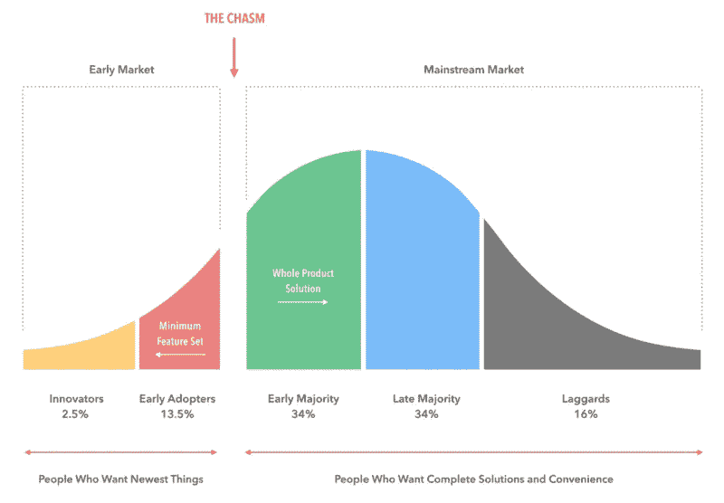

# 商业模式折旧及其重要性

> 原文：<https://medium.datadriveninvestor.com/business-model-depreciation-and-why-it-matters-c5a6d0d519bd?source=collection_archive---------14----------------------->

商业模式是一个公司或行业赚钱和传递价值的方式。最简单的，你可以说“我们为 Y 做 X，得到 Z 的报酬”。大多数时候，我们认为商业模式是稳定和永久的。退一步讲，商业模式就出现了。成长、稳定并最终衰退和消失。一个商业模式，因为它产生收入，可以被认为是一种资产，所以这篇文章是所有关于商业模式折旧的想法，以及为什么它是重要的。

许多经理都熟悉折旧的概念。当一项资产被购买时，它就出现在资产负债表上。经过一段时间，它的价值会随着使用和年龄的增长而降低。企业需要将折旧成本计入其账目，还需要及时计划资产的重置。

商业模式折旧将这一概念从会计领域扩展到商业战略。

# 商业模式不会永远持续下去

没有商业模式是永恒的。在某些情况下，他们似乎是这样做的，但这往往是由于我们的经验目光短浅。例如，现代电力供应商业模式从 20 世纪 20 年代就已经存在了。

在 20 世纪 20 年代，有许多小型发电站向周围地区输送电力。随着蒸汽涡轮机的发明，运行更大的发电站变得更经济，英国的法规支持国家电网的建立，这允许发电站是大型的，与它们所服务的城镇分开，并通过高压传输电缆连接。这种商业模式已经存在了 100 多年，现在没有人能记得有什么不同。

 [## 跑步摆脱疯狂:锻炼如何提高你的生产力——数据驱动型投资者

### 没有比锻炼更好的方式来开始一天的工作了。我试着一周至少做四天，在…

www.datadriveninvestor.com](https://www.datadriveninvestor.com/2018/10/23/running-to-get-rid-of-the-crazy-how-working-out-increases-your-productivity/) 

现实却大相径庭。例如，IBM 已经经历了六种不同的商业模式。最初的 IBM 制造打孔时钟，然后转移到制表机，然后是计算机，然后是大型机，然后是个人电脑，商业系统和目前的人工智能。在几乎所有这些案例中，推动公司发展并创造利润的商业模式仅仅持续了几十年。

在其他行业，例如在数字营销的某些领域，盈利的商业模式只能存在几个月。它们因新技术的出现而产生，然后随着技术的发展或失败而关闭。在我住的地方，三合会有一个非常有利可图的商业模式，就是盗版 CD，直到人们不再一起购买 CD。

因此，商业模式贬值是一种捕捉商业模式中这种短暂性的尝试。它表示，在某种程度上，公司或行业利润的主要来源将不复存在。因此，为了生存，该行业将不得不彻底改造自己。

# 出租车:马拉的和汽油驱动的

如果我们回顾 20 世纪初，伦敦的大多数出租车都是马车式出租车，通常被称为哈克尼或汉瑟姆马车。这些都是由经销商以类似于现代汽车经销商的方式提供的。

其中一家经销商(Mann 和 Overton)看到了汽车是未来的发展方向，于是委托一家汽车公司(Austin)制造一款内燃机汽车进行销售。在这样做的过程中，曼恩和奥弗顿破坏了马车供应的商业模式，代之以一种由内燃机驱动的新模式，这种模式又持续了 100 年，直到优步和乘车共享公司打破了这种商业模式，迫使曼恩和奥弗顿破产。

如果你有一个成功的商业模式，无论是在一个集中的行业还是高度分散的行业，你未来的收入都是有限的。

传统上，企业认为 R&D 和新产品设计是解决这个问题的方法。我的一个叔公被法国政府授予荣誉军团勋章，以表彰他对真空管发展的贡献。不到十年后，他一生的工作被放弃了，因为真空管被过渡和计算机时代所取代。

R&D 和产品开发通常是渐进式的。它是由经理们提供的，他们的职责是从市场中获取最大的价值，因为它现在存在，并将在未来几年内演变。

除了一些大公司的未来学家之外，它现在还考虑了行业或部门在未来几年如何快速转型。

# 破产:先慢后快

在我们深入研究商业模式折旧之前，最后一点。海明威在《太阳照常升起》中有一句名言:

> *“你是怎么破产的？”
> 两种方式。渐渐地，然后突然。”*
> 
> *欧内斯特·海明威，《太阳照常升起》*

商业模式似乎经常运行很长时间，然后突然失效

这幅图展示了用户对一个新想法的采纳，改编自杰弗里·摩尔的《跨越鸿沟》。许多商业模式都有类似的演变。他们从少数早期采用者开始慢慢发展。然后他们实现了大众市场的采用和高度集中。然后会有一个很长的平台期。这可能会慢慢增长，因为经理们发现这是为了让它更有效。由于受到外力的冲击，它可能会慢慢缩小。

当它走到生命的尽头时，我们看到它慢慢变弱，直到它非常迅速地瓦解。潜在的经济或价值逻辑不再存在，就像一根被踩烂的木头，没有任何东西可以支撑它。

举几个例子。众所周知，柯达看到了胶片时代即将结束，却无能为力，被摧毁了。诺基亚和黑莓的商业模式在几年内被苹果和 T2【谷歌创造的[新智能手机商业模式摧毁了。Friendster 和 Yahoo 看到他们的商业模式在几个月内分别被](https://www.denis-oakley.com/what-is-the-apple-business-model/)[脸书的](https://www.denis-oakley.com/what-is-the-facebook-business-model/)时间线和谷歌基于 adwords 的商业模式摧毁。

# 当旧的商业模式被取代时会发生什么？

当我们从历史的角度看待事物时，现有商业模式的价值似乎是完全不相关的。在大多数情况下，现有的商业模式为其所有者创造了财富，而且还在继续创造财富。对于主要行业来说，资产负债表上有大量资产。

然而，当一个新的商业模式取代旧的模式时，一个重要的新价值被释放出来，而且通常如此重要，以至于以前的模式显得渺小和过时。当我们回顾 1930 年代的电话技术或 1900 年的电力生产时，这些行业的价值在今天看来是微不足道的。[商业模式创新的力量令人难以置信。既创造新产业，又摧毁或削弱旧产业。现在谁会认为钢铁工业曾经创造了世界上最大的财富之一？](https://www.denis-oakley.com/lean-canvas/)

# 管理者应该怎么做？

管理层面临的一个关键问题是，他们通常能够看到新的业务模式。他们有知识和资源去开发它。他们不采取行动。为什么不呢？

简而言之，采用新的商业模式将要求他们积极参与破坏现有市场和收入流。这对现代 MBA 管理者来说是一种诅咒，他们一直被教导要增加收入和削减成本。[管理者专注于提高业务模式绩效](https://www.denis-oakley.com/using-the-business-model-canvas-to-assessing-corporate-performance/)而不是改变它

向股东证明这一点也是一个巨大的挑战。管理者是否在逃避对股东的受托责任？他们这样做会被起诉吗？

这就是为什么给商业模式赋予价值然后贬低它是如此重要的根本原因。

# 衡量商业模式

使用上面的模型，我们可以说:

*   这种商业模式每年产生 100 亿美元的利润
*   在平台期，它的预期寿命是 25 年
*   当它失败时，它将在 5 年内失败，如果我们什么都不做，我们将看到收入崩溃 90%。
*   取代它的商业模式将在 15 年后产生 500 亿美元/年的利润

因此，如果我们对现有的商业模式进行折旧，并获得折旧后的利润份额，那么企业就处于从一种商业模式过渡到另一种商业模式的有利地位。

# 商业模式折旧的问题

我的专长不是财务和会计。然而，我很确定这不太适合 GAAP 和财务报表

然而，作为股东代理人的经理人似乎有明确的责任，确保股东价值不会因为现有商业模式的破产，或者因为担心损害现有收入而未能过渡到新模式而遭到破坏。

使用业务模型折旧这样的方法意味着企业可以保留一些价值，为这种变化做准备。

这又是一个大问题，因为这是我们如何通过多个商业模式周期来经营公司的一个范式转变。

如果你有大量现金，你应该投资吗？但是，如果你投资的企业没有强化而不是颠覆现有的模式，你的境况也不会更好

保持一个商业模式在财务上是低效的，这意味着你把从现有商业模式中获得的钱留在了桌子上

# 商业模式折旧的价值

这些都是挑战。然而，清楚地了解现有商业模式已经持续了多长时间，你预计它将持续多久，以及考虑为新旧模式的过渡提供资金，这一点非常重要