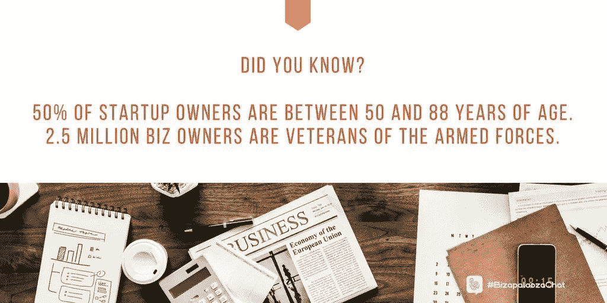
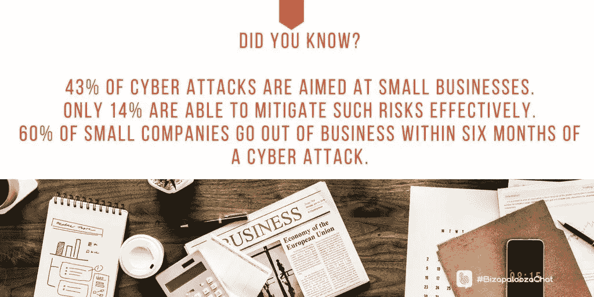

# 濒临破产的企业:一定要复苏

> 原文：<https://medium.datadriveninvestor.com/business-on-the-brink-do-resuscitate-198227966268?source=collection_archive---------4----------------------->

商业斗争。对于企业家的生命周期来说，这很正常。反弹也是成功商业模式的一部分。不是所有人都这样。

[沃尔特·l·琼斯三世](https://twitter.com/osapproach)曾与许多公司合作，帮助他们重振旗鼓。他是管理咨询顾问公司 [SEQ 顾问集团](https://www.seqadvisorygroup.com/about-seq/)的负责人。

他与经验丰富的企业家伊万娜·泰勒和伊瓦·伊尼亚托维奇谈论企业的兴衰。泰勒拥有 DIYMarketers 公司，这是一家“致力于帮助小企业主摆脱困境”的公司 Ignjatovic 是一名营销、战略、领导力和商业顾问。

当支出永远超过收入，并且趋势为负时，你知道你的企业有麻烦了。

“向供应商付款的问题——现金流不畅——失去客户或利润率下降都是不好的迹象，”琼斯说。"查看最近几个月的情况，找出趋势."

他给出了这些快速效率指标:

*   利息、税项、折旧和摊销前的收益，即 EBITDA
*   员工流失和流动
*   客户保留

琼斯说:“这三个指标会告诉你是否出了问题。”。

Ignjatovic 直奔底线。

“一切都是为了赚钱，”她说。“当你的企业不赚钱时，它就是在失败。”

创业公司的所有者范围很广。50%的人年龄在 50 到 88 岁之间，250 万企业主是退伍军人。

对苦苦挣扎的企业的建议有很多来源。

“小企业管理局是商业信息的重要资源，”琼斯说。“然而，聘请顾问的好处是，他们的工作是找到问题的根源，并帮助确定最佳行动方案。

“不幸的是，一些咨询公司缺乏投资回报和有限的附加值，让许多公司感到不快，”他说。

不要忽视内部资源。

“寻求建议和帮助至关重要，”泰勒说。“你可以从向你的员工或团队汇报开始。

“太多的企业主认为顾问是一件坏事，”她说。“比一个员工便宜，而且你得到了一个超级专家。”

Ignjatovic 也喜欢从内部开始。

“我们应该总是从内部开始解决问题，”她说。“我们甚至可以雇佣公正的人。这取决于手头的问题。”

# 员工视角

找到根本问题的最快方法之一是让外部专家来看看你的业务。这些人接受过寻找目标的训练，他们与游戏没有利害关系。你会得到最好的无偏见的意见。

“与你的员工交谈，包括管理层和一线员工，”琼斯说。“与你的客户谈论你的业务关系。最好的选择是抓住脉搏，在问题开始前就阻止它。

“再说一遍，我坚持我的三个指标，”他说。“他们会告诉你谁、什么和如何做。”

泰勒和 Ignjatovic 都认为获得工人的洞察力是关键。

“你的人通常知道主要问题，”Ignjatovic 说。“从那里开始，深入挖掘。”

当一家企业几乎无法生存时，总有地方可以寻求改善。

“寻找可以立即削减开支的领域，”琼斯说。“一切都应该摆在桌面上——供应品、员工等。我告诉客户，要抓住“核心战略问题”，而不仅仅是症状。

“纸张和耗材对公司来说是巨大的浪费，”他说。“我曾经告诉一位办公室经理，让所有员工默认使用黑白双面打印，并在会前会后提供所有会议文件，以防止打印。”

# 使失事

不要继续不需要的操作。

“通常，我们承担费用，甚至在我们不再使用它们的时候也继续支付，”泰勒说。

简化程序也有帮助。

“在你的过程中寻找效率的提高，”Ignjatovic 说。“通过让团队成员分享他们如何做事和采用最佳流程来创建最佳实践。”

在艰难时期，员工也需要激励。

“不要让他们蒙在鼓里，”琼斯说。“让他们了解情况。向他们保证一切都在进行中。如果可能的话，让他们参与寻找省钱方法的过程。”

交流有助于控制小道消息。

“开诚布公的沟通会让事情变得更好。它会让谣言远离，”Ignjatovic 说。

“这从来都不容易，因为人们只能承受这么多，但让人们参与整个过程可以提高效率，”她说。"这为如何解决这个问题带来了新的想法。"

当一个企业陷入困境时，人们失去了激情，这需要恢复。

“这就像一场婚姻。你会找到再次坠入爱河的方法，”琼斯说。“咨询师的好处是，当你专注于你所爱的人或公司时，可以倾听并理解问题所在，比如婚姻顾问。”

他写了一份[白皮书](https://www.seqadvisorygroup.com/powered-up/publications/nonprofit-forservice-model/),阐述了每家企业——报纸上专门针对非营利组织——需要的三样东西:目的、计划和热情。

“一个企业实际上就是一个家庭，”泰勒说。“不管你怎么看，这都是关系管理的问题。

“激励团队是领导者的职责，”她说。"代表企业的愿景和目标."

无论如何，保持理智。

“你做的每件事都必须有一个目标，尤其是在艰难时期，”Ignjatovic 说。"树立个人榜样和期望."

放弃生意可能是有益的。减少你的损失。你达到了收益递减点，实质上是把钱倒进了一个洞里。

“当成本超过潜在收益时，可能是时候关门大吉了，”琼斯说。“行业在变，口味在变，如果你跟不上，可能就太晚了。”

强行解决这个问题可能会造成双重损害。

“不管有多困难，我们必须承认我们已经尝试了所有的方法——但都失败了，”Ignjatovic 说。

沟通和生意失败是有联系的。

琼斯说:“每个领导人都应该有参谋顾问。”“如果你没有与他们进行公开坦诚的讨论，你可能会错过关键信息。”

当企业家承担过多时，衰败就开始了。

“通常，企业主试图保护员工，自己解决问题，”泰勒说。

交流的失败加剧了这种情况。

Ignjatovic 说:“脱节和缺乏沟通几乎总是企业失败的原因。”“不公开——或者因此而隐瞒——会造成信息的空白。

她说:“听到好企业倒闭，总是令人难过。”。"有时候，能做的事情就这么多了。"

企业主的健康和幸福是企业成功的重要因素。这就是为什么为了以防万一，最好有关键员工或买卖协议。

“婚姻、孩子、财务、健康——所有这些都是你成功经营企业的一部分，”琼斯说。最佳提示:意识到你什么时候会让自己筋疲力尽。

他说:“我是基于从上一任雇主的错误中吸取的教训创办了自己的公司。”“一共有*批*。记住，这是工作-生活*平衡*，而不是工作-生活*分离*

# 心理游戏

从很多方面来说，创业是一种精神锻炼。

“最大的个人挑战是心态，”泰勒说。“这是你告诉自己什么是可能的故事。”

Ignjatovic 补充说，企业主并不是不可战胜的。

“任何事情——从健康问题到工作饱和——我们都比我们想承认的更脆弱，”她说

这三位企业家为扭转一个挣扎中的企业提供了实用的建议。

“做一个客观的评估和基准，你在哪里，你应该在哪里，”泰勒说。

灵活性对 Ignjatovic 来说很重要。

“这取决于一个问题，”她说。“确定客户想要什么。想办法分析趋势。”

琼斯告诫企业主要控制预期。

他说:“在生意中，你喜欢做的 30%对你度过你不喜欢做的 70%很重要。”。“你不会热爱一切。

“让咨询师的生活变得更容易:开诚布公地承认问题，”他说。“这就是你雇佣他们的原因。”

琼斯正在 Udemy 上开发一个“盒子里的顾问”课程。它将教会公司如何在早期发现问题，以及如何解决问题。

如需更多信息，请发电子邮件至 inquiries@seqadvisorygroup.com 的[。](mailto:inquiries@seqadvisorygroup.com)

**关于作者**

吉姆·卡扎曼是拉戈金融服务公司的经理，曾在空军和联邦政府的公共事务部门工作。你可以在[推特](https://twitter.com/JKatzaman)、[脸书](https://www.facebook.com/jim.katzaman)和 [LinkedIn](https://www.linkedin.com/in/jim-katzaman-33641b21/) 上和他联系。