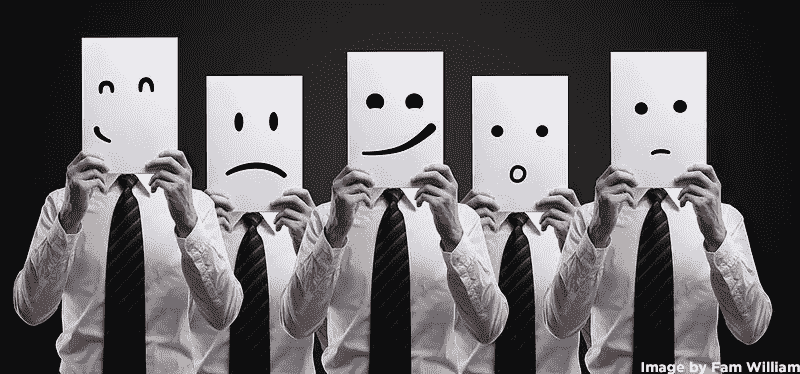
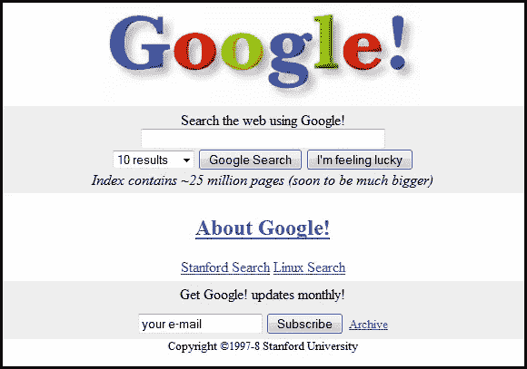
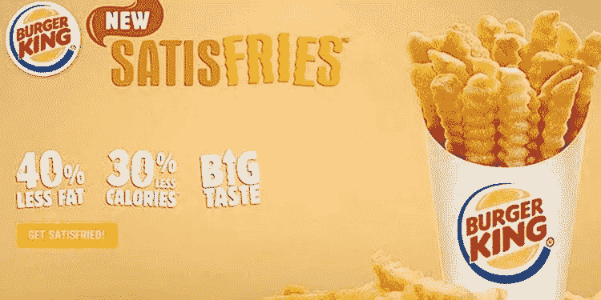
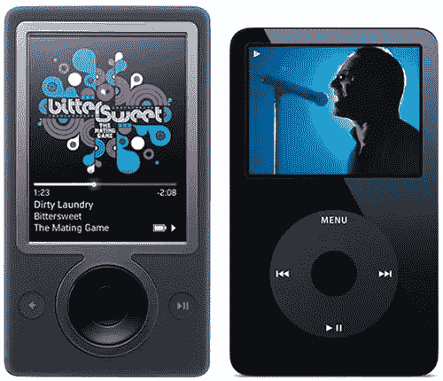

# 通过理解情感获得商业成功

> 原文：<https://medium.datadriveninvestor.com/business-success-by-understanding-emotions-a6d8e03ccda5?source=collection_archive---------4----------------------->

我通常写未来，但我想今天我会写一些永恒的东西。我们将把未来的成功建立在与昨天和今天相同的原则之上。我认为指出这一点是有用的。

任何事业的成功都取决于我们对情感的理解。原因是:无论谁买了你卖的东西，都是出于情感原因。情感驱动人类行动。良好的情绪会让你的客户更接近销售，而负面情绪会促使你的客户购买你的产品，以减轻他们的不适。我们的整个生活是一系列的行为，这些行为引导着喜悦、愤怒、恐惧、悲伤、厌恶、惊讶、信任和期待的情绪。每一笔交易的完成都是因为产品通过这 8 种基本情绪中的一种或几种刺激了购买者。都是生化宝宝！

例如，一个正在寻找电影 CD 的顾客就是一个收藏家。他或她可能是一个大风扇，并希望检查 CD，小册子，看到它在他或她的收藏在家里。这个人想要触摸产品，去感受它。这位顾客购物不是为了一个人看电影。他或她表现出的情绪与只是想看一部好电影的顾客不同。后一种顾客可以观看同一部电影，而且价格便宜。尽管如此，因为许多电影爱好者对放在家里的实体 CD 有一种情感上的依恋，所以 CD 市场意义重大。纸质书是另一个例子。尽管在平板电脑、笔记本电脑甚至智能手机上下载文件和阅读电子书更便宜、更实用，但纸质书如今仍然很受欢迎。底线是，人们购买大多数东西并不是因为这合乎理性，他们购买是因为他们觉得有必要。为了取得成功，我们必须了解客户决策背后的情感，并调整我们的设计和生产，以创造客户想要的东西。

最成功的企业都深深触动了目标客户的情感。你可能已经听说过成功的关键因素之一是拥有一个独特的产品，为尽可能多的人解决一个大问题。成为第一个解决这个问题并被你的目标受众注意到的人是很重要的。如果你正在解决一个严重的问题，他们会想用你的产品来解决他们的问题。驱动这些客户的不是对产品的渴望，而是摆脱挫败感的情感冲动。大多数顾客只是想要解脱。我们买食物是因为吃饭是愉快的，我们希望家里有食物以避免沮丧。在我们感到挫折解除后，我们经常向朋友和家人吹牛。分享克服这些挑战的故事让我们感觉很好。“我买了这个小工具，它解决了我的问题。它也能解决你的！”如今，人们在社交媒体上向他们的网络朋友表达他们的喜悦和沮丧——卖家的即时营销！

这些对大多数人来说都不陌生。有趣的是，在产品上市并提供给消费者之前会发生什么。设计师、开发人员、程序员、制作人都掺杂了自己的情感，试图推出目标人群想要的产品。那些设计决策专注于解决主要问题的公司会大获全胜。

我记得很多年前我第一次用谷歌的搜索引擎的时候。谷歌一开始并没有投放广告，但许多搜索引擎在它之前就开始了竞争。在谷歌出现之前，所有的搜索引擎都很慢，效率很低。他们也有混乱的界面。当谷歌推出干净的界面、卓越的搜索算法和速度时，我和我的极客朋友们觉得我们发现了圣杯！好多了。我们开始使用谷歌搜索，从未回头。这是谷歌成功的开始。该公司看到了竞争，理解了缓慢、低效、混乱的搜索引擎带来的挫败感，并解决了这个问题。大多数搜索引擎已经不存在了。

如果该公司没有继续考虑客户的情绪，它可能很快就会失败。雅虎搜索(幸存下来并进行自我重组)和必应等模仿者试图效仿谷歌搜索的成功来超越它，但谷歌坚持创新，坚持自己的使命。谷歌每年都专注于让他们的算法变得越来越好，总是领先竞争对手一步。毕竟消费者只忠于自己的感觉。如果另一个搜索引擎变得更快更准确，那么谷歌搜索将成为历史。谷歌一直致力于其在搜索领域的优势，并将继续这样做。谷歌团队没有给谷歌搜索添加额外的功能。它完成了我们客户希望它完成的工作。

在取得初步成功的几年后，谷歌在没有让客户失望的情况下赚到了钱，保持了他们优秀的免费服务。想要向网络冲浪者宣传其服务的企业支付谷歌的费用。他们仍然是。正是商家期望支付额外的费用来创造销售，所以商家也是快乐的顾客。这是一个美好的商业模式，每个人都是赢家。

然而，大多数时候，企业家并没有做对。我们很容易被自己的情感需求所迷惑。在开发新产品时，一个团队可能会忘记销售的主要原则:减轻沮丧或给情绪激动的客户带来快乐。作为创意人员，我们将自己的愿望和想法投射到产品中，认为“如果我喜欢这个，我们的客户也会喜欢”。真是一派胡言！

我们不是在为自己制造产品。观众的情感驱动力往往和我们不一样。就像 CD 的例子一样，当我们试图卖给 CD 收藏者时，我们可能是电影的飘带。完全不同的动机。显然，如果我们失去重点，做我们觉得对我们口味的事情，产品肯定会在市场上失败。如果你听说过产品设计中的“功能蔓延”，你就会明白我的意思。对于那些不知道的人来说，“功能蔓延”是指团队中的每个人给产品添加他们认为会使产品变得伟大的酷功能。过了一段时间，产品的主要功能和解决方案就消失在客户从未要求的一大堆功能中了。作为企业家和投资者，我们需要关注回报。简单的思维，单一的焦点。如果我们在市场上解决了问题，就像谷歌搜索那样，我们就没事了。

另一个错误思维的例子是 2013 年汉堡王试图为更注重健康的人群提供更健康的食物。智囊团的成果是“Satisfries”，一种低卡路里的薯条。问题是，汉堡王的食品人员忘记了他们的顾客从来不想要更健康的薯条。如果他们想要健康的食物，他们可以买已经在菜单上的沙拉或者去一家提供健康食物的餐馆。这一次，汉堡王没有意识到很少有人去他们的餐厅购买更健康的薯条。他们喜欢油腻咸咸的薯条。因此，该产品失败了，推出几个月后，汉堡王就把 Satisfries 从菜单上撤了下来。

有时候，产品设计师和企业家完全忘记了购买是情绪化的。通过发明或设计解决挫折需要勇气，因为这是有风险的。其他一些公司可能会抢先一步，我们可能会误解客户的情感需求，其他许多事情也可能会出错。公司经常忘记黄金法则，在市场上复制现有的产品，希望该产品会畅销。如果它的目标人群不是主要创新者直接服务的人群，这种方法就会奏效。如果产品销售给不同的受众，这意味着我们为不同类型的人解决了问题。设计可能是相似的，但另一群人正在购买该产品。

微软复制其他公司的成功，依靠自己的品牌和吸引观众来获得成功。微软的 Windows 操作系统是苹果旧操作系统的翻版。这对微软来说是成功的，因为 Windows 是对其自身不完善的操作系统的升级，该系统已经安装在数百万台机器上。

然而，当微软看到苹果通过 iPod 在数字音乐播放器上取得的成功时，他们试图玩同样的把戏。Zune 出来了。不幸的是，没有强有力的理由让微软用户购买 Zune 而不是已经流行的 iPod。这不是升级，只是一个和 iPod 做同样事情的设备。2006 年，微软家庭娱乐和移动业务的前领导者 Robbie Bach 说得很好:“老实说，我们只是不够勇敢，我们最终用一款实际上并不糟糕的产品追赶苹果，但它仍然是一款追赶的产品，没有理由有人说，哦，我必须出去买那个东西。”巴赫和他的团队渴望当年获得巨大成功的 iPod 市场，想要分一杯羹，但 Zune 的目标受众和 iPod 一样。为什么周围朋友都有 iPods 的人会买一部 Zune，价格差不多却做了同样的事情？彻底失败。这并不是微软最后一次试图复制苹果的成功(还记得微软智能手机吗？).

这些都是产品成功或失败的例子，因为决策者或团队未能专注于产品销售的唯一原因:解决客户的情感问题。这个产品从来不是关于我们这些企业家和工程师的。总是，总是让顾客感觉更好。

所以，当想到一个新产品时，不要分心，不要有额外的功能。保持解决方案的简洁，清楚地表明它是如何解决情感需求的。一个古老的营销故事说得最好。“为了建造一个木制甲板，我们不去五金店买钻头，而是去五金店找工具钻孔。”这个故事的要点是，解决方案可能是钻头，但如果建筑商找到了更好、更便宜的打洞方法，他或她就会购买。这种想法导致了产品的销售，因此也导致了成功的商业。

我们在行走，在谈论情感的球。我们的客户是一样的。他们不会和你讲道理。他们只是想让解决方案在他们所做的事情中感觉更舒服。解决基本的情感需求，顾客就会购买你的产品。就这么简单。