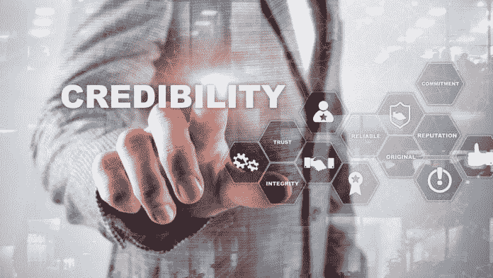

# 商业成功始于信誉

> 原文：<https://medium.datadriveninvestor.com/business-success-starts-with-credibility-8bd5a8f1420c?source=collection_archive---------15----------------------->

## 人们和品牌需要在市场上可信

信誉可以成就或摧毁一个品牌。这对于白手起家的企业至关重要，对于试图从自身失误中恢复过来的公司来说尤其具有挑战性。

开发者和数字经理[让-伊夫·阿格尼桑](https://twitter.com/jynapster)重视人们和品牌的可信度。他在[非洲推特聊天](https://twitter.com/AfricaTweetChat)中解释道，顺其自然并不总是一件容易的事情。

“在今天的企业环境中，你依靠品牌信誉来接触和影响你的目标市场，”Agnissan 说。“这些激励你的客户购买和参与你的品牌。但是为一个品牌建立网上信誉可能是困难的。

“对你的生意可能会有先入之见，”他说。“要想脱颖而出，在网上获得成功，你需要可信、值得信赖、知识渊博。你需要建立自己的企业价值观，让自己在竞争中脱颖而出。”

 [## 在创业的旅途中，拥抱学习

### 同时，忠于你的内心、思想和灵魂

medium.datadriveninvestor.com](/on-the-entrepreneurial-trek-embrace-the-learning-814107a208d) 

Agnissan 补充说，正确的品牌营销策略将是信誉成功的关键。这从内容开始。

“内容功能的一个方面应该是可信度，”他说。“这是一个不言而喻的目标，内容创作者应该把它放入他们制作的任何东西中。

“创造一个伟大的内容有很多步骤，”Agnissan 说。“你需要一个吸引人的标题、一个耐人寻味的故事情节和一种传播方式。当你按照清单工作时，真实性和可信度有时被认为是理所当然的，或者在日常内容创作中迷失了。”

# 重建

信誉受损的品牌面临着试图从头开始重建的艰巨任务。

“在出现错误后，恢复你的品牌形象和可信度是可能的，”Agnissan 表示。“首先要接受并承认自己的错误。保持透明，展示坦诚。最重要的是，不要试图责怪别人。如果你伤害了别人，请原谅自己，但不要夸大其词，为自己辩护。

“有必要做出道歉，”他说。“毕竟，每个人都会犯错误。它会通过弥补来减少损失。这将有助于使你的业务更加人性化。”

 [## 在社交媒体快车道上保持警惕

### 当你建立自己的品牌时，警惕可避免的错误

medium.datadriveninvestor.com](/stay-alert-on-the-social-media-fast-track-17bec8c917) 

吸取的教训同样重要。

“努力理解发生了什么，以便不重复同样的错误，”Agnissan 说。“这将使您能够通过对客户的调查收集尽可能多的信息，以获得正面信息。然后你就可以从这种糟糕的情况中成长起来。

“你必须重新赢得顾客的信任，”他说。“这不容易，但并非不可能。你需要耐心和努力工作。还要考虑积极的沟通。”

专注的交流会产生最好的结果。

“避免盲目的积极言论，这可能会让你的客户更加怀疑，”Agnissan 说。“保持清晰，尽可能用最积极的方式沟通。

“记住，在这种情况下，你是可信的，你的客户喜欢你做的事情，”他说。“记下过去奏效的方法。用你的商业营销的基本原则重新赢得客户的信任。”

# 收集内容

最初的可信度构建者是内容，对此 Agnissan 建议创业者进行审核:创建新的高质量内容，删除任何负面内容。

他还区分了经过验证和未经验证的账户，以及这种差异如何影响品牌可信度。

 [## 通过真实和信任赢得胜利

### 从真实的成就、优势和情感中汲取

medium.com](https://medium.com/an-idea/win-the-day-through-authenticity-and-trust-1670c5fe5494) 

“这是一种证明你的社交媒体账户是这家公司、品牌或个人的官方账户的方法，”Agnissan 说。“官方帐户在其名称右侧会显示一个蓝色小标签。

“在社交网站上拥有一个认证账户，可以证明这个账户的真实性，”他说。“这显然有利于你的形象。它让你在竞争中脱颖而出。这让互联网用户放心，因为有可能有几个账户会试图利用你的恶名。”

这给了一个品牌一些保护，虽然不是一个不可渗透的盾牌。

“一个经过验证的账户是防止身份盗窃的有效措施，”Agnissan 说。"然而，这并不能每次劝阻篡位者."

# 数字的故事

数字和统计数据也证明了品牌对客户或观众的价值。

“除了明显的销售和潜在客户生成应用，营销分析可以提供对客户偏好和趋势的深刻见解，”Agnissan 说。“推动分析增加竞争优势的另一个因素是使用数据来更好地预测人类行为。这种能力可以在许多层面上改进模型。

他说:“例如，保险公司可以通过了解导致保险损失的潜在行为，更好地模拟社会、法律和经济因素如何影响保险损失。”

 [## 挖掘客户的力量

### 小型企业通过个性化客户服务获得优势

medium.datadriveninvestor.com](/tap-into-the-power-of-customers-876388cc8f8f) 

培养对顾客需求的关注将会把他们的兴趣放在心上。

“以客户为中心的方法完全重新定义了品牌与消费者的关系，”Agnissan 说。“它通过分析相关数据来帮助识别和了解消费者需求，从而创造整体体验。

“这些数据可以让你创造完美的客户体验，”他说。采取以客户为中心战略的公司在竞争中脱颖而出，而这仅仅是开始。"

**关于作者**

吉姆·卡扎曼是[拉戈金融服务公司](http://largofinancialservices.com)的经理，曾在空军和联邦政府的公共事务部门工作。你可以在[推特](https://twitter.com/JKatzaman)、[脸书](https://www.facebook.com/jim.katzaman)和 [LinkedIn](https://www.linkedin.com/in/jim-katzaman-33641b21/) 上和他联系。

*原载于 2019 年 5 月 6 日 https://www.datadriveninvestor.com***。**