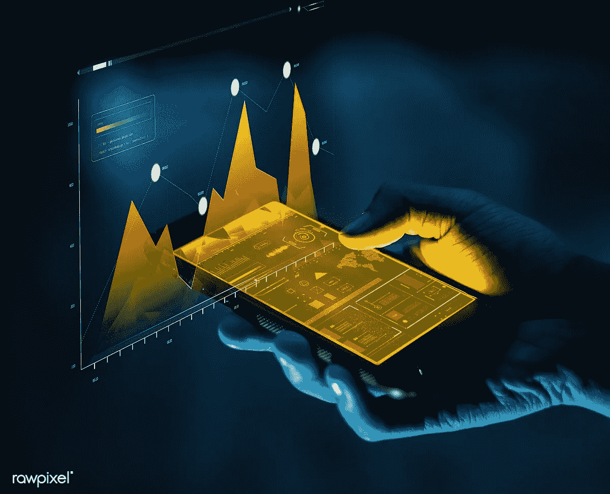
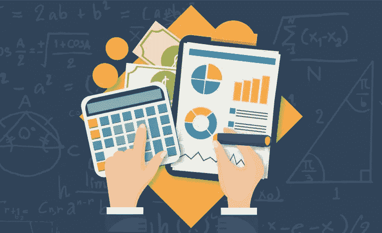

# 使用移动应用程序可以更好地完成业务任务

> 原文：<https://medium.datadriveninvestor.com/business-tasks-you-can-do-more-effectively-with-a-mobile-app-61387ceb440d?source=collection_archive---------4----------------------->

Source: rawpixel.com

很久以前，除了打电话和发信息之外，通过手机做任何与工作相关的事情似乎都是不现实的。

然而，现在移动已经成为一件普通的事情，人们几乎不记得没有手机时事情是如何完成的。

 [## 2019 年移动应用开发之路——数据驱动投资者

### 任何在移动应用程序开发行业工作的人，无论他们是专注于在伦敦开发 iOS 应用程序还是…

www.datadriveninvestor.com](https://www.datadriveninvestor.com/2019/01/15/the-path-of-mobile-app-development-in-2019/) 

许多企业仍然处于是否依赖移动应用程序来执行业务任务的十字路口。无论规模大小，公司都必须在相关行业保持竞争力，使用移动应用程序来完成相关任务是一种有效的方式。

根据 Mindsea 收集的统计数据，[移动用户花 87%的时间使用移动应用程序](https://mindsea.com/app-stats/),而只有 13%的时间使用网络。

如今，移动技术在我们的职业生活中扮演着至关重要的角色，无论是共享信息、与同事联系、基本通信还是其他。通过这种方式，公司可以提高员工的工作效率，取得更好的成果。使用直观的交互式移动应用程序可以完成各种任务，如行政、营销、CRM 和其他管理任务。

移动应用程序可以帮助您实现工作负载现代化。

让我们看看什么样的业务*【任务】*可以用手机 app 更有效地完成。

## **客户关系管理**

[通过移动应用的 CRM](https://fitsmallbusiness.com/best-mobile-crm-app/)可以帮助标准化从销售线索转化到报告设计和绩效评估的销售流程。它不仅是转化率、销售记录或历史记录的宝贵工具，也是每个团队成员在服务、产品或客户方面的表现记录的宝贵工具。

一些主要的关键功能是电子邮件集成、销售线索跟踪、自动数据保存、管理[销售渠道](https://blog.hubspot.com/sales/sales-pipeline)、保存销售线索和销售渠道的记录等等。

## **人力资源**

移动应用有可能提高人力资源人员的速度和效率。如今有[各种人力资源应用解决方案](https://www.softwaresuggest.com/hr-mobile-apps-software)可用，但你可以随时与[一家移动开发公司](http://zesium.com/)合作，根据你的具体业务需求构建定制的软件应用。

使用范围可以从随时向员工提供访问权限、指导员工将问题导向正确的地点和人员、支持特定计划或活动的推广，一直到重要人力资源信息的分发。

## **招聘**

类似于人力资源，招聘过程可能会变得压力更小，效率更高[简单的移动应用](https://www.mimeo.com/blog/top-recruiting-apps/)。

虽然这听起来令人难以置信，因为招聘人员甚至可能不在办公桌前工作，但它实际上简化了工作流程——移动招聘人员只需点击一下鼠标，就可以安排面试，跟踪任务或预定的约会，快速更新任务状态，最重要的是，随时与候选人沟通。

据估计，63%的求职者从移动设备上寻找工作机会，而只有 16%的全球雇主有移动运营商网站，所以自己算算吧！

Source: leaderonomics.com

## **会计和工资单**

谈到工资，没有人喜欢错误或任何类型的违规行为。

[工资单移动应用](https://fitsmallbusiness.com/best-payroll-apps/)将消除此类错误和任何类型的付款延迟。你可以做得更好的事情是跟踪所有标准信息(日期、人口统计等。)，包括多种向员工支付工资的方式，无需纸质文件，并且可以定制隐私和安全功能。

这与会计相似，在那里错误是不可接受的，因此使用移动应用程序可以减少错误——无论你在哪个行业工作，会计涵盖了广泛的任务，如财务信息的测量和交流。

你可以根据自己的需要创建一个定制的移动应用程序，也可以[选择市场上已经有的应用程序](https://www.softwareadvice.com/accounting/mobile-apps-comparison/)。无论您做出何种决定，您都可以确保能够实现可定制的报告、存储和分析相关数据以获得洞察力，并保持会计系统的无误和无纸化。

## **客户支持**

客户支持可以通过移动应用程序来促进这一过程，特别是在维护购买后忠诚度方面，因为如果能够通过操作工具全天候联系到您，客户会感到联系更加紧密。

您的客户支持可以轻松处理来自任何渠道(如电子邮件、网络、社交、聊天或其他)的入站机票请求，这是您的客户快速找到所需内容的简单方法，从而最大限度地减少他们的挫折感。

客户支持应用程序还可以启用[自助账户功能](https://www.manageengine.com/products/self-service-password/help/admin-guide/features.html)，发送推送通知，推广激励或奖励计划，或者允许通过应用程序支付账单。一些知名的 app 有 [Zendesk](https://www.zendesk.com/) 、 [Salesforce Desk](https://www.salesforce.com/solutions/small-business-solutions/help-desk-software/?mc=desk) 、Slack 以及很多[以上的客服 app](https://www.customerthermometer.com/customer-service/14-brilliant-customer-service-apps/)。

## **调度与排程**

无论是大公司还是小企业，无论是电力承包商、清洁/运输公司还是其他公司，调度和派遣都是不可或缺的一部分。

如今，几乎所有公司都参与了现场代理或团队的调度或派遣，无论规模大小。移动应用程序可以极大地帮助智能规划和调度日历板、快速估算和开票、工作订单设计、管理和组织所有员工、他们的角色和路线以及创建业务报告。市场上有许多用于安排或[调度](https://www.getapp.com/operations-management-software/service-dispatch/?oses_slug%5B%5D=android&oses_slug%5B%5D=ipad&sort=relevance)的应用程序，你可以使用它们，而不需要任何昂贵的定制应用程序。

如果你是运输或物流行业，你可能需要一个更强大的应用程序来支持所有必需的流程，如路线和卡车跟踪、GPS 跟踪、证明过境所需文件的交付等。一些车队管理应用程序有 [Onfleet](https://onfleet.com/fleet-management-software?utm_source=capterra&utm_medium=cpc&utm_campaign=fleet_management&utm_source=GetApp) 、 [Fleetio](https://www.getapp.com/operations-management-software/a/fleetio/) 、[车队管理](https://www.getapp.com/operations-management-software/a/fleet-manager/)、 [GoFleet](https://www.gofleet.com/product/mobile-dispatch) ，还有[更多应用程序](https://www.getapp.com/operations-management-software/fleet-management/os/android/)可供您使用，为您的员工简化复杂的流程。

## **营销**

今天的营销就像一场快节奏的比赛，营销领导者转向移动应用程序以获得市场竞争优势。

如今，有许多应用程序可供营销人员使用，不仅可以帮助他们发起活动，还可以从头开始测量结果，如跟踪指标以促进评估、数据分析、在某项活动上花费的时间等。

此类移动应用程序支持组织内的销售和沟通，促进内部员工的协助，保持最终用户的兴趣等等。

[有许多专门为营销需求定制的应用程序](https://www.oberlo.com/blog/mobile-marketing-apps)所以你应该先深入研究，在开始营销活动之前找到你的完美匹配。

# **总结**

如今有许多移动应用程序，选择适合您业务的应用程序可以自动执行繁琐的任务，这些任务可以随时随地执行。如果你想在竞争中生存下来并加入这场竞赛，你需要尝试移动应用程序的功能，从而使你的业务更有利可图。

您不仅可以提高绩效和利润，还可以增加公司内部的灵活性——由于移动应用无处不在，您应该充分利用它，帮助您的企业实现工作负载管理方式的现代化。