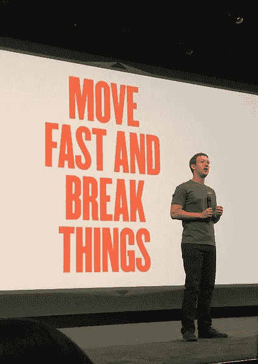

# 当有失败的空间时，企业就会繁荣。

> 原文：<https://medium.datadriveninvestor.com/businesses-flourish-when-there-is-a-room-for-failure-1f0a37cb041f?source=collection_archive---------38----------------------->

佐治亚州立大学最近的一项研究研究了多样性对创造力的影响。

研究表明，多元化对团队解决问题的速度没有 T2 效应。这项研究测量了年龄、性别和种族的多样性。

然而，同一项研究表明，思维的多样性导致了产出的显著提高。他们称之为“认知多样性”。

> 认知多样性被定义为*观点或信息处理风格的差异。*

认知多样性发生在有 ***心理安全的地方，*** 一个人们感到安全去冒险和在彼此面前脆弱的地方。

心理安全要求让人们在团队中做真实的自己。这鼓励冒险，带来创新、成功和增长。

杰夫·贝索斯一直大力支持亚马逊冒险。他说，那些经常进行明智押注的公司将不必进行*“公司押注”*，在这种情况下，他们被逼到最后一次押注，拿整个公司冒险。

亚当·格兰特在他的畅销书《给予与索取》中解释了《故事会》中的心理安全是如何让《辛普森一家》成为获奖最多的情景喜剧之一的。

> 像迪伦、毕加索和牛顿这样最伟大的艺术家冒着失败的风险。如果我们想变得伟大，我们也必须冒险。—史蒂夫·乔布斯

[他们的人力资源部门进行了一项谷歌内部研究，涉及 180 个工作团队，历时两年，发现了成功团队的 5 个关键要素，](https://rework.withgoogle.com/blog/five-keys-to-a-successful-google-team/)

其中包括意义和影响，但排在首位的是— **心理安全。五行中最重要的元素。**

谷歌发现，一个允许心理安全的团队会传递更多的意义、影响、结构和清晰度，并且更可靠——这是一个伟大团队的其他动态元素。

他们发现这也是骗子综合症的解药，这是谷歌特别出名的地方。

> 无畏地真实

谷歌和其他科技巨头允许风险，因为他们发现这是一个不断与没有什么可失去的新贵演变的世界中最安全的选择。

创造一个心理安全的环境，其核心是一种伟大的文化。这是一种很难培养、甚至更难保持的特质。

这需要远见、同情心和对团队能力的信任。所有这些都是出色的招聘和能干的领导的结果。

## 烤面包，不是烧焦的。

心理安全和认知多样性对于创新和成长至关重要，但明智和谨慎地承担风险也至关重要。

确保你的公司赢得更多敢于冒险的人的最好方法是雇佣具有伟大直觉的杰出人才，并让他们自由。

接下来，作为领导者，你需要确保存在一种支持性的文化、领导力和工具，以提高每次成功的几率。

亚马逊的 14 条领导原则之一是**领导者总是对的。**

> 他们有很强的判断力和良好的直觉。他们寻求不同的观点，努力打破他们的信念。—亚马逊领导原则№4

> 今天你就是你！那比真实更真实！世上没有比你更好的人了！— **苏斯博士**

心理安全是推动工作成功和生活幸福的少数个人因素之一。应该有目的和明确地追求这一目标。

研究表明，视觉线索在塑造个人行为中起着不可或缺的作用，这里有一些很棒的引言，你可以把它们放在工作场所的海报上，以促进心理安全。

*不是因为事情困难，我们不敢冒险。因为我们不敢冒险，所以他们很难。—塞内卡*

*最大的风险是不冒任何风险……在这个瞬息万变的世界里，唯一肯定会失败的策略就是不冒风险——马克·扎克伯格*

不冒险，你不可能在商业上成功。真的就这么简单。—阿德娜·弗里德曼

如果你每年做的实验数量翻倍，你的创造力也会翻倍——杰夫·贝索斯。

你的时间有限，所以不要浪费在过别人的生活上。—史蒂夫·乔布斯

如果你什么都不冒，那你就什么都冒了。—吉娜·戴维斯

你不拍的照片，你会 100%错过。”—韦恩·格雷兹基