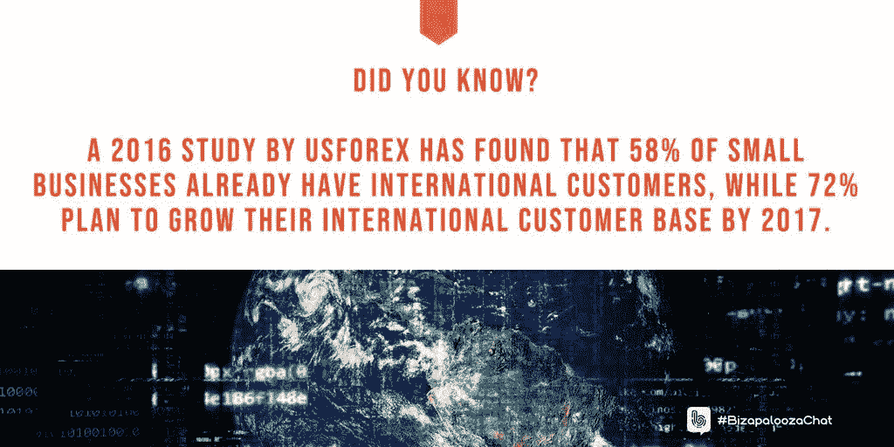
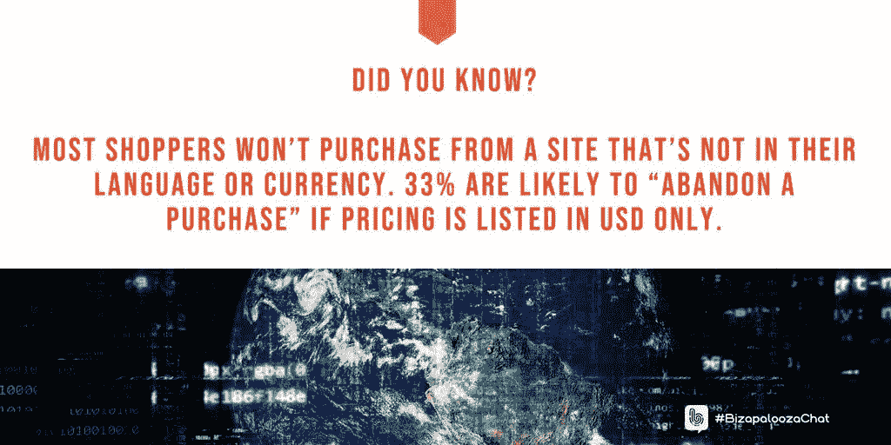
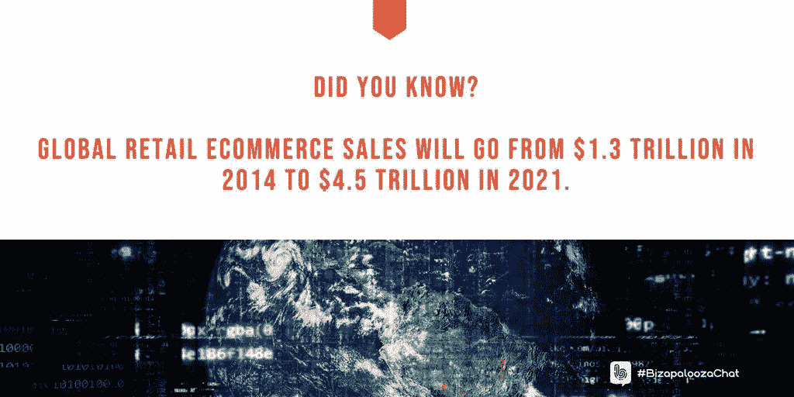
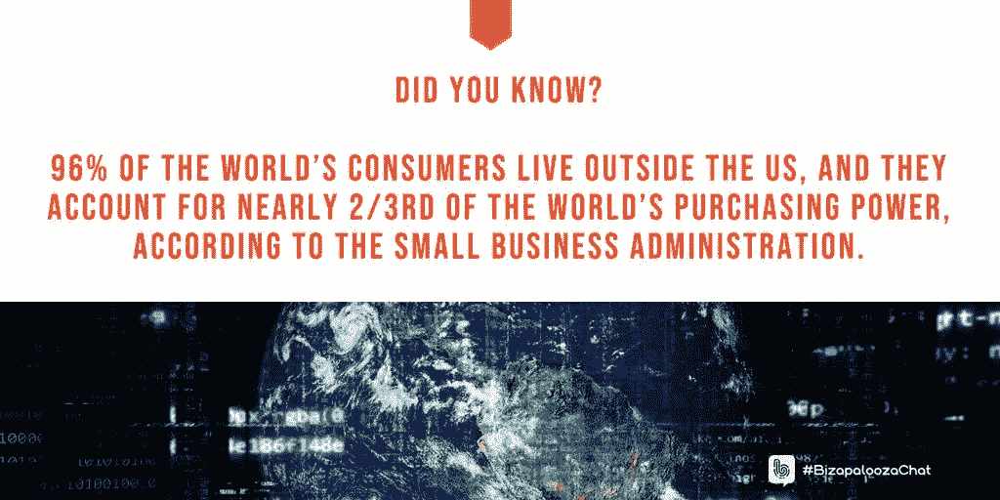

# 企业要赢得新的合作伙伴还有很长的路要走

> 原文：<https://medium.datadriveninvestor.com/businesses-stretch-hands-across-the-seas-fea354cbdd06?source=collection_archive---------12----------------------->

## 每位车主都应该在过境前采取这些措施

Going global includes learning new cultures, languages and customs. Photo by [Ben Ostrower](https://unsplash.com/@benostrower?utm_source=medium&utm_medium=referral) on [Unsplash](https://unsplash.com?utm_source=medium&utm_medium=referral)

大多数企业都是从小规模起步的，许多企业都留在了那里。一些公司成长并扩展到当地以外的地区——也许是整个国家。

如果一个小企业真的流行起来，它将迈出一大步，走向世界。企业家可能不确定这样的飞跃，但不是[戴安娜·巴拉德](https://twitter.com/DianaBallard18)。她是一名顾问战略家，为全球战略提供建议。

Ballard 与 [Ivana Taylor](https://diymarketers.com/about/) 和 [Iva Ignjatovic](https://twitter.com/IvaIgnjatovic) 讨论了每个企业主在进军海外之前应该知道的事情。

Ballard 说:“国际公司是指存在于两个或更多市场的公司。”“全球性公司是指在各大洲的多个市场开展业务的公司，可能是全球知名的品牌。

“一家全球性企业有意探索所有可行的国际市场来发展业务，”她说。"一家国际公司专注于特定的市场以拓展商机."

Ignjatovic 指出，一个企业可能是全球知名的，即使它并不存在于所有的国家。

全球销售的时候，跟着钱走还是追求钱。通过走向全球，你有最大的竞技场来做这两件事。

“只有 1%的美国企业出口，仍然使美国成为仅次于中国和欧盟的世界第三大出口国，”巴拉德说。“美国公司有更多的机会在全球发展业务。

“小企业可以开辟新的收入潜力和更高的盈利能力，”她说。“他们可以将现有产品和服务的销售规模扩大到新的市场，而无需昂贵或耗时的新产品或服务创新。”

# 寻求正确的支持

泰勒补充说，“当你在全球销售时，你已经成倍地扩大了你的市场。”

不要承诺太多，但要兑现太多。如果你的企业能够在全球范围内合理地满足这个标准，那就去做吧。

“找到你的支持系统来输出成功，”巴拉德说。"[这里有一篇很棒的文章](https://www.veem.com/sales/organizations-helping-us-small-businesses-export/)，提供了与指导你的商业顾问联系的资源。

“研究互联网和社交媒体，并咨询美国政府、企业和行业协会，以研究最适合的出口市场，”她说。

 [## 你的身体比语言更响亮

### 面部表情、手势和姿势传达了清晰的信息

medium.datadriveninvestor.com](/your-body-speaks-louder-than-words-ea9ea043d601) 

创业者还需要考虑潜在的语言障碍。

“与语言服务公司合作，准确翻译你的业务价值，”巴拉德说。“专业翻译人员必须翻译成他们的母语，生活在目标国家，了解你的行业和业务。

“虽然英语可能被广泛理解，但除非你用客户和潜在客户的语言与他们交谈，否则你可能无法真正吸引你的观众，”她说。“人们更喜欢用自己的语言购物。”

不是每个公司都会从走向世界中受益。

泰勒说:“我认为这与你从事什么类型的业务有关。”“并不是每一项业务、产品或服务都适合国际或全球销售——比如管道服务或房屋粉刷。”

Ignjatovic 说，小企业应该投资于适当的研究，因为它权衡全球扩张的可能性。

“小企业有许多电子商务平台，”巴拉德说。“考虑 SaaS —软件即服务—以避免重大投资，支持信息技术招聘并快速投入运营。

“确保您的电子商务平台支持多种语言，包括复杂的多字节字符集，接受任何货币的支付；有国际航运和税收选项；并支持当地的习俗，”她说。

# 专业企业的利基

特长可以在一个影响深远的企业里做得很好。

“成为一名工匠或艺术家是一个理想的全球性行业，”泰勒说。"像 Etsy 或易贝这样的平台使得在全球销售变得非常容易."

走向全球的首要考虑是财务:你能负担得起吗？紧随其后的是国际专家。你必须能够用熟悉的市场和语言与企业和消费者交流。没有交流，就没有生意。

 [## 开始在网上做生意不是为了胆怯

### 在迈出这一步之前，要知道你将面临什么

medium.datadriveninvestor.com](/startcustoing-business-online-not-for-faint-of-heart-6367e4e6bc4d) 

“低成本国家通常提供更便宜的产品和服务，”巴拉德说。“这就是美国进口多于出口的原因。建立小企业可以提供差异化价值的利基领域。

“理解全球市场的运作方式是一项挑战，”她说。“这需要投资来确定最合适的市场、竞争对手，并评估阻碍进步的潜在法律、监管或其他障碍。”

还有不确定因素。

“最大的障碍是不知道或不理解你是否能在全球成功销售，”泰勒说。

小企业主在全球扩张之前应该考虑几个因素。

巴拉德说:“在网上搜索，为你的最佳机会建立一张地图。”“向政府、商会和其他资源寻求建议，为你的企业找到最佳市场。

“制定国际战略，确定市场、机会和计划，”她说。“与当地合作伙伴一起研究和测试您的计划，以指导您的方法。确保当你的业务成功时，你能够交付。”

公司也应该有人在现场。

巴拉德说:“地面部队将有助于指导你的当地战略。”。

国内营销规则也适用于海外。

泰勒说:“首先要考虑的是你的受众、你的产品或服务以及你接触全球受众的能力。”

以你的产品和服务最能满足他们需求的国家为目标。随着目标的确定，你将如何适应他们的市场和文化。

泰勒说，“要发现目标，你必须有数据。”“如果有人从其他国家来到你的网站，你可以从瞄准这些人开始。”

# 全球与否

超越国界不是必然的。

“不是所有的企业都能马上走向全球，”Ignjatovic 说。“我支持以最佳方式逐步扩大市场，从有意义的地方开始。”

不会说这个国家的语言会立即让你落后，注定永远无法恢复。你给了自己一个不必要的语言和文化障碍。

“从个人经验来说，我甚至无法想象如果英语不流利，我会做什么工作，”住在塞尔维亚的 Ignjatovic 说。“那是不可能的。这也是我学习德语和挪威语的原因。”

 [## 营销不是一见钟情

### 花时间真正了解你客户的需求

jkatzaman.medium.com](https://jkatzaman.medium.com/marketing-is-not-relationship-at-first-sight-4d0d6a3d966e) 

掌握多种语言不是一朝一夕的事。

“流利地说一门语言需要时间，”巴拉德说。“与当地的业务合作伙伴和语言服务合作伙伴建立稳固的关系，他们将为您提供当地的洞察力，并转化您的业务价值。

“说你正在扩张的国家的语言并不重要，”她说。“然而，访问新的国家可能会很有趣，并有助于积累你在海外做生意的知识——学习新的文化、语言和习俗。”

这就把本地服务带入了画面。

Ballard 说:“查看行业协会对国际支持网络的指导。”“他们将帮助您联系当地最优秀的资源，跨越法律、监管、语言和文化障碍和惯例。

“永远不要把语言当成商品，”她说。“最好明智地投资，减少翻译，这样你的信息就不会在翻译中丢失。确信你的语言翻译伙伴的承诺，否则就走开。”

Ignjatovic 更重视文化。

“了解当地习俗比语言更重要，”她说。“至少有一名专业翻译很重要。在一些国家，不表现出你懂这门语言是明智的。”

有一些实用的方法可以让你熟悉你可能去的国家的文化。

“观看关于你的目标市场的广播可以提供一个有用的和有趣的文化背景，”巴拉德说。“考虑为了乐趣而学习另一种语言。

“去看看国际行业协会，探索你的出口市场及其商业文化，”她说。“在你的出口市场中找到对你的行业有影响的人，并调查他们如何‘适合’你的业务。”

亲临现场也胜过远程学习。

巴拉德说:“去其他国家旅行可能会很棒。”“这将拓展你对机遇和挑战的洞察力，以及发展强大的当地合作伙伴关系的机会。”

美国商会在其简报中提到了这些要点，“帮助小企业出口*”*

# 很多建议

“全球社交媒体和网络是建立全球关系和了解其他文化的好方法，”泰勒说。

Ballard 建议那些想在全球范围内拓展小企业的企业家们向美国政府、商会和行业协会寻求建议。

 [## 疯狂设定目标背后是有方法的

### 专注于一个目标，为自己或公司制定一个计划

blog.markgrowth.com](https://blog.markgrowth.com/theres-method-behind-goal-setting-madness-9a8ba0a96ee1) 

“研究是关键，”她说。“慢慢开始，开始前要有可衡量的目标。在线调查，了解像你们这样的企业是如何进行国际化经营的。

巴拉德说:“统计数据显示，由于背景的多样性和集体智慧，多文化团队更具创造力和生产力。”

当地营销机构也可能是一个很好的调查伙伴。

“这是一个令人难以置信的方法，”巴拉德说。“开展个性化调查，获取做出正确决策所需的商业智能。发掘你还不知道的知识。”

泰勒说，任何扩张都应该包括吸引广大受众的具体信息。

**关于作者**

吉姆·卡扎曼是拉戈金融服务公司的经理，曾在空军和联邦政府的公共事务部门工作。你可以在[推特](https://twitter.com/JKatzaman)、[脸书](https://www.facebook.com/jim.katzaman)和 [LinkedIn](https://www.linkedin.com/in/jim-katzaman-33641b21/) 上和他联系。