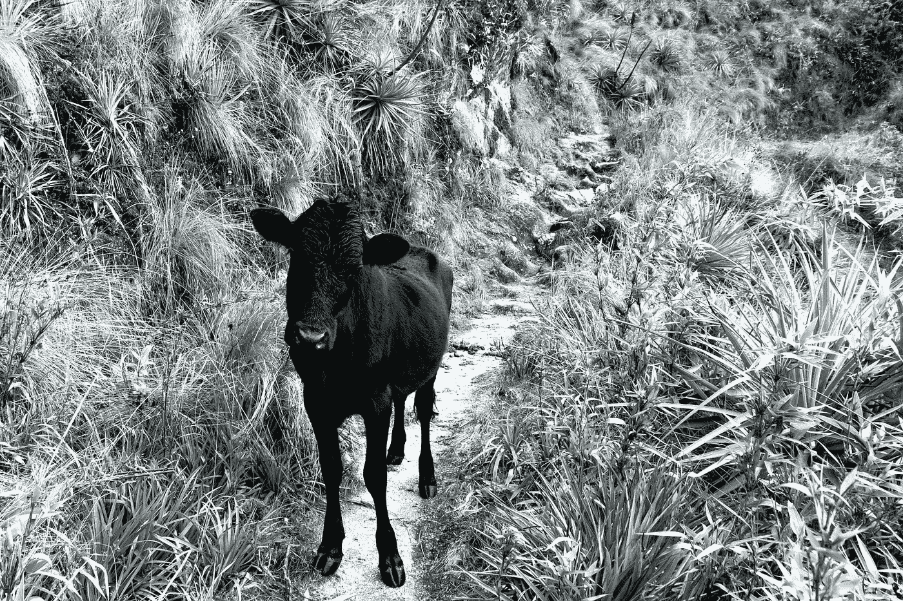
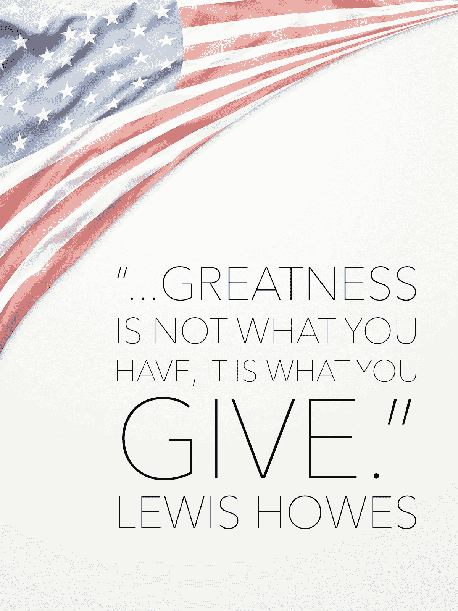
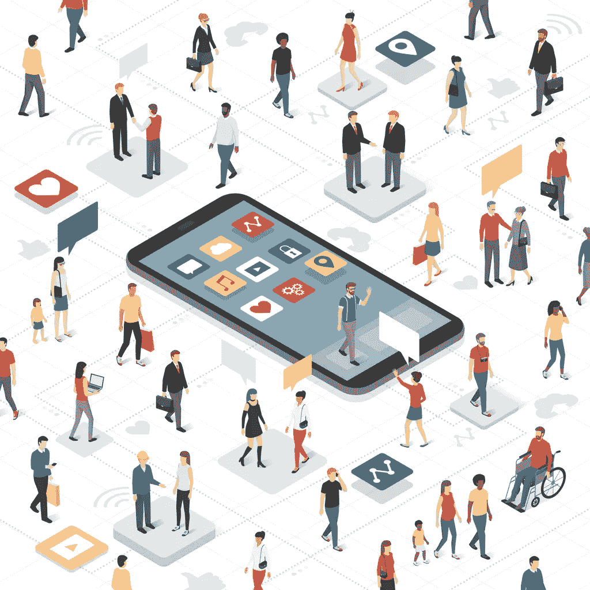

# 但我不是受命来传教的

> 原文：<https://medium.datadriveninvestor.com/but-i-am-not-ordained-to-preach-d2d5d757ce2e?source=collection_archive---------18----------------------->

“……但我不是受命来传教的。”这是山姆·沃尔特·福斯的诗的最后一行，**小牛小路。它写于 1893 年，但我不得不为新时代分享这个道德故事。**

我们被安排沿着*“从太阳到太阳的小牛走过的路。”*今天，我们在这条道路上携带了一个强大的工具。它不仅仅是一个通讯设备/全球定位系统，它还是一个有可能毁灭我们的工具。它已经智取了我们，并认为我们每一击。机器人包含了我们的智慧，并等待我们对每一击做出反应。我们发推特，发布到 instagram 和 snapchat。我们的精神状态从事于人物、视频、广告和数据。又一次刷卡。每天，我们越来越多地让自己的情绪和恐惧相互对抗，吐出替代事实和假新闻，因为我们放弃了自己天生的推理和批判性思考的能力。我们在这场文化战争中分裂了；一边喊着“让美国再次伟大！”巧妙地利用现在和过去来构思未来的故事。另一方面，只是试图保持其相关性。

最伟大一代的成员并没有给自己贴上“最伟大一代”的标签。他们成长为饱受经济大萧条和两次世界大战创伤的幸存者。他们是移民的子女，不敢在做正确的事情时表现出傲慢或骄傲。那些不顾国家的种族隔离法律和教义而站起来或坐下来的人也是如此。他们被训诫不要对喷涌在他们身上的暴力和仇恨做出反应。伟大是他们牺牲的副产品，是他们对造物主的信仰和信念，是他们凑合并最终努力确保我们政府和公共机构合法性的副产品。他们奋起迎接他们时代的挑战，他们不是被领导，而是领导者。

我们没有权利踩在我们祖先的尾巴上。我们父辈和祖辈时代的钢铁厂、煤矿、纺织厂、玻璃厂和汽车公司不会神奇地重现。通用汽车公司将做通用汽车公司需要做的事情来满足他们的目标和利益相关者。是的，这意味着关闭他们的小型轿车制造厂，解雇数千名工人。对此任何人都无能为力。事实上，Joe 和 Jane Public 选择不买他们的车，而是选择 SUV 和跨界车。我们不能继续期望小牛的道路会变直，因为它一直是弯曲的。当这个决定完全基于经验数据时，我们不能愤怒，举起拳头说这是不公平的。但我们会感到愤怒，并寻找某个人、某个团体来承担责任，永远不会把镜子举到我们面前。

一只死去近三个世纪的小牛带领了十万人。他们仍然遵循他的歪门邪道，每天失去一百年。因为这样的崇敬是借出的。一个良好的先例。”

The future directed by AI

号角已经吹响，是时候重建我们的社区了，我们真正的 T2 社区，我们居住的社区，我们孩子上学的学校，我们做礼拜的教堂和清真寺，我们工作的工厂和企业。这些社区不同于马克·扎克伯格在 2017 年的一次演讲中吹捧的*“有意义的社区”*，当时他谈到脸书的人工智能(AI)*“…不仅要扭转我们几十年来看到的社区成员数量的整体下降，还要加强我们的社会结构，让世界更加紧密。”随着大数据观察和人工智能指导我们的生活方式，我们绝不能放弃我们的隐私和安全。*

我们需要像我们的祖先一样，通过牺牲、信仰和信念来建立世代资本，凑合并确保我们的政府和公共机构的合法性。我们是公共政策中的公众。我们需要不仅仅通过我们的投票或华盛顿游行来指导政策，我们需要与我们社区的所有成员进行持续的对话，并不知疲倦地出现，与呼吸、思考的人面对面，无论种族、宗教、社会地位或看法如何。我们需要在同一条船上，我们需要学会一起划船。一旦我们承认并接受这一点，我们将见证我们的文明和伟大。

*“因为人们容易盲目地沿着心灵的小路前进；离开孙去做别人做过的事。他们沿着人迹罕至的道路，走来走去，走来走去，仍然走着迂回曲折的道路，以保持别人走的道路。他们把这条路当作神圣的小树林，他们一生都沿着这条路前进。这可能会教一个道德课，如果我被任命和呼吁说教。”*