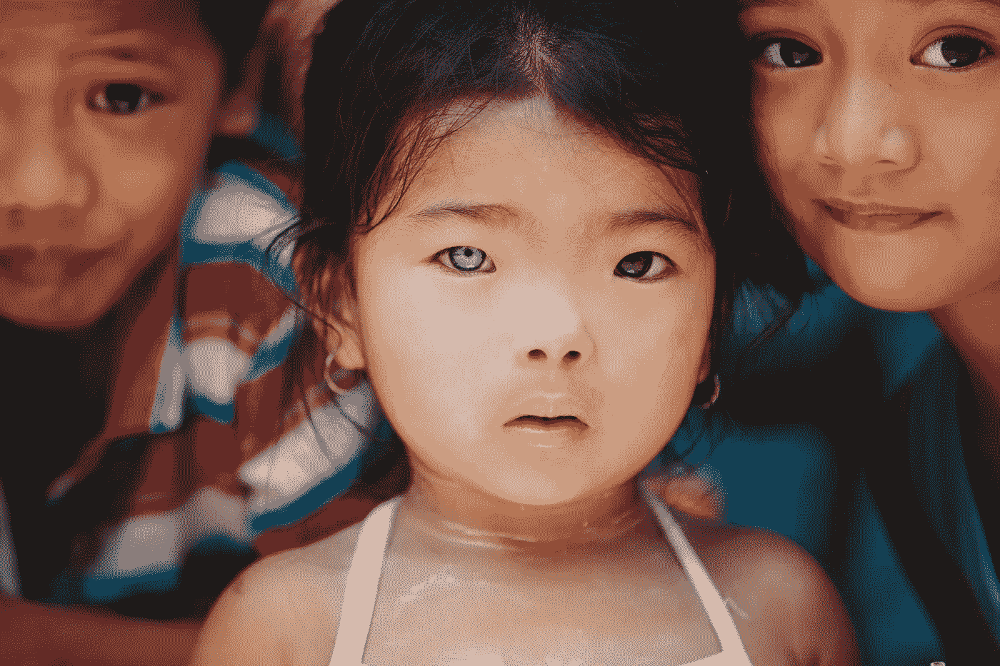

# 为什么“买一送一”公司可能弊大于利

> 原文：<https://medium.datadriveninvestor.com/buy-one-give-one-companies-could-be-causing-more-harm-than-good-ce31cc1bd84d?source=collection_archive---------5----------------------->

‘乙 **生意好’就是生意好**。研究证实“有目的”的生意是可以赚钱的。[2014 年，尼尔森](https://www.nielsen.com/us/en/insights/reports/2014/doing-well-by-doing-good.html)对 3 万多人进行的一项研究表明，75%的千禧一代和 Z 世代(各年龄段均为 65%)将为“回馈”社会的产品和服务支付更多费用。Porter Novelli 的新研究还显示，78%的美国人认为公司有责任对社会产生积极影响，而 77%的人对他们认为受社会目的驱动的公司有着“更强烈的情感联系”。

对此，我们看到新一波企业家抓住了明显的市场机会，越来越多的人采用“买一送一”的模式，出售特定的商品/服务，并用一部分利润向有需要的人捐赠类似的商品/服务。

Toms Shoes 于 2006 年由现在的 B 队队长 Blake Mycoskie 创立，是最早采用“买一送一”模式的知名企业之一。虽然该公司在财务上取得了成功，而且布雷克的积极意图毋庸置疑，但也并非没有批评。提出的关键问题是，它是否有能力让接受国的当地公司破产，以及是否有能力充分改变接受社区，以产生持续的影响。

“买一送一”模式的吸引力被归因于人们倾向于最容易与个人的痛苦故事联系起来，而不是一个大群体经历的不平等或痛苦。心理学研究发现，当人们听到一个人的痛苦故事时，他们可能会捐出两倍于帮助“数百万匿名者”的钱。

有趣的是，当他们被置于一个更广泛的不平等或剥夺模式中时，他们也不太可能向个人捐款。以“有益于有需要的孩子”为卖点的购买行为，伴随着孩子们被“帮助”的支持性形象，很可能会成功，因为消费者被赋予了一个简单的、个性化的问题的简单解决方案。

写于 [*FastCompany* ，劳伦·詹斯坦和肉桂·扬泽尔](https://www.fastcompany.com/3053596/the-buy-one-give-one-model-might-make-you-feel-good-but-it-doesnt-make-the-world-better)呼吁这些企业“销售伪装成社会变革的自我提升，通过在我们的脚上穿上汤姆斯鞋，在我们的脖子上戴上被剥夺权利的妇女制作的手工珠宝，我们有能力塑造利他主义者的形象，从而使这些企业流行起来”。

## **买一送一模式的扩散有什么真正的影响？我相信公司和购买者在理解他们的决定的真正影响时会更加精明。**

例如，有人强调，免费供应鞋子(或实际上任何产品)可能会影响当地鞋匠的业务[，当当地人开始依赖这项业务时，也会产生供应一致性方面的问题。美国天主教大学(Catholic University of America)创业项目主任安德烈亚斯·威德默(Andreas Widmer)曾因该校的做法而获得 Toms 的资助，但他表示，自己后来改变了看法。“[Toms 创始人布莱克]麦可思基心地善良。但是，我已经认识到，跟随内心去对抗贫穷是一个可怕的想法。“它让你更高兴，而不是帮助任何东西。当你试图与贫困作斗争时，给予任何东西总是一个坏主意。”](http://knowledge.wharton.upenn.edu/article/one-one-business-model-social-impact-avoiding-unintended-consequences/)

旧金山大学的一个小组对该模型进行的研究发现，尽管孩子们很大程度上喜欢这双鞋，但他们担心这一发现对他们的自尊没有什么积极影响。他们还发现，这些孩子更有可能觉得更依赖外部援助作为一种生活方式。

> 不管赠送特定产品的效果如何，正如*可持续品牌*的[Hannah Ritchie](https://www.sustainablebrands.com/news_and_views/business_models/hannah_ritchie/beyond_good_intentions_tweaking_buy_one_give_one_model)所写的那样，从本质上讲，接受免费物品的人所经历的贫困并不是因为缺乏资源。相反，它源于“一个无效的社会和经济体系，未能为社区提供必要的基础设施，为自己创造资源或财富”。

## 如果我们真的想创造积极的改变，我们能做些什么？

通过杠杆室，我们提倡寻求理解真正的社会或环境问题所在。一旦我们了解了根本原因，我们就可以为公司建立财务上有利可图的商业模式，并做出购买决策，解决挑战，同时产生持久的积极影响。

我对一系列新的商业模式感到振奋，这些模式已被证明能够解决关键问题，对人类和地球产生影响，并带来利润。观察到的主题包括，但绝不限于，我将描述为:

1.  “废物资源化”模式，包括从回收的废物中获取材料的创新方法，创造全新的产品。
2.  “产品即服务”模式是指人们为产品提供的服务付费，而无需承担维修、更换或处置的责任。
3.  “包容性采购”模式涉及考虑核心业务以外的影响。重组供应链，使公司更具包容性，重点支持提供产品的农民或生产商，而不仅仅是采购产品的数量。
4.  “合作伙伴关系”,涉及创新和意想不到的合作伙伴关系，以增加倡议的规模和影响。

最后，值得注意的是，汤姆斯鞋业在这方面并不孤单，这些见解同样适用于许多采用“买一送一”模式的其他公司。例如，新西兰盈利性公司“吃我的午餐”被批评创造了一个不寻求真正解决问题的模式。消费者每买一份午餐，就有一份捐赠给了饥饿的学生。该企业的创始人表示，他们正在解决“饥饿儿童”的问题，但其他人质疑如何处理利润，并指出当前的模式对解决导致这一问题的更大的系统性问题几乎没有作用。[“吃我的午餐”也招致了批评，因为他们挑战政客们通过向他们购买午餐来解决儿童挨饿的问题，而忽视了我们能够用来解决更深层次问题的更强大的工具。](https://thespinoff.co.nz/business/02-10-2017/eat-my-lunch-the-business-of-doing-good/)

## **总之，为了创造持久的系统性变革，我建议我们:**

1.了解问题的确切性质，然后创造适合目的的解决方案，为他人创造经济机会，而不是减少它。其中可能包括授权给我们寻求帮助的人，让他们找到自己的创造性解决方案，建立长期价值，提高自尊。

2.购买产品，建立公司，创造解决方案，而不是创可贴(从长远来看，这可能会使问题变得更糟)。

3.探索现有的各种新商业模式(除了买一送一)，这些模式可以为人类、地球和利润带来明确的结果。

4.在我们的购买决策中，询问更多关于免费物品对接受它们的社区的实际影响的问题。

最初发表于:[https://www.theleverroom.com/news/buyonegiveone](https://www.theleverroom.com/news/buyonegiveone)