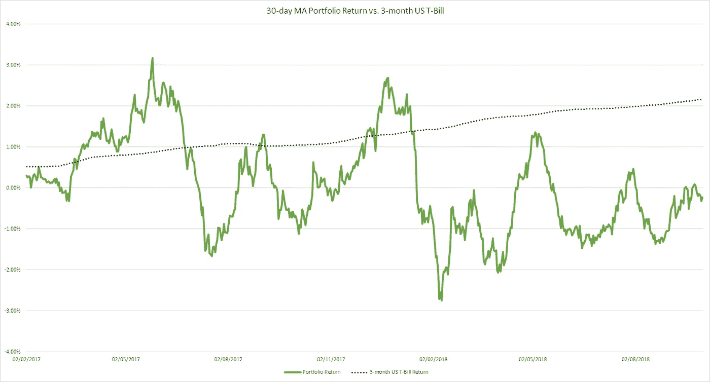
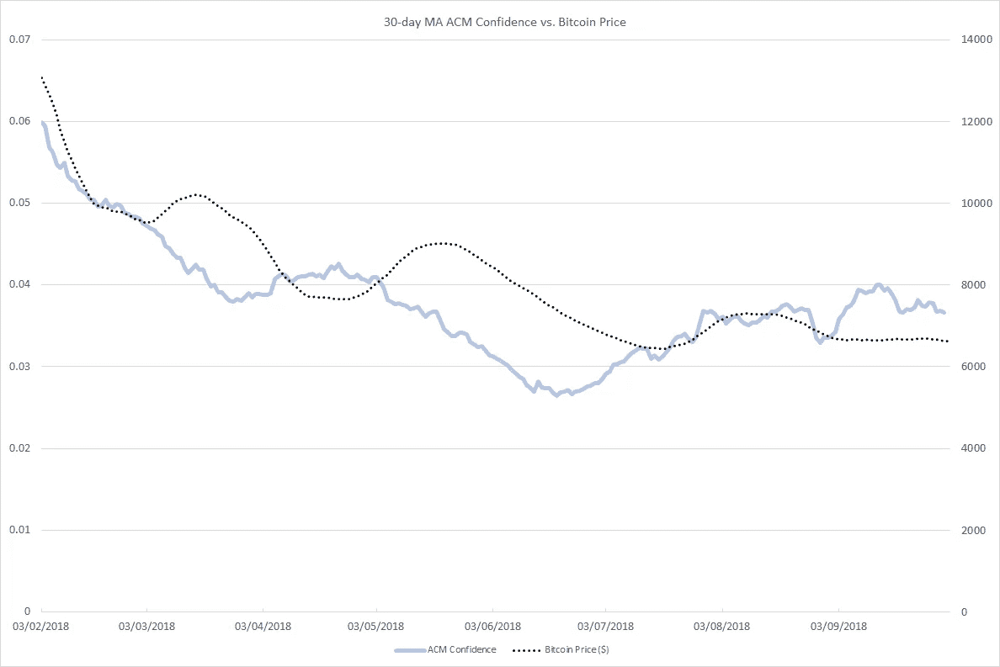
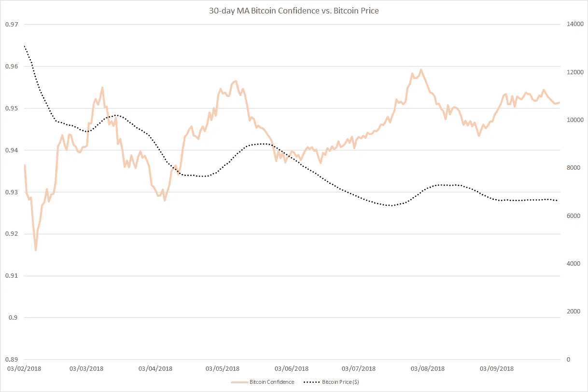

# 买炒作？—衡量加密的可信度

> 原文：<https://medium.datadriveninvestor.com/buying-the-hype-measuring-confidence-in-crypto-13bedc6d9a22?source=collection_archive---------9----------------------->

## 秘密投资者经常被指责过度炒作和过于自信。但是数据怎么说呢？

Photo by [Verena Yunita Yapi](https://unsplash.com/@verenayunita?utm_source=medium&utm_medium=referral) on [Unsplash](https://unsplash.com?utm_source=medium&utm_medium=referral)

*这篇文章讨论了我在 2019 年 9 月在都柏林举行的 IAREP-SABE 会议上发表的论文“Cryptic Signals”的一部分。全文可以在这里找到***。**

*信心在投资中发挥的作用比我们想象的要大。不幸的是，人类并不擅长分辨何时自信，何时过度自信。每个人都认为自己处于投机阶段，没有人处于庞氏骗局中*

* [## 总部位于瑞士的 ETP 进入加密交易市场|数据驱动的投资者

### 虽然金融市场几乎没有沉闷的时刻，特别是在引入…

www.datadriveninvestor.com](https://www.datadriveninvestor.com/2019/03/10/swiss-based-etp-enters-the-crypto-trading-market/) 

谈到信心，加密货币市场是一个激发大量热情的市场。努里埃尔·鲁比尼等著名经济学家对这一资产类别持高度怀疑态度，而比特币及其公司继续拥有极其忠实的追随者。但忠诚是一种明智的投资策略，还是过度自信的表现？

所谓过度自信，我指的是相信自己的能力超出了自己的知识范围。例如，一个新手投资者认为他们所有的投资都做得很好，尽管对他们投资的东西或如何判断优秀表现知之甚少。但是，我们如何衡量信心，加密货币市场的投资者是否特别过度自信？

## 行为正常

传统市场可以通过多种方式衡量信心，从买入/卖出报表到债券收益率。这些指标目前在加密领域并不存在，所以我们必须更有创意。行为经济学家经常创造他们自己的信心指标。例如，一个小奢侈品指标记录了一个人给自己买一个小奢侈品如星巴克的频率——这可以用来衡量对经济的信心。然而，这又是加密货币的一个问题——一点点奢侈品会是什么形式，我们怎么知道它实际上是*奢侈品？*

## 总体置信度模型

相反，我用一个理论模型来衡量信心，这个模型最早是由格里芬和特沃斯基(1992 年)开发的，后者因 T2 的前景理论而出名。这个模型最近被克里斯·梅尔在[行为金融杂志](https://www.tandfonline.com/doi/full/10.1080/15427560.2018.1406942)上改编并测试。这个总体信心模型(ACM)有三个关键组成部分:

1.  自我归因偏差
2.  资产实力
3.  资产重量

自我归因偏差是一种过度自信。它指出，一个人更可能将收益归因于自己的投资决策，而将亏损归因于运气不好，而不管市场上其他人发生了什么。

资产强度是给定其典型表现的资产回报。这通常采用资产价格减去移动平均资产价格的形式，其中使用了适当的时间框架来计算移动平均价格。对于我所有的计算，我用了 1 年。

> 资产实力=资产价格-移动平均资产价格

正如我们将看到的，在我们计算整个投资组合的实力之前，这是对投资组合中的每项资产进行的。这种计算有点复杂，但只要知道他们投资组合的构成，就不会太难:

> 投资组合实力=加权平均资产实力/资产质量

其中资产质量是我们可以计算资产强度值的投资组合的总百分比。

最后，还有投资组合权重。权重是投资组合回报的可靠性，由投资组合的横截面标准差给出，使用[等式](https://xplaind.com/268982/portfolio-standard-deviation)找到。现在我们知道了这些组件，它们是如何组合在一起的？如果我们假设，当一项资产的表现好于平均水平(高强度)时，自我归因偏差是正确的，投资者应该将这种表现归因于自己，因此这些回报(权重)的可靠性并不重要。然而，当资产表现不佳时(低强度)，投资者会责怪市场而不是他们自己，因此低回报一定非常可靠(高权重)。因此，信心是力量和重量的比值:

> 置信度= (1 +力量)/ (1 +重量)

其中置信度大于 0 为过度自信，小于 0 为欠自信。

## 密码投资组合？

ACM 是为资产组合设计的，但也可以通过使用基本的标准差公式为单个资产设计。截至 2018 年 9 月，我使用 20 种最大的加密货币构建了我的加密投资组合(如果有足够的历史数据来最小化统计误差，可以使用任何货币)。

对于感兴趣的人，我还计算了这个投资组合的 CAPM。当与 3 个月期美国国债对比时，收益率很有意思。

## 信心

所以，我们有了模型，也有了投资组合。现在来回答这个价值 1.5 万美元的问题:加密货币投资者是否过于自信？简单的回答是肯定的。对于我的投资组合，信心从 2018 年 1 月的 0.06 左右降至 5 月的 0.028 左右。但是，如果不进行比较，这并不意味着什么，所以我绘制了这段时间内 ACM 信心指数与比特币价格的关系图。

这种关系立即变得引人注目，尽管考虑到信心计算中的比特币价格因素，这可能是意料之中的。然而，这种影响减少了，因为我在 ACM 计算中使用了百分比变化，而不是绝对值变化。因此，一枚定价为 100 美元的硬币的 1 美元零钱与一枚价值 10，000 美元的硬币的 100 美元零钱具有相同的效果。

那么，我们实际上看到的是什么模式呢？嗯，信心似乎与市场上最大的玩家密切相关。事实上，一个简单的相关性显示我的 ACM 计算和比特币价格的相关性为 0.72。显然，有一种观点认为，2017 年 12 月比特币价格的下跌打击了投资者的信心；但是当比特币崩盘时，投资者绝对是*过于自信了。应该对 2018 年夏天发生的事情进行进一步调查，但我最好的猜测是，崩盘让一些投资者对自己不确定。*

最后，我计算了仅针对比特币的置信度得分，并与比特币价格进行了对比。在这里，肯定有信心驱动关系的迹象，随着信心的上升，比特币价格很快见顶。然而，这种关系在两个方面不同于以前的关系。首先，比特币投资者比投资组合投资者*明显*过度自信。其次，过度自信在 2018 年初比年末对比特币价格的影响更大。

我能想到三个原因:

1.  投资者并没有因为过度自信而采取行动
2.  投资者正根据他们的过度自信采取行动，但已经调整了他们的价格预期
3.  投资者过于自信，但其他力量正在影响比特币价格，这些力量在 2018 年底有所不同* 

*2018 年，加密货币投资者过于自信。在 2017 年 12 月的崩盘期间，他们可能过于自信，数据显示出经典明斯基时刻的迹象。我们可以从 ACM 信心指数和主要加密货币比特币价格之间的高度相关性看出这一点，因为在崩溃之后，信心在某种程度上与比特币价格脱钩。*

*—*

*斯图尔特·米尔斯是曼彻斯特城市大学行为经济学和元认知推动理论的博士研究员*