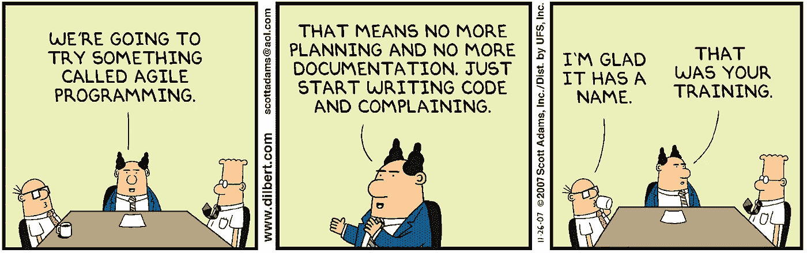
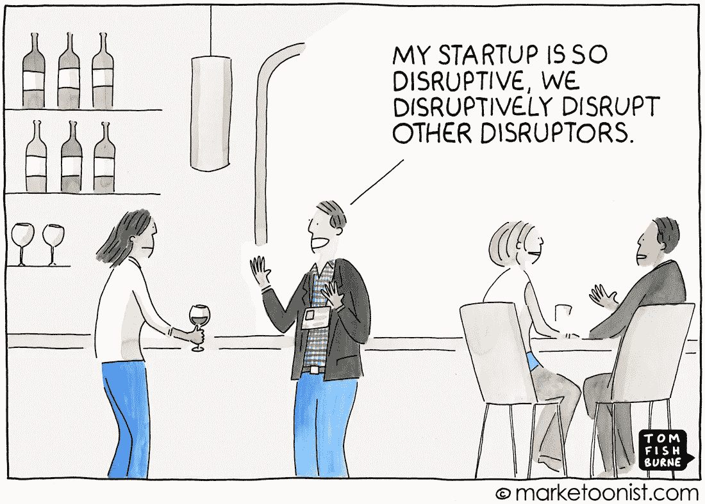

# 流行语宾果！(也就是人们用得过于轻浮的十个商业/技术术语)

> 原文：<https://medium.datadriveninvestor.com/buzzword-bingo-aka-ten-business-tech-terms-people-use-too-frivolously-fc0a444e221d?source=collection_archive---------10----------------------->

你有没有觉得人们说一些事情只是为了，嗯…说一些事情？

很明显，这个星期词汇一直在我的脑海里。如果你关注我在我的媒体频道上写的基于信仰的系列文章，你会知道我刚刚在本周早些时候发表了两篇文章([这里](https://medium.com/@dkhundley/the-power-behind-specific-words-and-phrases-86ea1e8a330d)和[这里](https://medium.com/@dkhundley/what-does-it-mean-to-be-born-again-2327edeedda2))，关于我们使用的词语如何对好的和不太好的事物产生强大的影响。这让我想到，这不仅仅是一个信仰问题。我无法告诉你有多少次我听到人们在商业中使用特定的词语，然后困惑地走开。通常，当人们使用下面这样的流行语时，他们这样做是因为…

*答:他们不知道自己在说什么，想让自己听起来很酷，或者*

他们对自己想要的东西有着良好的意愿……但仍然不知道自己在说什么。

好了，朋友们，是时候揭开我一生中经历过的一些最大的流行语的神秘面纱了。这篇文章的结构非常简单:我们将列出单词/短语，它不是什么，它是什么。(为了增加趣味，我加入了一些漫画，它们最能说明一些特定的术语。)

好了，谁准备好卡片和记号笔了？因为是时候玩一些时髦的宾果游戏了！

## 1.人工智能

*不是什么*:你所有问题的答案；代码基本上有自己的想法

*它是什么*:出于某种原因，这是迄今为止商业世界中最被误用/误解的术语。简而言之，人工智能是一整套计算机科学主题，围绕着让机器以更快、更有效的方式为我们做事这一总体理念而构建。因此，像机器学习、机器人和计算机视觉这样的东西都在人工智能的大标题下。我的朋友 Raj Ramesh 博士在 YouTube 上制作了一个精彩的视频，与其让你在这里感到无聊，我建议你去看看。

## 2.数据科学家

*不是什么*:一个固定的角色，拥有固定的技能，是在过去的五年里才出现的

这是一种让你的统计学家朋友一头撞墙的方式。显然，这是我过去可能误用的一个词，因为它确实听起来像是新的和新奇的东西。我听过的最好的定义来自乌萨马·法耶兹博士，它基本上是这样的:“比大多数统计学家更擅长数据工程的人，比大多数数据工程师更擅长统计的人。”是啊，你这么说就没那么迷人了。尽管如此，我发现这是一个非常迷人的工作领域，所以这不会阻止我追求这条学习道路。

## 3.“做敏捷”

*不是什么*:一套软件开发框架，有效地摒弃了传统的“瀑布式”做事方式

*什么是*:让我们澄清一下:敏捷*这个词本身并不是一个名词。你做不到敏捷；你很敏捷。如果你曾经看过开启了这场敏捷革命的[敏捷宣言](https://agilemanifesto.org)，你会发现它是作为一种手段开始的，目的是通过任何对给定团队*最有效的方式，专注于以更有效的方式大量生产工作。一些善意的人决定围绕这个敏捷思想建立框架，以帮助团队摆脱以前的思维方式……它很快就变成了这个令人困惑、不直观的怪物。敏捷开发从来没有打算成为人们必须记住的另一个规则列表。相反，它应该是自由和授权…我肯定你不会把这两个词和敏捷开发联系在一起。(Lol…*内心呐喊*)

## 4.走向云

*不是什么*:免费…？

*什么是*:不要误解我的意思，云计算很棒，而且肯定是未来的发展方向。你可以利用一个你不必自己构建的弹性基础设施，这个想法很棒，但挑战是大多数公司不会在一夜之间实现。如果您设计的系统与云环境交互的方式很差，那么您还不如构建本地解决方案，因为您将为在云上做任何事情付出代价。此外，不同的云提供不同的解决方案，所以如果你利用 AWS 特定的工具来设计自己，很可能你的架构不会很好地移植到谷歌云平台或微软 Azure。说到架构系统…

## 5.体系结构

*不是什么*:一套可以解决您所有问题的标准交付件(您是否看到了快速解决方案的主题……？)

*它是什么*:作为一名业务架构师，它是我最喜欢的。我经常被问到，“生产 *X* 架构可交付产品会帮助我解决我的问题吗？”也许吧，但是如果你正在寻找一个可交付的架构，因为你不知道你想要什么，那么答案可能是否定的。就像一所房子的蓝图一样，业务和技术架构都非常擅长将一个计划组合在一起以构建一个解决方案，通常是以可视化的方式。但是如果你不知道你想要建什么样的房子(如果它是一所房子的话)，建筑就不会对你有太大的帮助。\_(ツ)_/

## 6.数据湖(或大数据)

*它不是什么*:一种把你所有的数据都放在一个地方的方法，这种方法可以自动理解所有的数据

*它是什么*:你的第一部分是对的:它是关于把你的数据集中在一个地方。棘手的是第二部分。如果不小心的话，数据湖很快就会变成数据垃圾场，不幸的是，这种情况比你想象的要经常发生。如果你没有办法对数据进行适当的分类和筛选，那么把数据放在一个地方基本上是没有用的。要做到这一点，您确实需要将可靠的数据管理原则应用到您的数据湖中。否则…垃圾进，垃圾出。

## 7.史诗、特写和故事

*不是什么*:人们在敏捷框架下组织工作的直观方式

这是什么:一团混乱。再说一次，这又是一件好心人试图帮助人们把他们的工作组织成分类层次的事情，但是它们变得如此复杂，以至于我看到人们花更多的时间试图弄清楚史诗实际上是什么，而不是写史诗。如果你不知道这些是什么，它们基本上是一个接一个的工作类别。一个故事(2-3 周的工作)积累成一个专题(3-4 个月的工作)积累成一部史诗(9-12 个月的工作)。概念是健全的；措辞混乱。因此，如果措词让你犯了错误，找出最适合组织你的工作的术语。

## 8.增长黑客

*不是什么*:电脑黑客(就像……差远了)

*这是什么*:呃……这个让我很难过，因为我其实真的真的很喜欢这个概念！增长黑客基本上是市场营销、产品/IT 开发和分析研究人员之间的持续伙伴关系，不断尝试新的想法，希望能引起客户的共鸣。我个人很喜欢这个概念，但是由于人们把黑客和匿名或维基解密这样的东西联系得太紧密，它有点坏名声。(如果你对这个话题更感兴趣，可以去看看《成长黑客营销*或 [*黑客成长*](https://www.amazon.com/Hacking-Growth-Fastest-Growing-Companies-Breakout-ebook/dp/B01IZTCF6Y/ref=pd_sim_351_1/136-3874870-3364343?_encoding=UTF8&pd_rd_i=B01IZTCF6Y&pd_rd_r=44b2b0dc-29ed-11e9-96dd-17867d353d36&pd_rd_w=i912w&pd_rd_wg=FGm85&pf_rd_p=90485860-83e9-4fd9-b838-b28a9b7fda30&pf_rd_r=4TGB16J8QJKH317K31EJ&psc=1&refRID=4TGB16J8QJKH317K31EJ) 。)*

## *9.干扰/破坏者*

**

*不是什么:任何不同于新的/创新的/新颖的东西*

**它是什么*:我认为“它不是什么”很好地概括了这一点。人们这么说只是为了听起来酷一点。这个帖子已经疯狂很久了，所以既然我对这个帖子没什么可说的，让我们继续吧！*傻笑**

## *10.服务型领导*

**不是什么*:为了团队的进步而痛打自己一顿*

**它是什么*:我不打算在这里深入讨论这个问题，因为我认为它应该有自己的完整帖子。简而言之，我认为仆人式领导因为它的名字而受到了很坏的影响。我真的认为仆人式领导是一个很好的概念，但是因为它有一个与“问 Jeeves”管家形象相关的名字…没有人真的想采用它。*

*唷，我们已经走了很长一段路了！我希望你从这篇文章中有所收获。对我来说，写这本书很有趣，但是我的妻子告诉我，我必须回去睡觉。(当我写这篇文章时，是凌晨 3 点 11 分。)下期贴吧全抓！*

## *来自 DDI 的相关故事:*

* [## 用 7 个步骤解释深度学习

### 和猫一起

medium.com](https://medium.com/datadriveninvestor/deep-learning-explained-in-7-steps-9ae09471721a)  [## 为什么数据会改变投资管理

### 有人称之为“新石油”虽然它与黑金没有什么相似之处，但它的不断商品化…

medium.com](https://medium.com/datadriveninvestor/why-data-will-transform-investment-management-4a60966c1c81)*