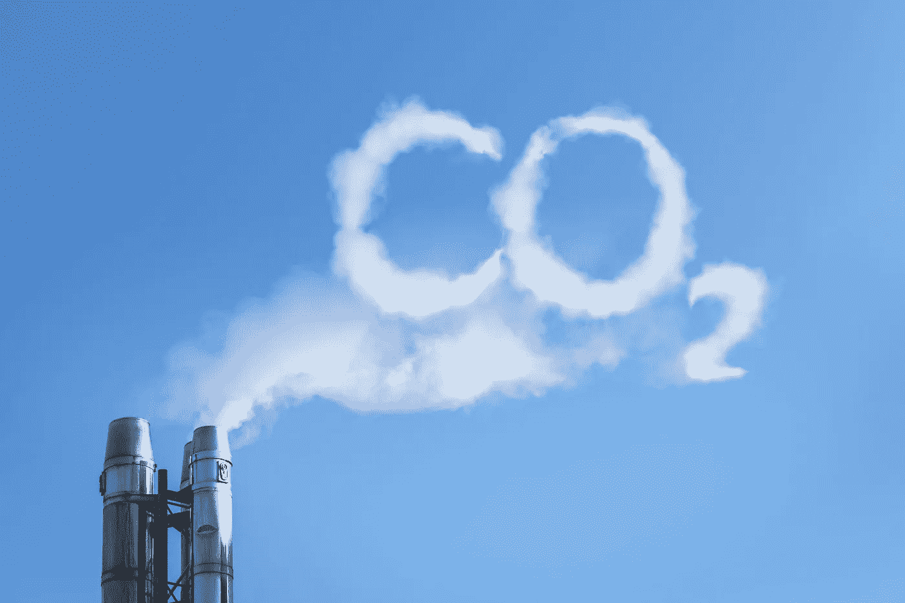
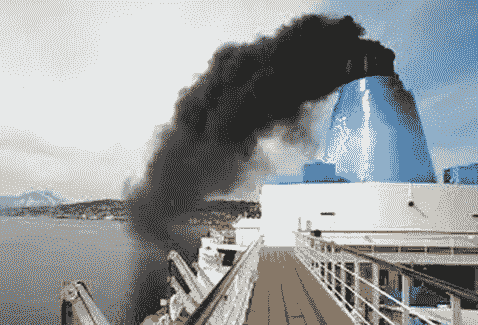
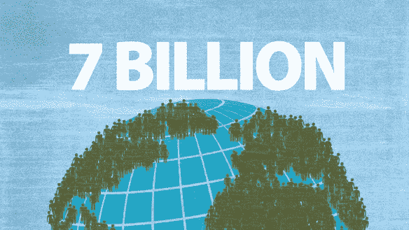

# 到 2018 年 8 月 1 日，我们已经消耗了地球一整年的资源

> 原文：<https://medium.datadriveninvestor.com/by-august-1-2018-we-had-consumed-a-whole-years-worth-of-the-planet-s-bounty-f6d900e1dda0?source=collection_archive---------13----------------------->

## 这被称为地球过冲日。

到2019 年 7 月 29 日，我们用完了今年所有的自然和再生资源。我们现在正在使用我们的透支。需要 1.7 个地球来补充我们在这个小星球上集体浪费的自然资源。这只是**而不是**的可持续发展。正如我在以前关于环境的文章中所说:地球是 a 计划，没有 b 计划。

## 地球上的居民面临的最大问题是二氧化碳气体。根据最新报告，全球航空业产生的二氧化碳排放量约占所有人为二氧化碳排放量的 2%。

大约 80%的航空二氧化碳排放是由超过 1500 公里的飞行产生的，这些飞行的目的地没有实际的替代运输方式。每当一个人从他们居住的地方飞到他们想去的地方(如果是游客，不是他们必须去的地方)，这个人在一次飞行中产生的温室气体比他们的内燃机汽车一年排放的温室气体多 20%。

该数字基于北美的平均值。请记住，即使你拥有一辆电动汽车，你的汽车制造过程中仍然会产生温室气体。汽车发电也会产生二氧化碳，如果这种电力是由煤或天然气驱动的发电厂产生的，情况就更是如此。

 [## 气候变化、ESG 和对更好数据的追求|数据驱动的投资者

### 在地球上许多地方经历了另一个令人难以置信的炎热夏季后，来自 S&P 的最新发现…

www.datadriveninvestor.com](https://www.datadriveninvestor.com/2018/08/24/climate-change-esg-and-the-quest-for-better-data/) 

甚至水力发电大坝在建造过程中也会产生温室气体。混凝土和运土机械、卡车、便携式发电机和刀耕火种都会产生二氧化碳。因此，这不是不产生任何形式的 CO2 气体的问题，而是减少的问题。

根据一些估计，全世界每年大约有 20，000 架飞机在使用，为 30 亿乘客提供服务。到 2040 年，可能会有超过 50，000 架飞机投入使用，而且预计会飞得更频繁。2018 年底全球海洋邮轮总运力为 53.7 万人次，314 艘船舶。全球年化总载客量为 2600 万人次，比 2017 年增长 3.3%。这是新西兰或爱尔兰每年人口的 6 倍，或者相当于澳大利亚的人口。

不过，我跑题了。我感到大多数人对著名的气候学家、环境学家和科学家发出的气候崩溃即将来临的可怕警告不感兴趣，这激起了我的好奇心。

我认为选择忽视气候危险警告或嘲笑气候科学界警告的人分为五类:

否认气候变化的人。所以，是假新闻。
**P** 人们不想知道或假装一切都很好
**P** 人们害怕这些警告并选择不相信它们？人们相信住在天上的看不见的人会拯救心灵和思想的纯洁，所以为什么要费心去做任何事情。有钱人只想享受地球提供的一切，很少或根本不考虑他们对地球的影响；即邮轮，不断的海外度假，无限的消费主义等等。

西方世界的大多数人在自己的小世界里过得很舒服。那些退休后在银行有大量存款的人，很少考虑他们进行的游轮旅行或他们进行的世界异国情调的长期旅行对环境的影响。

## 我们有超过 70 亿人生活在这个小小的蓝色大理石上，其中 27%是儿童。如果今天的大多数成年人什么都不做，他们的未来会怎样？