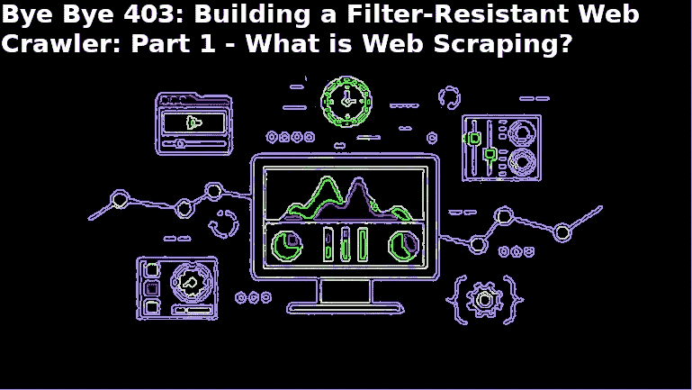

# 拜拜 403:构建一个抗过滤的网络爬虫第一部分——什么是网络抓取？

> 原文：<https://medium.datadriveninvestor.com/bye-bye-403-building-a-filter-resistant-web-crawler-part-i-what-is-web-scraping-442b268f64f3?source=collection_archive---------11----------------------->



What is Web Scraping?

> **原载于编码鸭博客:**[](https://www.ccstechme.com/coding-duck-blog)

**如果你用 Python 编程，或者对这个话题感兴趣，2018 年围绕这种语言的大量信息是它在机器学习和数据分析中的实用性，以及 SciKit Learn、Tensorflow、Pandas、NumPy 等框架。问题是，如果你没有数据可以分析，你就卡住了。在这方面，你有两个选择:使用 Quandl 这样的服务来获取你的数据，这很好，但如果你像我一样，你想使用的数据几乎总是被锁在付费墙后面。你的另一个选择是自己出去收集数据，这是我个人的偏好。**

**这样做需要掌握这门语言的另一个稍微不那么时髦的强项:网络抓取/爬行/聚合，即使用自动化过程从互联网上的公共空间收集公开可用的数据。现在，这些术语被用来描述稍微不同的事物，但是这种不同在你关于这个主题的旅程的早期阶段是没有意义的。然而，不管你的机器人致力于哪个子领域，你都不可避免地会遇到网络服务器过滤器和防火墙的问题。**

**现在请注意，在开始之前，网络搜集的法律后果会因你进行数据收集的司法管辖区而有很大的不同。问题的伦理保持不变，尊重网站，尊重所有者。但是，抓取您没有权限抓取的网页存在固有的风险。如有疑问，请联系网站所有者，请求允许抓取他们的内容。如果你滥用“公共空间”的概念而惹上麻烦，我将不负任何责任。再次提醒，*请尊重你正在抓取的网站的内容*，并意识到这些网站在给定的时间内可以处理的请求是有限的。这些资源是为了服务有可能从他们那里购买的客户，而你的机器人使用这些资源时并没有购买意图。虽然网络抓取是一个有趣的爱好，随着数据科学家需要越来越多的数据来分析，它有望发展成为一个非常大的产业，但现在围绕这个话题有很多“灰色区域”，可能会因谁听说了它而变得不安而有所不同。享受这个帖子系列，但要尊重。**

**这就是伦理发挥作用的地方。即使有了 Python 的 GIL 极限，并发、异步甚至真正的并行也越来越成为该语言文化的一部分。按照这种思路，如果您的机器有足够的能力，生成 20–30 个以上的守护线程并以请求会话的形式将它们发送到 web 服务器并不困难。虽然这听起来可能没那么多，但电子商务平台上一些更便宜的虚拟主机层，如 Shopify、Woocommerce 或 WordPress，很容易就会出现性能大幅下降，或者每隔几秒钟就有一个线程访问服务器，导致服务器完全锁定。其中一些服务器仅使用 1GB 的 RAM 和单个处理器内核，因此一个重要的经验法则是:如果我的生计或业务利益与一台马力如此之小的服务器相关联，我会愿意允许一项服务访问多少内存，以实现销售额的 0%变化？这条规则的诀窍是把你自己放在网站所有者的位置上。是的，我同意，如果你的生活是基于你的服务器，给它更多的资源。但这不是你作为一个数据收集者该做的决定。没有法律实体会关心在你之后出现的人是否应该更好地使用他们的服务器。争论最终将会是:在这个人向你发送他们的机器人之前，你的网站工作正常吗？没错。好吧，那么，刮网先生/女士，你现在欠这个人的罚款是…基本上，你正在收集的数据属于别人。尊重他们，尊重他们的数据，尊重他们的网站。遵循这些规则，你会找到成功，或者至少，避免任何不必要的关注。**

**在这个系列教程中，我们不仅要讨论如何避免被网络过滤器拦截，还要讨论在收集数据时如何避免不必要的攻击网络服务器。虽然本系列将专门针对 Python，但是所涉及的过程和原则可以翻译成任何具有 HTTP 请求模块和 HTML 解析器的语言。**

**所以，现在你知道了什么是网络抓取，为什么它很重要，我们简单地设置一下我们的环境。**

**首先，打开你最喜欢的编辑器，创建一个名为 requirements.txt 的文件。**

**在该文件中，键入以下内容:**

```
requests
bs4
pandas
```

**这些库都有助于我们环境的设置、网页的检索和 HTML 的解析。最后一个模块 pandas 将用于解析、排序、清理和分析我们收集的数据。**

**下一步是安装我们的依赖项。但是为了避免在我们当前的机器上扰乱 python 环境，我们将为这个特定的 Python 设置创建一个虚拟环境。因为我们将在本系列中使用 Python 3，所以请确保您已经安装了 Python 3，并且位于您的路径中，即使默认的 Python 是 2。然后，打开各自的终端应用程序并键入:**

****pip3 安装 virtualenv****

**在那里，输入命令:**

****virtualenv -p python3 venv****

**这个过程告诉你的 Virtualenv 创建一个完全独立于你的计算机全局环境的 python 3 环境，在这个环境中你可以安装软件包、依赖项、python 版本和其他只能从那个环境中访问的东西，有效地防止你的全局机器环境变得混乱。当您希望能够挑选哪个 python 版本将与哪个项目一起运行，或者根据项目需要的其他依赖项(这些依赖项可能与该模块的更高或更低版本不兼容)来选择要使用的特定库的哪个版本时，这就很方便了。**

**要使用我们的 virtualenv，我们需要键入以下内容:**

****源 venv/bin/activate****

**该命令激活环境，并允许您访问 venv 的依赖项、环境变量等(顺便说一句，当您创建 virtualenv 时，您可以随意命名它，您不需要使用“venv”这个名称。这只是一个被社区广泛采用的制作惯例)。**

**现在我们已经激活了 Python 3 环境，让我们安装放入 requirements.txt 的依赖项**

****pip install-r requirements . txt****

**这将在一个命令中安装或文本文件中列出的所有依赖项，而不是一次“跳过”一个。**

**好了，我们的环境已经设置好了，可以开始了！在下一篇文章中，我们将开始构建我们的机器人，然后让它具有抗过滤能力！**

***最初发表于*[](https://www.ccstechme.com/coding-duck-blog/bye-bye-403-building-a-filer-resistant-web-crawler-part-one-what-is-web-scraping)**/coding-duck-blog。****