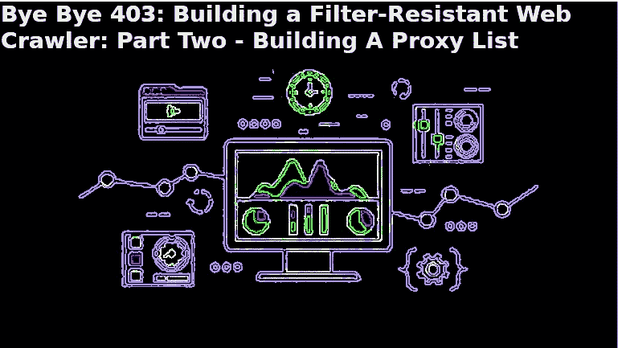
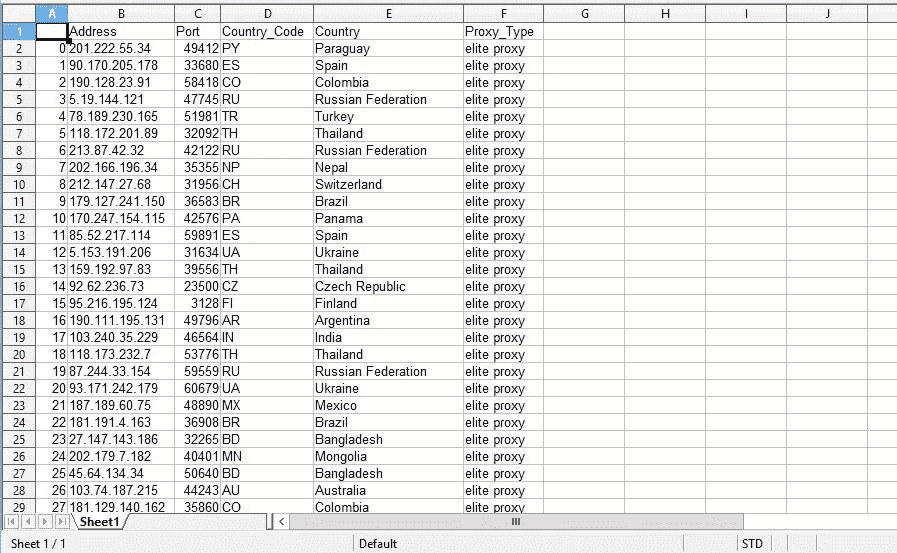

# 拜拜 403:构建一个抗过滤的网络爬虫第二部分——构建一个代理列表

> 原文：<https://medium.datadriveninvestor.com/bye-bye-403-building-a-filter-resistant-web-crawler-part-ii-building-a-proxy-list-49ffe437f458?source=collection_archive---------2----------------------->



How to Build A Web Scraper Proxy List

> **原载于编码鸭博客:**[](https://www.ccstechme.com/coding-duck-blog)

**呜呜呜。我们已经建立了我们的环境，并准备开始构建我们的机器人！鉴于本系列的最后一篇文章(位于[这里](https://www.ccstechme.com/coding-duck-blog/bye-bye-403-building-a-filer-resistant-web-crawler-part-one-what-is-web-scraping))主要是信息性的，让我们直接进入第二部分的代码。**

**所以，我的假设是，如果到目前为止你正在阅读这个系列，你知道 Python 中的 web 抓取的基础，并且你正在寻找学习如何不被阻塞而不是基础。因此，让我们直接进入我们对网络过滤器的第一道防线:IP 地址循环**

**许多网页抓取工具会购买代理，为了不被地址过滤，他们被允许每月更换一到两次。但是您知道吗，一个 IP 通常会在 100 个以下的请求中被过滤，鉴于大多数抓取器每小时至少会发出 100 个请求，购买足够使用一个月的 IP 地址代理可能会非常昂贵。**

**有免费的选项，但缺点是这些 IP 地址列表通常会被监控，并且只能持续几个小时才会被列入黑名单。但也有一些好消息:免费代理提供商(无论如何都是好的)创造新 IP 的速度比旧 IP 被探测到的速度要快。所以我们要用我个人最喜欢的:[free-proxy-list.net](http://free-proxy-list.net/)**

**为了有效地利用这一点，并考虑到我们已经使用和放弃的 IP，我们将构建一个 web scraper 来动态检索 IP！这个过程的第一步，也是本文的主题，将是构建我们的代理列表。第一步是创建一个名为 proxy_retriever.py 的新文件，它包含以下内容:**

```
import requests
import pandas as pdfrom bs4 import BeautifulSoupclass proxyRetriever(): def __init__(self):
        self.s = requests.Session()
        self.ip_list = []
```

**到目前为止很简单。我们已经导入了 http 库(requests)和 html 解析器(BeautifulSoup ),以及用于构建包含代理(pandas)的 CSV 文件的库。接下来，我们创建一个名为 proxyRetriever 的新类来处理构建列表时涉及的所有操作。现在，你可能想根据你所使用的 OOP 概念来设计你的项目。但是，在我个人看来，我觉得一个尽可能划分的应用程序会让你自己和每个使用你的代码的人的生活变得更容易。基本上，每个类处理一个常规任务(例如构建一个代理列表)。该类中的每个函数将处理一个特定的任务，越具体越好。这样，您的代码将会非常枯燥，调试也将变得轻而易举，因为如果某些东西不能正常工作，您将会非常清楚问题出在哪里，这仅仅是基于应该用什么类和函数来处理这个非常具体的事情。**

**您还会注意到，我们在这里定义了一个请求会话，而不仅仅是一个 requests.get()。有几个原因让我觉得这比重复使用一次性 HTTP 请求更好，但是关于这一点的具体文章很快就要发表了，所以我不会在这里深入讨论。只是暂时配合一下。**

**第二个类级属性是我们将要构建的 ip_list。以这种方式定义我们的属性只是使我们的类函数更容易共享对特定变量的访问，而不必相互传递数据，这可能 A)在涉及多个线程和/或进程时变得混乱，B)即使在单线程环境中也变得混乱。对我来说，如果在你不再使用它时维护它的人不知道如何使用它，那么你的解决方案有多优雅，或者它让你看起来有多聪明，一点也不重要。让自己看起来比别人更聪明是一种 A 型的哗众取宠，在开发和工程领域这样一个协作和多样化的环境中没有一席之地。简单、易读、易理解的解决方案优于那些可能更快或更有效，但完全站不住脚的解决方案。**

**现在我们的类已经定义好了，并且有了一些初始化行为，让我们添加第一个函数:**

```
def connect_and_parse(self, website):
        r = self.s.get(website)
        soup = BeautifulSoup(r.text, "html.parser")
        proxy_table = soup.find('tbody')
        proxy_list = proxy_table.find_all('tr')
        elites = [tr for tr in proxy_list if 'elite' in tr.text]
        tds = []
        for tr in elites:
            tds.append([td.text for td in tr])   
        return tds
```

**本着“一个函数一个函数”的原则，connect_and_parse 将一个 web 地址作为参数(在本例中为'[https://free-proxy-list.net/【T1 ')，通过我们的请求会话进行连接，并提取位于该地址的 HTML。为了简单起见，我倾向于使用 BeautifulSoup 附带的“html.parser”解析器，而不是依赖另一个依赖项，如 lxml。](https://free-proxy-list.net/)**

*****Pro 提示:记住，BeautifulSoup 是标记解析器。它只处理 HTML 字符串，不处理其他内容。我看到许多人习惯于将响应对象(在本例中为 r)传递给 BeautifulSoup，然后遇到一个异常。我们的响应是一个包含 BeautifulSoup 使用的属性的对象(比如。文本和。内容)，但本身对我们毫无用处。只要记住传递 r.text 或 r.content 就可以避免这种恼人的延迟。*****

**使用您喜欢的浏览器工具(我使用 Chrome Dev 工具)，检查站点的内容，发现包含我们的代理信息的表是“tbody”HTML 类的第一个实例。调用 soup.find()函数找到这个类的第一个实例，并将其分配给 proxy_table。**

**若要创建此表的行列表，请将 proxy_table.find_all('tr ')赋给 proxy_list 变量。**

*****Pro 提示:soup.find()函数返回的任何项目都将是一个 BeautifulSoup 对象，可以用 find()、find_all()、next_sibling()等进一步解析。但是，soup.find_all()返回一个填充了 BeautifulSoup 对象的列表。即使这个列表只包含一个项目，您仍然需要专门访问它来进一步解析它。在这个例子中，如果我们试图调用类似于******proxy_list . find(' some-other-element ')的东西，我们将得到一个异常，因为 proxy _ list 变量是一个包含 soup 对象的列表，因此只具有列表的属性。要进一步解析 find_all()的元素，可以遍历列表或通过索引访问一个项目。*****

**我们的下一行创建了一个“精英”状态代理列表。这些类型的代理是完全匿名的，过滤器很难在运行中锁定和过滤。他们也是 HTTPS，所以你的流量将是匿名的和加密的 SSL，这两个东西，我们希望我们的爬虫拥有。这个过程是用列表理解来完成的，你可以在[这里](https://www.ccstechme.com/coding-duck-blog/python-programming-in-5-minutes-list-comprehensions)得到一个速成班。**

**下一行是可读性和聪明度的对比。我们正在创建存储在精英列表中的每行的单元格列表。这可以通过列表理解来完成，但是这是一个嵌套的列表理解，有点脑筋急转弯，难以阅读，并且需要多次阅读才能理解逻辑流程。这将使调试以后可能出现的任何问题的时间比需要的时间长得多。因此，我们使用传统的 for 循环来访问 elites 中的行，然后利用更简单、更易读的列表理解来将每行的单元格处理成我们正在收集的每个代理上的所需信息。**

**酷！因此，我们在一个简洁的列表中获得了代理信息。现在对其进行处理，并将其放入一个 CSV 文件中，以便我们以后引用:**

```
def clean_and_sort(self, data_set):
        columns = [’Address’, 'Port’, 'Country_Code’, 'Country’, 'Proxy_Type’]
        mapped_lists = {}
        i=0
        while i < 5:
            mapped_lists.update({columns[i]: [tag[i] for tag in data_set]})
            i+=1
        df = pd.DataFrame(mapped_lists, columns=columns)
        df.to_csv(’proxy_ips.csv’)
```

**下一个函数获取上一个函数的输出(我们的集合或列表或代理细节)，对其进行清理、排序，并将其输出到一个 csv 文件中。columns 变量是一个列表，包含我们将用于 csv 文件的列名。然后，我们创建一个空字典，并使用 while 循环只处理我们在 connect_and_parse 函数中创建的每个列表中的前 5 项，将数据映射到 csv 列。这是必要的，因为如果我们重新检查[free-proxy-list.net](http://free-proxy-list.net/)，表格包含 8 列。我们只关心前 5 个。现在，我们可以编写我们的 scraper 来只检索前 5 个。然而，connect_and_parse 不负责清理和排序我们的数据，只抓取数据并将其作为随意的 blob 返回。这是最有效的解决方案吗？也许是，也许不是。但是，当涉及到调试一个检索后正确排序数据的问题时，您会很高兴自己采用了这种方式。因为无论您在调试 clean_and_sort 函数的过程中做了什么更改(以及随后的中断), connect_and_parse 仍然会正常工作。如果两个职责都交给 connect_and_parse 本身，你能说同样的话吗？**

**在那里，我们调用 pandas 从我们的 mapped_lists 字典中的数据创建一个数据帧，使用我们的 columns list 作为列标题，并将数据帧导出到我们的新文件 proxy_ips.csv 中。**

****

**Proxy List for Web Scraping**

**好吧！我们的第一道防线已经就位！但是在我们开始寻找我们想要的数据之前，我们有一个更常见的过滤向量需要混淆:用户代理。收听第三部分，继续你的网络爬虫过滤研究！**

**# python #编程# learntocode # webscraping #软件开发#数据科学#软件工程# web 编程**