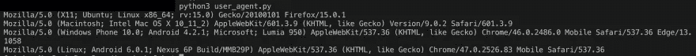

# 拜拜 403:构建一个抗过滤的网络爬虫第三部分:用户代理

> 原文：<https://medium.datadriveninvestor.com/bye-bye-403-building-a-filter-resistant-web-crawler-part-iii-user-agents-5df330ce253?source=collection_archive---------7----------------------->

[](http://www.track.datadriveninvestor.com/1B9E)

Bye Bye 403 Part 3: User Agents

因此，我们已经涵盖了什么是网络抓取。我们还讨论了如何循环代理信息来伪装我们的 IP 地址。如果你 1)不感到羞耻，2)为什么你会读一篇有“第三部分”的文章，而没有读“第一部分”和“第二部分”，3)撇开厚脸皮不谈，下面是其他文章的链接:

第一部分:[https://medium . com/datadriveninvestor/bye-bye-403-building-a-filter-resistant-web-crawler-part-I-what-is-web-scraping-442 b268 f64 F3](https://medium.com/datadriveninvestor/bye-bye-403-building-a-filter-resistant-web-crawler-part-i-what-is-web-scraping-442b268f64f3)

第二部分:[https://medium . com/datadriveninvestor/bye-bye-403-building-a-filter-resistant-web-crawler-part-II-building-a-proxy-list-49 FFE 437 f 458](https://medium.com/datadriveninvestor/bye-bye-403-building-a-filter-resistant-web-crawler-part-ii-building-a-proxy-list-49ffe437f458)

但是，我们现在必须考虑掩盖刮刀的另一个步骤。举例来说，可以这样想:

想象一下，有人在任何社交媒体平台上骚扰你，而你屏蔽了他们。假设你是一个有影响力的人，所以你每天都有数百个关注，很难对每个关注者进行“个人资料检查”,以确保他们不是你屏蔽的人。对你来说，进行初步猜测最简单的方法是什么？显然，检查新粉丝的名字是你的第一道防线。如果有同名同姓的人开始跟踪你呢？他们的个人资料片段将他们列为来自不同的国家，这一事实会阻止你立即阻止他们吗？不太可能。十有八九，这会让你更加怀疑这个人，因为他们在骗人。

[](https://www.datadriveninvestor.com/2018/11/12/web-scraping-hedge-fund-strategy/) [## 网络抓取和对冲基金的另类数据策略——数据驱动的投资者

### 曾经隐藏在众目睽睽之下的数据再也隐藏不住了。有了复杂的软件，新的数据继续…

www.datadriveninvestor.com](https://www.datadriveninvestor.com/2018/11/12/web-scraping-hedge-fund-strategy/) 

把 web 服务器 bot 过滤器想象成“有一个讨厌的追随者的影响者”。通过循环使用我们的 IP 地址，我们更改了各自的位置 ID 和“个人资料图片”，但我们仍然被列为来自相同类型的笔记本电脑、相同操作系统版本、相同浏览器等的连接。很容易追踪和过滤。那么，一个崭露头角的 web scraper 要做什么呢？循环您的用户代理。

用户代理本质上是 HTTP/S 头中的一个字段，它告诉 web 服务器浏览器版本、主机操作系统版本、主机外形以及其他一些关于每个请求的小信息。这有两个目的:web 内容的诊断(查看某个 bug 是否只在某些操作系统、浏览器或两者的某种组合上报告)和安全性(查看谁连接了以及他们从哪里连接，以便在安全事件期间和/或之后跟踪可能的攻击者)。所以通俗地说，用户代理告诉 web 服务器关于连接的机器，而 IP 地址告诉它更多关于你来自哪里。有道理吗？很好！

要开始循环用户代理，请点击[此处](https://deviceatlas.com/blog/list-of-user-agent-strings#desktop)获取最新的桌面用户代理集合:

***亲提示:我们还可以通过更换用户代理来抓取移动版网站。这就是移动浏览器上“显示桌面站点”选项的工作原理。浏览器会欺骗你的用户代理，就好像它来自桌面设备一样，尽管事实上你是在移动设备上，因此向你显示任何内容的“桌面版本”。对于抓取仅移动内容*** ，反向操作相同

现在，我们可以将所有这些用户代理复制/粘贴到一个文件中，但这毕竟是一个网络抓取系列文章，因此，相反，创建一个新的项目文件，并将其命名为 user_agent.py

```
from bs4 import BeautifulSoupimport random
import requestsclass UserAgent: ua_source_url='https://deviceatlas.com/blog/list-of-user-agent-strings#desktop' def __init__(self):
        self.new_ua = random.choice(self.get_ua_list())
```

因此，首先我们要创建 UserAgent 类。如果您已经阅读了本系列的这么多内容，您可能会认为我是封装的忠实粉丝。这在很大程度上是因为在我开始写代码之前，我来自网络工程和 IT 技术领域，在那里，人们认为，每次在凌晨 4 点之前你随叫随到的时候，一个事件**就会**把你**叫醒。正因为如此，我非常喜欢创建易于调试的东西。4 点接到传呼，4 点半到办公室，4 点 45 分离开，和家人共度一个美好的早晨，这比花 3 个小时解决一个被层层垃圾掩埋的简单问题要好。因为如果它花了我 3 个小时，那么我在 7:30 之前已经解决了我的问题。你知道，正好可以开始一天的“正常”工作…**

也就是说，UserAgent 类将为我们处理所有用户代理的事情！您可能已经注意到，我们创建的类变量`ua_source_url`在`__init__`函数之外。这是为什么呢？因为`__init__`中的所有东西只有在你的代码中调用了一个类的实例之后才“存在”。类级别的变量可以被直接引用，更重要的是，可以在该类的所有实例之间共享。也就是说，当我们多线程处理这个坏男孩时，我们不需要在内存中多次存储这个字符串。

在我们的`__init__`函数中有`new_ua`属性，我们希望该属性对于该类的每个实例都是不同的，但是在该类被创建之前不会存在。

*边注:为了进一步了解* `*__init__*` *，它做什么，怎么用，粘在身边。很快会有一个帖子！*

属性从用户代理列表中选择一个随机的用户代理。我们从哪里可以得到你问名单？从您要键入的代码中:

```
def get_ua_list(self, source=ua_source_url):
    r = requests.get(source)
    soup = BeautifulSoup(r.content, "html.parser")
    tables = soup.find_all('table')
    return [table.find('td').text for table in tables]
```

那么我们在这里做了什么？好了，我们已经抓取了上面的页面(正如我们所做的),以获取该页面上列出的用户代理信息。与我们所有的小抓取脚本一样，它从 Requests `get()`函数开始，将响应内容提供给我们的 HTML 解析器(BeautifulSoup)，为每个用户代理找到表标记，并提取每个表的数据文本。现在这个函数已经完成了，那么`__init__`是不是更有意义了呢？如果没有，请允许我解释:

只要我们在代码中的任何地方创建了 UserAgent 类的实例，它就会运行这个函数，而不需要我们去碰它。当该函数完成时，它会将潜在用户代理的列表分配给属性`new_ua`。这有什么关系？看看下面的终端屏幕截图，它显示了以下代码的输出:

```
i=1
while i <= 4:
    print(UserAgent().new_ua)
    i+=1
```



正如您所看到的，我们不需要将用户代理写入文件，这涉及到打开文件、读取文件、然后再次关闭文件，这依赖于磁盘内存。相反，我们将这个列表读入 RAM(更快、更容易清理的存储器)并仅在需要时检索它，每次通过`random.choice()`函数获取不同的用户代理

***专业提示:对于那些不熟悉*** `***random.choice()***` ***的人来说，它在从列表或可迭代项中进行选择时，基本上与*** `***random.randint(0, len(sample_list))***` ***做同样的事情。简单地说，它从您传递给它的任何可迭代数据结构中选择一个伪随机项。在这种情况下，*** `***random.choice()***` ***是我的首选，因为这两种方法做的事情大致相同，而*** `***.choice()***` ***的击键次数更少。***

好吧，小牛队(任何人的漂流季节😉)你已经有了欺骗 99%的僵尸过滤器的工具。但是你知道如何使用它们吗？去野外寻找答案，然后回来报告。我很想听听你关于数据集的故事，你的聚会，以及你打算用它们做什么！成功和失败同样受欢迎，因为这完成了我们将要发现的第一套对策。这些被称为(至少我是这样认为的)网络抓取的“硬技能”。拓展知识所需的技能。但是你的直觉如何？下周我们将在第四部分中讨论中间内容:计时和节流。