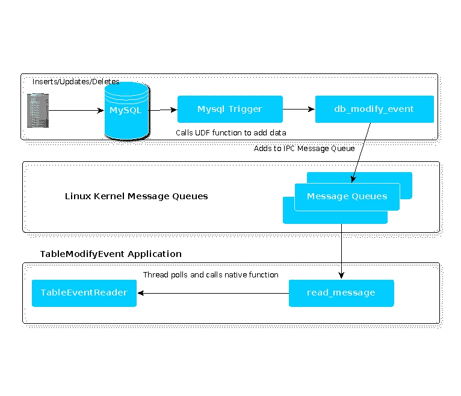

# 缓存刷新技术

> 原文：<https://medium.datadriveninvestor.com/cache-refreshing-techniques-446403de1ba2?source=collection_archive---------1----------------------->

L ess 频繁变化&经常访问的数据通常保存在缓存中，以避免昂贵的数据库查询操作。这种不常变化的数据必须以固定的时间间隔刷新，这样缓存才不会过时。

缓存维护的可能策略有三种类型:

*   直写缓存(每当发生数据库操作时写入缓存)
*   拉机制(应用程序定期轮询以更新缓存)
*   **推送机制(记录更改时数据库通知应用程序)**

以上所有方法都很受欢迎，在这篇博客中，我们将详细讨论第三种**方法。**

在开始之前，我假设你已经对 IPC 有了基本的了解，如果没有，看看 Jean-Sébastien Herbaux 在 IPC 上的文章

 [## Unix / C 中进程间通信的一瞥——概念

### 您可能已经听说过或读过 C / Unix 中的 IPC。如果你还没有完全掌握它的工作原理，我可以理解…

medium.com](https://medium.com/@Convly/a-peek-at-inter-process-communication-in-unix-c-notions-485b70a8a50c) 

> 这个例子使用 MySQL (RDBMS)和 Linux 消息 IPC 队列，然后使用 Rabbit MQ AMQP 将它作为通知发送给多个应用程序侦听器。

**我们来谈谈代号**

TableModifyEvent 项目的源代码如下:

 [## root0109/TableModifyEvent

### 当记录发生变化时，Mysql 数据库通知 java 应用程序。

github.com](https://github.com/root0109/TableModifyEvent) 

让我们先看看这个 TableModifyEvent 应用程序的流程图:

您需要两个类，即 [TableEvent](https://github.com/root0109/TableModifyEvent/blob/master/src/my/test/TableEvent.java) 和 [TableEventReader](https://github.com/root0109/TableModifyEvent/blob/master/src/my/test/TableEventReader.java) ，它们使用 Java 本地访问(jna.jar)本地代码来读取 IPC 消息队列的内容，并将其转发到我们基于 Rabbit MQ 的 AMQP 队列。

 [## 创建折衷书架的程序员指南|数据驱动的投资者

### 每个开发者都应该有一个书架。他的内阁中可能的文本集合是无数的，但不是每一个集合…

www.datadriveninvestor.com](https://www.datadriveninvestor.com/2019/03/25/a-programmers-guide-to-creating-an-eclectic-bookshelf/) 

其次，您将需要设置 MySQL UDF 的(用户定义的函数)，如示例[tme . c](https://github.com/root0109/TableModifyEvent/blob/master/src/tme.c)&[db _ modify _ event . c](https://github.com/root0109/TableModifyEvent/blob/master/src/db_modify_event.c)所示。这两个 c 程序都需要编译成共享文件(。so 文件)并添加到 mysql 插件文件夹中。

此外，您还需要在更新/插入/删除时在数据库表上创建一个触发器，以便将数据发送到 IPC 消息队列。

如果你想看 IPC 上的代码，可以看看 Julien AGUILAR 的文章

 [## 进程间通信:Unix 系统

### 以下是我的第一篇文章，不要太当真。我是一名法国计算机科学专业的学生…

medium.com](https://medium.com/@AguilarJulien/inter-process-communication-unix-systems-46195f6a6fbe) 

其他链接:

*   关于 Mysql UDF 的详细信息:【https://dev.mysql.com/doc/refman/5.7/en/adding-udf.html 
*   MySQL https://github.com/mysqludf/repositories UDF 参考库:
*   示例 UDF:[https://github . com/Twitter/MySQL/blob/master/SQL/UDF _ example . c](https://github.com/twitter/mysql/blob/master/sql/udf_example.c)

有问题吗？建议？评论？

下一步是什么？ [**在 Medium 上关注我**](https://medium.com/@vaibhav0109) 成为第一个看我故事的人。