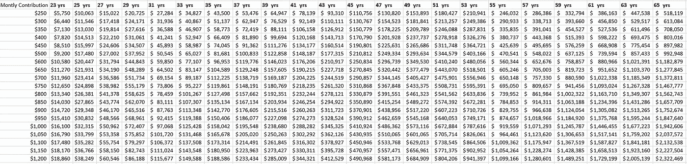

# 计算你每个月应该为退休存多少钱

> 原文：<https://medium.datadriveninvestor.com/calculating-what-you-should-be-saving-each-month-for-retirement-8236d09c9cd2?source=collection_archive---------1----------------------->

Photo by [Simon Migaj](https://unsplash.com/@simonmigaj?utm_source=medium&utm_medium=referral) on [Unsplash](https://unsplash.com?utm_source=medium&utm_medium=referral)

谈到 401(k)储蓄建议，人们通常会说，人们应该为退休储蓄 10%到 15%的收入。但是这个数字真的足够了吗？它包括雇主的贡献吗？什么时候开始存钱重要吗？你退休后需要多少钱？

退休建议需要少关心你储蓄的收入百分比，多关心你储蓄的金额对你的退休收入意味着什么。百分比并不能告诉你退休后的收入会是多少。为了帮助证明你应该存多少钱以及你的退休收入会是多少，我制作了两张图表来帮助跟踪你的储蓄。

第一张图表显示了不同的月储蓄金额，以及这对你的退休储蓄意味着什么。该图表估算了不同点的储蓄金额。作为免责声明，这里假设你把 100%的存款都投入了股市，并遵循股市的历史平均水平。股票市场没有这么干净，但趋于平均。如果你存了 40 多年，平均回报率应该在每年 7.5%左右。

Amounts you will have saved assuming you start monthly contributions at age 22

这张图表希望说明的是比简单地说你应该把收入的 10%到 15%存起来更实际的东西，因为有更多的东西需要考虑进去。如果你直到 30 岁才开始储蓄，那么你获得储蓄基数的时间将比第一张图表中计算的时间少 8 年。上图假设你从 22 岁开始存钱。如果你开始储蓄的时间晚了，达到你的储蓄目标的退休年龄就会提前！

作为另一个免责声明，这是一个静态图表，这意味着它假设你每个月都会存同样的钱，直到退休。然而，这是一件好事。你不应该考虑你认为你将来会赚多少钱，而应该关注你现在正在存的钱。金钱获得红利和增长的时间越长，你的储蓄就越多。所以看看你每月的贡献，然后把你的手指拖到你想退休的年龄。

接下来，你退休后需要多少钱？这又是一个难题。当你退休时，一些费用会减少，如儿童保育，通常抵押贷款和汽车贷款会减少，但同时医疗费用会增加，理想情况下，你会在度假上花费更多。经验之谈是，你应该设法在退休后保持你的收入。但是越多越好，而且有退休账户的所有税收优势，它们是积累财富的最佳方式。

第二张图表展示了为了维持你目前的收入，你的储蓄要有多大。再次声明，这张图表不包括你可能有的其他收入来源，如社会保障(没有保障)或其他养老金。但是你唯一有能力增加的收入来源是你的 401(k)计划。

This chart estimates annual incomes for people with varied retirement savings at different ages.

一般的经验法则是，如果你想在退休后有 80，000 美元的年收入，你应该努力在 401(k)计划中存下 200 万美元。这不是一个容易实现的目标。平均来说，在你的职业生涯中，你每个月要存 1000 多美元。认为你会等到职业生涯的晚些时候才开始为退休储蓄是错误的，因为你越早开始储蓄，复利魔法生效的时间就越长。为了更多地了解投资和复利的魔力，我写了这篇文章:[成为专业投资者的简单步骤](https://medium.com/@bigguyjer803_14349/easy-steps-to-becoming-an-expert-investor-970a8decf321)。

对于我们许多人来说，200 万美元似乎是遥不可及的，这没关系。这张图表是为了帮助你弄清楚你是否应该增加你的贡献。也许，你已经落后于你想要的退休水平，需要把你收入的 10%提高到 13%。

太多的人在开始工作时选择收入的一个百分比作为退休储蓄，并且一旦他们开始工作就不再调整。这是一个错误。太多人推迟增加他们的储蓄金额，如果你需要增加你的贡献，现在就做，不要等待！把钱存进股票市场比存在银行账户里好得多。股票，尤其是退休账户里的股票，税收优势要好得多。这是你工作生涯中积累财富的最佳方式。如果你每个月能多存一点，就去做吧，你会感谢你自己的。我在另一篇名为[的媒体文章中讨论了这个问题:富人不会把钱存在银行账户里，你也不应该这样做](https://medium.com/@bigguyjer803_14349/rich-people-dont-keep-money-in-a-bank-account-you-shouldn-t-either-de8cd890d649)。