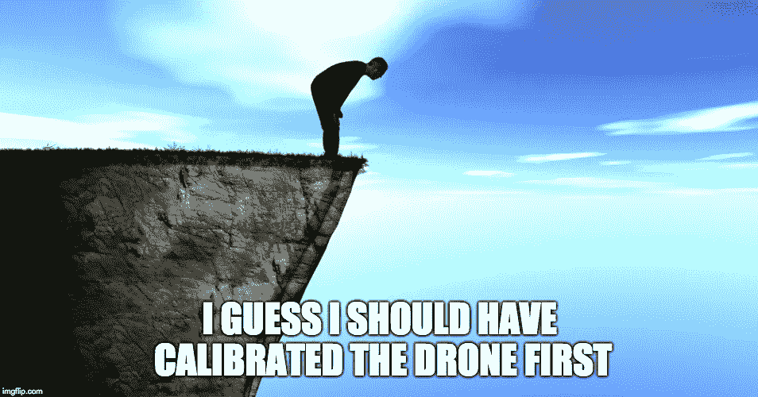

# 校准、信任和深度学习

> 原文：<https://medium.datadriveninvestor.com/calibration-trust-and-deep-learning-d1e18fe7f4d9?source=collection_archive---------0----------------------->

你知道在开始飞行之前你真的需要校准你的无人机吗？如果你不对它做那种“T0”旋转“T1”的动作，它真的会变得很傻？或者，有时谷歌地图被锁定，蓝点显示你在错误的地方？要修复它，你需要做那个[【8 字形】](https://support.google.com/maps/answer/2839911?hl=en&co=GENIE.Platform%3DAndroid)的东西？
这些是*校准*的例子——将仪器的输出与参考标准进行比较，以确保其正确(和/或适当设置)。

[我们一直依赖校准](http://asq.org/quality-progress/2008/07/measure-for-measure/measure-for-measure-calibration-from-cradle-to-grave.html)，见鬼，如果不是在幕后发生，现代生活基本上会是灾难性的。从卷尺的标准化(想想这是如何让你所在的建筑不倒塌的)，到电压调节(你的 iPhone 还能用，对吧？)，到，嗯，一切，假设仪器校准！

很好，但是你可能会问，这和深度学习有什么关系？
答案是郭等人在[最近的一篇论文](https://arxiv.org/pdf/1706.04599.pdf)()中问自己的一个问题，即。，*你怎么知道你的模型的输出还是正确的？*

想一想。你组装了你的模型来识别猫，训练它，嘿，你做得对吗？您*知道*这一点，因为它对您的验证集有效。但是(！)，那其他开始用的人呢？他们如何*知道*这对他们有用？嘿*如何校准*网络以适应他们的使用？

这不仅仅是一个抽象的问题——如果你的工作取决于准确识别那只猫，你会把它留给模型吗？或者，更严重的是，如果这个模型是为了识别肿瘤而设计的，难道你不想说“*嘿，我对* ***这些*** *类型的肿瘤的准确性有点差，你们人类中的一个能看看这个吗？*”

当郭等人开始研究这个问题时，他们发现

> 今天的神经网络无疑比十年前更加精确，我们惊奇地发现现代神经网络不再精确校准。

或者，换句话说，虽然现在神经网络更加准确，但对其结果的信心水平也比 T2 低得多！这也(有点)没问题，只要有某种方式可以让结果带有“可信度分数”。你知道，就像“*我几乎可以肯定这是一只猫”*对“*是的，我想这是一只猫，但是，你好，我真的不敢打赌我是对的！*
底线是，信心评估为用户提供有价值的信息，让他们建立信任。用户可能不信任结果，但是他们*会*足够信任系统来告诉他们结果是否可信！

总之，让我们回到郭等人的问题上来，他们发现，如今在神经网络中，置信度滞后于准确性。他们发现，这种信心的缺乏显然与模型的宽度和深度的增加、批量标准化、正则化、*而不是*使用权重衰减(go figure！)，以及构成现代深度学习神经网络的几乎所有东西。

他们并不真正知道*为什么*(尽管在[论文](https://arxiv.org/pdf/1706.04599.pdf)中有一些想法)，但他们确实有一种方法来提供有用的信心指标——特别是[普拉特缩放](https://en.wikipedia.org/wiki/Platt_scaling)()，他们根据验证集训练模型，以返回输出(在现实世界中)正确的概率。或者说得更专业一点，“分类器的非概率预测被用作逻辑回归模型的特征，该模型在验证集上被训练以返回概率”。

对于这样一个简单的方法，它被证明是非常有效的——更复杂的计算方法，如矩阵缩放和宁滨，在最好的情况下，表现一样好，有时表现差得多！

这是默认情况下应该做的事情之一——分类器应该总是输出预测标签反映实际情况的概率。当我们在现实世界中开始将这些模型拼接在一起时，这几乎是我们可以对输出进行推理的唯一方式！

()“ [*论现代神经网络的校准*](https://arxiv.org/pdf/1706.04599.pdf)”—郭等。

[()“*支持向量机的概率输出以及与正则化似然方法的比较*](http://citeseer.ist.psu.edu/viewdoc/summary?doi=10.1.1.41.1639)”—John c . Platt

*(* [*这篇文章也出现在我的博客*](http://dieswaytoofast.blogspot.com/2018/07/calibration-trust-and-deep-learning.html) *)*